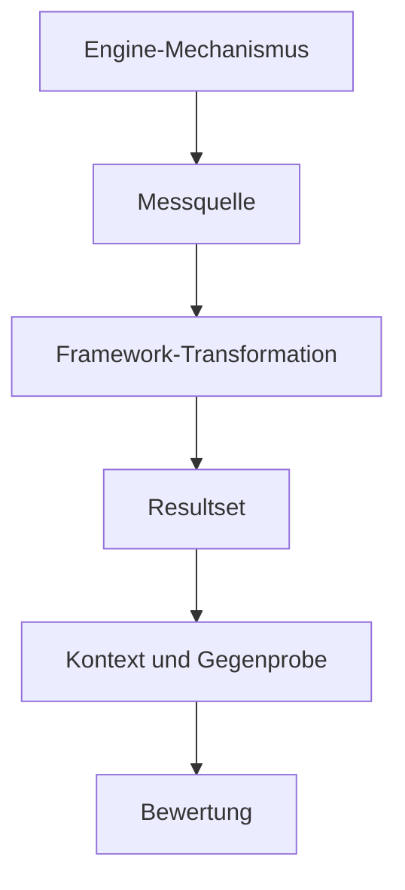
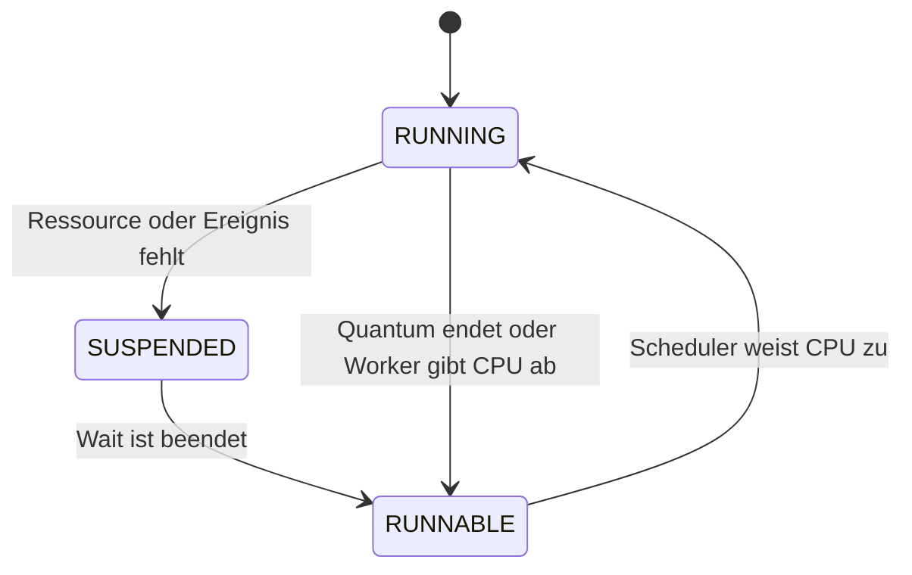
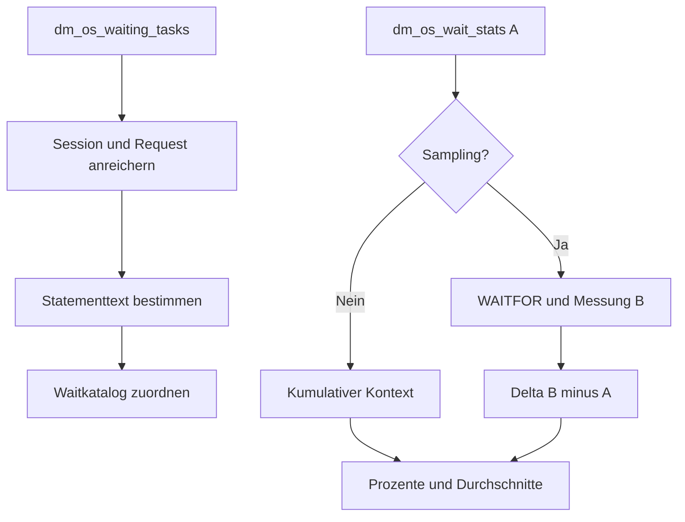

# Draft: technische Tiefendokumentation für SQL_Server_Analyze

**Stand:** 19. Juli 2026
**Status:** integriertes Authoring-Archiv; nicht kanonisch und nicht zur direkten Nutzung als Procedure-Referenz bestimmt
**Integration:** gemeinsames Modell in `../Technical_Foundations.md`, procedurespezifische Inhalte in `../Procedures`
**Zielgruppe:** Analyseanfänger:innen, Datenbankentwickler:innen und erfahrene SQL-Server-Administrator:innen

> Dieser Draft dokumentiert die Redaktionsherkunft. Für die Anwendung und zukünftige Pflege gelten ausschließlich die kanonischen Analysis Guides.

## 1. Datenschutz- und Quellenrahmen

Der Draft enthält ausschließlich:

- öffentliche SQL-Server-Systembegriffe und Produktmechanismen,
- öffentliche Repositoryobjekte,
- offizielle Microsoft-Learn-Quellen,
- eindeutig synthetische Bezeichnungen wie `ExampleDatabase`,
- keine realen Laufzeitresultate, Server-, Datenbank-, Benutzer-, Firmen-, Host-, Job-, Pfad- oder Infrastrukturbezeichnungen.

Technische Aussagen werden nach Möglichkeit einer der folgenden Klassen zugeordnet:

| Klasse | Bedeutung |
|---|---|
| **Dokumentiert** | durch offizielle Microsoft-Produktdokumentation oder den kanonischen Repositorycode belegt |
| **Repositorylogik** | Verhalten, Berechnung oder Schwelle wird direkt durch den Frameworkcode erzeugt |
| **Heuristik** | praktisch nützliche Einordnung, aber keine universelle Produktgrenze |
| **Vermutung** | mögliche Ursache, die durch Folgeanalysen bestätigt oder widerlegt werden muss |

## 2. Didaktisches Zielbild

Eine Analysebeschreibung ist erst vollständig, wenn Leser:innen diese Fragen beantworten können:

1. Welcher technische Mechanismus wird beobachtet?
2. In welchem Moment und mit welchem Zeitbezug entstehen die Daten?
3. Ist eine Zeile ein aktueller Zustand, ein Ereignis, ein kumulativer Zähler, ein Delta, ein Intervall oder eine Metadatenzeile?
4. Welche Transformation führt von der SQL-Server-Quelle zur ausgegebenen Spalte?
5. Ist der Wert Ursache, Symptom, Auswirkung oder nur ein Korrelationsschlüssel?
6. Unter welchen Bedingungen ist der Wert normal?
7. Welche Kombination macht ihn auffällig?
8. Welche Gegenprobe verhindert eine Fehlinterpretation?
9. Welche nächste Procedure oder externe Datenquelle vertieft den Befund?
10. Was darf aus einem leeren oder unauffälligen Resultset nicht geschlossen werden?

Die didaktische Grundkette lautet:



## 3. Beobachtungsarten und Zeitmodelle

Dieselben Zahlen können je nach Zeitmodell eine völlig andere Bedeutung besitzen.

| Beobachtungsart | Typische Quelle | Zeitbezug | Wichtige Aussagegrenze |
|---|---|---|---|
| aktuelle Momentaufnahme | `sys.dm_exec_requests`, `sys.dm_os_waiting_tasks` | genau zum Lesezeitpunkt sichtbarer Zustand | kann Millisekunden später verschwunden sein |
| Sessionzustand und Sessionzähler | `sys.dm_exec_sessions` | aktuelle Session; einzelne Zähler kumulativ für deren Lebensdauer | Session-IDs werden später wiederverwendet |
| instanzweiter kumulativer Zähler | `sys.dm_os_wait_stats` | seit Engine-Start oder letztem Reset | alte Ereignisse können den aktuellen Zustand dominieren |
| Stichprobendelta | Differenz zweier DMV-Lesungen | nur Arbeit zwischen Messpunkt A und B | Reset oder Restart im Fenster macht das Delta ungültig |
| Plan-Cache-Evidenz | `sys.dm_exec_query_stats` und Plan Cache | seit Entstehung des jeweiligen Cacheeintrags | Eviction, Recompile, Restart und Cache-Clear verkürzen die Historie |
| Query-Store-Historie | Query-Store-Katalogsichten | persistierte, datenbankbezogene Intervalle innerhalb der Retention | Capture Mode, Cleanup, Read-only-Zustand und Randintervalle begrenzen die Aussage |
| Extended-Events-Ereignis | XE-Target | nur erfasste Ereignisse während aktiver Session und vorhandener Retention | nicht erfasst oder rotiert bedeutet nicht, dass es nicht geschah |
| Katalog-/Konfigurationszustand | `sys.*`-Katalogsichten | aktuell gespeicherter Metadatenzustand | beweist nicht, dass das Feature tatsächlich genutzt wurde |
| Betriebsmetadaten | beispielsweise `msdb`-Historie | abhängig von Job, Cleanup und Aufbewahrung | fehlende Historie ist kein Beweis für fehlende Ausführung |

### 3.1 Pflichtangaben je Resultset

Jedes Resultset soll deshalb explizit dokumentieren:

- Beobachtungsart,
- Scope: Instanz, Datenbank, Session, Request, Task, Query, Plan oder Objekt,
- Beginn und Ende des Messfensters,
- Reset-/Restartbedingungen,
- Aggregationsstufe,
- Einheit,
- Nenner von Prozenten und Durchschnittswerten,
- mögliche partielle Verfügbarkeit.

## 4. SQL-Server-Ausführungsmodell als Grundlage

### 4.1 Session, Request, Task, Worker und Scheduler

**Dokumentiert:** Eine Clientverbindung besitzt eine Session. Eine Session kann Requests ausführen. Ein Request wird in mindestens eine Task zerlegt; ein paralleler Plan kann mehrere Tasks besitzen. Eine Task wird durch einen Worker ausgeführt. Worker werden durch SQLOS-Scheduler kooperativ eingeplant.

Für die Diagnose folgt daraus:

- `session_id` identifiziert den Sitzungskontext, aber noch nicht den einzelnen Request oder parallelen Task.
- `request_id` trennt Requests innerhalb derselben Session.
- `exec_context_id` unterscheidet Tasks beziehungsweise Execution Contexts eines Requests.
- Ein paralleler Request kann gleichzeitig unterschiedliche Waittypen auf verschiedenen Tasks besitzen.
- Ein einzelner Request-Waitwert kann deshalb das Taskbild vereinfachen.

### 4.2 Zustandswechsel eines Workers



Die Zeit in `SUSPENDED` ist grundsätzlich Ressourcen-/Ereigniswartezeit. Nach dem Signal ist der Worker `RUNNABLE`; er kann dennoch auf CPU-Zuteilung warten. Bei instanzweiten Wait Stats ist `signal_wait_time_ms` in `wait_time_ms` enthalten.

**Dokumentiert:** Für `sys.dm_os_wait_stats` gilt daher:

```text
ResourceWaitTimeMs = WaitTimeMs - SignalWaitTimeMs
```

Diese Rechenregel ist auch in `USP_CurrentWaits` implementiert.

### 4.3 Warum Waitzeit größer als Requestlaufzeit sein kann

Bei parallelen Requests warten mehrere Tasks teilweise gleichzeitig. Werden Task-Wartezeiten summiert, kann die aggregierte Waitzeit größer als die verstrichene Wanduhrzeit des Requests sein. Das ist kein Rechenfehler, sondern eine Folge der Aggregation über parallele Tasks.

## 5. Von einem Symptom zur belastbaren Bewertung

Waits, hohe Reads, Blocking, große Grants oder hohe Latenz sind zunächst Evidenz. Eine belastbare Diagnose benötigt mindestens:

| Ebene | Leitfrage |
|---|---|
| Scope | Welche Instanz, Datenbank, Session, Query, Plan oder Datei ist betroffen? |
| Zeit | Ist das Problem aktuell, wiederkehrend, kumulativ oder historisch? |
| Menge | Wie viele Ausführungen, Tasks, I/Os, Seiten oder Zeilen bilden den Nenner? |
| Symptom | Wo wird Zeit verbraucht oder gewartet? |
| möglicher Mechanismus | Welcher Enginevorgang kann diesen Messwert erzeugen? |
| Auswirkung | Werden Laufzeit, Durchsatz, SLA, Blocking oder Kapazität messbar beeinflusst? |
| Gegenprobe | Welche alternative Erklärung passt ebenfalls zu den Daten? |
| Bestätigung | Welche zweite Quelle bestätigt dieselbe Ursache? |

### 5.1 Ursache, Symptom und Auswirkung trennen

| Beobachtung | Zunächst gezeigt | Noch nicht bewiesen |
|---|---|---|
| `LCK_M_X` | ein Task erhält einen Exclusive Lock noch nicht | warum der Blocker den inkompatiblen Lock hält |
| `PAGEIOLATCH_SH` | eine benötigte Datenseite ist noch nicht aus I/O verfügbar | dass ausschließlich das Storage langsam ist |
| `RESOURCE_SEMAPHORE` | ein Request wartet auf Query Execution Memory | ob Schätzfehler, DOP, Konkurrenz oder Konfiguration der Hauptgrund ist |
| `SOS_SCHEDULER_YIELD` | ein Worker gab CPU kooperativ ab und wartet auf erneute Einplanung | dass mehr CPUs die richtige Lösung sind |
| `ASYNC_NETWORK_IO` | SQL Server wartet auf die Abnahme von Ergebnisdaten | ob Netzwerk, Clientverarbeitung oder Ergebnisgröße ursächlich ist |
| hohe Dateilatenz | I/O-Abschlüsse dauerten im Messfenster lange | ob Storage, Queueing, Backup, Virenscanner oder Workloadform die Hauptursache ist |

## 6. Verbindlicher Aufbau einer späteren Procedure-Seite

Jede integrierte Detailseite soll diese Abschnitte besitzen:

1. **Executive Summary** – Zweck, geeignete und ungeeignete Einsatzfälle.
2. **Technischer Hintergrund** – Enginekomponenten und Ablauf.
3. **Datenherkunft** – Quellobjekte, Quellspalten, Joins und Berechnungen.
4. **Zeit-, Scope- und Resetmodell**.
5. **Sicherer Einstieg** – begrenzter Standardaufruf.
6. **Fokussierter Aufruf** – Filter und konkrete Fragestellung.
7. **Tiefenaufruf** – Opt-in-Kosten und Risiken.
8. **Resultset-Reihenfolge und Zeilenbedeutung**.
9. **Spaltenkatalog** – Name, Datentyp, Quelle, Einheit, Bedeutung, Interpretation und Aussagegrenze.
10. **Bewertungsmuster** – normal, auffällig, kritisch, grenzwertig und irreführend.
11. **Kausalketten und Gegenproben**.
12. **Folgeanalysen** – Frameworkprocedure und externe Validierung.
13. **Berechtigungen, Versionen und Kostenklasse**.
14. **Leeres oder partielles Resultset**.
15. **Synthetische Beispiele**.
16. **Weiterführende Quellen**.

## 7. Vertiefungsdraft: [monitor].[USP_CurrentWaits]

### 7.1 Welche Fragen beantwortet die Procedure?

`USP_CurrentWaits` kombiniert zwei unterschiedliche Sichtweisen:

1. **Current Tasks:** Welche Tasks warten beim Lesen gerade konkret?
2. **Instance Waits:** Welche abgeschlossenen Waits dominieren kumulativ oder innerhalb eines Samples?

Diese Sichtweisen dürfen nicht vermischt werden. Ein aktuell wartender Task stammt aus `sys.dm_os_waiting_tasks`; die Instanzzeile stammt aus `sys.dm_os_wait_stats` oder aus der Differenz zweier Lesungen.

### 7.2 Technischer Datenfluss



### 7.3 Current-Task-Quellen

| Ausgabebereich | Technische Quelle oder Transformation |
|---|---|
| Session, Execution Context, aktuelle Waitdauer, Waittyp, Blocker und Ressource | `sys.dm_os_waiting_tasks` |
| Sessionstatus, Login-, Host- und Programminformation | `sys.dm_exec_sessions` |
| Requeststatus, Datenbank, Command, SQL Handle und Statementoffsets | `sys.dm_exec_requests` |
| Batchtext | `sys.dm_exec_sql_text` |
| aktuelles Statement | `monitor.TVF_StatementText` aus Batchtext und Offsets |
| Waitgruppe, Erklärung, typische Entstehung, Auswirkung, Checks und Link | `monitor.TVF_WaitTypeInfo` |

**Aussagegrenze:** `HostName` und `ProgramName` werden vom Client geliefert und sind keine manipulationssicheren Identitäten.

### 7.4 Instance-Wait-Quellen und Sampling

#### Ohne Sampling

`@SampleSeconds = 0` liest `sys.dm_os_wait_stats` einmal. Die Werte sind kumulativ seit Engine-Start oder letztem expliziten Reset. Die Procedure kennzeichnet dies als `INSTANCE_CUMULATIVE` und `CUMULATIVE_CONTEXT`.

#### Mit Sampling

`@SampleSeconds` zwischen 1 und 60 führt diese Schritte aus:

1. Engine-Startzeit und Waitzähler als Messung A lesen.
2. `WAITFOR DELAY` über die angeforderte Dauer.
3. Engine-Startzeit und Waitzähler als Messung B lesen.
4. Für jede Waitart `B - A` berechnen.
5. Restart oder fallende Zähler als ungültige Messung `MEASUREMENT_RESET` markieren.

Das Delta beantwortet: Welche abgeschlossenen Waits wurden während dieses kurzen Fensters aufgezeichnet?

Es beantwortet nicht vollständig:

- welche Query jeden Wait erzeugte,
- ob vor dem Sample begonnene Waits vollständig enthalten sind,
- ob das kurze Sample für die normale Workload repräsentativ ist.

### 7.5 Zeitliche Besonderheit der Procedure

Die Current Tasks werden vor der optionalen Samplingpause gesammelt. Bei einem 60-Sekunden-Sample kann das ausgegebene Current-Task-Resultset daher einen Zustand vom Beginn des Aufrufs zeigen, während die Instance-Wait-Deltas das anschließende Messfenster beschreiben. Die Metadaten und Dokumentation müssen diese Differenz sichtbar machen.

### 7.6 Berechnete Instance-Spalten

| Spalte | Repositorylogik | Interpretation |
|---|---|---|
| `ResourceWaitTimeMs` | `WaitTimeMs - SignalWaitTimeMs` | Zeit bis die Ressource oder das Ereignis verfügbar wurde |
| `AverageWaitMs` | `WaitTimeMs / WaitingTasksCount` | arithmetischer Mittelwert; Verteilung und Ausreißer bleiben unsichtbar |
| `AverageResourceWaitMs` | `ResourceWaitTimeMs / WaitingTasksCount` | durchschnittlicher Ressourcenanteil |
| `AverageSignalWaitMs` | `SignalWaitTimeMs / WaitingTasksCount` | durchschnittliche Zeit nach Signal bis CPU-Zuteilung |
| `WaitPercentage` | Anteil der Waitzeit an der Summe der nach Filtern einbezogenen Waits | kein Anteil an gesamter Requestlaufzeit oder Serverzeit |
| `CumulativePercentage` | laufende Summe nach absteigender Waitzeit | Grundlage für `@TopWaitPercentage` |

`@TopWaitPercentage` behält auch diejenige Zeile, die die Prozentgrenze überschreitet. Dadurch wird die Gruppe, die den Grenzwert komplettiert, nicht abgeschnitten.

### 7.7 Waitfamilien verständlich bewerten

| Familie und Beispiele | Technischer Mechanismus | Mögliche Bedeutung bei hoher relevanter Last | Sinnvolle Bestätigung |
|---|---|---|---|
| Locking: `LCK_M_*` | inkompatibler Lock ist noch gehalten | lange Transaktion, ungünstige Zugriffsreihenfolge, fehlender Index, großer DML-Scope | `USP_CurrentBlocking`, `USP_CurrentTransactions`, Execution Plan |
| Buffer I/O: `PAGEIOLATCH_*` | Datenseite wird in den Buffer Pool gelesen und ist noch nicht verfügbar | viele Physical Reads, Scan, kalter Cache, Memory Pressure oder langsame I/O-Antwort | `USP_CurrentIO`, Request-Reads, Plan, Buffer-Pool-Kontext |
| In-Memory Latch: `PAGELATCH_*` | Synchronisation an einer bereits im Speicher befindlichen Seite oder Struktur | Hot Page, Allocation Contention, sequentieller Schlüssel oder interne Strukturkonkurrenz | Ressource auflösen, TempDB-/Indexkontext, wiederholtes Sampling |
| Scheduler: `SOS_SCHEDULER_YIELD` | Worker gibt nach kooperativer CPU-Nutzung ab und wird erneut runnable | CPU-intensive Operatoren, viele Scans, Konkurrenz auf Schedulern | CPU, runnable queue, Planoperatoren, Reads |
| Query Memory: `RESOURCE_SEMAPHORE` | benötigter Execution-Memory-Grant ist noch nicht verfügbar | große oder überschätzte Grants, hohe Parallelität oder viele gleichzeitige Memory-Consumer | `USP_CurrentMemoryGrants`, Plan, Schätzungen, DOP |
| Transaction Log: `WRITELOG` | Commit-/Logflush wartet auf Harden des Logs | hohe Log-Latenz, viele kleine synchrone Commits oder großer Logdurchsatz | Logdatei-I/O, Commitrate, Loggröße, VLF- und AG-Kontext |
| Client/Network: `ASYNC_NETWORK_IO` | Server kann Ergebnisdaten noch nicht an den Client abgeben | langsames Lesen durch Client, blockierte Clientverarbeitung oder sehr großes Resultset | Ergebnisgröße, Clientmessung, Netzwerk und Querydesign |
| Parallelität: `CXPACKET`, `CXCONSUMER` | Exchange-Tasks produzieren, konsumieren oder synchronisieren Daten | planabhängige Parallelitätsverteilung; nicht automatisch falsches MAXDOP | Plan, DOP, Rows je Operator, CPU und Laufzeit |
| Worker: `THREADPOOL` | Request wartet auf verfügbaren Worker | Worker-Erschöpfung durch hohe Parallelität, Blocking oder sehr viele gleichzeitige Requests | aktive Tasks, Blocking, DOP, Worker-/Schedulerzustand |
| synchrone AG: `HADR_SYNC_COMMIT` | Commit wartet auf Logtransport, Harden und Bestätigung der synchronen Secondary | Netzwerk-, Secondary-I/O- oder Queueverzögerung; in geringer Dauer erwarteter Mechanismus | AG-Queues, Replica-Zustand, Netzwerk und Log-I/O |

### 7.8 Beispiel: PAGEIOLATCH_SH

**Mechanismus:** Ein Operator benötigt eine Datenseite mit Shared-Zugriff. Ist sie nicht verwendbar im Buffer Pool vorhanden, wird ein asynchroner Physical Read angestoßen. Der Task geht in den Zustand `SUSPENDED`. Nach Abschluss des I/O wird er signalisiert und zunächst `RUNNABLE`.

**Noch kein Beweis für langsames Storage:** Derselbe Wait kann durch sehr viele notwendige Reads entstehen, selbst wenn jede einzelne I/O-Antwort akzeptabel ist.

**Belastbare Bewertung:**

- Waitzeit und Häufigkeit im gültigen Sample,
- gleichzeitig hohe Physical-Read-Menge,
- Datei-Latenz aus `USP_CurrentIO`,
- Requestlaufzeit und CPU,
- Execution Plan mit Scan-/Lookup- oder Spill-Kontext,
- Memory-Pressure- und Buffer-Pool-Evidenz.

**Abgrenzung:** `PAGELATCH_*` besitzt kein `IO` im Namen und beschreibt In-Memory-Synchronisation, nicht das Warten auf Physical I/O.

### 7.9 Typische Fehlinterpretationen

- Ein hoher kumulativer Wait seit einem monatelangen Uptimefenster beweist kein aktuelles Problem.
- Ein kurzer Samplezeitraum kann einen Burst überbetonen.
- Viele Waits mit sehr kleiner Gesamtdauer können weniger relevant sein als wenige sehr lange Waits.
- Ein dominanter Prozentwert kann entstehen, weil andere Waits gefiltert wurden.
- `IsGenerallyBenign` ist eine Katalogklassifikation, keine Garantie für Irrelevanz in jedem Einzelfall.
- SQL-Text kann fehlen, weil der Request bereits endete, der Handle nicht verfügbar ist oder Rechte fehlen.
- Das Beenden einer wartenden Session kann das Symptom treffen, während der Root Blocker oder die Ressourcenkonkurrenz bestehen bleibt.

## 8. Vertiefungsdraft: [monitor].[USP_QueryStoreWaitStats]

### 8.1 Unterschied zu Live- und Instanz-Waits

`USP_QueryStoreWaitStats` analysiert persistierte, datenbankbezogene Waitkategorien je Query-Store-Plan. Es liefert keine einzelnen aktuellen Waittypen und keine instanzweite Waitverteilung.

| Verfahren | Scope | Granularität | Zeitmodell |
|---|---|---|---|
| Current Tasks | Task | konkreter aktueller Waittyp | Momentaufnahme |
| Instance Wait Stats | Instanz | konkreter Waittyp | kumulativ oder Frameworkdelta |
| Query Store Wait Stats | Datenbank, Query und Plan | Waitkategorie | persistierte Runtimeintervalle |

### 8.2 Voraussetzungen

Der Code liest eine Quelldatenbank nur, wenn Query Store in einem vorgesehenen Zustand ist und `wait_stats_capture_mode = 1` gilt. Seit SQL Server 2022 verlangt die Microsoft-Dokumentation für die Query-Store-Waitsicht `VIEW DATABASE PERFORMANCE STATE`; auf älteren unterstützten Versionen gilt `VIEW DATABASE STATE`.

**Dokumentiert:** Query Store erfasst Wait Stats während der Queryausführung, nicht während der Kompilierung. Fehlende Compile-Waits sind daher eine Produktgrenze und kein Frameworkfehler.

### 8.3 Technische Quellen und Joins

| Zweck | Quelle |
|---|---|
| Waitwerte je Plan, Intervall, Ausführungstyp und Kategorie | `sys.query_store_wait_stats` |
| Intervallgrenzen | `sys.query_store_runtime_stats_interval` |
| Planidentität und Plan Hash | `sys.query_store_plan` |
| Queryidentität und Query Hash | `sys.query_store_query` |
| Querytext | `sys.query_store_query_text` |
| Query-Store-Zustand und Wait-Capture | `sys.database_query_store_options` |

Joinpfad:

```text
query_store_wait_stats
  -> query_store_runtime_stats_interval
  -> query_store_plan
  -> query_store_query
  -> query_store_query_text
```

### 8.4 Zeitfenster und Randintervalle

Der Code nimmt jedes Runtimeintervall auf, für das gilt:

```text
IntervalEnd > @VonUtc AND IntervalStart < @BisUtc
```

Ein Intervall wird damit vollständig berücksichtigt, sobald es das angeforderte Fenster schneidet. Die Waitwerte werden nicht anteilig auf die überlappenden Minuten heruntergerechnet. Besonders bei kurzen Analysefenstern und langen Query-Store-Intervallen kann die sichtbare Evidenz daher über die exakten Parametergrenzen hinausreichen.

### 8.5 Aggregationslogik

Innerhalb jeder Datenbank gruppiert die Procedure nach:

- `plan_id`,
- `execution_type_desc`,
- `wait_category`,
- `wait_category_desc`.

Berechnet werden:

| Ausgabespalte | Repositorylogik | Aussagegrenze |
|---|---|---|
| `FirstIntervalStartUtc` | kleinstes Startdatum der einbezogenen Intervalle | kann vor `@VonUtc` liegen |
| `LastIntervalEndUtc` | größtes Enddatum der einbezogenen Intervalle | kann nach `@BisUtc` liegen |
| `RecordedRows` | Anzahl gespeicherter Query-Store-Waitzeilen | weder Waitevents noch Ausführungszahl |
| `TotalQueryWaitTimeMs` | Summe `total_query_wait_time_ms` | Summe der vollständig einbezogenen Überlappungsintervalle |
| `AverageRecordedQueryWaitTimeMs` | ungewichteter Mittelwert der gespeicherten `avg_query_wait_time_ms`-Werte | kein ausführungsgemittelter Gesamtdurchschnitt |
| `MaxQueryWaitTimeMs` | Maximum der gespeicherten Intervallmaxima | zeigt den größten gespeicherten Maximalwert, nicht dessen genaue Ausführung |

Der Name `AverageRecordedQueryWaitTimeMs` ist deshalb bewusst wörtlich zu lesen: Die Procedure mittelt Intervallmittelwerte. Intervalle mit sehr unterschiedlichen Ausführungszahlen erhalten dabei dasselbe Gewicht.

### 8.6 Multi-Database-Top-N

Je Quelldatenbank werden zunächst lokal `N+1` Kandidaten nach Total Wait gelesen. Anschließend begrenzt die Procedure global. Dadurch kann sie feststellen, ob mehr Ergebniszeilen vorhanden wären, ohne jede Datenbank vollständig auszulesen. Bei unbegrenztem Modus entfällt diese praktische Begrenzung.

### 8.7 Waitkategorien

Query Store ordnet konkrete Waittypen Kategorien zu, beispielsweise CPU, Lock, Buffer I/O, Memory, Parallelism, Network I/O, Transaction Log I/O, Compilation oder andere Disk I/O. Die Kategorie erleichtert die Triage, verliert aber Detailinformation.

Eine hohe Kategorie beantwortet daher:

- welche Art von Wartezustand eine Query-/Plan-Kombination historisch dominierte,

aber nicht:

- welcher konkrete Waittyp innerhalb der Kategorie dominierte,
- welche Ressource oder blockierende Session beteiligt war,
- welche einzelne Ausführung betroffen war,
- ob alle Waitzeit innerhalb der exakten Fenstergrenzen entstand.

### 8.8 Bewertungsmuster

| Konstellation | Einordnung | Folgeanalyse |
|---|---|---|
| hohe Totalzeit, sehr viele Ausführungen, niedriger Maxwert | viele kleine Wartebeiträge können kumulativ relevant sein | Runtime Stats, Ausführungszahl und Plan |
| hoher Maxwert, geringe Totalzeit | möglicher einzelner Ausreißer | Intervall, Regression, XE oder reproduzierbarer Livefall |
| Lock dominiert nur ein Intervall | möglicher Blockingburst | Zeitraum eingrenzen; bei Wiederholung Blocking/XE |
| CPU-Kategorie und hohe Query-Store-CPU | CPU-intensive Planform oder hohe Ausführungszahl | Runtime Stats, Plan und Query Hash |
| Buffer I/O und hohe Physical Reads | I/O- oder Read-Amplification-Spur | Plan, Datenmenge, Datei-I/O und Buffer-Kontext |
| keine Zeilen bei Wait Capture OFF | erwartetes leeres Resultset | Query-Store-Konfiguration prüfen |
| keine Zeilen trotz Capture ON | Zeitraum, Retention, Filter, Query-/Plan-ID, Rechte und Ausführungsaktivität prüfen |

### 8.9 Live-Validierung

Ein historischer Query-Store-Befund sollte bei Reproduzierbarkeit mit `USP_CurrentRequests` und `USP_CurrentWaits` validiert werden. Die Liveanalyse kann konkrete Task-Waittypen und Blocker zeigen, die Query Store nur als Kategorie aggregiert.

## 9. Familienweite technische Grundlagen, die vor den Einzelpages entstehen sollen

| Grundlagenkapitel | Benötigt für |
|---|---|
| Execution Model: Session, Request, Task, Worker, Scheduler | Current State, Waits, Blocking, Parallelität |
| Zeitmodelle und Resetverhalten | alle DMV-, Plan-Cache-, Query-Store- und XE-Analysen |
| Locking, Isolation und Row Versioning | Blocking, Transactions, TempDB, Deadlocks |
| Buffer Pool, Seiten und I/O-Pfad | Current I/O, Buffer Pool, Page Latches, Integrity |
| Query Processing und Cardinality Estimation | Plans, Statistics, Missing Indexes, Memory Grants |
| Query Execution Memory | Current Memory Grants, Plan Cache, Query Store |
| Transaction Log und Recovery | Current Log, Backups, Availability, Replication |
| Indexstrukturen und B-Bäume | Object/Index, Fragmentierung, Operational Stats |
| Columnstore-Lebenszyklus | Columnstore, Loads, Tuple Mover, Deleted Rows |
| Query Store Capture und Intervalle | alle Query-Store-Procedures |
| Extended-Events-Pipeline und Targets | XE, Deadlocks, Blockinghistorie, Engine Events |
| Hochverfügbarkeit und Datenbewegung | AG, Log Shipping, Replication |

## 10. Historischer Integrationsplan

Dieser Draft wurde nicht als zweite kanonische Gesamtreferenz übernommen. Die folgende, inzwischen abgeschlossene Vorgehensweise verhinderte Konflikte und Textduplikate:

1. aktuellen `main`-Stand und alle offenen PRs neu lesen,
2. kanonische Procedurezahl, Dateipfade, Parameter und RAW-Resultsets neu bestimmen,
3. Draftaussagen gegen den dann aktuellen Code validieren,
4. gemeinsame Grundlagen in wenige zentrale Grundlagenkapitel überführen,
5. procedurespezifische Teile in die vorhandenen Procedure-Seiten integrieren,
6. Querverweise statt Textduplikate verwenden,
7. Dokumentationsvalidierung und Linkprüfung ausführen,
8. fachliche und datenschutzbezogene Diffprüfung durchführen,
9. kleine thematische PRs statt eines schwer reviewbaren Gesamtmerges erstellen.

### 10.1 Vorgesehene Integrationsziele

| Draftbereich | Späteres Ziel |
|---|---|
| Beobachtungsarten und Zeitmodelle | zentrales Grundlagenkapitel und Verlinkung aus `Beginner_Reading_Guide.md` |
| Execution Model | neues Grundlagenkapitel für Current State |
| `USP_CurrentWaits` | bestehende Procedure-Seite plus `02_Current_State.md` |
| `USP_QueryStoreWaitStats` | bestehende Procedure-Seite plus `05_Query_Store.md` |
| Authoringstandard | mit `Deep_Research_Analysis_Guides_Concept.md` konsolidieren |
| Quellen | `AI_Metadata/Internal_Documentation/Research/Sources.md` und lokale Quellenblöcke |

## 11. Qualitätssicherung für die Vollausbaustufe

Automatisierbar:

- jede öffentliche Procedure besitzt genau eine Guide-Seite,
- Seitentitel, Procedure-Name und kanonischer SQL-Pfad stimmen überein,
- Parameter und Defaults stimmen mit dem Code überein,
- RAW-Spalten werden vollständig referenziert,
- relative Links und Anker sind gültig,
- ausschließlich synthetische Beispiele werden verwendet,
- verbotene oder umgebungsspezifische Muster werden nicht übernommen.

Manuell erforderlich:

- technische Richtigkeit der Engineerklärung,
- korrekte Trennung von Ursache, Symptom und Auswirkung,
- sinnvolle Aussagegrenzen,
- Versionseinordnung,
- Bewertung von Heuristiken und Schwellen,
- Aktualität und Eignung weiterführender Quellen,
- Datenschutzreview des vollständigen Diffs.

## 12. Abschlussstand der früheren Arbeitspakete

- Current-Waits- und Query-Store-Wait-Verträge sind in den kanonischen Familien- und Procedure-Seiten integriert.
- Zeitpunkte, Resetgrenzen, Durchschnittsgewichtung und Prozentnenner sind Teil des Dokumentationsvertrags.
- Der Waitkatalog besitzt einen eigenen primärquellengebundenen statischen Vertrag.
- Locking, I/O, Memory Grants, Parallelität und das gemeinsame Execution Model stehen in den technischen Grundlagen und Familienguides.
- Alle 84 öffentlichen Procedure-Seiten besitzen die sieben technischen Vertiefungsfelder.
- Interne Links/Anker und externe Ziele besitzen getrennte automatische Prüfungen.

Neue Arbeit entsteht nur über die im [Authoring-Konzept](Deep_Research_Analysis_Guides_Concept.md#12-abschluss-und-erneute-rechercheauslöser) dokumentierten Rechercheauslöser.

## 13. Offizielle weiterführende Quellen

### Execution Model und aktuelle Tasks

- [SQL Server thread and task architecture guide](https://learn.microsoft.com/en-us/sql/relational-databases/thread-and-task-architecture-guide?view=sql-server-ver17)
- [sys.dm_os_waiting_tasks](https://learn.microsoft.com/sql/relational-databases/system-dynamic-management-objects/sys-dm-os-waiting-tasks-transact-sql)
- [sys.dm_exec_requests](https://learn.microsoft.com/sql/relational-databases/system-dynamic-management-views/sys-dm-exec-requests-transact-sql)
- [sys.dm_exec_sessions](https://learn.microsoft.com/sql/relational-databases/system-dynamic-management-views/sys-dm-exec-sessions-transact-sql)

### Wait Statistics

- [sys.dm_os_wait_stats](https://learn.microsoft.com/sql/relational-databases/system-dynamic-management-objects/sys-dm-os-wait-stats-transact-sql)
- [sys.dm_exec_session_wait_stats](https://learn.microsoft.com/sql/relational-databases/system-dynamic-management-views/sys-dm-exec-session-wait-stats-transact-sql)

### Query Store

- [Monitor performance by using the Query Store](https://learn.microsoft.com/sql/relational-databases/performance/monitoring-performance-by-using-the-query-store)
- [Best practices for monitoring workloads with Query Store](https://learn.microsoft.com/sql/relational-databases/performance/best-practice-with-the-query-store)
- [sys.query_store_wait_stats](https://learn.microsoft.com/sql/relational-databases/system-catalog-views/sys-query-store-wait-stats-transact-sql)
- [sys.query_store_runtime_stats_interval](https://learn.microsoft.com/sql/relational-databases/system-catalog-views/sys-query-store-runtime-stats-interval-transact-sql)

### Vertiefende Enginebereiche

- [Transaction locking and row versioning guide](https://learn.microsoft.com/sql/relational-databases/sql-server-transaction-locking-and-row-versioning-guide)
- [Query processing architecture guide](https://learn.microsoft.com/sql/relational-databases/query-processing-architecture-guide)
- [sys.dm_exec_query_memory_grants](https://learn.microsoft.com/sql/relational-databases/system-dynamic-management-views/sys-dm-exec-query-memory-grants-transact-sql)
- [sys.dm_io_virtual_file_stats](https://learn.microsoft.com/en-us/sql/relational-databases/system-dynamic-management-objects/sys-dm-io-virtual-file-stats-transact-sql?view=sql-server-ver17)

## 14. Zwischenfazit

Die bestehende Dokumentation besitzt bereits eine gute Navigations- und Referenzbasis. Der nächste Qualitätsgewinn entsteht durch ein konsistentes technisches Modell hinter den Resultsets. Leser:innen sollen nicht nur erkennen, dass ein Wert hoch ist, sondern erklären können:

- welcher Engineablauf ihn erzeugt,
- wie und wann er gemessen wurde,
- welche Transformation im Framework stattfand,
- welche alternativen Ursachen möglich sind,
- welche zweite Evidenz für eine belastbare Bewertung fehlt.

Dieser Draft bildet dafür eine konfliktfreie Zwischenablage. Er darf erst nach erneutem Abgleich mit dem aktuellen `main` in die kanonischen Guides integriert werden.
