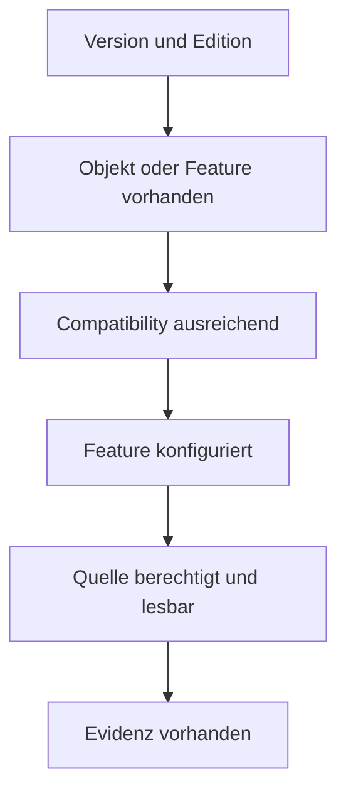

# Draft: technische Vertiefung – Version Adaptive und Special Features

**Stand:** 19. Juli 2026
**Status:** integriertes Authoring-Archiv; nicht kanonisch
**Abdeckung:** 8 Procedures aus `09_VersionAdaptive`

> Capability Detection muss Version, Edition, Engine Edition, Compatibility Level, Objekt-/Spaltenexistenz, Featurekonfiguration, Datenbankzustand und Berechtigung trennen. Optional nicht verfügbar ist ein erwarteter Status, kein Grund für einen Gesamtabbruch.

## 1. Capability-Modell

`Evidenz vorhanden` ist die letzte und schwächste Verfügbarkeitsaussage: `0` Zeilen kann fehlende Nutzung, Retention, Filter, Capture oder fehlenden Workload bedeuten. Umgekehrt beweist bloße Eligibility keine aktive Nutzung.

## 2. Procedures

### `[monitor].[USP_ServerFeatureCapabilities]`

**Leitfrage:** Welche versions-/editionsabhängigen Frameworkpfade sind auf dieser Instanz technisch möglich und lesbar?

**Technischer Hintergrund:** Die Procedure verbindet Product Major Version, Edition/Engine Edition, Compatibility und die Existenz versionsabhängiger Systemobjekte/Spalten. Capability-Probes vermeiden Compilefehler durch statische Referenzen auf nicht vorhandene Quellen und führen optionale Abfragen geschützt dynamisch aus.

**Datenquellen:** Die Analyse verwendet folgende Datenquellen und Ausführungspfade: `master.sys.all_objects`, `sys.databases`, `sys.dm_os_host_info`, `sys.objects`, `sys.query_store_replicas`, `sys.resource_governor_configuration`, `sys.schemas`, `sys.sp_executesql`, `sys.vector_indexes`, `sys.views`.

**Zeit- und Scopemodell:** Die zeitliche und fachliche Aussage ist wie folgt begrenzt: Aktueller Instanz-/Datenbankzustand. Upgrade, Compatibilitywechsel, Failover oder Permissionänderung können Ergebnis ändern.

**Bewertung und Gegenprobe:** Lesen Sie Supported, ObjectExists, Compatibility, Permission, Queryable und Usable getrennt. Dokumentieren Sie den Fallbackpfad und das Evidence Limit.

**Typische Fehlinterpretation:** Version allein reicht nicht: SQL Server 2025 mit niedriger Compatibility kann Features nicht im Querykontext aktivieren. Objekt vorhanden beweist keine nutzbare Datenlage.

**Weiterführende Analyse:** Für die weiterführende Analyse gelten folgende Schritte und Quellen: Das betroffene Spezialmodul nur bei `Usable=1` ausführen; sonst Status/Warnung beibehalten.

### `[monitor].[USP_SpecialFeatureInventory]`

**Leitfrage:** Welche besonderen oder versionsabhängigen Datenbankfeatures und Objektarten sind im gewählten Scope konfiguriert?

**Technischer Hintergrund:** Cross-Database-Katalogscans suchen Featuremarker für unter anderem Graph, Ledger, External Tables, FileTable/FILESTREAM, XML/Spatial/Columnstore, Memory Optimized, Vector oder weitere unterstützte Typen. Jede Featureart besitzt eigene Katalog- und Editionsbedingungen.

**Datenquellen:** Die Analyse verwendet folgende Datenquellen und Ausführungspfade: `sys.assemblies`, `sys.change_tracking_databases`, `sys.change_tracking_tables`, `sys.column_encryption_keys`, `sys.column_master_keys`, `sys.columns`, `sys.configurations`, `sys.databases`, `sys.external_data_sources`, `sys.external_languages`, `sys.external_libraries`, `sys.external_tables`, `sys.filegroups`, `sys.fulltext_catalogs`, `sys.fulltext_indexes`, `sys.objects`, `sys.service_queues`, `sys.services`, `sys.sp_executesql`, `sys.tables`, `sys.types`, `sys.xml_indexes`.

**Zeit- und Scopemodell:** Die zeitliche und fachliche Aussage ist wie folgt begrenzt: Aktueller Metadatenbestand je zugänglicher Datenbank; keine Nutzungs-/Historienmessung.

**Bewertung und Gegenprobe:** Für die Bewertung und Gegenprobe gelten folgende Prüfschritte: Featuretyp, Objektanzahl, Datenbankscope, Version/Compatibility, Schutz-/Abhängigkeitsmerkmale und zuständiges Deep-Modul lesen. Inventar dient Migrations-/Upgrade-/Betriebsplanung.

**Typische Fehlinterpretation:** Objekt vorhanden bedeutet nicht aktiv genutzt, performant oder korrekt konfiguriert. Null Zeilen kann durch Metadata Visibility oder ausgeschlossene Datenbanken entstehen.

**Weiterführende Analyse:** Für die weiterführende Analyse gelten folgende Schritte und Quellen: Featurebezogene Deep Analysis, Query-/Dependencyanalyse und Ownerreview.

### `[monitor].[USP_InMemoryOltpAnalysis]`

**Leitfrage:** Wie sind Memory-Optimized-Objekte, Indizes, Memoryverbrauch und Persistenz-/Checkpointpfade konfiguriert und belastet?

**Technischer Hintergrund:** In-Memory OLTP speichert Rows in Memory und nutzt MVCC statt klassischer Page Locks/Latches. Hashindizes verteilen Schlüssel auf Buckets; Rangeindizes verwenden Bw-Trees. Durable Tabellen schreiben Log und Checkpoint File Pairs; SCHEMA_ONLY nicht. Garbage Collection entfernt nicht mehr sichtbare Versionen.

**Datenquellen:** Die Analyse verwendet folgende Datenquellen und Ausführungspfade: `sys.databases`, `sys.dm_db_xtp_checkpoint_files`, `sys.dm_db_xtp_hash_index_stats`, `sys.dm_db_xtp_memory_consumers`, `sys.dm_db_xtp_table_memory_stats`, `sys.dm_db_xtp_transactions`, `sys.dm_resource_governor_resource_pools`, `sys.filegroups`, `sys.hash_indexes`, `sys.schemas`, `sys.sp_executesql`, `sys.table_types`, `sys.tables`.

**Zeit- und Scopemodell:** Die zeitliche und fachliche Aussage ist wie folgt begrenzt: Aktueller Katalog-/Runtimezustand; Memory-/Transaction-/Checkpointwerte teils seit Start, Objektbestand aktuell.

**Bewertung und Gegenprobe:** Für die Bewertung und Gegenprobe gelten folgende Prüfschritte: Table Durability, Rows/Memory, Hash Bucket Count, Empty/Chainverteilung, Indexart, GC/Transactionalter, Checkpointstorage und Database Memoryquota zusammen lesen. Hashketten benötigen Datenverteilungs-/Lookupkontext.

**Typische Fehlinterpretation:** Viele Empty Buckets allein sind nicht automatisch schlecht; lange Chains sind besonders bei häufigen Equality Lookups relevant. Memory-Optimized heißt nicht logfrei oder ohne Capacitygrenze.

**Weiterführende Analyse:** Für die weiterführende Analyse gelten folgende Schritte und Quellen: Current Transactions/Memory, Querypläne, XTP DMVs und Checkpoint-/Logstorage.

### `[monitor].[USP_TemporalAnalysis]`

**Leitfrage:** Welche system-versioned Tabellen besitzen welche History-, Period-, Retention-, Größen- und Indexkonfiguration?

**Technischer Hintergrund:** Temporal Tables schreiben bei Update/Delete frühere Rowversionen in eine History Table; Period Columns definieren Gültigkeit. System Versioning, Data Consistency Check und Retention steuern Lebenszyklus. Historyzugriffe über `FOR SYSTEM_TIME` benötigen passende Indizes/Partitionierung.

**Datenquellen:** Die Analyse verwendet folgende Datenquellen und Ausführungspfade: `sys.columns`, `sys.databases`, `sys.dm_db_partition_stats`, `sys.index_columns`, `sys.indexes`, `sys.periods`, `sys.schemas`, `sys.sp_executesql`, `sys.tables`.

**Zeit- und Scopemodell:** Die zeitliche und fachliche Aussage ist wie folgt begrenzt: Aktueller Schemastand plus angesammelte Historydaten innerhalb fachlicher/technischer Retention.

**Bewertung und Gegenprobe:** Für die Bewertung und Gegenprobe gelten folgende Prüfschritte: Current/History Table, Period Columns, Retention, Historygröße/Rows, Index-/Partitionierung und Cleanupstatus lesen. Schreibrate und typische Zeitprädikate bestimmen Design.

**Typische Fehlinterpretation:** Große History ist nicht automatisch Problem; sie kann Complianceanforderung sein. Temporal ON beweist keine erfolgreiche Retentionbereinigung.

**Weiterführende Analyse:** Für die weiterführende Analyse gelten folgende Schritte und Quellen: Object/Index/Partition/Capacity, konkrete Temporal Querypläne und Retentionpolicy.

### `[monitor].[USP_ServiceBrokerAnalysis]`

**Leitfrage:** Warum werden Service-Broker-Nachrichten nicht verarbeitet oder übertragen, und welche Queue-/Conversationzustände existieren?

**Technischer Hintergrund:** Service Broker routet typisierte Dialognachrichten über Services/Contracts/Queues. Internal Activation startet Procedures nach Queuezustand. Remoteübertragung nutzt Routes/Endpoints; `sys.transmission_queue` hält nicht zustellbare Nachrichten mit Fehlertext. Conversation Endpoints besitzen Zustandsmaschine und Lifetime.

**Datenquellen:** Die Analyse verwendet folgende Datenquellen und Ausführungspfade: `sys.conversation_endpoints`, `sys.databases`, `sys.dm_broker_activated_tasks`, `sys.dm_broker_queue_monitors`, `sys.dm_db_partition_stats`, `sys.schemas`, `sys.service_queues`, `sys.services`, `sys.sp_executesql`, `sys.transmission_queue`.

**Zeit- und Scopemodell:** Die zeitliche und fachliche Aussage ist wie folgt begrenzt: Aktueller Queue-/Conversation-/Transmissionzustand; Rows können bei Verarbeitung rasch verschwinden, alte Dialoge persistieren.

**Bewertung und Gegenprobe:** Für die Bewertung und Gegenprobe gelten folgende Prüfschritte: Broker Enabled, Queue IsReceiveEnabled/Activation, Queue Rows, Transmission Errors/Age, Endpoint States, Routes/Remote Binding und Poison-Message-Deaktivierung korrelieren. Wachstum über Zeit messen.

**Typische Fehlinterpretation:** Queue Rows > 0 können normaler Backlog sein; `NOTIFIED`/Activationstatus allein beweist keinen erfolgreichen Consumer. `NEW_BROKER` wäre destruktiv für Dialogidentitäten und ist keine Diagnosemaßnahme.

**Weiterführende Analyse:** Für die weiterführende Analyse gelten folgende Schritte und Quellen: Queueprocedure/Errorlog/XE, Network/Endpoint und wiederholtes Backlogsample.

### `[monitor].[USP_FullTextAnalysis]`

**Leitfrage:** Wie sind Full-Text Catalogs/Indexes konfiguriert, und laufen Population/Change Tracking ohne sichtbare Fehler oder Rückstand?

**Technischer Hintergrund:** Full-Text Engine tokenisiert sprachabhängig, speichert invertierte Indizes in Catalogs und aktualisiert sie über Full/Incremental/Auto Population. Stoplists, Search Properties und Change Tracking beeinflussen Inhalt. Population DMVs zeigen aktive Crawls/Phasen.

**Datenquellen:** Die Analyse verwendet folgende Datenquellen und Ausführungspfade: `sys.dm_fts_fdhosts`, `sys.dm_fts_index_population`, `sys.dm_fts_memory_pools`, `sys.dm_fts_outstanding_batches`, `sys.dm_fts_semantic_similarity_population`, `sys.fulltext_catalogs`, `sys.fulltext_index_columns`, `sys.fulltext_index_fragments`, `sys.fulltext_indexes`, `sys.indexes`, `sys.schemas`, `sys.sp_executesql`, `sys.tables`.

**Zeit- und Scopemodell:** Die zeitliche und fachliche Aussage ist auf den aktuellen Metadaten- und Populationzustand sowie die begrenzte Crawl- und Errorhistorie beschränkt.

**Bewertung und Gegenprobe:** Für die Bewertung und Gegenprobe gelten folgende Prüfschritte: Catalog/Index, Change Tracking State, Population Type/Status, Start/End, Items processed/failed, Fragmentcount, Language/Stoplist und Base-Table-Änderung korrelieren. Querybedarf bestimmt Dringlichkeit.

**Typische Fehlinterpretation:** `IDLE` kann erfolgreich fertig oder nie gestartet bedeuten. Ein vorhandener Full-Text-Index garantiert keine aktuelle Vollständigkeit oder semantisch passende Wordbreaker.

**Weiterführende Analyse:** Für die weiterführende Analyse gelten folgende Schritte und Quellen: Full-Text Crawl Logs/Errorlog, Job/Populationstart und konkrete CONTAINS-Query.

### `[monitor].[USP_DataCaptureDeepAnalysis]`

**Leitfrage:** Sind CDC, Change Tracking oder Replication nicht nur aktiviert, sondern innerhalb Retention, LSN-/Versiongrenzen und Agentdurchsatz nutzbar?

**Technischer Hintergrund:** CDC Capture liest das Transaktionslog in Change Tables; Cleanup verschiebt `min_lsn`. Consumer müssen ihren LSN-Checkpoint vor Cleanup verarbeiten. Change Tracking speichert Versionsmarken; `CHANGE_TRACKING_MIN_VALID_VERSION` bestimmt, ob ein Consumer reinitialisieren muss. Replication nutzt Logreader/Distributoragenten und eigene History.

**Datenquellen:** Die Analyse verwendet folgende Datenquellen und Ausführungspfade: `msdb.dbo.agent_datetime`, `msdb.dbo.sysjobhistory`, `msdb.dbo.sysjobs`, `sys.change_tracking_databases`, `sys.change_tracking_tables`, `sys.databases`, `sys.schemas`, `sys.sp_executesql`, `sys.tables`, `cdc.change_tables`, `msdb.dbo.cdc_jobs`, `msdb.dbo.MSdistributiondbs`, `distribution.dbo.MSdistribution_agents`, `distribution.dbo.MSdistribution_history`, `distribution.dbo.MSdistribution_status`, `distribution.dbo.MSsubscriptions`, `distribution.dbo.MSlogreader_agents`, `distribution.dbo.MSlogreader_history`, `distribution.dbo.MSmerge_agents`, `distribution.dbo.MSmerge_sessions`, `distribution.dbo.MSrepl_errors`, `sys.dm_cdc_errors`, `sys.dm_cdc_log_scan_sessions`, `sys.fn_cdc_get_min_lsn`, `sys.fn_cdc_map_lsn_to_time`, `CHANGE_TRACKING_CURRENT_VERSION`, `CHANGE_TRACKING_MIN_VALID_VERSION`.

**Zeit- und Scopemodell:** Die zeitliche und fachliche Aussage ist auf den aktuellen Enablement-, Job-, Session-, LSN- und Versionsstand sowie die begrenzte Historie beschränkt.

**Bewertung und Gegenprobe:** Für die Bewertung und Gegenprobe gelten folgende Prüfschritte: Capture Instance, Start/End LSN, Min/Max, Consumercheckpoint, Cleanup Retention, Log Scan Sessions/Errors, Change Tracking Current/Min Valid Version und Replicationagenten korrelieren. Lag als Abstand und Zeit bewerten.

**Typische Fehlinterpretation:** Enabled und laufender Job beweisen keine lückenlose Konsumierbarkeit. Wenn Consumercheckpoint älter als Min Valid/Min LSN ist, helfen weitere Reads nicht; Reinitialisierungsstrategie nötig.

**Weiterführende Analyse:** Für die weiterführende Analyse gelten folgende Schritte und Quellen: Agent Monitoring, Replication, Log/Capacity und Consumerstatus.

### `[monitor].[USP_EncryptionAnalysis]`

**Leitfrage:** Welche TDE-/Verschlüsselungszustände und Key-/Certificate-Abhängigkeiten sind sichtbar, ohne Schlüsselmaterial offenzulegen?

**Technischer Hintergrund:** TDE verschlüsselt Daten-/Logseiten at rest über Database Encryption Key, geschützt durch Server Certificate/Asymmetric Key in `master` oder EKM. `sys.dm_database_encryption_keys` zeigt State/Percent/Algorithm/Protector. Restore auf anderer Instanz benötigt passenden Protector/Private Key. Backups können zusätzlich separat verschlüsselt sein.

**Datenquellen:** Die Analyse verwendet folgende Datenquellen und Ausführungspfade: `msdb.dbo.backupset`, `sys.column_encryption_keys`, `sys.column_master_keys`, `sys.columns`, `sys.databases`, `sys.tables`, `master.sys.certificates`, `sys.dm_database_encryption_keys`.

**Zeit- und Scopemodell:** Die zeitliche und fachliche Aussage ist wie folgt begrenzt: Aktueller Encryption-/Keymetadatenzustand; Rotation/Scan kann Fortschrittszustände zeigen.

**Bewertung und Gegenprobe:** Für die Bewertung und Gegenprobe gelten folgende Prüfschritte: Encryption State, Percent Complete, Algorithm/Key Length, Encryptor Type, Certificateablauf/-backupstatus, TempDB-/Systemkontext und Restoregovernance prüfen. Nur öffentliche Metadaten ausgeben, keine Thumbprints/Keybytes in Artefakten.

**Typische Fehlinterpretation:** `ENCRYPTED` beweist nicht, dass Zertifikat/Private Key sicher gesichert und Restore getestet wurde. TDE schützt nicht vor berechtigten SQL-Abfragen oder Datenexfiltration im laufenden System.

**Weiterführende Analyse:** Für die weiterführende Analyse gelten folgende Schritte und Quellen: Certificate-/Key-Backupinventar außerhalb Repository, echter Restoretest und Securitypolicy.

## 3. Offizielle Primärquellen

- [Editions and supported features of SQL Server](https://learn.microsoft.com/sql/sql-server/editions-and-components-of-sql-server-2022)
- [ALTER DATABASE compatibility level](https://learn.microsoft.com/sql/t-sql/statements/alter-database-transact-sql-compatibility-level)
- [In-Memory OLTP overview](https://learn.microsoft.com/sql/relational-databases/in-memory-oltp/overview-and-usage-scenarios)
- [Hash indexes for memory-optimized tables](https://learn.microsoft.com/sql/relational-databases/in-memory-oltp/hash-indexes-for-memory-optimized-tables)
- [Temporal tables](https://learn.microsoft.com/sql/relational-databases/tables/temporal-tables)
- [Service Broker](https://learn.microsoft.com/sql/database-engine/configure-windows/sql-server-service-broker)
- [Full-Text Search](https://learn.microsoft.com/sql/relational-databases/search/full-text-search)
- [Change Data Capture](https://learn.microsoft.com/sql/relational-databases/track-changes/about-change-data-capture-sql-server)
- [Change Tracking](https://learn.microsoft.com/sql/relational-databases/track-changes/about-change-tracking-sql-server)
- [Transparent Data Encryption](https://learn.microsoft.com/sql/relational-databases/security/encryption/transparent-data-encryption)

## 4. Integrationshinweis

Die kanonische Dokumentation unterscheidet für optionale Quellen `nicht unterstützt`, `unterstützt aber nicht konfiguriert` und `konfiguriert, Evidenz vorhanden/fehlend`. Dadurch bleibt sichtbar, dass fehlende Daten nicht automatisch Fehler oder Gesundheit bedeuten.
