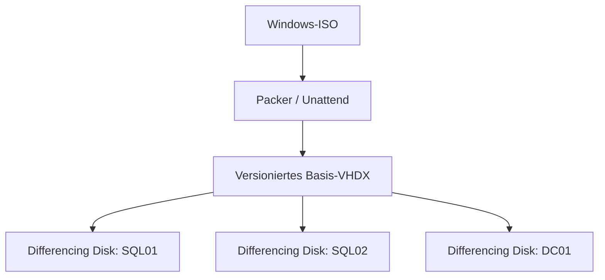
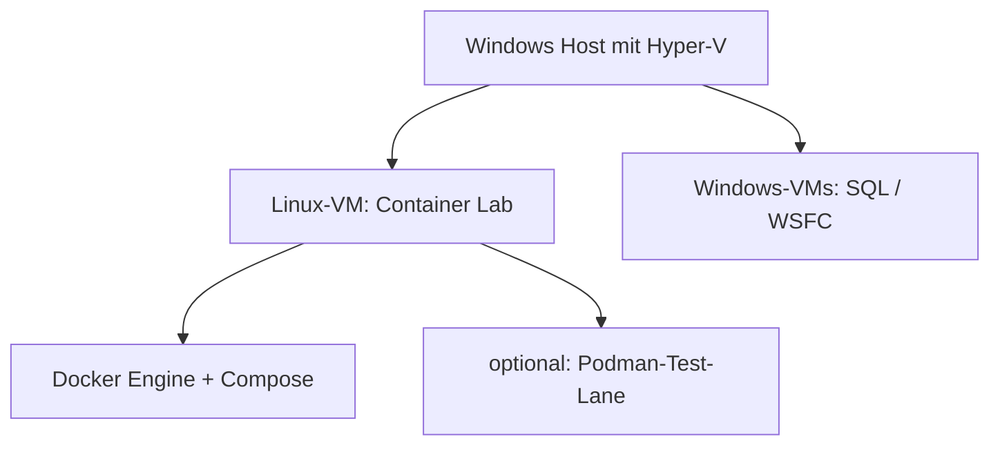

Um die Funktionalität dieses Frameworks zu demonstrieren, hätte ich gerne diverse Scripte (oder sonst was), mit denen ich die Konstellationen nachbilden kann.

Diese müssen so gebaut sein, dass es immer reproduzierbar ist. 
Es sollte für ALLE analysierbaren Konstellationen mindestens ein Beispiel vorhanden sein

Wie siehst du das - glaubst du, dass es möglich ist das bereit zu stellen?

https://github.com/gecompat/SQL_Server_Analyze


---


Ja, das ist möglich – aber nicht ausschließlich mit einer einzelnen Demo-Datenbank und nicht jede Konstellation als real erzwungener SQL-Server-Zustand.

Das Repository bietet bereits eine gute Grundlage:

* 97 öffentliche Analyse-Procedures sind dokumentiert.
* Die Testmatrix nennt 17 P0-, 40 P1- und 124 P2-Fälle.
* Die vorhandenen Beispiele zeigen derzeit überwiegend nur Aufrufe, erzeugen aber die analysierbaren Zustände nicht reproduzierbar.
  ([Call Catalog](https://github.com/gecompat/SQL_Server_Analyze/blob/main/Documentation/Reference/Call_Catalog.md), [Beispielaufrufe](https://github.com/gecompat/SQL_Server_Analyze/blob/main/Code/Examples/041_Beispielaufrufe_Alle_Funktionalitaeten.sql), [Test Matrix](https://github.com/gecompat/SQL_Server_Analyze/blob/main/Documentation/Quality/Test_Matrix.md))

## Empfohlene Lösung: DEMO-001 – Reproducible Diagnostic Lab

Jedes Szenario sollte einen einheitlichen Lebenszyklus besitzen:

1. `Setup` – Zustand deterministisch herstellen
2. `Workload` – gegebenenfalls Last oder konkurrierende Sessions starten
3. `Analyze` – passende Framework-Procedures aufrufen
4. `Verify` – erwartete Status- und Finding-Codes prüfen
5. `Cleanup` – ausschließlich eigene Demoobjekte entfernen
6. `Reset` – gesamten Demozustand reproduzierbar neu aufbauen

### Frei wählbare Demo-Datenbank

Der Datenbankname wird niemals fest codiert, sondern zentral übergeben, beispielsweise:

```text
DemoDatabaseName = SQLServerAnalyzeDemo
FrameworkDatabaseName = SQLServerAnalyze
```

Technische Anforderungen:

* Datentyp intern `sysname`
* Validierung mit `QUOTENAME`
* keine ungesicherte Konkatenation
* Framework- und Demo-Datenbank dürfen identisch sein, empfohlen wird aber eine getrennte Demo-Datenbank
* alle Szenarien übernehmen denselben konfigurierten Namen
* Setup und Cleanup verweigern die Ausführung bei Systemdatenbanken
* `DROP DATABASE` nur nach expliziter Bestätigung und nur für eine nachweislich vom Demo-Paket angelegte Datenbank

## Drei Arten von Szenarien

| Kategorie                          | Beispiele                                                                                                                 | Umsetzung                                                                |
| ---------------------------------- | ------------------------------------------------------------------------------------------------------------------------- | ------------------------------------------------------------------------ |
| Datenbanklokal und deterministisch | fehlende/überflüssige Indizes, Statistiken, Datentypen, Partitionierung, Columnstore, Temporal, Query Store, Planprobleme | vollständig in der frei wählbaren Demo-Datenbank                         |
| Laufzeit-/Mehrsession-Szenarien    | Blocking Chains, Deadlocks, Memory Grants, TempDB-Nutzung, lange Transaktionen, Lock Escalation                           | Controller plus zwei oder mehr getrennte Sessions                        |
| Instanz-/Infrastrukturzustände     | SQL Agent, Resource Governor, Extended Events, Backupketten, CLR, External Runtime, Availability Groups, Replikation      | capability-adaptive Instanzszenarien oder synthetische Evidence Fixtures |

Für Mehrsession-Szenarien reichen einzelne `.sql`-Dateien nicht. Dafür ist ein kleiner PowerShell- oder SQLCMD-Orchestrator sinnvoll, der Sessions gleichzeitig startet und kontrolliert beendet.

## Was realistisch vollständig abdeckbar ist

„Alle analysierbaren Konstellationen“ sollte als folgender Vertrag definiert werden:

> Für jeden fachlich unterscheidbaren Status- oder Finding-Code des Frameworks existiert mindestens ein reproduzierbares Demo-, Fixture- oder Capability-Szenario.

Nicht sinnvoll wäre:

> Jede mögliche Kombination sämtlicher Parameter, SQL-Server-Versionen, Editionen, Plattformen, Berechtigungen und Infrastrukturzustände real nachzubauen.

Diese Kombinationen wären praktisch unbegrenzt.

Einige Zustände dürfen nicht zuverlässig erzwungen werden:

* echter physischer I/O-Engpass
* realer Worker-Thread- oder Memory-Druck
* produktionsähnliche `PAGELATCH`-Contention
* beschädigte Datenbankseiten
* operatives AG-Failover
* echte Log-Shipping- oder Replikationstopologie
* External Runtime ohne installierte Runtime
* Windows-spezifische CLR-Sicherheitskonstellationen

Hier sollte das Paket sauber unterscheiden:

* `LIVE_REPRO` – real erzeugter Zustand
* `CONTROLLED_REPRO` – kontrollierte synthetische Workload
* `EVIDENCE_FIXTURE` – synthetische Eingabeevidenz
* `CAPABILITY_ONLY` – Zustand benötigt externe Infrastruktur
* `UNSAFE_NOT_AUTOMATED` – absichtlich nicht automatisch erzeugt

## Sinnvolle Repositorystruktur

```text
Code/Demos/
├── README.md
├── 00_Controller/
├── 01_CurrentState/
├── 02_ObjectIndex/
├── 03_PlanCache/
├── 04_QueryStore/
├── 05_ExtendedEvents/
├── 06_Infrastructure/
├── 07_ServerHealth/
├── 08_VersionAdaptive/
├── 09_ExecutionPlan/
├── Fixtures/
└── Validation/
```

Zusätzlich sollte eine maschinenlesbare Matrix entstehen:

```text
Metadata/Demos/Demo_Scenario_Catalog.csv
```

Sie ordnet mindestens zu:

* Scenario ID
* analysierte Procedure
* erwartete Finding-/Status-Codes
* SQL-Server-Version
* benötigte Edition oder Capability
* erforderliche Berechtigungen
* Demoart
* Ressourcenrisiko
* Setup-, Analyze- und Cleanup-Script
* Automatisierbarkeit
* erwartete Dauer
* unterstützte Plattform

## Hauptempfehlung

Das Vorhaben ist fachlich sinnvoll und umsetzbar. Ich würde es als eigenes Teilprojekt `DEMO-001` in mehreren Wellen implementieren:

1. Szenarioinventar aus allen öffentlichen Procedures und Finding-Codes erzeugen
2. Controller, frei wählbare Demo-Datenbank und Sicherheitsvertrag
3. deterministische datenbanklokale Szenarien
4. Mehrsession- und Workload-Szenarien
5. Feature-/Infrastrukturszenarien
6. Fixtures für nicht sicher erzwingbare Zustände
7. Coverage-Prüfung: kein analysierbarer Finding-Code ohne Szenario
8. CI-Ausführung auf SQL Server 2019, 2022 und 2025

Damit lässt sich eine sehr weitgehende und überprüfbare Demonstrationsabdeckung erreichen, ohne problematische Serverzustände künstlich oder unkontrolliert zu provozieren.

---

Ja, dafür gibt es geeignete freie Tools. Sie sollten das Demo-Framework ergänzen, aber nicht die gezielten T-SQL-Szenarien ersetzen: Ein allgemeiner Benchmark erzeugt zwar Last, aber nicht zuverlässig einen bestimmten Wait Type, Finding-Code oder Blocking-Zustand.

## Empfehlung

| Werkzeug                          | Eignung                                                                                        | Rolle im Demo-Paket                                    |
| --------------------------------- | ---------------------------------------------------------------------------------------------- | ------------------------------------------------------ |
| **sqlstresscmd / SQLQueryStress** | gezielte Abfrage mit definierter Thread- und Iterationszahl; Cross-Platform CLI; MIT-Lizenz    | Hauptwerkzeug für reproduzierbare Einzelszenarien      |
| **HammerDB**                      | realistische OLTP-/analytische Gesamtlast, Virtual Users, Ramp-up, CLI- und CI-Automatisierung | allgemeine Hochlast- und Systemübersichtsdemos         |
| **WorkloadTools**                 | Workload Capture, Analyse und Replay; MIT-Lizenz                                               | optional für synthetische Replay-Szenarien             |
| **OStress / RML Utilities**       | sehr leistungsfähige parallele Ausführung und Replay                                           | Windows-Alternative; kostenlos, aber nicht Open Source |
| eigene T-SQL-Orchestrierung       | Deadlocks, Blocking Chains, lange Transaktionen und exakt steuerbare Zustände                  | unverzichtbar für deterministische Spezialfälle        |

SQLQueryStress stellt inzwischen auch `sqlstresscmd` als Cross-Platform CLI bereit und verwendet dieselbe Load Engine wie die Windows-GUI. Das passt gut zur vorhandenen Linux-CI-Matrix des Projekts (ErikEJ, 2026: [SQLQueryStress](https://github.com/ErikEJ/SqlQueryStress)).

HammerDB unterstützt SQL Server, CLI-Automatisierung, CI-Pipelines, Virtual Users, Step Testing und analytische sowie transaktionale Workloads. Damit kann beispielsweise gezeigt werden, wie `USP_CurrentRequests`, Wait-, I/O-, Memory-, Query-Store- und Plan-Cache-Analysen unter einer realistischeren Mischlast reagieren (HammerDB, 2026: [Produktübersicht](https://www.hammerdb.com/), [Dokumentation](https://www.hammerdb.com/document.html)).

WorkloadTools eignet sich für Capture und Replay. Für das Repository dürfen jedoch ausschließlich vollständig synthetische Workloads verwendet werden – niemals Aufzeichnungen aus einer realen Umgebung. Das Tool selbst normalisiert zwar Batches für Auswertungen, aber Capture-Dateien können trotzdem schutzbedürftige SQL-Texte und Metadaten enthalten (WorkloadTools, 2026: [GitHub-Repository](https://github.com/spaghettidba/WorkloadTools)).

Microsoft empfiehlt für neuere SQL-Server-Versionen RML Utilities einschließlich `OStress` als Replay-Alternative zu Distributed Replay. Die dokumentierte finale RML-Version nennt allerdings nur Unterstützung bis SQL Server 2022; SQL Server 2025 wäre daher zunächst separat zu verifizieren (Microsoft, 2025: [RML Utilities](https://learn.microsoft.com/en-us/troubleshoot/sql/tools/replay-markup-language-utility), [Distributed Replay](https://learn.microsoft.com/en-us/sql/tools/distributed-replay/sql-server-distributed-replay?view=sql-server-ver17)).

## Vorgesehene Integration

Ich würde vier Lastprofile definieren:

| Profil    | Zweck                       | Beispiel                                           |
| --------- | --------------------------- | -------------------------------------------------- |
| `MINIMAL` | funktioneller Nachweis      | 2 Sessions, 30 Sekunden                            |
| `LIGHT`   | lokale Entwicklungsumgebung | 5–10 Sessions                                      |
| `MEDIUM`  | deutliche DMV-Evidenz       | 20–50 Sessions                                     |
| `HEAVY`   | bewusster Belastungstest    | konfigurierbar, explizite Bestätigung erforderlich |

Jedes Hochlastszenario erhält:

* frei wählbare Demo-Datenbank;
* festes `Application Name`, etwa `SQLServerAnalyzeDemo`;
* eindeutige Run-ID;
* Warm-up-, Mess- und Cool-down-Phase;
* maximale Laufzeit;
* maximale Parallelität;
* automatische Beendigung ausschließlich der eigenen Sessions;
* Vorher-/Während-/Nachher-Aufrufe der passenden Framework-Procedures;
* erwartete Finding- oder Status-Codes;
* `Cleanup` und Wiederholbarkeitsprüfung.

## Sicherheitsgrenzen

Ein Lastlauf darf nur starten, wenn:

* die Zieldatenbank nachweislich vom Demo-Paket erstellt oder registriert wurde;
* keine Systemdatenbank angegeben ist;
* das Lastprofil explizit bestätigt wurde;
* Host, Instanz und Datenbank vor dem Start angezeigt werden;
* für `HEAVY` eine zusätzliche Bestätigung vorliegt.

Nicht verwendet werden sollten globale Eingriffe wie:

```sql
DBCC FREEPROCCACHE;
DBCC DROPCLEANBUFFERS;
```

Diese beeinflussen die gesamte Instanz und wären für ein allgemein verwendbares Demo-Paket zu riskant.

Meine Hauptempfehlung ist daher: **eigene deterministische T-SQL-Szenarien plus `sqlstresscmd` für gezielte Parallelität; HammerDB zusätzlich für realistische Gesamtlast.** Damit erhalten wir sowohl reproduzierbare Findings als auch überzeugende Live-Demonstrationen unter Last.


---

Ja. Deine Beispiele sind technisch sinnvoll – die bisherige Betrachtung war zu stark auf „ein SQL Server plus erzeugte T‑SQL-Last“ beschränkt.

Die Demonstrationsumgebung sollte als vollständiges, reproduzierbares SQL-Server-Labor konzipiert werden. Nicht jede Konstellation muss innerhalb derselben Laufzeit oder ausschließlich mit T‑SQL erzeugt werden.

## Zielarchitektur

| Ebene                        | Technologie                      | Geeignete Szenarien                                                                   |
| ---------------------------- | -------------------------------- | ------------------------------------------------------------------------------------- |
| Einzelinstanz                | Docker Compose                   | Blocking, Deadlocks, Pläne, Statistiken, Query Store, Memory Grants, PAGELATCH        |
| Ressourcenlimitierung        | Docker/cgroups                   | RAM-, CPU- und Block-I/O-Druck                                                        |
| Mehrinstanz-Topologie        | Docker Compose                   | AG, Log Shipping, Replikation, Linked Server, verteilte Transaktionen                 |
| Netzwerkstörung              | `tc/netem` oder Proxy-Container  | Latenz, Paketverlust, Verbindungsabbrüche, unterbrochene AG-/Replication-Verbindungen |
| Windows-/Hardware-nahe Ebene | Hyper‑V                          | Windows-spezifische Features, Storage-QoS, WSFC, automatisches AG-Failover            |
| Defektartefakte              | Restore und Offline-Manipulation | Page Corruption, CHECKDB-Fehler, SUSPECT-Zustände                                     |
| Custom Images                | eigene SQL-Server-Container      | External Runtime, Language Extensions, SQL CLR und optionale Komponenten              |

Meine Hauptempfehlung ist eine Kombination aus Docker Compose und einer optionalen Hyper‑V-Erweiterung. Docker deckt den größten Teil automatisierbar ab; Hyper‑V ist für Windows-spezifische und hardware-nähere Szenarien erforderlich.

## Physischer I/O-Engpass

Das ist möglich und sollte nicht nur durch künstliches `WAITFOR` simuliert werden.

### Docker auf nativem Linux

Über cgroups kann die Block-Device-Leistung begrenzt werden:

* maximale Read-/Write-IOPS;
* maximale Read-/Write-Bandbreite;
* begrenzte CPU;
* begrenzter RAM.

Zusammen mit einem Working Set, das größer als der Buffer Pool ist, lassen sich reale physische Reads und damit unter anderem folgende Zustände erzeugen:

* `PAGEIOLATCH_SH`;
* `PAGEIOLATCH_EX`;
* `IO_COMPLETION`;
* `ASYNC_IO_COMPLETION`;
* hohe `io_stall_read_ms`;
* hohe `io_stall_write_ms`;
* langsame Data-File-Autogrowths;
* langsame Backups und Restores.

Der Linux-Block-I/O-Controller unterstützt explizite I/O-Throttling-Policies (Linux Kernel, 2026: [Block IO Controller](https://docs.kernel.org/admin-guide/cgroup-v1/blkio-controller.html)).

### Hyper‑V

Für Windows SQL Server ist Hyper‑V sogar die belastbarere Variante:

* separate VHDX für Data, Log, TempDB und Backup;
* pro VHDX konfigurierbare maximale IOPS;
* unterschiedliche virtuelle Disk-Latenzen beziehungsweise Leistungsgrenzen;
* reproduzierbare Trennung von Data- und Log-I/O.

`Set-VMHardDiskDrive -MaximumIOPS` begrenzt normalisierte I/O-Operationen auf Basis von 8-KB-I/O – das passt sehr gut zur SQL-Server-Seitengröße (Microsoft, 2026: [Set-VMHardDiskDrive](https://learn.microsoft.com/en-us/powershell/module/hyper-v/set-vmharddiskdrive?view=windowsserver2025-ps)).

Wichtig: Das ist ein echter Engpass im I/O-Pfad, aber natürlich kein verschlissenes physisches Laufwerk. Hardwarefehler wie intermittierende Controller-Resets benötigen Fault Injection oder echte Testhardware.

## Memory Pressure

Auch das lässt sich sehr gut erzeugen. Dabei sollten zwei Grenzen kombiniert werden:

1. RAM-Limit des Containers beziehungsweise der VM;
2. SQL-Server-interne Memory-Konfiguration.

Für Linux-Container stehen zur Verfügung:

* Docker-/cgroup-Memory-Limit;
* `MSSQL_MEMORY_LIMIT_MB`;
* `max server memory`.

`max server memory` begrenzt nicht den gesamten SQL-Server-Prozess, sondern hauptsächlich den Buffer Pool. `MSSQL_MEMORY_LIMIT_MB` beziehungsweise das cgroup-Limit umfasst dagegen die gesamte Instanz einschließlich SQLPAL, Agent und weiterer Komponenten (Microsoft, 2026: [SQL Server Memory on Linux](https://learn.microsoft.com/en-us/sql/linux/configure/performance-best-practices-sql-server-memory?view=sql-server-ver17)).

Damit lassen sich getrennt erzeugen:

* Buffer-Pool-Druck und physische Reads;
* niedrige Page Life Expectancy;
* Lazy Writes;
* Memory Grant Pressure;
* `RESOURCE_SEMAPHORE`;
* Grant Queue und `Memory Grants Pending`;
* Spill-to-tempdb;
* External-Runtime-Druck;
* echtes Container-OOM als separates destruktives Szenario.

Ein OOM-Kill gehört in eine eigene Szenarioklasse, weil er die Instanz beendet und anschließend neu aufgebaut werden muss.

## PAGELATCH

Ja. Das lässt sich ohne Storage-Engpass reproduzieren.

Die stabilste Variante ist eine synthetische Tabelle mit:

* sequenziell ansteigendem Clustered Key;
* vielen kleinen parallelen Inserts;
* 50 bis mehrere hundert Sessions;
* bewusst deaktiviertem `OPTIMIZE_FOR_SEQUENTIAL_KEY`;
* ausreichend schnellem Storage, damit nicht `PAGEIOLATCH` dominiert.

Alle Sessions konkurrieren dabei um die letzte Indexseite. Microsoft beschreibt genau diese Lastform als typische Ursache für `PAGELATCH_EX` bei parallelen Inserts (Microsoft, 2026: [Resolve PAGELATCH_EX contention](https://learn.microsoft.com/en-us/troubleshoot/sql/database-engine/performance/resolve-pagelatch-ex-contention)).

Das Szenario sollte Varianten enthalten:

* Baseline mit Last-Page Contention;
* `OPTIMIZE_FOR_SEQUENTIAL_KEY = ON`;
* partitionierter beziehungsweise verteilter Schlüssel;
* Heap oder nichtsequenzieller Key als Vergleich;
* TempDB Allocation Contention als eigenes, versionsabhängiges Szenario.

Damit demonstriert das Framework nicht nur die Erkennung, sondern auch die Wirkung möglicher Gegenmaßnahmen.

## Beschädigte Datenbankseiten

Auch das ist reproduzierbar möglich. Der saubere Weg ist:

1. kleine vollständig synthetische Datenbank erzeugen;
2. SQL Server stoppen oder Datenbank offline nehmen;
3. an einer bekannten Position gezielt Bytes verändern;
4. SQL Server wieder starten;
5. `DBCC CHECKDB`, Page- und Suspect-Pages-Analysen ausführen;
6. Container beziehungsweise VM nach dem Szenario verwerfen.

Dadurch können verschiedene Defektklassen vorbereitet werden:

* Data Page Checksum Failure;
* Index Page Corruption;
* Allocation Corruption;
* beschädigte IAM-/PFS-/GAM-Strukturen;
* beschädigte LOB-Seite;
* beschädigte Nonclustered-Index-Seite;
* nicht lesbare Seite;
* Datenbankzustand `SUSPECT`;
* Page-Restore-Szenario.

Ich würde keine fremde „kaputte Datenbank“ voraussetzen. Besser ist ein reproduzierbarer Corruption-Generator, der ausschließlich eine synthetische Labordatenbank manipuliert. Undokumentierte Befehle wie `DBCC WRITEPAGE` sollten dafür nicht die Hauptlösung sein; eine kontrollierte Offline-Manipulation ist klarer abgrenzbar.

## Availability Groups

Mehrere Container sind dafür geeignet.

### Kleine, vollständig lokale Variante

* zwei oder drei SQL-Server-Container;
* persistente getrennte Volumes;
* Certificate-basierte Endpoint-Authentifizierung;
* synchroner und asynchroner Commit;
* `CLUSTER_TYPE = NONE`;
* geplantes manuelles Failover;
* pausierte Datenbewegung;
* Netzwerkunterbrechung;
* verzögerte Secondary Replica;
* suspendierte Datenbank;
* nicht synchronisierte Replica.

Bei `CLUSTER_TYPE = NONE` ist ein echtes SQL-Server-Failover möglich, aber nur manuell. Automatisches Failover erfordert einen Cluster Manager, beispielsweise Pacemaker oder eine entsprechende Container-/Kubernetes-Lösung (Microsoft, 2026: [Availability Groups on Linux](https://learn.microsoft.com/en-us/sql/linux/business-continuity/availability-groups/overview?view=sql-server-ver17)).

Daher sollten zwei Stufen existieren:

* `AG_MANUAL`: Docker Compose, kompakt und lokal ausführbar;
* `AG_AUTOMATIC`: Hyper‑V mit WSFC oder Linux-Cluster-Orchestrierung.

Ein einzelner Docker-Host demonstriert allerdings keinen echten Hostausfall. Dafür braucht man mehrere VMs oder Cluster Nodes.

## Log Shipping

Zwei SQL-Server-Container plus gemeinsames Transfer-Volume genügen:

* Primary;
* Secondary;
* optional Monitor;
* aktivierter SQL Server Agent;
* Backup-, Copy- und Restore-Job;
* definierte Schwellenwerte.

Reproduzierbare Störungen:

* Backup Job angehalten;
* Copy Job angehalten;
* Restore Job angehalten;
* Transferverzeichnis nicht erreichbar;
* beschädigtes Log Backup;
* Restore Delay;
* Secondary hinter Primary;
* Log-Shipping-Alert überschritten.

Log Shipping basiert auf SQL Server Agent Jobs für Backup, Copy und Restore. Der Agent ist in aktuellen Linux-Paketen enthalten, aber standardmäßig deaktiviert (Microsoft, 2026: [Business Continuity](https://learn.microsoft.com/en-us/sql/linux/business-continuity/overview?view=sql-server-ver17), [SQL Server Agent on Linux](https://learn.microsoft.com/en-us/sql/linux/install-upgrade/setup-sql-agent?view=sql-server-ver17)).

## Replikation

Eine echte Topologie ist ebenfalls möglich:

* Publisher;
* Distributor;
* Subscriber;
* vollständig synthetetische Publication;
* SQL Agent in den beteiligten Containern.

Szenarien:

* Log Reader Agent gestoppt;
* Distribution Agent gestoppt;
* wachsender Distributor Backlog;
* Subscriber nicht erreichbar;
* nicht zugestelltes Command;
* abgelaufene Subscription;
* Initial Snapshot;
* Schemaänderung;
* Latenz und Netzwerkverlust.

SQL Server auf Linux kann seit SQL Server 2017 CU18 als Publisher, Distributor und Subscriber teilnehmen (Microsoft, 2026: [SQL Server Replication on Linux](https://learn.microsoft.com/en-us/sql/linux/replication/overview?view=sql-server-ver17)).

Für die erste Implementierung würde ich Transactional Replication priorisieren. Sie ist diagnostisch am relevantesten und weniger komplex als Merge Replication.

## Netzwerkengpässe und Kommunikationsfehler

Hier reicht eine reine Bandbreitenbegrenzung nicht. Das Labor sollte auch erzeugen können:

* feste Latenz;
* Jitter;
* Paketverlust;
* Paketduplikation;
* Reordering;
* Verbindungsabbruch;
* vollständige Partition zwischen zwei Containern;
* asymmetrische Störung nur in eine Richtung.

Unter Linux kann `tc netem` solche Netzwerkeigenschaften direkt emulieren (Linux manual pages, 2026: [tc-netem](https://man7.org/linux/man-pages/man8/tc-netem.8.html)).

Damit können AG, Log Shipping, Replikation, Linked Server, MSDTC und Remote-Abfragen unter realen TCP-Störungen demonstriert werden.

## External Runtime

Ja, als eigenes Custom Image.

Microsoft stellt keine fertigen SQL-Server-Images mit Language Extensions bereit, unterstützt aber den Bau entsprechender Images. Language Extensions unterstützen Java, C#, Python und R; die Runtime-Installation unterscheidet sich nach SQL-Server-Version (Microsoft, 2025: [Language Extensions](https://learn.microsoft.com/en-us/sql/language-extensions/language-extensions-overview?view=sql-server-ver17), Microsoft, 2026: [Java Extension on Linux](https://learn.microsoft.com/en-us/sql/linux/install-upgrade/setup-language-extensions-java?view=sql-server-ver17)).

Benötigte Szenarien wären:

* External Runtime korrekt installiert;
* External Scripts deaktiviert;
* Runtime nicht registriert;
* falscher Runtime-Pfad;
* fehlende Berechtigung;
* Runtime-Prozess hängt;
* Runtime-Ausführung läuft lange;
* Parallelitätslimit erreicht;
* Memory Pressure im Runtime-Prozess;
* fehlerhafte Extension;
* erfolgreicher Referenzlauf.

Für SQL Server 2019 kann zusätzlich ein Machine-Learning-Services-Container mit Python/R gebaut werden; Microsoft dokumentiert dafür ausdrücklich einen Docker-Template-Ansatz (Microsoft, 2026: [Machine Learning Services on Docker](https://learn.microsoft.com/en-us/sql/linux/install-upgrade/setup-machine-learning-docker?view=sql-server-ver15)).

## Weitere Infrastruktur-Szenarien

Über die genannten Fälle hinaus sollten mindestens folgende Kategorien betrachtet werden:

| Kategorie        | Reproduzierbares Beispiel                                            |
| ---------------- | -------------------------------------------------------------------- |
| CPU              | Container auf 1 CPU begrenzen, parallele CPU-intensive Abfragen      |
| Scheduler        | mehr aktive Worker als verfügbare Scheduler                          |
| Worker Threads   | viele blockierte beziehungsweise parallele Sessions                  |
| Transaction Log  | kleines Log, begrenztes Autogrowth, lange offene Transaktion         |
| Disk Full        | bewusst kleines separates Volume vollständig belegen                 |
| TempDB           | kleines Volume, Spill-Last, Autogrowth und Space Exhaustion          |
| Autogrowth       | kleine Growth-Schritte plus langsamer Datenträger                    |
| Backup           | langsames Ziel, blockiertes Ziel, beschädigtes Backup                |
| Query Store      | Plan Regression, erzwungener Plan, fehlgeschlagener Forced Plan      |
| Plan Cache       | Ad-hoc-Planflut, Parameter Sniffing, Compile Pressure                |
| Statistiken      | definierte Skew-Verteilung, veraltete Statistiken                    |
| Indexe           | Fragmentierung, Over-indexing, Duplicate Indexes                     |
| Blocking         | Chain, Schema Lock, Metadata Lock, Compile Lock                      |
| Deadlocks        | Key-, Range-, Conversion- und Parallelism-Deadlocks                  |
| Service Broker   | deaktivierte Queue, Transmission Queue Backlog                       |
| CLR              | erfolgreiche, fehlerhafte und blockierte Assembly-Ausführung         |
| MSDTC            | zwei Container, erfolgreiche und unterbrochene verteilte Transaktion |
| Sicherheit       | fehlende DMV-Rechte, eingeschränkte Metadatensichtbarkeit            |
| Versionsmatrix   | SQL Server 2019, 2022 und 2025 mit identischem Szenariovertrag       |
| NUMA/vNUMA       | Hyper‑V-VM mit definierter vCPU-/vNUMA-Topologie                     |
| Restart Recovery | lange offene Transaktion, Container-Abbruch, Recovery beobachten     |

## Reproduzierbarkeit

„Derselbe Wait-Wert“ ist nicht realistisch reproduzierbar. Reproduzierbar muss stattdessen der fachliche Befund sein.

Jedes Szenario benötigt daher einen Vertrag:

```text
Arrange
  Infrastruktur und Daten deterministisch aufbauen

Act
  Last oder Störung starten

Observe
  Framework während eines definierten Messfensters ausführen

Assert
  Erwarteten Status, Finding-Code oder Mindest-Evidenz prüfen

Cleanup
  ausschließlich eigene Ressourcen entfernen oder Umgebung verwerfen
```

Der Vertrag sollte enthalten:

* unterstützte SQL-Server-Versionen;
* erforderliche Plattform;
* erwartete Dauer;
* erwartete Ressourcen;
* Sicherheitsklasse;
* destruktiv/nicht destruktiv;
* erwartete Findings;
* zulässige alternative Wait Types;
* Timeouts;
* Health Checks;
* feste Seeds und Datenmengen;
* gepinnte Container-Image-Versionen;
* vollständigen Reset durch Container-/VM-Neuaufbau.

## Realistische Abdeckung

„Für jede analysierbare Konstellation“ lässt sich sinnvoll in vier Nachweisstufen aufteilen:

1. `REAL` – Zustand entsteht tatsächlich im SQL Server.
2. `EMULATED_INFRASTRUCTURE` – Storage, RAM oder Netzwerk wird kontrolliert begrenzt.
3. `RESTORED_ARTIFACT` – beschädigte DB, Plan, Deadlock XML oder Backup wird synthetisch vorbereitet.
4. `CONTRACT_FIXTURE` – nur für Zustände, die lokal nicht sicher erzeugbar sind, etwa bestimmte Hardware-, Cluster- oder Cloudfehler.

Damit kann tatsächlich jeder Analyzer-Pfad einen reproduzierbaren Nachweis erhalten, ohne zu behaupten, dass ein Docker-Container einen echten SAN-Controller-Ausfall oder ein vollständiges WSFC ersetzen könne.

Die Konsequenz ist klar: Das Vorhaben sollte nicht als Sammlung von Demo-Skripten, sondern als eigenständiges Teilprojekt **Reproducible Diagnostic Lab** geplant werden – mit Docker-Compose-Basis, optionalem Hyper‑V-Lab, Scenario Manifest, Coverage-Matrix und automatischer Ergebnisvalidierung.

---

Ja. Hyper‑V kann eine komplette Umgebung automatisiert erstellen, konfigurieren, testen und wieder entfernen. Es gibt allerdings kein einzelnes natives Gegenstück zu `docker compose`; dieselbe Funktion entsteht aus mehreren Bausteinen.

## Vergleich

| Funktion                    | Docker Compose          | Hyper‑V                                              |
| --------------------------- | ----------------------- | ---------------------------------------------------- |
| Maschinen definieren        | `compose.yaml`          | PowerShell-Konfiguration, optional Vagrant           |
| Basis-Image bauen           | `Dockerfile`            | Packer + ISO beziehungsweise Golden VHDX             |
| Betriebssystem installieren | Container-Image         | `Autounattend.xml`, Packer oder vorbereitete VHDX    |
| CPU/RAM festlegen           | Compose-Limits          | `Set-VMProcessor`, `Set-VMMemory`                    |
| Disks erzeugen              | Volumes                 | `New-VHD`, `Add-VMHardDiskDrive`                     |
| I/O begrenzen               | cgroups                 | Hyper‑V Storage QoS / `MaximumIOPS`                  |
| Netzwerk aufbauen           | Docker Networks         | virtuelle Switches, NAT, VLANs                       |
| Gast konfigurieren          | Entrypoint/Skripte      | PowerShell Direct, WinRM, DSC                        |
| Zustand zurücksetzen        | Container neu erstellen | Differencing Disks, neues Deployment                 |
| Mehrere Maschinen           | Services                | PowerShell-Orchestrierung oder Vagrant Multi-Machine |
| `up/down`                   | Compose CLI             | eigene PowerShell-Kommandos                          |

Hyper‑V selbst stellt eine umfangreiche PowerShell-API bereit. `New-VM` kann Maschinen aus vorhandenen VHDX-Dateien oder mit neuen Disks erstellen; auch Remote-Hyper‑V-Hosts werden unterstützt (Microsoft, 2026: [New-VM](https://learn.microsoft.com/en-us/powershell/module/hyper-v/new-vm?view=windowsserver2025-ps)).

## Sinnvolle Architektur für das Diagnostic Lab

Ich würde für das Repository eine kleine, Compose-ähnliche Orchestrierung bauen:

```text
Lab/
├── docker/
│   └── compose.yaml
├── hyperv/
│   ├── lab.config.example.psd1
│   ├── Invoke-Lab.ps1
│   ├── images/
│   │   ├── Build-BaseImage.ps1
│   │   └── Autounattend.template.xml
│   ├── topology/
│   │   ├── standalone.psd1
│   │   ├── wsfc-ag.psd1
│   │   ├── log-shipping.psd1
│   │   └── replication.psd1
│   └── scenarios/
│       ├── Invoke-StorageBottleneck.ps1
│       ├── Invoke-MemoryPressure.ps1
│       ├── Invoke-NetworkPartition.ps1
│       └── Invoke-NodeFailure.ps1
└── scenarios/
    └── scenario-manifest.json
```

Die Bedienung könnte ähnlich einfach wie bei Compose aussehen:

```powershell
.\Invoke-Lab.ps1 -Action Up -Topology WsfcAg
.\Invoke-Lab.ps1 -Action Scenario -Name StorageLatency
.\Invoke-Lab.ps1 -Action Reset -Topology WsfcAg
.\Invoke-Lab.ps1 -Action Down
```

Die Skripte sollten idempotent sein: Existiert ein passendes Objekt bereits, wird es geprüft beziehungsweise angepasst, nicht blind nochmals erzeugt.

## Vollständig automatisierbare Schritte

Ein `Up`-Lauf kann automatisiert:

1. Voraussetzungen und verfügbaren Host-RAM prüfen.
2. virtuelle Switches und isolierte Labornetze erzeugen.
3. Basis-VHDX prüfen oder aus ISO bauen.
4. Differencing Disks pro VM erstellen.
5. VMs mit definierten CPU-, RAM- und Disk-Limits anlegen.
6. Maschinen starten und deren Heartbeat abwarten.
7. über PowerShell Direct ins Gastbetriebssystem wechseln;
8. Hostnamen, IP-Adressen, Firewall und Rollen konfigurieren.
9. SQL Server unattended installieren beziehungsweise vorkonfigurierte Images verwenden.
10. SQL Server konfigurieren und Labordatenbanken erstellen.
11. WSFC, AG, Log Shipping oder Replikation einrichten.
12. Health Checks und Framework-Assertions ausführen.

PowerShell Direct funktioniert zwischen Hyper‑V-Host und Windows-Gast unabhängig von dessen Netzwerkkonfiguration. Damit lässt sich sogar eine VM reparieren oder konfigurieren, deren Netzwerk absichtlich unterbrochen wurde (Microsoft, 2025: [PowerShell Direct](https://learn.microsoft.com/en-us/windows-server/virtualization/hyper-v/powershell-direct)).

Eine Windows-Installation kann über `Autounattend.xml` ohne interaktive Setup-Seiten erfolgen (Microsoft, 2021: [Automate Windows Setup](https://learn.microsoft.com/en-us/windows-hardware/manufacture/desktop/automate-windows-setup?view=windows-11)).

## Hyper‑V-spezifische Szenarien

Hyper‑V ist besonders wertvoll für Konstellationen, die Docker nur eingeschränkt abbildet.

### WSFC und automatisches AG-Failover

Das Labor kann beispielsweise enthalten:

* `LAB-DC01`: Active Directory und DNS;
* `LAB-SQL01`: primäre SQL-Server-Instanz;
* `LAB-SQL02`: sekundäre Instanz;
* `LAB-WITNESS01`: File Share Witness oder weitere Cluster-Rolle;
* eigenes Cluster-Netz;
* optional getrenntes Client-Netz.

Anschließend kann ein Szenario gezielt:

* eine VM hart ausschalten;
* den SQL-Server-Dienst beenden;
* das Cluster-Netz trennen;
* eine Disk offline schalten;
* Heartbeat-Verkehr stören;
* ein automatisches AG-Failover auslösen;
* Framework-Ergebnisse vor, während und nach dem Failover prüfen.

Das ist wesentlich näher an einer realen Windows-SQL-Server-Umgebung als mehrere Container auf demselben Docker-Host.

### Storage-Engpass

Für Data, Log und TempDB können getrennte VHDX-Dateien angelegt werden. Jede Disk erhält eigene IOPS-Grenzen:

```powershell
Get-VMHardDiskDrive -VMName $VmName |
    Where-Object Path -Like '*Data*' |
    Set-VMHardDiskDrive -MaximumIOPS 100
```

Hyper‑V Storage QoS kann Limits über PowerShell konfigurieren und überwachen (Microsoft, 2022: [Storage Quality of Service](https://learn.microsoft.com/en-us/windows-server/storage/storage-qos/storage-qos-overview)).

Damit lassen sich reale Wartezustände im virtuellen I/O-Pfad erzeugen. Es ist aber weiterhin ein emulierter Engpass – kein echter Controller-, SAN- oder Hardwaredefekt.

### Memory Pressure

Der VM kann ein fester RAM-Wert zugewiesen werden:

```powershell
Set-VMMemory `
    -VMName $VmName `
    -DynamicMemoryEnabled $false `
    -StartupBytes 4GB
```

Innerhalb des Gasts wird zusätzlich `max server memory` konfiguriert. Dadurch können VM-Gesamtdruck und SQL-Server-interner Buffer-Pool-Druck getrennt demonstriert werden.

### Netzwerkfehler

Automatisierbar sind unter anderem:

* Netzwerkadapter trennen;
* virtuellen Switch wechseln;
* VLAN falsch konfigurieren;
* Bandbreite begrenzen;
* Firewallregel aktivieren;
* nur eine Kommunikationsrichtung blockieren;
* DNS- oder Routing-Fehler erzeugen.

Für präzise Latenz, Jitter und Paketverlust wäre eine zusätzliche Linux-Router-VM mit `tc/netem` die sauberste Variante. Alle SQL-VMs kommunizieren dann über diese Fault-Injection-VM.

## Golden Image oder Neuinstallation?

Hauptempfehlung: Golden Image plus Differencing Disks.



Vorteile:

* schneller Aufbau;
* reproduzierbarer Patchstand;
* wenig zusätzlicher Speicherbedarf;
* Reset durch Verwerfen und Neuerstellen der Child Disks;
* kein riskantes Zurücksetzen einer laufenden SQL-Server-VM.

Packer besitzt einen Hyper‑V-Builder, der aus einer ISO eine VM erstellen und anschließend als Image exportieren kann (HashiCorp, 2026: [Hyper‑V ISO Builder](https://developer.hashicorp.com/packer/integrations/hashicorp/hyperv/latest/components/builder/iso)).

Vagrant wäre die wichtigste Alternative. Es kommt einem deklarativen `compose.yaml` näher und unterstützt Hyper‑V sowie mehrere VMs. Der Trade-off: Für feingranulare Hyper‑V-Fehlersimulationen und Storage-QoS braucht man trotzdem eigene PowerShell-Erweiterungen; zudem sind Administratorrechte erforderlich (HashiCorp, 2026: [Vagrant Hyper‑V Provider](https://developer.hashicorp.com/vagrant/docs/providers/hyperv)).

## Wichtige Grenzen

* Hyper‑V-Automatisierung benötigt lokale Administratorrechte.
* Der Host muss Windows Pro/Enterprise oder Windows Server mit Hyper‑V sein.
* Windows- und SQL-Server-Installationsmedien sowie Lizenzen dürfen nicht einfach im Repository verteilt werden.
* Kennwörter oder Produktschlüssel dürfen nicht in `Autounattend.xml` oder Repository-Konfigurationen landen. Microsoft weist darauf hin, dass gecachte Answer Files sensible Inhalte hinterlassen können (Microsoft, 2021: [Windows Setup Automation Overview](https://learn.microsoft.com/en-us/windows-hardware/manufacture/desktop/windows-setup-automation-overview?view=windows-11)).
* Ein VM-Checkpoint während laufender SQL-Aktivität ist nicht automatisch ein fachlich sauberer Datenbank-Reset. Sicherer sind heruntergefahrene Basisimages, neu erzeugte Differencing Disks oder SQL-Server-Backups.
* Exakte Laufzeiten und Wait-Zahlen bleiben vom Host abhängig; reproduzierbar werden Findings und Zustandsklassen, nicht identische Messwerte.

Für das Framework würde ich daher zwei Laborebenen vorsehen:

* `Docker Lab`: schnell, portabel, für den Großteil der Szenarien;
* `Hyper-V Lab`: Windows SQL Server, WSFC, automatisches AG-Failover, getrennte VHDX, Storage QoS, vNUMA und hardwarenahe Störungen.

Damit kann auch die Hyper‑V-Umgebung faktisch mit einem einzigen Befehl aufgebaut und vollständig verworfen werden – lediglich die Implementierung hinter diesem Befehl ist umfangreicher als eine einzelne Compose-Datei.

---

Ja, der Großteil lässt sich auch mit Podman Desktop umsetzen. Einige frühere Aussagen müssen jedoch präzisiert werden: Docker Compose und Podman Compose sind nicht vollständig austauschbar, und Desktop-Container eignen sich nicht für jede hardwarenahe Fehlersimulation.

## Zentrale Klarstellungen

1. **Podman Desktop unter Windows betreibt keine Linux-Container direkt auf Windows.** Es verwendet eine „Podman Machine“ wahlweise über WSL2 oder Hyper‑V. Docker Desktop verwendet entsprechend WSL2 oder eine eigene Hyper‑V-VM. Diese internen VMs sind nicht mit einem vollständigen Hyper‑V-Labor aus mehreren Windows-/Linux-Server-VMs gleichzusetzen. Podman Desktop dokumentiert beide Provider ausdrücklich (Podman Desktop 2026, [Windows installation](https://podman-desktop.io/docs/installation/windows-install)).

2. **SQL-Server-Container sind Linux-Container.** Offiziell unterstützt Microsoft die Images nur auf Linux/x86‑64; emulierte CPU-Architekturen sind nicht unterstützt. Windows-Container mit SQL Server sind lediglich als eigene Referenzimages für Entwicklung denkbar, aber keine unterstützte Basis (Microsoft 2026, [Deploy SQL Server Linux containers](https://learn.microsoft.com/en-us/sql/linux/containers/deploy?view=sql-server-ver17)).

3. **Podman kann die Microsoft-SQL-Server-Images technisch ausführen.** Microsoft nennt inzwischen Docker oder Podman als mögliche Container Runtime in den Container-Tutorials. Einzelne Microsoft-Wizards und Docker-spezifische Beispieltemplates unterstützen Podman jedoch nicht ausdrücklich. Daher braucht das Lab eigene Tests für beide Engines (Microsoft 2026, [Restore in a Linux container](https://learn.microsoft.com/en-us/sql/linux/migrate/tutorial-restore-backup-sql-server-container?view=sql-server-ver17)).

4. **`podman compose` ist kein eigener vollständiger Compose-Interpreter.** Es delegiert an einen externen Provider, beispielsweise `docker-compose` oder `podman-compose`. Deshalb kann dieselbe `compose.yaml` je nach Provider unterschiedlich behandelt werden (Podman 2026, [podman compose](https://docs.podman.io/en/latest/markdown/podman-compose.1.html)).

## Plattformdefinitionen

| Kürzel         | Plattform                                                                                        |
| -------------- | ------------------------------------------------------------------------------------------------ |
| Docker-Linux   | Docker Engine auf einem nativen Linux-Host                                                       |
| Podman-Linux   | Podman, vorzugsweise rootful, auf einem nativen Linux-Host                                       |
| Docker-Desktop | Docker Desktop unter Windows, WSL2- oder Hyper‑V-Backend                                         |
| Podman-Desktop | Podman Desktop unter Windows, WSL2- oder Hyper‑V-Machine                                         |
| Hyper‑V-Lab    | Eigene vollständige Windows-/Linux-Server-VMs mit eigenen Disks, Netzwerken und Betriebssystemen |

## Mit Docker und Podman gut abbildbar

| Szenario                                               | Docker-Linux | Podman-Linux | Docker-Desktop | Podman-Desktop | Hyper‑V-Lab |
| ------------------------------------------------------ | :----------: | :----------: | :------------: | :------------: | :---------: |
| Blocking und Blocking Chains                           |       ✅      |       ✅      |        ✅       |        ✅       |      ✅      |
| Deadlocks                                              |       ✅      |       ✅      |        ✅       |        ✅       |      ✅      |
| `PAGELATCH`/Last-Page Contention                       |       ✅      |       ✅      |        ✅       |        ✅       |      ✅      |
| CPU- und Scheduler-Druck                               |       ✅      |       ✅      |        ✅       |        ✅       |      ✅      |
| Worker-Thread-Druck                                    |       ✅      |       ✅      |        ✅       |        ✅       |      ✅      |
| Memory Grants/`RESOURCE_SEMAPHORE`                     |       ✅      |       ✅      |        ✅       |        ✅       |      ✅      |
| Buffer-Pool-Druck                                      |       ✅      |       ✅      |        ✅       |        ✅       |      ✅      |
| TempDB-Spills und Space Pressure                       |       ✅      |       ✅      |        ✅       |        ✅       |      ✅      |
| kleines oder volles Transaction Log                    |       ✅      |       ✅      |        ✅       |        ✅       |      ✅      |
| Statistiken und Data Skew                              |       ✅      |       ✅      |        ✅       |        ✅       |      ✅      |
| Parameter Sniffing/Plan Regression                     |       ✅      |       ✅      |        ✅       |        ✅       |      ✅      |
| Query Store und Forced Plans                           |       ✅      |       ✅      |        ✅       |        ✅       |      ✅      |
| Plan-Cache-Bloat/Compile Pressure                      |       ✅      |       ✅      |        ✅       |        ✅       |      ✅      |
| Indexprobleme                                          |       ✅      |       ✅      |        ✅       |        ✅       |      ✅      |
| fehlende Berechtigungen                                |       ✅      |       ✅      |        ✅       |        ✅       |      ✅      |
| SQL Server Agent Jobs                                  |       ✅      |       ✅      |        ✅       |        ✅       |      ✅      |
| Service Broker Backlog                                 |       ✅      |       ✅      |        ✅       |        ✅       |      ✅      |
| Container-/Prozessabbruch und Recovery                 |       ✅      |       ✅      |        ✅       |        ✅       |      ✅      |
| vorbereitete Page Corruption                           |       ✅      |       ✅      |        ✅       |        ✅       |      ✅      |
| manuelles AG-Failover, `CLUSTER_TYPE=NONE`             |       ✅      |       ✅      |        ✅       |        ✅       |      ✅      |
| Log Shipping                                           |       ✅      |       ✅      |        ✅       |        ✅       |      ✅      |
| Transactional Replication                              |       ✅      |       ✅      |        ✅       |        ✅       |      ✅      |
| Linked Server zwischen SQL-Instanzen                   |       ✅      |       ✅      |        ✅       |        ✅       |      ✅      |
| Distributed Transactions zwischen Standalone-Instanzen |       ✅      |       ✅      |        ✅       |        ✅       |      ✅      |
| synthetische Netzwerklatenz über Proxy                 |       ✅      |       ✅      |        ✅       |        ✅       |      ✅      |
| Linux Language Extensions/External Runtime             |       ✅      |       ✅      |        ✅       |        ✅       |      ✅      |
| plattformneutrales SQL CLR                             |       ✅      |       ✅      |        ✅       |        ✅       |      ✅      |

Dabei gelten Versionsgrenzen. Beispielsweise ist Merge Replication unter SQL Server 2025 auf Linux nicht verfügbar, Transactional Replication hingegen schon. Ebenso unterscheiden sich die verfügbaren Machine-Learning- und Language-Extension-Pakete zwischen SQL Server 2019, 2022 und 2025 (Microsoft 2026, [SQL Server 2025 features on Linux](https://learn.microsoft.com/en-us/sql/linux/sql-server-linux-editions-and-components-2025?view=sql-server-ver17)).

## Nur mit Einschränkungen in Desktop-Containern

| Szenario                                | Native Linux-Container                      | Docker/Podman Desktop                                                        | Hyper‑V-Lab                               |
| --------------------------------------- | ------------------------------------------- | ---------------------------------------------------------------------------- | ----------------------------------------- |
| per Container begrenzte CPU             | zuverlässig über cgroups                    | grundsätzlich möglich                                                        | zuverlässig                               |
| per Container begrenzter RAM            | zuverlässig                                 | möglich; zusätzliches Gesamtlimit der Desktop-/Podman-VM                     | zuverlässig                               |
| echte Block-I/O-Bandbreitenbegrenzung   | rootful mit bekanntem Block Device          | nicht portabel und nicht zuverlässig über eine allgemeine Compose-Datei      | zuverlässig über VHDX/Storage QoS         |
| getrennte Data-/Log-/TempDB-Datenträger | bei getrennten Host-Block-Devices           | Volumes sind meist nur logisch getrennt und liegen auf derselben VM-Disk     | echte getrennte VHDX                      |
| `tc/netem` auf Container-Netzwerken     | mit `NET_ADMIN` gut möglich                 | in der internen VM möglich, aber backendabhängig                             | über Router-VM vollständig kontrollierbar |
| Paketverlust, Jitter, Reordering        | mit `tc/netem`                              | bedingt; portabler über Proxy-Container                                      | zuverlässig über Router-VM                |
| isoliertes „Disk full“                  | eigenes Loop-/Block-Device oder Dateisystem | nur mit Zusatzaufbau; sonst Gefahr, die gemeinsame Desktop-VM-Disk zu füllen | eigene kleine VHDX                        |
| Container-OOM                           | zuverlässig                                 | zuverlässig, aber die Desktop-VM muss ausreichend RAM besitzen               | VM- oder SQL-spezifisch steuerbar         |
| harte Netzwerkpartition                 | rootful/firewall/netns                      | Container-Netz oder Proxy; kein echter VM-NIC-Ausfall                        | VM-Adapter, Switch, VLAN oder Router-VM   |

Podman unterstützt Read-/Write-BPS und IOPS grundsätzlich. Dafür muss aber ein echtes Block Device adressiert werden; rootless- und cgroup-Konfigurationen können die Limits verhindern. Auf Podman Desktop liegt dieses Device innerhalb der Podman Machine und ist daher nicht portabel über alle Installationen hinweg (Podman 2026, [podman run resource limits](https://docs.podman.io/en/latest/markdown/podman-run.1.html)).

Daraus folgt eine Korrektur der früheren Aussage:

> Ein reproduzierbarer echter I/O-Engpass ist mit Docker/Podman auf nativem Linux möglich. Mit Docker Desktop oder Podman Desktop ist er über eine allgemeine Compose-Datei nicht verlässlich portabel. Dort sollte Hyper‑V Storage QoS oder ein speziell aufgebautes Fault-Injection-Volume verwendet werden.

## Konstellationen für das vollständige Hyper‑V-Lab

Diese Szenarien benötigen keine Hyper‑V-Technologie im universellen Sinn – andere Hypervisoren oder physische Server wären ebenfalls möglich. Innerhalb des geplanten lokalen Labors sind sie aber nur mit vollständigen Hyper‑V-VMs fachlich belastbar.

| Konstellation                                        | Warum Container nicht ausreichen                                                                   |
| ---------------------------------------------------- | -------------------------------------------------------------------------------------------------- |
| Windows Server SQL Server                            | Offizielle SQL-Container sind Linux-basiert                                                        |
| WSFC-basierte Availability Group                     | Benötigt Windows Server Failover Clustering und vollständige Windows-Knoten                        |
| automatisches WSFC-AG-Failover                       | `CLUSTER_TYPE=NONE` in Containern erlaubt nur manuelles Failover                                   |
| Failover Cluster Instance                            | Cluster, Windows-Rollen und Shared-/Cluster-Storage erforderlich                                   |
| Windows-Knoten hart ausschalten                      | Container-Stopp simuliert nur Prozess-/Instanzausfall                                              |
| Cluster Heartbeat-Ausfall                            | Container-Netz ist kein vollständiges WSFC-Netz                                                    |
| File Share/Cloud Witness                             | Vollständige Cluster- und Identitätsinfrastruktur erforderlich                                     |
| Windows-Domäne, SPNs und Kerberos-Fehlerbilder       | Linux-Container können Kerberos verwenden, bilden aber keine vollständige Windows-/AD-Topologie ab |
| Windows-spezifische SQL-Dienste und Service Accounts | Im Linux-Container nicht vorhanden                                                                 |
| Windows Registry und Windows Performance Counter     | Im Linux-Container nicht vorhanden                                                                 |
| Windows Machine Learning Services/Launchpad          | Andere Architektur als Linux External Runtime                                                      |
| CLR mit Windows-only Assemblies oder nativen DLLs    | Unter Linux nicht ausführbar                                                                       |
| vNUMA-/NUMA-Topologien                               | Container können CPU-Sets begrenzen, aber keine definierte vNUMA-Topologie erzeugen                |
| getrennte virtuelle Storage Controller               | Container sehen keine vollständige virtualisierte Controller-Topologie                             |
| VHDX auswerfen, offline setzen oder IOPS-begrenzen   | Erfordert Kontrolle der VM-Hardware                                                                |
| kontrollierter VM-Boot-/OS-Recovery-Verlauf          | Container haben keinen vollständigen Gast-Bootvorgang                                              |
| Windows-Patching, Dienststart- und Upgradefehler     | Linux-Container bilden diese Abläufe nicht ab                                                      |
| Windows-/Linux-Plattformvergleich desselben Findings | Erfordert mindestens eine vollständige Windows-SQL-Instanz                                         |

Linux-AGs können mit Pacemaker automatisches Failover durchführen. Das sollte jedoch in vollständigen Linux-VMs und nicht als gewöhnliche privilegierte Compose-Container-Topologie aufgebaut werden. Microsoft verlangt für automatisches Linux-Failover `CLUSTER_TYPE=EXTERNAL`; `CLUSTER_TYPE=NONE` unterstützt nur manuelles Failover (Microsoft 2026, [Availability Groups on Linux](https://learn.microsoft.com/en-us/sql/linux/business-continuity/availability-groups/overview?view=sql-server-ver17)).

## Was selbst ein einzelner Hyper‑V-Host nicht echt nachbildet

Auch mehrere Hyper‑V-VMs auf einem Rechner ergeben noch keinen echten physischen Hostausfall.

| Fehlerbild                                 | Erforderliche Umgebung                                          |
| ------------------------------------------ | --------------------------------------------------------------- |
| Ausfall eines SQL-Knotens/VMs              | einzelner Hyper‑V-Host genügt                                   |
| Ausfall eines Gastbetriebssystems          | einzelner Hyper‑V-Host genügt                                   |
| Ausfall eines virtuellen Switches          | lokal simulierbar                                               |
| Ausfall eines physischen Hyper‑V-Hosts     | mindestens zwei physische Hosts                                 |
| Storage-Array-/SAN-Ausfall                 | externe Storage-Testumgebung oder Fixture                       |
| Controller Reset/Hardware Timeout          | Fault-Injection-Hardware, Hypervisor-Unterstützung oder Fixture |
| echte Split-Brain-Situation über Standorte | mehrere Hosts beziehungsweise getrennte Netze                   |
| Stromausfall eines Standorts               | mehrere physische Standorte oder abstrahierte Fixture           |

## Empfohlene Laborstruktur

Meine Hauptempfehlung ist nun eine dreistufige Architektur:

1. **Portable Compose Core**

   Eine gemeinsame `compose.yaml` für Docker Compose und Podman Compose. Darin nur der nachgewiesene gemeinsame Funktionsumfang: SQL-Instanzen, Netzwerke, Volumes, Health Checks, CPU/RAM-Limits und Profile.

2. **Native Linux Infrastructure Lab**

   Engine-spezifische Ergänzungen für Docker und Podman: Block-I/O-Throttling, `tc/netem`, Loop Devices, Disk-Full-Volumes und privilegierte Fault Injection. Podman dafür vorzugsweise rootful.

3. **Hyper‑V VM Lab**

   Windows SQL Server, WSFC, automatisches Failover, FCI, vNUMA, getrennte VHDX, Storage QoS, Windows External Runtime und betriebssystemnahe Fehler.

Jedes Compose-Szenario sollte automatisiert in mindestens diesen beiden Lanes validiert werden:

```text
docker compose config
docker compose up

podman compose config
podman compose up
```

Dabei muss der verwendete Podman-Compose-Provider festgeschrieben und protokolliert werden. Eine lediglich syntaktisch gültige Compose-Datei ist kein Nachweis, dass Resource Limits, Health Checks, Netzwerkoptionen und Profiles von beiden Engines identisch umgesetzt werden.

**Gesamturteil:** Etwa 75–85 % der fachlichen SQL-Server-Diagnoseszenarien sind mit Docker oder Podman abbildbar. Die verbleibenden Szenarien betreffen überwiegend Windows, WSFC, automatische Cluster-Failover, vNUMA und hardware-/betriebssystemnahe Störungen. Podman Desktop ist daher eine sinnvolle gleichwertige zweite Container-Lane, aber kein Ersatz für das vollständige Hyper‑V-Labor.


---

@GitHub was würdest du mir empfehlen
Kombination aus Hyper-V und Docker und/oder Podman
oder nur Hyper-V bzw. nur Docker und / oder Podman
was empfiehlst du mir

---

Meine klare Empfehlung ist:

> **Hyper‑V als Infrastruktur-Basis plus Docker Engine in einer dedizierten Linux-VM. Podman zusätzlich als optionale Kompatibilitäts-Lane, nicht als zweite gleichberechtigte Hauptlaufzeit.**

Nicht Docker Desktop und Podman Desktop parallel als Fundament verwenden.

## Empfohlener Aufbau



| Ebene                | Empfehlung                                     | Aufgabe                                                              |
| -------------------- | ---------------------------------------------- | -------------------------------------------------------------------- |
| Host                 | Hyper‑V                                        | VM-, Netzwerk-, Storage- und Ressourcensteuerung                     |
| Portable Lab-Lane    | Docker Engine unter Linux                      | schnelle SQL-Server-Container und Compose-Topologien                 |
| Kompatibilitäts-Lane | Podman unter Linux                             | Prüfung, ob portable Szenarien auch mit Podman funktionieren         |
| Windows-Lab          | vollständige Hyper‑V-VMs                       | Windows SQL Server, WSFC, automatisches AG-Failover, Windows Runtime |
| Fault Injection      | Linux-Router-VM beziehungsweise getrennte VHDX | Netzwerkfehler, Storage QoS, Disk Full, Latenz                       |

## Warum diese Kombination?

Dokumentiert im Repository sind genau jene Nachweislücken, die eine einzige Plattform nicht sauber schließt:

* realer Memory Pressure und produktionsähnliche `PAGELATCH`-Last;
* operatives Failover und Seeding;
* Remote-Replikations- und Distributorpfade;
* External-Runtime-Positivtests;
* SQL-CLR-SAFE-Assembly und Windows-Securityfälle;
* Storage-, Netzwerk-, Restore-, Chaos- und Failovertests.

Siehe die aktuelle [Testmatrix](https://github.com/gecompat/SQL_Server_Analyze/blob/main/Documentation/Quality/Test_Matrix.md) und den [RUNTIME-001-Vertrag](https://github.com/gecompat/SQL_Server_Analyze/blob/main/Documentation/Architecture/External_Runtime_CLR_Analysis_Plan.md).

Docker übernimmt dabei die häufigen, schnell reproduzierbaren Fälle. Hyper‑V schließt die Windows-, Cluster-, Storage- und betriebssystemnahen Lücken.

## Weshalb Docker Engine und nicht primär Docker Desktop?

Eine dedizierte Linux-VM unter Hyper‑V bietet:

* direkten und kontrollierbaren Zugriff auf cgroups;
* verlässlicheres CPU-, RAM- und Block-I/O-Throttling;
* `tc/netem` für Latenz, Paketverlust und Jitter;
* kontrollierte zusätzliche virtuelle Disks;
* reproduzierbare Linux-Konfiguration;
* keine Abhängigkeit von der internen Docker-Desktop-VM;
* besser kontrollierbare Updates;
* einen klaren Reset der kompletten Container-Lane.

Docker Desktop ist komfortabler, verschleiert aber einen Teil der Infrastruktur hinter seiner eigenen VM. Gerade bei I/O-, Netzwerk- und Disk-Full-Szenarien ist das für dein Vorhaben ungünstig.

## Rolle von Podman

Podman würde ich unterstützen, aber zunächst nicht als primäre Engine verwenden.

Hauptgründe:

* Docker Compose ist für komplexe Mehrcontainer-Labore derzeit der etabliertere Referenzpfad.
* Microsofts SQL-Server-Containerbeispiele und viele Drittanbieterbeispiele sind weiterhin Docker-orientiert.
* `podman compose` hängt vom gewählten Compose-Provider ab.
* Netzwerk-, Health-Check-, Resource-Limit- und Volume-Verhalten muss gesondert validiert werden.
* Ein zusätzlicher Podman-Pfad verdoppelt einen Teil des Test- und Troubleshooting-Aufwands.

Podman ist trotzdem wertvoll als:

* zweite Portabilitäts-Lane;
* Alternative bei Docker-Lizenz- oder Betriebsanforderungen;
* Test für daemonlose beziehungsweise rootless Ausführung;
* Nachweis, dass die Labordefinition nicht unnötig Docker-spezifisch ist.

Ich würde daher einen festen Provider und eine dokumentierte Version verwenden und Podman nur für Szenarien mit Capability `PODMAN_SUPPORTED` ausführen.

## Bewertung der Alternativen

| Variante                                 | Urteil                    | Begründung                                                                 |
| ---------------------------------------- | ------------------------- | -------------------------------------------------------------------------- |
| Nur Docker Desktop                       | Nicht empfohlen           | Windows-, WSFC-, vNUMA- und Storage-QoS-Fälle fehlen                       |
| Nur Podman Desktop                       | Nicht empfohlen           | dieselben Plattformlücken plus höheres Compose-Kompatibilitätsrisiko       |
| Nur Hyper‑V                              | Möglich, aber ineffizient | vollständige Abdeckung, jedoch langsamer Aufbau und hoher Ressourcenbedarf |
| Hyper‑V + Docker Desktop                 | Gut                       | bequem, aber Infrastruktur-Faults teilweise backendabhängig                |
| Hyper‑V + Podman Desktop                 | Gut mit Einschränkungen   | lizenzfreundlich, aber Compose-Verhalten stärker zu validieren             |
| Hyper‑V + Linux-VM mit Docker Engine     | **Beste Hauptlösung**     | hohe Reproduzierbarkeit und beste Trennung der Laborebenen                 |
| Hyper‑V + Linux-VM mit Docker und Podman | **Bestes Endziel**        | Docker als Haupt-Lane, Podman als geprüfte Alternative                     |

## Sinnvoller Ausbaupfad

1. **Portable Docker-Compose-Basis**

   * SQL Server 2019, 2022 und 2025;
   * Blocking, Deadlocks, Plans, Query Store, Memory Grants, `PAGELATCH`;
   * Log Shipping, Replikation und manuelle AG.

2. **Infrastructure Fault Injection**

   * Memory-/CPU-Limits;
   * Block-I/O-Throttling;
   * `tc/netem`;
   * kleine getrennte Datenträger;
   * Disk Full und Recovery.

3. **Hyper‑V-Windows-Lab**

   * Active Directory und DNS;
   * zwei oder drei Windows-SQL-Knoten;
   * WSFC und automatisches AG-Failover;
   * Windows External Runtime;
   * SQL CLR mit Windows-spezifischen Permission Sets.

4. **Podman-Kompatibilitäts-Lane**

   * dieselben portablen Compose-Szenarien;
   * Capability-Matrix statt pauschaler Gleichstellung;
   * engine-spezifische Overrides nur bei technisch notwendigen Unterschieden.

## Falls du dich auf nur eine Technologie beschränken musst

Dann würde ich **Hyper‑V** wählen.

Begründung: In einer Linux-VM unter Hyper‑V kannst du später immer noch Docker oder Podman betreiben. Aus einem reinen Container-Host kannst du dagegen keine vollständigen Windows-/WSFC-/vNUMA-/Storage-QoS-Szenarien ableiten.

Für dein Diagnostic Lab ist daher die passende Zielentscheidung:

> **Hyper‑V ist das Fundament. Docker Compose ist die primäre schnelle Ausführungsebene. Podman wird als optionale Kompatibilitäts-Lane vorgesehen.**


---