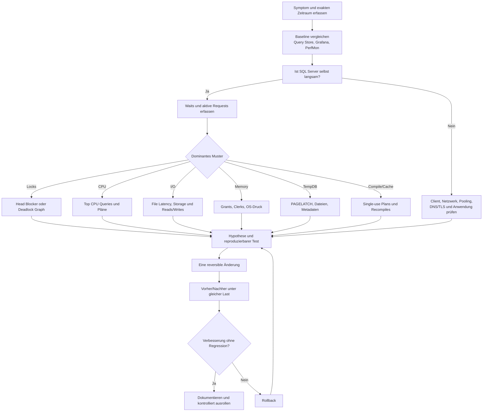

# SQL Server: Testdaten, Monitoring und reproduzierbare Performance-Labs

Status: nicht maßgebliche Forschungsnotiz

Recherchezeitpunkt: 2026-08-07

Diese Notiz katalogisiert externe Testdaten, Lastwerkzeuge und Diagnosehilfen für
explorative Laboruntersuchungen. Sie definiert weder einen Produktvertrag noch den
Implementierungsbacklog oder die verbindliche CI-Auswahl. Maßgeblich bleiben
[`Lab/README.md`](../../../Lab/README.md),
[`Reproducible Diagnostic Lab.md`](Reproducible%20Diagnostic%20Lab.md),
[`Future_Enhancement_Backlog.csv`](../../../Metadata/Quality/Future_Enhancement_Backlog.csv)
und die dort referenzierten Projektverträge.

Zeitabhängige Versions-, Support-, Lizenz- und Kompatibilitätsangaben sind vor einer
Umsetzung anhand der verlinkten Primärquellen neu zu prüfen. Externe Werkzeuge und
Datensätze werden nicht automatisch zu Abhängigkeiten des Frameworks.

## Executive Summary

Für ein belastbares SQL-Server-Labor empfiehlt sich kein einzelner Datensatz, sondern eine Kombination aus vier Bausteinen:

| Ziel | Hauptempfehlung | Wichtigste Alternative |
|---|---|---|
| Funktionale OLTP-Tests | [WideWorldImporters OLTP](https://github.com/microsoft/sql-server-samples/releases/tag/wide-world-importers-v1.0) | [AdventureWorks OLTP](https://github.com/microsoft/sql-server-samples/releases/tag/adventureworks) |
| Data Warehouse und BI | [AdventureWorksDW](https://github.com/microsoft/sql-server-samples/releases/tag/adventureworks) | [Contoso BI Demo](https://www.microsoft.com/en-us/download/details.aspx?id=18279) |
| Realistische Performance- und Index-Tests | [Stack Overflow SQL Server Database](https://www.brentozar.com/archive/2015/10/how-to-download-the-stack-overflow-database-via-bittorrent/) | [TPC-H/dbgen](https://github.com/electrum/tpch-dbgen) |
| Reproduzierbare Lasttests | [HammerDB](https://www.hammerdb.com/) | [Microsoft RML Utilities/OStress](https://learn.microsoft.com/en-us/troubleshoot/sql/tools/replay-markup-language-utility) |
| Kurzzeitdiagnose | Query Store, Extended Events, DMVs, `sp_WhoIsActive`, First Responder Kit | PSSDiag/SQL LogScout und SQL Nexus |
| Langzeitmonitoring | Prometheus, `windows_exporter` beziehungsweise `sql_exporter`, Grafana | Redgate Monitor |
| Fehlerreproduktion | SQLQueryStress, OStress, DiskSpd und Toxiproxy in isolierten VMs | Eigene PowerShell-/T-SQL-Testharnesses |

**Dokumentiert:** Microsoft verwendet für SQL Server nicht dieselbe formale „LTS“-Bezeichnung wie manche andere Softwareprojekte. Für neue Tests sollten SQL Server 2025 als aktuelle Generation und SQL Server 2022 als weitverbreitete Vergleichsbasis verwendet werden. SQL Server 2025 befindet sich bis Januar 2031 im Mainstream Support; SQL Server 2022 bis Januar 2028. Ältere Versionen sind dort sinnvoll, wo Anwendungskompatibilität, Compatibility Level oder Upgradepfade geprüft werden müssen.

**Hauptempfehlung für ein universelles Lab:** SQL Server Developer Edition, WideWorldImporters, eine kleine und eine größere Stack-Overflow-Datenbank, Query Store, Extended Events, `sp_WhoIsActive`, First Responder Kit und SQLQueryStress. Für Storage-Tests kommt DiskSpd hinzu, für Netzwerktests Toxiproxy und für standardisierte OLTP-/DW-Benchmarks HammerDB.

Alle absichtlich erzeugten Blockaden, Deadlocks, Speicherengpässe und I/O-Lasten gehören ausschließlich auf eine wegwerfbare VM, einen isolierten Container-Host oder einen dedizierten Testserver. Produktive Datenbanken, Always-On-Replikate, Backup-Volumes und gemeinsam verwendete Storage-Systeme sind dafür ungeeignet.

## Test-/Beispieldatenbanken und Testdatengenerierung

Die Microsoft-Datenbanken sind am besten für dokumentierte Funktionen, Demos und reproduzierbare Schulungen geeignet. Stack Overflow, TPC-H und HammerDB sind besser, wenn Datenvolumen, Datenverteilung und Konkurrenzlast wichtig werden.

**Größenangaben sind Richtwerte:** Release Assets und wiederaufbereitete Community-Datenbanken können sich ändern. Bei `.bak`-Dateien ist außerdem die komprimierte Downloadgröße nicht mit der Größe der wiederhergestellten Datenbank gleichzusetzen.

| Ressource und direkter Link | Formate und Größenklasse | Struktur und empfohlener Einsatz |
|---|---|---|
| **[Microsoft SQL Server Samples Repository](https://github.com/microsoft/sql-server-samples)** | `.sql`, `.bak`, `.bacpac`, Quellcode und Demoanwendungen | Zentrale Primärquelle für AdventureWorks, WideWorldImporters, Query Store, In-Memory OLTP und weitere Feature-Demos. Repository klonen oder nur das benötigte Unterverzeichnis beziehungsweise Release Asset laden. |
| **[AdventureWorks Releases](https://github.com/microsoft/sql-server-samples/releases/tag/adventureworks)** | Primär `.bak`; zusätzlich Installationsskripte. Klein bis mittelgroß | Klassisches Fahrradhandelsmodell für OLTP, Abfragen, Indizes, Stored Procedures, Reporting und Schulungen. Für aktuelle Releases stehen unter anderem nach SQL-Version benannte Backups bereit; das logische Modell wurde seit den älteren Versionen nur begrenzt verändert. |
| **AdventureWorks OLTP** über die [Release Assets](https://github.com/microsoft/sql-server-samples/releases/tag/adventureworks) | `AdventureWorks2025.bak`, `AdventureWorks2022.bak`, ältere Varianten | Gute Standarddatenbank für Execution Plans, Indexdesign, Query Store, Backup/Restore und Compatibility-Level-Tests. Für hohe Last oder ausgeprägte Daten-Skews ist sie allein meist zu klein. |
| **AdventureWorksLT** über die [Release Assets](https://github.com/microsoft/sql-server-samples/releases/tag/adventureworks) | `.bak`, sehr klein | Reduzierte OLTP-Version mit weniger Tabellen und Abhängigkeiten. Geeignet für ORM-, Deployment-, Migration-, DACPAC- und einfache T-SQL-Tests; weniger geeignet für realistische Skalierung. |
| **AdventureWorksDW** über die [Release Assets](https://github.com/microsoft/sql-server-samples/releases/tag/adventureworks) | `AdventureWorksDW*.bak`, klein bis mittelgroß | Star-/Snowflake-nahe Warehouse-Struktur mit Fakten und Dimensionen. Geeignet für Columnstore, Reporting, Power BI, SSIS, Partitionierung und analytische Abfragen. |
| **[WideWorldImporters OLTP](https://github.com/microsoft/sql-server-samples/releases/tag/wide-world-importers-v1.0)** und [Installationsanleitung](https://learn.microsoft.com/en-us/sql/samples/wide-world-importers-oltp-install-configure) | `.bak` und `.bacpac`; Standard- und Full-Variante | Moderneres OLTP-Modell als AdventureWorks, unter anderem für Temporal Tables, JSON, Security, In-Memory OLTP und Operational Analytics. Die Full-Variante setzt für bestimmte Funktionen Developer oder Enterprise voraus. |
| **[WideWorldImportersDW](https://github.com/microsoft/sql-server-samples/releases/tag/wide-world-importers-v1.0)** und [Installationsanleitung](https://learn.microsoft.com/en-us/sql/samples/wide-world-importers-dw-install-configure) | `.bak` und teilweise `.bacpac`; mittelgroß | Warehouse-Gegenstück zu WWI OLTP. Geeignet für ETL, Columnstore, Fact-/Dimension-Modelle, BI und Operational-Analytics-Szenarien. |
| **[Contoso BI Demo Dataset](https://www.microsoft.com/en-us/download/details.aspx?id=18279)** | Selbstextrahierende `.exe`; extrahiert `ContosoRetailDW.bak` und `ContosoRetail.abf`. Downloads etwa 626,5 MB und 433,4 MB | Retail-DW mit großen Transaktionsmengen, Aggregationen, Finanz-, Sales- und Marketingdaten. Vor allem für klassisches SQL Server DW, SSAS und ältere Microsoft-BI-Demos geeignet; die ursprünglichen Systemanforderungen sind historisch. |
| **[Northwind und pubs](https://github.com/microsoft/sql-server-samples/tree/master/samples/databases/northwind-pubs)** | T-SQL-Skripte wie `instnwnd.sql` und `instpubs.sql`; sehr klein | Historische SQL-Server-2000-Beispiele. Gut für einfache Joins, Views und Legacy-Kompatibilität, aber nicht repräsentativ für moderne Skalierung, Security oder Performance. |
| **[Microsoft Query Store Sample](https://github.com/microsoft/sql-server-samples/tree/master/samples/features/query-store)** | T-SQL und Demoanwendung | Erzeugt unter anderem wechselnde Ausführungspläne und ein Parameter-Sniffing-Szenario. Besonders geeignet für Query Store, Plan Regression und Plan Forcing. |
| **[Microsoft In-Memory-OLTP-Beispiel](https://learn.microsoft.com/en-us/sql/relational-databases/in-memory-oltp/sample-database-for-in-memory-oltp)** | Setupskripte plus OStress-Workload | Zum Vergleich diskbasierter und memory-optimierter Tabellen beziehungsweise Stored Procedures. OStress wird über die RML Utilities installiert. |
| **[Stack Overflow SQL Server Database](https://www.brentozar.com/archive/2015/10/how-to-download-the-stack-overflow-database-via-bittorrent/)** | Komprimierte Archive mit `.mdf`, `.ndf` und `.ldf`; Varianten von klein bis mehrere hundert GB | Praxisbewährte Community-Datenbank mit realen Datenverteilungen. Sehr gut für Index-Tuning, Cardinality Estimation, Parameter Sensitivity, Parallelism, Memory Grants und große Scans. Archive zuerst außerhalb der SQL-Datenverzeichnisse entpacken und danach kontrolliert attachen beziehungsweise verschieben. |
| **[Offizieller Stack-Exchange-Datendump](https://archive.org/details/stackexchange)** | XML-Dateien in komprimierten Archiven | Primärquelle der öffentlichen Stack-Exchange-Daten. Sinnvoll, wenn der Importprozess selbst getestet oder ein eigener SQL-Schema-/ETL-Prozess erstellt werden soll; deutlich mehr Vorarbeit als bei Brent Ozars vorbereiteten SQL-Server-Dateien. |
| **[Chinook Database](https://github.com/lerocha/chinook-database)** | Einzelne SQL-Skripte für SQL Server und andere DBMS; sehr klein | Musikshop-Modell und moderner, portabler Ersatz für Northwind. Sehr gut für ORM-, Cross-DBMS-, CI- und Schema-Deployment-Tests. |
| **[TPC-H-Spezifikation](https://www.tpc.org/tpch/)** und **[dbgen-Repository](https://github.com/electrum/tpch-dbgen)** | Generator erzeugt pipe-delimited `.tbl`-Dateien und Query Templates; Scale Factor 1 entspricht ungefähr 1 GB Rohdaten | Standardnaher Decision-Support-Datensatz mit komplexen analytischen Abfragen. Empfohlen für DW, Columnstore, Partitionierung, parallele Scans und skalierbare Tests von etwa GB bis TB; der Community-Mirror ist nicht selbst eine offizielle TPC-Zertifizierung. |
| **[TPC-H Dataset Generator for SQL Server](https://github.com/nghiahhnguyen/TPC-H-Dataset-Generator-MS-SQL-Server)** | SQL-/Shell-/Generator-Skripte | SQL-Server-orientierte Community-Automatisierung für TPC-H-Daten. Vor der Verwendung Quellcode, Datentypen, Constraints und Scale-Factor-Behandlung prüfen. |
| **[HammerDB](https://www.hammerdb.com/)** und [Dokumentation](https://www.hammerdb.com/docs4.5/index.html) | Open-Source-Anwendung, Tcl-Workloads und automatisch erzeugte Schemas/Daten | Erzeugt TPROC-C für OLTP und TPROC-H für Analytics und kann die Last über GUI, CLI und Automation ausführen. Die Workloads sind von TPC-C/TPC-H abgeleitet, aber ein HammerDB-Lauf ist nicht automatisch ein offiziell zertifiziertes TPC-Ergebnis. |

**Öffentliche Datenportale und APIs**

| Ressource und direkter Link | Formate | Empfohlener Einsatz |
|---|---|---|
| **[Kaggle Datasets](https://www.kaggle.com/datasets)** und [Kaggle API](https://github.com/Kaggle/kaggle-api) | Meist CSV, JSON, Parquet, ZIP, Bilder und domänenspezifische Formate | Sehr große Auswahl für Data Engineering, ML und BI. Für reproduzierbare Pipelines die API/CLI statt manueller Browserdownloads verwenden; Lizenz und personenbezogene Inhalte pro Datensatz prüfen. |
| **[Data.gov](https://catalog.data.gov/dataset)** und [Catalog API](https://catalog.data.gov/dataset/?res_format=API) | CSV, JSON, XML, APIs, ZIP und Geodaten | US-Open-Data für ETL-, API-, Reporting- und Data-Lake-Tests. Das Portal stellt einen programmatisch abfragbaren Katalog bereit; Ressourcenformate variieren nach Behörde. |
| **[European Data Portal](https://data.europa.eu/)** und [Bulk Download](https://data.europa.eu/data/datasets?locale=en) | CSV, JSON, RDF, XML, APIs und komprimierte Metadatenpakete | EU-weite öffentliche Daten für mehrsprachige, geografische und föderierte ETL-Szenarien. Zusätzlich steht ein Bulk-Download des Katalogs bereit. |
| **[Eurostat Database](https://ec.europa.eu/eurostat/data/database)** | TSV, CSV, SDMX, Excel und APIs | Hochwertige statistische Zeitreihen und Dimensionsdaten. Sehr gut für Star Schemas, Slowly Changing Dimensions, Power BI und inkrementelle ETL-Pipelines. Eurostat bietet sowohl benutzerdefinierte Exporte als auch komplette TSV-Downloads. |
| **[data.gov.uk](https://www.data.gov.uk/)** | CSV, JSON, APIs, ZIP und Geodaten | Britische Verwaltungsdaten; Metadaten und direkte Ressourcen-URLs lassen sich über APIs automatisieren. Gut für Importtests mit heterogenen Quellen. |

Bei öffentlichen Datensätzen ist „offen zugänglich“ nicht automatisch gleichbedeutend mit „für beliebige Weitergabe und Veröffentlichung freigegeben“. Lizenz, Attribution, personenbezogene Daten, geografische Einschränkungen und mögliche Proprietary Fields müssen vor Speicherung oder Weitergabe geprüft werden.

**Synthetische Testdatengeneratoren**

| Werkzeug und direkter Link | Lizenz/Format | Kurzbeschreibung und Nutzung |
|---|---|---|
| **[Redgate SQL Data Generator](https://www.red-gate.com/products/sql-development/sql-data-generator/)** | Kommerziell, Testversion; schreibt direkt in SQL Server | Schema-aware Generator mit vielen Datengeneratoren und reproduzierbaren Projekten. Sinnvoll für große relationale Datensätze mit Foreign Keys; Generatorprojekt in Source Control legen und nur gegen leere Testdatenbanken ausführen. |
| **[dbForge Data Generator for SQL Server](https://www.devart.com/dbforge/sql/data-generator/)** | Kommerziell, Trial; GUI und CLI | Mehr als 200 Generatoren, relationale Abhängigkeiten und Command-Line-Automation. Gut für CI/CD und strukturierte Testdaten, wenn Redgate nicht eingesetzt wird. |
| **[Mockaroo](https://www.mockaroo.com/)** | Webdienst; Free Tier bis zu einer begrenzten Zeilenzahl | Schnell konfigurierbare Felder und Exporte als CSV, JSON, SQL und Excel. Ideal für kleine bis mittlere Demos; für vertrauliche Schemas keine echten Namen oder Produktionswerte hochladen. |
| **[tSQLt](https://github.com/tSQLt-org/tSQLt)** und [`FakeTable`](https://tsqlt.org/user-guide/isolating-dependencies/faketable/) | Open Source; T-SQL | `FakeTable` ersetzt im Test eine Tabelle durch eine leere, von Constraints entkoppelte Kopie; anschließend werden nur die für den Test relevanten Zeilen eingefügt. Ideal für deterministische Unit Tests, nicht für Volumen- oder Lasttests. |
| **[Faker für Python](https://github.com/joke2k/faker)** | MIT; Python, Ausgabe etwa als CSV/JSON/SQL/Batch Inserts | Reproduzierbare synthetische Namen, Adressen, Zeitstempel und benutzerdefinierte Provider. Geeignet für ETL-, API-, Bootstrap- und Lasttestdaten; feste Seeds für wiederholbare Tests verwenden. |
| **[Bogus für .NET](https://github.com/bchavez/Bogus)** | Open Source; .NET/NuGet | Fluent API für C#-Objekte und relationale Testdaten. Besonders geeignet für Integrationstests, Entity Framework und Bulk Copy in SQL Server. |
| **[TPC-H dbgen](https://github.com/electrum/tpch-dbgen)** | Open Source/Benchmark-Code; `.tbl` | Deterministischer, skalierbarer Generator für analytische Daten und definierte Datenverteilungen. Anschließend über `BULK INSERT`, BCP oder ETL laden. |
| **[HammerDB Schema Builder](https://www.hammerdb.com/docs4.5/index.html)** | Open Source; erstellt Schema und Daten direkt | Erzeugt nicht nur Daten, sondern auch eine passende Konkurrenzlast. Für vergleichbare Messungen Datenbankgröße, Warehouses, Virtual Users, Ramp-up und Testdauer versionieren. |
| **[SQL Server BULK INSERT](https://learn.microsoft.com/en-us/sql/t-sql/statements/bulk-insert-transact-sql)** | Eingebaut; CSV/Text | Kein Generator, aber der Standardbaustein zum Laden großer generierter CSV-/Textdateien. In einer Staging-Tabelle laden, Datentypen validieren und erst danach in Zieltables transformieren. |

**Praktische Auswahl nach Testziel**

| Testziel | Datenbank/Generator | Begründung |
|---|---|---|
| Stored Procedures, Basis-T-SQL, Deployment | AdventureWorksLT oder Chinook | Klein, schnell wiederherstellbar und einfach zu verstehen |
| Moderne SQL-Server-Funktionen | WideWorldImporters | Temporal, JSON, Security, In-Memory und DW-Modell |
| BI, Columnstore, Partitionierung | AdventureWorksDW, WWI DW oder Contoso | Fakten-/Dimensionsstruktur und analytische Abfragen |
| Query Tuning und Indexdesign | Stack Overflow | Realistische Verteilungen und hinreichend große Tabellen |
| Parametervarianz und Plan Regression | Microsoft Query Store Demo plus Stack Overflow | Kontrollierte Reproduktion und realistische Ergänzung |
| Standardisierte OLTP-Last | HammerDB TPROC-C | Wiederholbare Schema- und Lastparameter |
| Standardisierte Analytics-Last | TPC-H/dbgen oder HammerDB TPROC-H | Skalierbares Datenvolumen und bekannte Query-Suite |
| Deterministische Unit Tests | tSQLt FakeTable | Minimale, isolierte Testdatensätze |
| Anwendungsnahe Integrationstests | Faker oder Bogus | Testdaten direkt aus Python- oder .NET-Testcode |
| Schema-aware Massendaten | Redgate oder dbForge | Komfortable Behandlung relationaler Abhängigkeiten |

## Monitoring-Funktionen, Skripte und Plattformen

Ein belastbares Monitoring besteht aus mehreren Zeithorizonten:

- **Sekunden bis Minuten:** DMVs, `sp_WhoIsActive`, `sp_BlitzFirst`.
- **Stunden bis Wochen:** Query Store, Extended-Events-Dateien, PerfMon und persistierte Snapshot-Tabellen.
- **Monate und Flottenebene:** Prometheus/Grafana oder ein kommerzielles Produkt wie Redgate Monitor.
- **Supportfall und tiefgehende Eskalation:** SQL LogScout/PSSDiag, SQL Nexus und gegebenenfalls RML Utilities.

| Funktion oder Werkzeug | Typ | Installation und sinnvoller Einsatz |
|---|---|---|
| **[Extended Events](https://learn.microsoft.com/en-us/sql/relational-databases/extended-events/extended-events)** | Eingebaut, offiziell | Kein separater Installationsschritt. Gezielt Events, Actions, Predicates und asynchrones Event-File-Target konfigurieren; Sessions über SSMS oder T-SQL verwalten. Bevorzugte Plattform für Deadlocks, Blocking, Fehler, Timeouts und Plan-/Query-Ereignisse. |
| **`system_health` Extended-Events-Session** | Eingebaut, offiziell | Standardmäßig vorhandene Basissession, die unter anderem wichtige Engine- und Diagnoseereignisse aufzeichnet. Als erste Quelle für zurückliegende Deadlocks und schwere Fehler prüfen, aber nicht als vollständiges Langzeitmonitoring behandeln. |
| **[Query Store](https://learn.microsoft.com/en-us/sql/relational-databases/performance/monitoring-performance-by-using-the-query-store)** | Eingebaut, offiziell | Pro Datenbank aktivieren und Größenlimit, Capture Mode sowie Retention konfigurieren. Speichert Query-, Plan- und Runtime-Historie und ist die wichtigste Quelle für Plan Regression, Top Resource Consumers und Plan Forcing. |
| **[Dynamic Management Views](https://learn.microsoft.com/en-us/sql/relational-databases/system-dynamic-management-views/system-dynamic-management-views)** | Eingebaut, offiziell | Keine Installation. Kernobjekte sind unter anderem `sys.dm_exec_requests`, `sys.dm_exec_sessions`, `sys.dm_os_wait_stats`, `sys.dm_exec_query_stats`, `sys.dm_io_virtual_file_stats`, Memory Grants und Index-DMVs. Viele Werte sind seit Start, Cache-Eviction oder Reset kumuliert und müssen deshalb mit Zeitbezug interpretiert werden. |
| **[Windows Performance Monitor](https://learn.microsoft.com/en-us/sql/relational-databases/performance-monitor/use-sql-server-objects)** | Windows-Systemobjekt | Data Collector Set mit festem Intervall erstellen. Relevante Gruppen sind Processor, Memory, PhysicalDisk, Network Interface sowie SQLServer:Buffer Manager, Databases, Memory Manager, SQL Statistics und Locks. Microsoft empfiehlt PerfMon zusammen mit SQL-Waits und DMVs für die I/O-Diagnose. |
| **[SQL Server Management Studio](https://learn.microsoft.com/en-us/ssms/install/install)** | Kostenloses Microsoft-Tool | SSMS enthält Query Store Reports, XEvent Viewer, Activity Monitor, Standard Reports, Live Query Statistics und Execution-Plan-Analyse. Für reproduzierbare Diagnosen Resultsets und `.sqlplan`-/`.xel`-Dateien sichern, statt nur Screenshots zu erstellen. |
| **[SQL Server Profiler](https://learn.microsoft.com/en-us/sql/tools/sql-server-profiler/sql-server-profiler)** | Legacy, offiziell, deprecated | Nur für bestehende Trace-Workflows einsetzen. SQL Trace und Profiler sind deprecated; neue Erfassungen sollen mit Extended Events erfolgen, insbesondere weil Profiler unter Last stärker eingreifen kann. |
| **[SQL LogScout](https://github.com/microsoft/SQL_LogScout)** | Kostenlos, Microsoft/GitHub | Microsoft-Supportsammler für Windows und inzwischen auch Linux-/Container-Szenarien. Szenarien wie GeneralPerf, DetailedPerf, Memory, NetworkTrace oder Setup wählen; Ausgabe anschließend beispielsweise mit SQL Nexus analysieren. |
| **[PSSDiag/SQLDiag Manager](https://github.com/microsoft/DiagManager)** und [Releases](https://github.com/microsoft/DiagManager/releases) | Kostenlos, Microsoft/GitHub | GUI zur Konfiguration des SQLDiag-Collectors. Release-ZIP entpacken, `DiagManager.exe` starten, einen passenden Collector erstellen und nur für den erforderlichen Zeitraum sammeln. Die Daten sind für SQL Nexus vorgesehen. |
| **[SQL Nexus](https://github.com/microsoft/SqlNexus)** | Kostenlos, Microsoft/GitHub | Importiert PSSDiag-/SQLDiag-Daten in eine SQL-Datenbank und erstellt Berichte zu Bottlenecks, Blocking, Top Queries, Waits und Best Practices. Auf einer Analyseinstanz installieren, nicht zwingend auf dem untersuchten Produktionsserver. |
| **[RML Utilities: ReadTrace und OStress](https://learn.microsoft.com/en-us/troubleshoot/sql/tools/replay-markup-language-utility)** | Kostenloses Microsoft-Tool | `ReadTrace` analysiert Trace-/XEvent-Daten; `OStress` reproduziert Queries oder Workloads mit vielen Verbindungen und Wiederholungen. Die aktuelle Webversion unterstützt laut Microsoft SQL Server 2008 bis 2022; für SQL Server 2025 vorab im Lab validieren. |
| **[First Responder Kit](https://github.com/BrentOzarULTD/SQL-Server-First-Responder-Kit)** | Open Source, MIT, Community | Release-ZIP laden und `Install-All-Scripts.sql` in einer DBA-Datenbank oder `master` ausführen. `sp_Blitz` prüft den Gesamtzustand, `sp_BlitzFirst` aktuelle Engpässe, `sp_BlitzCache` teure Queries, `sp_BlitzIndex` Indizes und `sp_BlitzLock` Deadlocks. |
| **[sp_WhoIsActive](https://github.com/amachanic/sp_whoisactive)** | Open Source, GPLv3, Community | Installationsskript in einer zentralen DBA-Datenbank ausführen. Liefert aktive Sessions, Blocking, Waits, TempDB-Nutzung, Pläne und Transaktionsinformationen; zusätzlich regelmäßig in eine Tabelle loggen, wenn kurzlebige Vorfälle rekonstruiert werden müssen. Das Repository nennt SQL Server 2005 bis 2022 und Azure SQL DB als unterstützte Plattformen. |
| **[Ola Hallengren SQL Server Maintenance Solution](https://github.com/olahallengren/sql-server-maintenance-solution)** | Kostenlos, Community | `MaintenanceSolution.sql` erzeugt Backup-, Integrity- und Index-/Statistics-Jobs. Es ist kein Echtzeitmonitor, liefert aber standardisierte Jobhistorie und Wartungsprotokolle; die aktuelle Hauptdatei ist für SQL Server 2017, 2019, 2022 und 2025 vorgesehen. |
| **[Redgate Monitor](https://www.red-gate.com/products/dba/sql-monitor/)** | Kommerziell; Trial | Zentrales Estate Monitoring mit Baselines, Alerting, Query-/Wait-Analyse und Historie. Sinnvoll, wenn schnelle Einführung, Support und ein fertiges UI wichtiger sind als ein vollständig selbst betriebenes Open-Source-System. |
| **[Prometheus windows_exporter](https://github.com/prometheus-community/windows_exporter)** | Open Source | Auf Windows-SQL-Servern installieren und Windows-/PerfMon-Collector aktivieren. Gut für Host-, Storage-, Netzwerk- und sichtbare SQL-Performance-Counter; SQL-interne Query-Details müssen über zusätzliche T-SQL-Collector erfasst werden. |
| **[SQL Exporter](https://github.com/free/sql_exporter)** | Open Source | Konfigurationsgesteuerter Prometheus-Exporter, der T-SQL-Abfragen periodisch ausführt und Resultate als Metriken ausgibt. Unterstützt SQL Server direkt; Monitoring-Login mit minimalen Rechten und kurze, indexfreundliche Collector Queries verwenden. |
| **[Grafana MSSQL Data Source](https://grafana.com/docs/grafana/latest/datasources/mssql/)** | Open Source/kommerziell je nach Grafana-Ausgabe | Eingebaute Datenquelle, daher kein zusätzliches Plugin nötig. Unterstützt SQL Server 2012+, Azure SQL Database und Managed Instance sowie Metrics, Alerting und Annotations. Für jeden Panel-Query Timeout, Zeitfilter und minimale Berechtigungen definieren. |
| **[Grafana Microsoft SQL Server Dashboard](https://grafana.com/grafana/dashboards/21378-microsoft-sql-server-dashboard/)** | Community-Dashboard | Mehr als 60 Panels auf Basis von T-SQL-DMVs und Grafanas eingebauter MSSQL-Datenquelle; kein Prometheus-Exporter erforderlich. Das Dashboard enthält auf der verlinkten Seite mehrere UI-Screenshots und eignet sich als Ausgangspunkt, seine Queries müssen aber vor produktiver Nutzung geprüft werden. |

**Empfohlene Minimalinstallation**

Für einen einzelnen Testserver genügt:

1. Query Store in den relevanten Datenbanken.
2. Extended Events mit Event-File-Target.
3. `sp_WhoIsActive`.
4. First Responder Kit.
5. Ein PerfMon Data Collector Set.
6. Optional Grafana mit direkter MSSQL-Datenquelle.

Für mehrere SQL-Server-Instanzen sollte eine zentrale Monitoring-Ebene hinzukommen. Die kosteneffiziente Open-Source-Variante ist Prometheus/Grafana; die wartungsärmere kommerzielle Alternative ist Redgate Monitor.

**Berechtigungsprinzip:** Monitoring-Logins sollten weder `sysadmin` noch Schreibrechte auf Anwendungsdaten erhalten. Erforderliche Rechte hängen vom Collector ab; häufig werden `VIEW SERVER STATE`, bei neueren Versionen teilweise `VIEW SERVER PERFORMANCE STATE`, `VIEW DATABASE STATE` und gezielte `SELECT`-/`EXECUTE`-Rechte benötigt. Vor dem Rollout ist jeder Collector unter genau dem vorgesehenen Service Account zu testen.

## Performanceprobleme reproduzieren und beheben

Die folgende Sammlung verbindet Reproduktion, erwartete Symptome, Diagnose und Gegenmaßnahme. Die Reproduktionsschritte sind bewusst kurz beschrieben; sie sollen in einer isolierten Datenbank mit einem bekannten Restore Point umgesetzt werden.

| Problem | Sichere Reproduktion außerhalb der Produktion | Erwartete Symptome und Diagnose | Remediation und belastbare Leitfäden |
|---|---|---|---|
| **Blocking** | In Sitzung A `BEGIN TRAN`, anschließend eine Zeile aktualisieren und die Transaktion offenlassen. In Sitzung B dieselbe Zeile aktualisieren oder unter einem kollidierenden Isolation Level lesen. Danach Sitzung A mit `ROLLBACK` beenden. | Sitzung B wartet; `blocking_session_id`, Lock-Waits, offene Transaktion und Head Blocker sind in `sys.dm_exec_requests`, `sp_WhoIsActive` oder `sp_BlitzWho` sichtbar. Langes Blocking reduziert Durchsatz und kann Application Timeouts auslösen. | Transaktion verkürzen, fehlendes `COMMIT`/`ROLLBACK` korrigieren, Abfrage und Index optimieren, Zugriffsmuster ändern und gegebenenfalls row-versioning-basierte Isolation fachlich prüfen. Microsoft: [Understand and resolve blocking](https://learn.microsoft.com/en-us/troubleshoot/sql/database-engine/performance/understand-resolve-blocking). |
| **Deadlock** | Zwei kleine Tabellen anlegen. Sitzung A aktualisiert zuerst Tabelle A, dann B; Sitzung B in umgekehrter Reihenfolge. Zwischen den Statements mit `WAITFOR DELAY` ein kontrolliertes Zeitfenster erzeugen. | Eine Sitzung erhält Fehler 1205. Den Deadlock Graph über `system_health`, eine XE-Session mit `xml_deadlock_report` oder `sp_BlitzLock` analysieren; nicht nur den Victim-Query betrachten. | Einheitliche Objektzugriffsreihenfolge, kürzere Transaktionen, passende Indizes, weniger Zeilen pro Transaktion und robuste Retry-Logik in der Anwendung. Leitfaden: [SQL Server deadlocks guide](https://learn.microsoft.com/en-us/sql/relational-databases/sql-server-deadlocks-guide). |
| **Parameter Sniffing / Parameter Sensitivity** | [Microsoft Query Store Demo](https://github.com/microsoft/sql-server-samples/tree/master/samples/features/query-store) ausführen oder in Stack Overflow eine Stored Procedure mit stark selektiven und unselektiven Parameterwerten abwechselnd aufrufen. | Stark schwankende Laufzeiten, Reads und Memory Grants; nach Recompile oder Cache-Wechsel wird ein Plan für einen unpassenden Wert wiederverwendet. Query Store zeigt mehrere Pläne oder deutliche Runtime-Cluster. | Unter SQL Server 2022+ und Compatibility Level 160 zunächst [Parameter Sensitive Plan Optimization](https://learn.microsoft.com/en-us/sql/relational-databases/performance/parameter-sensitive-plan-optimization) prüfen. Alternativen sind Query Store Plan Forcing/Hints, gezieltes `OPTION (RECOMPILE)`, dynamisches SQL oder eine fachlich begründete Aufteilung der Prozedur. Globale Cache-Clears vermeiden. |
| **Fehlender Index** | In einer Kopie von AdventureWorks oder Stack Overflow einen nicht zwingend benötigten Nonclustered Index entfernen, Query Store zurücksetzen beziehungsweise einen neuen Messzeitraum beginnen und die selektive Query mehrfach ausführen. | Table/Clustered Index Scan, hohe Logical Reads, CPU und I/O; Missing-Index-Hinweis im Plan und Einträge in `sys.dm_db_missing_index_*`. Die DMV-Ausgabe ist auf 600 Zeilen begrenzt und stellt Vorschläge, keine fertige Designentscheidung, dar. | Einen möglichst schmalen, konsolidierten Index entwerfen, Write-Kosten und Überlappungen prüfen, mit `SET STATISTICS IO, TIME ON` sowie Query Store vergleichen und bei negativer Wirkung wieder entfernen. Leitfaden: [Tune nonclustered indexes with missing-index suggestions](https://learn.microsoft.com/en-us/sql/relational-databases/indexes/tune-nonclustered-missing-index-suggestions). |
| **Plan-Cache-Bloat** | Mit [SQLQueryStress](https://github.com/ErikEJ/SqlQueryStress) viele semantisch gleiche Ad-hoc-Batches mit jeweils anderen Literalen oder abweichenden Parameterlängen senden. Nur eine kleine Lab-DB verwenden. | Viele `Adhoc`-Pläne mit `usecounts = 1`, hoher Cache-Speicherverbrauch und zusätzliche Compilation. Diagnose über `sys.dm_exec_cached_plans`, `sys.dm_exec_sql_text` und `sp_BlitzCache`. SQLQueryStress kann Queries mit vielen Threads, Iterationen und variierenden Parametern ausführen. | Anwendung parametrisieren, Parameterdatentypen vereinheitlichen und bei nachgewiesenem Single-Use-Ad-hoc-Anteil `optimize for ad hoc workloads` testen. Die Option speichert beim ersten Lauf nur einen Plan Stub und wirkt nur für neu kompilierte Pläne. Leitfaden: [Optimize for ad hoc workloads](https://learn.microsoft.com/en-us/sql/database-engine/configure-windows/optimize-for-ad-hoc-workloads-server-configuration-option). |
| **Lock Escalation** | In einer Lab-Tabelle viele Zeilen innerhalb einer einzigen Transaktion aktualisieren oder löschen. Parallel eine zweite Session auf derselben Tabelle starten; Datenmenge schrittweise erhöhen. | Wechsel von vielen Row/Page Locks zu einem Table Lock, plötzlich breiteres Blocking und `lock_escalation`-Ereignisse in Extended Events. | Große Änderungen in kontrollierte Batches teilen, Query und Index selektiver machen und Transaktionsdauer reduzieren. Lock-Eskalation nicht reflexartig mit globalen Trace Flags deaktivieren; die Speicherkosten vieler Einzellocks können das Problem verschärfen. Leitfaden: [Resolve blocking caused by lock escalation](https://learn.microsoft.com/en-us/troubleshoot/sql/database-engine/performance/resolve-blocking-problems-caused-lock-escalation). |
| **TempDB Allocation/Metadata Contention** | Mit SQLQueryStress oder OStress viele parallele Schleifen aus `CREATE TABLE #t`, Inserts und `DROP TABLE #t` starten. Nur kleine Tabellen verwenden und Testdauer begrenzen. | Hohe `PAGELATCH_*`-Waits auf TempDB-Allokationsseiten beziehungsweise bei Metadatenkonkurrenz, während Storage-Latenz nicht zwingend erhöht ist. | Gleich große TempDB-Datendateien verwenden; Microsoft empfiehlt als Startwert eine Datei pro logischem Prozessor bis acht, danach bei weiter nachgewiesener Contention in Vierergruppen erhöhen. Ab SQL Server 2019 kann Memory-Optimized TempDB Metadata gezielt getestet werden. Die früheren TempDB-Verhaltensweisen der Trace Flags 1117/1118 sind in modernen Versionen weitgehend Standard. [Microsoft-Empfehlungen](https://learn.microsoft.com/en-us/troubleshoot/sql/database-engine/performance/recommendations-reduce-allocation-contention). |
| **I/O-Sättigung oder hohe Storage-Latenz** | [DiskSpd](https://github.com/microsoft/diskspd) ausschließlich gegen eine große Testdatei auf einem dedizierten Testvolume ausführen. Profile für 8-KB Random Reads/Writes und größere sequenzielle Transfers getrennt messen. Niemals SQL-Daten-, Log- oder Backup-Dateien direkt als DiskSpd-Ziel verwenden. | Hohe `PAGEIOLATCH_*`, `WRITELOG`, `IO_COMPLETION` oder `ASYNC_IO_COMPLETION`-Waits; erhöhte Latenz in `sys.dm_io_virtual_file_stats` und PerfMon `Avg. Disk sec/Read` beziehungsweise `/Write`. Microsoft nennt konsistente 10–15 ms als groben Untersuchungswert, betont aber die Abhängigkeit von Hardware und Workload. | Ursache trennen: ineffiziente Query, fehlender Index, unzureichender Storage, Filtertreiber, Autogrowth oder konkurrierende Backups. Query/Index optimieren, Dateien und Workloads entzerren, Growth vorkonfigurieren und Storage mit passendem Queue-Depth-Profil validieren. Leitfaden: [Troubleshoot SQL Server I/O performance](https://learn.microsoft.com/en-us/troubleshoot/sql/database-engine/performance/troubleshoot-sql-io-performance). |
| **CPU Pressure** | In Stack Overflow oder TPC-H mehrere kontrollierte Hash Aggregates, Sorts oder große Joins über SQLQueryStress ausführen. Threadzahl langsam erhöhen und ein hartes Zeitlimit setzen. | `sqlservr.exe` beansprucht einen hohen CPU-Anteil; teure Queries erscheinen in Query Store, `sys.dm_exec_query_stats` und `sp_BlitzCache`. Häufige Ursachen sind ineffiziente Queries, fehlende Indizes, veraltete Statistiken, parameter-sensitive Pläne oder schlicht mehr Last. | Zuerst bestätigen, dass SQL Server selbst CPU verbraucht; danach Top-CPU-Queries, Pläne, Statistiken und Indizes korrigieren. `MAXDOP` oder Cost Threshold nicht als pauschalen Ersatz für Query Tuning verwenden. Leitfaden: [Troubleshoot high CPU usage](https://learn.microsoft.com/en-us/troubleshoot/sql/database-engine/performance/troubleshoot-high-cpu-usage-issues). |
| **Memory Pressure / Memory Grants** | In einer isolierten VM `max server memory` kontrolliert reduzieren und mehrere große Sort-/Hash-Abfragen starten. OS und SQL Server müssen weiterhin ausreichend Speicher für einen sauberen Betrieb behalten; danach Konfiguration sofort zurücksetzen. | Lange `RESOURCE_SEMAPHORE`-Waits, Pending Memory Grants, reduzierte Buffer-Cache-Effektivität oder Fehler wie 701 beziehungsweise 8645. Microsoft unterscheidet externen Druck, interne Nicht-Engine-Komponenten und Engine-interne Speicherverbraucher. | `max server memory` passend dimensionieren, OS-/Agent-Verbrauch berücksichtigen, große Grants durch Query-/Indexänderungen reduzieren und Memory Clerks beziehungsweise `DBCC MEMORYSTATUS` untersuchen. Nicht einfach mehr RAM zuweisen, bevor Leaks, schlechte Pläne und externe Verbraucher ausgeschlossen sind. Leitfaden: [Troubleshoot memory issues](https://learn.microsoft.com/en-us/troubleshoot/sql/database-engine/performance/troubleshoot-memory-issues). |
| **Network Latency, Packet Loss und Timeouts** | SQL-Verbindung der Testanwendung über [Toxiproxy](https://github.com/Shopify/toxiproxy) führen und beispielsweise 50–200 ms Latenz, Jitter oder begrenzte Timeouts hinzufügen. SQL Server selbst bleibt unverändert; Proxy und Anwendung müssen isoliert sein. | Hohe End-to-End-Dauer trotz geringer Server-CPU und moderater Query-Laufzeit; chatty Anwendungen mit vielen Roundtrips verschlechtern sich besonders stark. Toxiproxy kann Verbindungen deterministisch oder zufällig verzögern und stellt Prometheus-Metriken bereit. | Roundtrips reduzieren, Batches beziehungsweise Table-Valued Parameters nutzen, Resultsets begrenzen, Connection Pooling und Treiberversion prüfen. Netzwerk-Captures bei Bedarf mit Microsofts SQL Network Analyzer oder SQL LogScout auswerten. Microsoft ordnet diese Werkzeuge explizit Connectivity- und Network-Trace-Szenarien zu. |

**Geeignete Last- und Reproduktionswerkzeuge**

| Werkzeug | Hauptzweck | Sicherheitsgrenze |
|---|---|---|
| [SQLQueryStress](https://github.com/ErikEJ/SqlQueryStress) | Einzelne Query oder Stored Procedure mit Threads, Iterationen und variierenden Parametern belasten | Threads langsam erhöhen; Query Timeout und maximale Laufzeit setzen |
| [OStress/RML Utilities](https://learn.microsoft.com/en-us/troubleshoot/sql/tools/replay-markup-language-utility) | T-SQL oder aufgezeichnete Workloads mit vielen Verbindungen wiedergeben | Nur anonymisierte beziehungsweise freigegebene Workloads verwenden |
| [HammerDB](https://www.hammerdb.com/) | Standardisierte OLTP-/DW-Workloads inklusive Schemaaufbau | Ramp-up, Virtual Users, Warehouses und Testdauer dokumentieren |
| [DiskSpd](https://github.com/microsoft/diskspd) | Block-Level-Storage-Benchmark | Nur dedizierte Testdateien und Testvolumes; destruktive Write-Optionen genau prüfen |
| [Toxiproxy](https://github.com/Shopify/toxiproxy) | Netzwerk-Latenz, Jitter, Bandbreite und Verbindungsfehler | Nur Testclients über den Proxy führen |
| [Microsoft Query Store Demo](https://github.com/microsoft/sql-server-samples/tree/master/samples/features/query-store) | Plan Regression und Parameter Sniffing | Eigene Demo-Datenbank verwenden |
| [First Responder Kit](https://github.com/BrentOzarULTD/SQL-Server-First-Responder-Kit) | Diagnose während des Tests | Output in DBA-Tabellen protokollieren, Änderungen nicht ungeprüft übernehmen |
| [sp_WhoIsActive](https://github.com/amachanic/sp_whoisactive) | Sessions, Blocking, TempDB und aktuelle Requests | Sampling-Intervall nicht unnötig kurz wählen |

**Rollback-fähige Remediation-Templates**

Die IDs, Objekt- und Spaltennamen sind Platzhalter. Vor jeder Änderung müssen aktueller Zustand, Rollback und Messkriterium dokumentiert werden.

```sql
/* Query Store: einen verifizierten Plan erzwingen */
EXEC sys.sp_query_store_force_plan
    @query_id = 42,
    @plan_id  = 7;

/* Rollback */
EXEC sys.sp_query_store_unforce_plan
    @query_id = 42,
    @plan_id  = 7;
```

Query Store bewahrt Plan- und Laufzeithistorie und ist damit besser kontrollierbar als das globale Leeren des Plan Cache. Plan Forcing muss nach Schema-, Statistik- und Versionsänderungen erneut validiert werden.

```sql
/* SQL Server 2022+: gezielter Query-Store-Hinweis */
EXEC sys.sp_query_store_set_hints
    @query_id = 42,
    @value    = N'OPTION(RECOMPILE)';

/* Rollback */
EXEC sys.sp_query_store_clear_hints
    @query_id = 42;
```

Query Store Hints erlauben eine Änderung des Optimizer-Verhaltens, ohne den Anwendungscode sofort zu ändern. Sie sind eine kontrollierte Zwischenmaßnahme und kein Ersatz für die Korrektur des Datenmodells oder der Query.

```sql
/* Beispielindex – Namen und Spalten fachlich ersetzen */
CREATE INDEX IX_Test_OrderDate_CustomerID
ON dbo.TestOrders (OrderDate, CustomerID)
INCLUDE (OrderStatus, TotalAmount);

/* Rollback */
DROP INDEX IX_Test_OrderDate_CustomerID
ON dbo.TestOrders;
```

Ein Missing-Index-Vorschlag sollte nicht unverändert kopiert werden. Vorher vorhandene Indizes, Spaltenreihenfolge, Included Columns, Write-Last, Kompression und tatsächliche Query-Frequenz prüfen.

```sql
/* Nur nach Nachweis vieler Single-Use-Ad-hoc-Pläne */
EXEC sys.sp_configure N'show advanced options', 1;
RECONFIGURE;

EXEC sys.sp_configure N'optimize for ad hoc workloads', 1;
RECONFIGURE;

/* Rollback */
EXEC sys.sp_configure N'optimize for ad hoc workloads', 0;
RECONFIGURE;
```

Die Aktivierung wirkt nur auf neu hinzukommende Pläne. Ein globales `DBCC FREEPROCCACHE` kann einen Compile-Sturm verursachen und sollte nicht als normaler Bestandteil dieses Tests verwendet werden.

**Trace-Flag-Grundsätze:** Nur dokumentierte, versionsspezifisch passende Trace Flags verwenden. Zuerst prüfen, ob das Verhalten in der verwendeten SQL-Version bereits Standard ist oder durch Database Scoped Configuration, Query Store Hints oder einen regulären Serverparameter ersetzt wurde. Globale Flags wie Lock-Eskalations- oder Cache-beeinflussende Flags können erhebliche Nebenwirkungen haben; Microsoft warnt beispielsweise ausdrücklich vor möglicher Speicherverschlechterung durch Trace Flag 8032.

## Diagnoseworkflow und Mermaid-Vorlage

Ein Performanceproblem sollte nicht mit einer zufälligen Konfigurationsänderung beginnen. Zuerst wird der Zeitpunkt eingegrenzt, danach die dominante Ressource beziehungsweise Wait-Klasse, anschließend die konkrete Query oder Transaktion und zuletzt die kleinste reversible Änderung.



Der Workflow entspricht Microsofts Grundmethodik: Bei Blocking zuerst den Head Blocker und die zugehörige Transaktion identifizieren; bei I/O SQL-Waits, `sys.dm_io_virtual_file_stats` und Betriebssystem-Counter zusammenführen; bei CPU zunächst bestätigen, dass `sqlservr.exe` der Verbraucher ist, und danach die ressourcenintensiven Queries bestimmen.

**Empfohlene Messreihenfolge**

| Phase | Zu erfassende Daten | Typische Werkzeuge |
|---|---|---|
| Vor dem Test | SQL-Version/CU, Compatibility Level, Hardware/VM-Konfiguration, Datenbankgröße, Statistiken, Indizes, Query-Store-Status | SSMS, `SERVERPROPERTY`, `sys.configurations`, First Responder Kit |
| Baseline | Durchsatz, P50/P95/P99-Latenz, CPU, Reads/Writes, Waits, Compilations, Memory Grants | Query Store, PerfMon, Grafana, `sp_BlitzFirst` |
| Während des Problems | Aktive Requests, Blocking Chain, Wait Resource, Plan, TempDB Usage, Deadlock Graph | `sp_WhoIsActive`, DMVs, Extended Events |
| Nach dem Lauf | Query-Store-Intervalle, `.xel`-Dateien, PerfMon-BLG, Lasttool-Resultate | Query Store, XEvent Viewer, SQL Nexus |
| Nach der Änderung | Exakt derselbe Workload und dieselbe Datenbasis | HammerDB, OStress, SQLQueryStress |
| Abnahme | Mittelwert plus Streuung mehrerer Läufe, Regressionen bei anderen Queries | Query Store, automatisierte Vergleichsauswertung |

**Messqualität:** Ein einzelner schneller Lauf ist kein ausreichender Nachweis. Cache-Zustand, Datenverteilung, Parallelität, Autogrowth, Hintergrundjobs und VM-Host-Aktivität können Resultate beeinflussen. Aussagekräftig sind mehrere Läufe mit identischen Randbedingungen sowie getrennte Warm-Cache- und Cold-Cache-Szenarien. Cold-Cache-Tests dürfen nicht durch globales Leeren gemeinsam genutzter produktiver Caches erzeugt werden.

## Praxisauswahl, Kompatibilität und Sicherheitsleitplanken

**Empfohlene Laborarchitektur**

| Komponente | Empfehlung |
|---|---|
| SQL-Server-Baseline | SQL Server 2025 Developer Edition |
| Vergleichsinstanz | SQL Server 2022 Developer Edition |
| Legacy-Vergleich | SQL Server 2019/2017/2016 nur für konkrete Kompatibilitätsanforderungen |
| Betriebssystem | Unterstütztes Windows Server oder Linux; für Client-/SSMS-Tests Windows 11 Enterprise |
| Kleine funktionale DB | WideWorldImporters oder AdventureWorks |
| Große realistische DB | Stack Overflow in mindestens zwei Größen |
| DW-Datensatz | AdventureWorksDW, WWI DW oder TPC-H |
| Standardisierte Last | HammerDB |
| Ad-hoc-Query-Last | SQLQueryStress |
| Replay | RML Utilities/OStress |
| Echtzeitdiagnose | `sp_WhoIsActive` und `sp_BlitzFirst` |
| Historie | Query Store, Extended Events und PerfMon |
| Zentrale Visualisierung | Grafana; optional Prometheus |
| Storage-Test | DiskSpd auf dediziertem Testvolume |
| Netzwerktest | Toxiproxy zwischen Testclient und SQL Server |

**Versionshinweise**

WideWorldImporters setzt mindestens SQL Server 2016 voraus; einzelne Full-Sample-Funktionen benötigen Developer oder Enterprise. Die aktuelle Ola-Hallengren-Hauptdatei zielt auf SQL Server 2017 bis 2025. `sp_WhoIsActive` dokumentiert derzeit Unterstützung bis SQL Server 2022; auf SQL Server 2025 sollte deshalb die aktuelle Repository-Version zunächst im Lab validiert werden. RML Utilities dokumentieren in ihrer aktuellen Webversion ebenfalls offiziell nur bis SQL Server 2022, obwohl OStress in vielen 2025-Szenarien technisch funktionieren kann.

**Sicherheits- und Datenschutzregeln**

| Risiko | Erforderliche Kontrolle |
|---|---|
| Produktionsdaten in Testsystemen | Keine ungeprüften Restores. Maskierung oder vollständig synthetische Daten verwenden; Backups, Logs und Dumps als vertraulich behandeln. |
| Stack-Overflow-/Open-Data-Lizenzen | Lizenz und Attribution des jeweiligen Dumps dokumentieren; offene Daten nicht automatisch als anonym oder uneingeschränkt weitergebbar betrachten. |
| Monitoring-Credentials | Dedizierte Logins mit minimalen Rechten; Secrets nicht in Git, Dashboard-JSON oder unverschlüsselten YAML-Dateien speichern. |
| XEvent-/PSSDiag-Ausgaben | Können SQL-Texte, Login-Namen, Objektpfade und Anwendungsparameter enthalten. Vor Weitergabe und Upload prüfen und gegebenenfalls redigieren. |
| Lasttests | Harte Laufzeit-, Thread- und Datenmengenlimits; Notfall-Abbruch und Rollback vorbereiten. |
| DiskSpd | Nie auf Daten-, Log-, TempDB- oder Backup-Dateien eines verwendeten SQL Servers richten. |
| Memory-/CPU-Druck | Nur auf dedizierten VMs; Host und andere VMs dürfen nicht beeinträchtigt werden. |
| Netzwerktests | Toxiproxy nur in den Verbindungspfad der Testanwendung setzen. |
| Konfigurationsänderungen | Vorher-/Nachher-Werte, Change Ticket, Rollback-Befehl und Abnahmekriterium dokumentieren. |
| Git-Repositories | Keine echten Connection Strings, Hostnamen, Kundennamen, `.bak`-, `.xel`-, `.blg`- oder Diagnosearchive ungeprüft committen. |

**Priorisierte Startsammlung**

| Priorität | Download oder Repository | Zweck |
|---|---|---|
| Essenziell | [Microsoft SQL Server Samples](https://github.com/microsoft/sql-server-samples) | AdventureWorks, WWI und offizielle Feature-Demos |
| Essenziell | [Stack Overflow DB](https://www.brentozar.com/archive/2015/10/how-to-download-the-stack-overflow-database-via-bittorrent/) | Realistische Query- und Indextests |
| Essenziell | [First Responder Kit](https://github.com/BrentOzarULTD/SQL-Server-First-Responder-Kit) | Health Check und Performance-Triage |
| Essenziell | [sp_WhoIsActive](https://github.com/amachanic/sp_whoisactive) | Aktive Sessions, Blocking und Waits |
| Essenziell | [SQLQueryStress](https://github.com/ErikEJ/SqlQueryStress) | Kontrollierte Konkurrenzlast |
| Sehr empfohlen | [HammerDB](https://www.hammerdb.com/) | Wiederholbare OLTP-/DW-Benchmarks |
| Sehr empfohlen | [Ola Hallengren Maintenance Solution](https://github.com/olahallengren/sql-server-maintenance-solution) | Standardisierte Wartungsjobs |
| Sehr empfohlen | [SQL LogScout](https://github.com/microsoft/SQL_LogScout) | Strukturierte Microsoft-Diagnoseerfassung |
| Sehr empfohlen | [SQL Nexus](https://github.com/microsoft/SqlNexus) | Analyse von PSSDiag-/SQLDiag-Daten |
| Spezialisierter Einsatz | [DiskSpd](https://github.com/microsoft/diskspd) | Storage-Charakterisierung |
| Spezialisierter Einsatz | [Toxiproxy](https://github.com/Shopify/toxiproxy) | Netzwerk- und Resilienztests |
| Spezialisierter Einsatz | [Prometheus windows_exporter](https://github.com/prometheus-community/windows_exporter) | Windows-/PerfMon-Metriken |
| Spezialisierter Einsatz | [SQL Exporter](https://github.com/free/sql_exporter) | Eigene DMV-/T-SQL-Metriken |
| Visualisierung | [Grafana MSSQL Data Source](https://grafana.com/docs/grafana/latest/datasources/mssql/) | SQL-Server-Dashboards und Alerting |
| DW-Skalierung | [TPC-H](https://www.tpc.org/tpch/) / [dbgen](https://github.com/electrum/tpch-dbgen) | Skalierbare analytische Daten |
| Unit Tests | [tSQLt](https://github.com/tSQLt-org/tSQLt) | Isolierte T-SQL-Tests |
| Synthetische Daten | [Faker](https://github.com/joke2k/faker) oder [Bogus](https://github.com/bchavez/Bogus) | Anwendungsnahe Testdatenerzeugung |

Die Kombination aus offiziellen Microsoft-Samples, Stack Overflow, HammerDB, Query Store, Extended Events, First Responder Kit und `sp_WhoIsActive` deckt den größten Teil eines professionellen SQL-Server-Test- und Diagnosebedarfs ab. Prometheus/Grafana, DiskSpd, Toxiproxy, PSSDiag und SQL Nexus erweitern diese Basis dort, wo langfristige Historie, Infrastrukturengpässe oder schwer reproduzierbare Supportfälle untersucht werden müssen.
