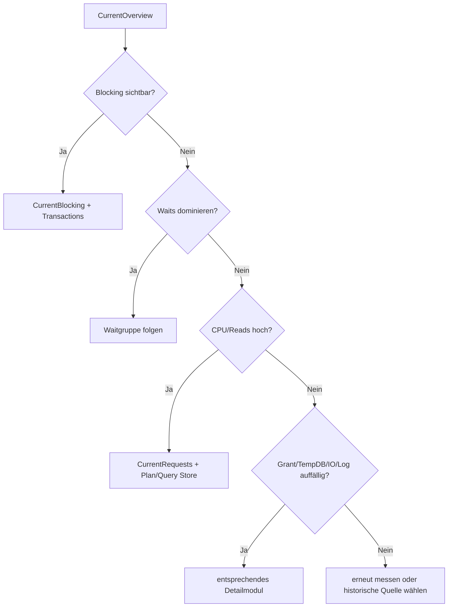

# Current State: laufende Sessions, Requests und Ressourcen

**Procedures:** 10  
**Evidenz:** Live-Momentaufnahme, kumulative DMV oder kurze Stichprobe  
**Kosten:** LOW bis MEDIUM; optionale Lockdetails und lange Textausgaben sind teurer

## Grundregel

Current-State-Daten beantworten die Frage **„Was ist jetzt sichtbar?“**. Sie beweisen nicht, dass ein Zustand dauerhaft besteht. Bei Blocking, Waits, Memory Grants und I/O ist eine zweite Messung meist wertvoller als ein voreiliger Eingriff.

---

## 1. [monitor].[USP_CurrentSessions]

### Zweck und Einsatz

Die Procedure inventarisiert aktuelle Sessions einschließlich Identität, Netzwerk, kumulativer Sessionaktivität und optional aktuellem Request-/SQL-Kontext.

Erkannte Object-Explorer-, Copilot- und SQL-Prompt-Hintergrundsessions sind
standardmäßig ausgeblendet. `@ToolHintergrundabfragenEinbeziehen = 1` zeigt sie
einschließlich der metadatengetriebenen Klassifikation wieder an.

**Einsetzen bei:** Setzen Sie diese Procedure bei unbekannten Verbindungen, hoher Sessionzahl, sleeping Sessions, offenen Transaktionen, auffälliger kumulativer CPU-/I/O-Last oder Client- und Verschlüsselungsfragen ein.

**Einschränkung:** Verwenden Sie diese Procedure nicht allein zur Ermittlung einer konkreten Query-Ursache. Nutzen Sie dafür `USP_CurrentRequests` oder Query Store.

### Aufrufe

```sql
EXEC [monitor].[USP_CurrentSessions]
      @ResultSetArt = 'CONSOLE';
```

```sql
EXEC [monitor].[USP_CurrentSessions]
      @EigeneSessionsModus = 'AUSSCHLIESSEN',
      @InaktiveSessionsEinbeziehen = 1,
      @Sortierung = 'CPU',
      @ResultSetArt = 'RAW';
```

```sql
EXEC [monitor].[USP_CurrentSessions]
      @ProgramNamePattern = N'like:ExampleApplication%',
      @MitSqlText = 1,
      @MaxSqlTextZeichen = 8000,
      @ResultSetArt = 'RAW';
```

### RAW-Resultsets

1. Statusresultset.
2. Sessionsresultset.

### Sessionspalten

| Gruppe | Spalten | Bedeutung und Interpretation |
|---|---|---|
| Schlüssel | `SessionId`, `RequestId`, `IsUserProcess` | `RequestId=NULL` ist bei einer sleeping Session normal. Session-IDs sind wiederverwendbar. |
| Status | `SessionStatus`, `RequestStatus` | `sleeping` heißt nicht automatisch harmlos; offene Transaktionen prüfen. `suspended` bedeutet Warten, nicht zwingend Blocking. |
| Identität | `LoginName`, `OriginalLoginName`, `HostName`, `ProgramName`, `ClientInterfaceName` | Clientwerte sind nützlich, aber vom Client geliefert und nicht manipulationssicher. Original-/Effektivlogin bei Impersonation unterscheiden. |
| Tool-Klassifikation | `IsToolBackgroundQuery`, `ToolBackgroundRuleCode`, `ToolBackgroundCategory`, `ToolBackgroundDetection`, `ToolBackgroundConfidence` | Diagnoseheuristik aus einer aktivierten `LIKE`-Regel; niemals als Sicherheitsmerkmal verwenden. |
| Zeit | `LoginTime`, `LastRequestStartTime`, `LastRequestEndTime` | Lange Login-Dauer ist bei Connection Pools normal. Entscheidend sind Aktivität und Transaktionszustand. |
| Datenbank/Transaktion | `DatabaseId`, `DatabaseName`, `OpenTransactionCount`, `TransactionIsolationLevel` | Sleeping + offene Transaktion ist besonders relevant. Datenbank ist der aktuelle Kontext, nicht zwingend jedes referenzierte Objekt. |
| Sessionkumulierung | `SessionCpuMs`, `SessionReads`, `SessionWrites`, `SessionLogicalReads`, `SessionMemoryMb`, `SessionRowCount` | Werte gelten seit Sessionbeginn und sind zwischen Sessions unterschiedlicher Lebensdauer nicht direkt vergleichbar. |
| aktueller Request | `RequestCpuMs`, `RequestElapsedMs`, `RequestLogicalReads`, `RequestReads`, `RequestWrites`, `BlockingSessionId`, `WaitType`, `WaitTimeMs`, `WaitResource`, `PercentComplete` | Momentaufnahme; für tiefe Analyse `USP_CurrentRequests`. |
| Verbindung | `ClientNetAddress`, `NetTransport`, `ProtocolType`, `EncryptOption`, `AuthScheme` | `EncryptOption` und `AuthScheme` beschreiben diese Verbindung, nicht die gesamte Instanzpolicy. |
| Text | `CurrentStatement`, `BatchText` | optional; kann gekürzt, verschlüsselt oder bereits nicht mehr verfügbar sein. |

### Beispiele

| Fall | Synthetische Werte | Bewertung |
|---|---|---|
| normaler Pool | `SessionStatus=sleeping`, `OpenTransactionCount=0`, letzte Aktivität vor 20 s | gewöhnliche Connection-Pool-Session |
| grenzwertig | sleeping, `OpenTransactionCount=1`, letzte Aktivität vor 90 s | sofort `USP_CurrentTransactions` prüfen |
| plakativ | 200 Sessions desselben `ExampleApplication`, jeweils wenig Aktivität | eher Pool-/Connection-Management als Queryproblem |
| irreführend | älteste Session hat höchste `SessionCpuMs` | kumulativ seit Login; CPU pro Zeit oder aktueller Request fehlt |
| Sicherheitsprüfung | `EncryptOption=FALSE` bei einer Verbindung | Verbindung prüfen; nicht automatisch beweisen, dass alle Clients unverschlüsselt sind |

### Nächste Schritte

- aktive Query: `USP_CurrentRequests`
- sleeping + Transaktion: `USP_CurrentTransactions`
- Blocking: `USP_CurrentBlocking`
- Prüfen Sie bei vielen Verbindungen oder Netzwerkauffälligkeiten den Anwendungspool und die SQL-Server-Endpunktkonfiguration.

### Kosten und Grenzen

LOW. Optionaler SQL-Text erhöht CPU und Ausgabegröße. Ohne serverweite Performanceberechtigung ist nur ein begrenzter Scope sichtbar.

---

## 2. [monitor].[USP_CurrentRequests]

### Zweck und Einsatz

Die Procedure ist die zentrale Live-Analyse aktuell ausgeführter Requests. Sie korreliert Laufzeit, CPU, I/O, Blocking, Task-Waits, Memory Grants, Parallelität, Transaktion, Resource Governor, Query-/Planidentität sowie Statement-, Batch-, Modul- und Input-Buffer-Kontext.

Tool-Hintergrundrequests sind standardmäßig ausgeblendet. Setzen Sie für eine bewusste
Vollansicht `@ToolHintergrundabfragenEinbeziehen = 1`.

### Aufrufe

```sql
EXEC [monitor].[USP_CurrentRequests]
      @ResultSetArt = 'CONSOLE';
```

```sql
EXEC [monitor].[USP_CurrentRequests]
      @MinLaufzeitSekunden = 30,
      @Sortierung = 'RELEVANZ',
      @ResultSetArt = 'RAW';
```

```sql
EXEC [monitor].[USP_CurrentRequests]
      @GesamtenSqlTextEinbeziehen = 1,
      @InputBufferEinbeziehen = 1,
      @ModulInfoEinbeziehen = 1,
      @MaxSqlTextZeichen = 0,
      @MaxZeilen = 0,
      @ResultSetArt = 'RAW';
```

Der letzte Aufruf ist nur gezielt sinnvoll, weil vollständige Texte und unbegrenzte Zeilen große Resultsets erzeugen können.

### Spaltengruppen

| Gruppe | Wichtige Spalten | Interpretation |
|---|---|---|
| Identität | `SessionId`, `RequestId`, `DatabaseName`, `LoginName`, `OriginalLoginName`, `HostName`, `ProgramName` | Ausgangspunkt für Korrelation; keine dauerhafte ID. |
| Tool-Klassifikation | `IsToolBackgroundQuery`, `ToolBackgroundRuleCode`, `ToolBackgroundCategory`, `ToolBackgroundDetection`, `ToolBackgroundConfidence` | Aktive `LIKE`-Regel und Konfidenz der diagnostischen Erkennung. |
| Arbeit | `StartTime`, `ElapsedMs`, `CpuMs`, `LogicalReads`, `Reads`, `Writes`, `RowCount` | hohe Laufzeit + niedrige CPU deutet eher auf Warten; hohe CPU + hohe Reads eher auf Query-/Planarbeit. |
| Fortschritt | `PercentComplete`, `EstimatedCompletionTimeMs`, `Command` | nur für unterstützte Operationen; Schätzung schwankt. |
| Blocking/Waits | `BlockingSessionId`, `WaitType`, `WaitTimeMs`, `LastWaitType`, `WaitResource`, `WaitingTaskCount`, `MaxTaskWaitMs`, `TaskWaitTypes` | parallele Requests können mehrere unterschiedliche Task-Waits besitzen. |
| Grant | `RequestedMemoryMb`, `GrantedMemoryMb`, `UsedMemoryMb`, `IdealMemoryMb` | groß ist nicht automatisch falsch; wartend oder dauerhaft stark übergrantet ist relevanter. |
| Parallelität | `Dop`, `ParallelWorkerCount`, `SchedulerId` | zusammen mit CPU, Workerknappheit, Plan und Waits bewerten. |
| Transaktion | `TransactionIsolationLevel`, `OpenTransactionCount`, `OpenResultsetCount`, `TransactionId` | wichtig bei Blocking und Version Store. |
| Resource Governor | `WorkloadGroupId`, `WorkloadGroupName`, `ResourcePoolId`, `ResourcePoolName` | Limits können Symptome erklären. |
| Query/Plan | `QueryHash`, `QueryPlanHash`, `SqlHandle`, `PlanHandle`, `StatementSqlHandle` | Handles sind flüchtig; Hashes dienen Gruppierung, sind keine garantierten globalen Schlüssel. |
| Modul | `ModuleDatabaseName`, `ModuleSchemaName`, `ModuleObjectName`, `ModuleTypeDescription`, `ModuleFullName`, `ExecutionContextType` | trennt Ad-hoc-, Batch- und Modulkontext. |
| Offset/Truncation | `HasStatementOffsets`, `IsStatementOffsetValid`, Start-/Endoffset, Zeichen-/Zeilenpositionen, `CurrentStatementIsTruncated`, `BatchTextIsTruncated` | bei ungültigem Offset oder Truncation nicht mit unvollständigem Text arbeiten. |
| Text/Input | `CurrentStatement`, `BatchText`, `InputBufferEventType`, `InputBufferParameterCount`, `InputBufferIsTruncated`, `InputBufferText` | Input Buffer kann äußeren RPC-Aufruf zeigen, während Statementtext den inneren Teil zeigt. |

### Plakative Konstellationen

| Konstellation | Bewertung | Folgeanalyse |
|---|---|---|
| `ElapsedMs=180000`, `CpuMs=900`, `BlockingSessionId=74`, `WaitType=LCK_M_X` | persistierendes Blocking | `USP_CurrentBlocking` |
| `ElapsedMs=60000`, `CpuMs=58000`, `LogicalReads=25000000` | CPU-/Scan-lastiger Request | `USP_QueryStats`, Showplan, Query Store |
| `RequestedMemoryMb=32768`, `GrantedMemoryMb=0`, `RESOURCE_SEMAPHORE` | Grant-Stau | `USP_CurrentMemoryGrants` |
| `Dop=16`, `ParallelWorkerCount=16`, mehrere CX-/exchange-Waits | Parallelitätskontext; nicht automatisch MAXDOP-Fehler | Showplan und Server-CPU/Worker prüfen |
| `CurrentStatementIsTruncated=1` | Text nicht vollständig | gezielt höheres Textlimit |
| `ASYNC_NETWORK_IO`, geringe CPU, große Resultsets | Client konsumiert langsam oder große Übertragung | Client und Resultsetdesign prüfen |

### Aussagegrenzen

- Nur aktuell laufende Requests.
- Ein Request kann zwischen DMV-Zugriffen enden.
- Text/Plan kann fehlen oder verschlüsselt sein.
- Estimated Completion ist keine SLA-Prognose.
- CPU, Reads und WaitTime sind bisherige Requestwerte, keine Rate.

---

## 3. [monitor].[USP_CurrentBlocking]

### Zweck

Die Procedure ermittelt aktuelle Blocking-Kanten, rekonstruiert Ketten bis zum Root Blocker und löst technische Blockingressourcen begrenzt auf Datenbank, Schema, Objekt, Index, Partition und Page auf. Negative Sonderblocker-IDs `-2` bis `-5` werden als eigene Owner-Typen beschrieben. Die lesbare Kette und der Session-/Request-/Transaktionskontext des äußersten Root Blockers sind Bestandteil derselben materialisierten Ergebniszeile.

### Aufrufe

```sql
EXEC [monitor].[USP_CurrentBlocking]
      @MinWaitMs = 1000,
      @BlockingObjektTiefe = 'STANDARD',
      @ResultSetArt = 'RAW';
```

```sql
EXEC [monitor].[USP_CurrentBlocking]
      @SessionIds = N'57|74',
      @BlockingObjektTiefe = 'DEEP',
      @HighImpactConfirmed = 1,
      @ResultSetArt = 'RAW';
```

`@BlockingObjektTiefe` akzeptiert `NONE`, `STANDARD` und `DEEP`. `DEEP` aktiviert Lockdetails und ist gruppengeschützt (`LOCKS_DEEP`). `@MaxObjektAufloesungen` begrenzt die deduplizierte Auflösung auf 1 bis 1000 Kandidaten; Default ist 100.

### RAW-Resultsets

1. Meta/Status.
2. `BlockingChains`.
3. `Locks`, wenn aktiviert.
4. Warnungen.

### BlockingChains

| Spalte | Bedeutung |
|---|---|
| `LeafSessionId` | ursprünglich betrachtete wartende Session |
| `BlockedSessionId` | Session auf dieser Kantenstufe |
| `BlockingSessionId` | direkter Blocker |
| `RootBlockingSessionId` | äußerster erkannter Root Blocker |
| `BlockingChain` | Leserichtung `blockierte Session <- direkter Blocker <- ... <- Root Blocker` |
| `BlockingOwnerType`, `BlockingOwnerDescription` | Session oder Sonderowner wie verwaiste DTC-/Recovery-/Latch-Zuordnung |
| `ChainDepth` | Tiefe der Kette |
| `IsCycle` | Schleife erkannt; selten und als flüchtiges/inkonsistentes Snapshotbild prüfen |
| `WaitType`, `WaitTimeMs`, `WaitResource` | Wait der blockierten Kante |
| `BlockingResourceType`, `BlockingResourceName` | klassifizierter Typ und bestmöglich aufgelöster Name |
| `BlockingResourceDatabase*`, `BlockingResourceSchemaName`, `BlockingResourceObject*` | Datenbank- und Objektbezug |
| `BlockingResourceIndex*`, `BlockingResourcePartition*` | Index- und Partitionsbezug |
| `BlockingResourceFileId`, `BlockingResourcePageId`, `BlockingResourceRowId`, `BlockingResourcePageTypeDesc` | physischer Page-/Row-Kontext, soweit sicher bestimmbar |
| `BlockingResourceMetadataSubtype`, `BlockingResourceMetadataName` | beispielsweise `STATS` plus Statistikname, `SCHEMA` oder Cache-Metadaten |
| `BlockingResourceResolutionStatus` | `RESOLVED`, `PARTIAL`, `RAW_ONLY`, `SKIPPED_LIMIT`, `SKIPPED`, `TIMEOUT`, `DENIED_PERMISSION`, `ERROR_HANDLED`, `INVALID_FORMAT` oder `EMPTY` |
| `BlockedLoginName`, `BlockedHostName`, `BlockedProgramName` | blockierte Seite |
| `BlockedIsToolBackgroundQuery`, `BlockedToolBackground*` | Klassifikation der blockierten Blattabfrage; diese Blätter sind standardmäßig ausgeblendet |
| `BlockerLoginName`, `BlockerHostName`, `BlockerProgramName` | blockierende Seite |
| `RootBlockerLoginName`, `RootBlockerHostName`, `RootBlockerProgramName` | Identität des äußersten Root Blockers |
| `RootBlockerSessionStatus`, `RootBlockerRequestStatus`, `RootBlockerOpenTransactionCount`, `RootBlockerLastRequest*` | Zustand und Transaktionskontext des Root Blockers |
| `RootIsToolBackgroundQuery`, `RootToolBackground*` | Klassifikation des Root Blockers; ein Tool-Root einer normalen Abfrage bleibt sichtbar |
| `BlockedStatement`, `BlockerStatement` | aktuelle Statements von Blatt und direktem Blocker, sofern sichtbar |
| `RootBlockerStatementSource`, `RootBlockerStatement` | aktives Root-Statement oder bei einer schlafenden Root-Session das zuletzt bekannte Verbindungsbatch; die Quelle verhindert eine Verwechslung beider Semantiken |

Die Toolfilterung ist kettenbewahrend: Nur ein erkanntes Tool als blockiertes
Blatt wird standardmäßig unterdrückt. Ist ein Tool Zwischen- oder Root-Blocker
einer normalen Abfrage, bleibt die gesamte normale Kette sichtbar.

### Locks

| Spalte | Bedeutung |
|---|---|
| `SessionId` | beteiligte Session |
| `ResourceType` | DATABASE, OBJECT, PAGE, KEY usw. |
| `ResourceDatabaseId`, `ResourceDatabaseName` | Datenbankkontext |
| `ResourceDescription` | technische Ressource; nicht immer direkt objektauflösbar |
| `ResourceSubtype`, `ResourceAssociatedEntityId`, `ResourceLockPartition` | native Lockidentität für die tiefe Auflösung |
| `ResolvedResourceName`, `ResourceResolutionStatus` | aufgelöster Objektkontext und Verlässlichkeit |
| `RequestMode` | S, U, X, IS, IX, Sch-M usw. |
| `RequestStatus` | beispielsweise GRANTED, WAIT, CONVERT oder LOW_PRIORITY_WAIT |
| `RequestOwnerType` | Owner-Kontext, etwa TRANSACTION |
| `RequestReferenceCount` | interne Referenzzahl |
| `LockOwnerAddress` | Korrelationsadresse, keine stabile ID |

### Bewertung

| Fall | Bewertung |
|---|---|
| einzelne Kante, 50 ms | häufig normal |
| dieselbe Kette wächst über mehrere Messungen | relevant |
| Root Blocker ist sleeping mit offener Transaktion | sehr verdächtig |
| Root Blocker arbeitet aktiv und macht Fortschritt | möglicherweise normale Serialisierung; SLA prüfen |
| `Sch-M` blockiert viele Leser | DDL-/Deploymentkontext sofort prüfen |
| viele blockierte Sessions, aber kurze Gesamtdauer | Burst; erst Verlauf prüfen |

Beenden Sie nie ausschließlich die Opfer-Session. Prüfen Sie zuerst Root Blocker, Transaktion, Geschäftsvorgang und Rollbackkosten.

### Kosten und Grenzen

`STANDARD` parst nur bereits gefundene, deduplizierte Wait-Ressourcen. Der Blocking-/Wait-Snapshot wird vor der Namensauflösung materialisiert. Danach läuft jeder Katalog- oder Page-Kandidat einzeln mit `LOCK_TIMEOUT 0`; ein gesperrter Kandidat erhält `TIMEOUT`, die übrigen Kandidaten werden weiter aufgelöst. Die Meta-Zähler trennen vollständige, partielle, rohe, zeitüberschrittene, nicht berechtigte, fehlerhafte und limitbedingt ausgelassene Kandidaten. Die Auflösung verwendet direkte Joins auf `sys.objects`, `sys.schemas`, `sys.indexes`, `sys.partitions`, `sys.allocation_units` und `sys.stats`, nicht `OBJECT_ID()` oder vergleichbare Metadatenfunktionen. `DEEP` ergänzt Lockzeilen aller beteiligten Sessions und ist daher bestätigungspflichtig. Schlüsselhashes und nicht dokumentierte interne Adressen werden nicht in erfundene Objekt- oder Schlüsselwerte übersetzt.

### Folgeanalyse

- `USP_CurrentTransactions` für offene/alte Transaktion,
- `USP_CurrentRequests` für Root-Statement,
- `USP_ExtendedEventsBlockedProcesses` für Historie,
- `USP_ExtendedEventsDeadlocks` bei zyklischem Lockkonflikt mit Opferauswahl.

---

## 4. [monitor].[USP_CurrentWaits]

### Zweck

Die Procedure liefert zwei unterschiedliche Evidenzarten:

1. aktuelle wartende Tasks,
2. instanzweite Waitstatistik kumulativ oder als 1–60-Sekunden-Delta.

Die Procedure ergänzt Waitgruppe, Schweregrad, typische Bedeutung, empfohlene Checks, Quellenqualität und Hilfelink aus dem Frameworkkatalog.

Die vollständige Kataloganalyse ist bewusst breiter als das stabile
Procedure-Resultset. `TVF_WaitTypeInfo` liefert Einordnungsbasis, häufige
Ursachen, Wirkung, Minderung, Gegenbeweise, verwandte Waits, Messhinweise,
Konfidenz und Quellenanzahl. `TVF_WaitTypeSources` trennt die konkreten Belege
nach Definition, Messmethodik, Interpretation und Diagnose/Minderung.

```sql
SELECT * FROM [monitor].[TVF_WaitTypeInfo] (N'RESOURCE_SEMAPHORE');
SELECT * FROM [monitor].[TVF_WaitTypeSources] (N'RESOURCE_SEMAPHORE')
ORDER BY [SourceOrdinal];
```

### Aufrufe

```sql
EXEC [monitor].[USP_CurrentWaits]
      @SampleSeconds = 0,
      @ResultSetArt = 'RAW';
```

```sql
EXEC [monitor].[USP_CurrentWaits]
      @SampleSeconds = 10,
      @UnkritischeWaitsEinbeziehen = 0,
      @TopWaitPercentage = 95,
      @ResultSetArt = 'RAW';
```

### CurrentTasks-Spalten

| Gruppe | Spalten |
|---|---|
| Task | `SessionId`, `ExecContextId`, `WaitDurationMs`, `WaitType`, `BlockingSessionId`, `ResourceDescription` |
| Kontext | `SessionStatus`, `RequestStatus`, `LoginName`, `HostName`, `ProgramName`, `DatabaseId`, `Command`, `CurrentStatement` |
| Tool-Klassifikation | `IsToolBackgroundQuery`, `ToolBackgroundRuleCode`, `ToolBackgroundCategory`, `ToolBackgroundDetection`, `ToolBackgroundConfidence` |
| Katalog | `WaitGroup`, `WaitSeverity`, `IsGenerallyBenign`, `WaitMeaning`, `WaitTypicalOccurrence`, `HighWaitImpact`, `RecommendedChecks`, `WaitHelpUrl`, `DescriptionSource`, `DescriptionQuality`, `CatalogMatchType` |

### InstanceWaits-Spalten

| Spalte | Bedeutung |
|---|---|
| `WaitType` | Waittyp |
| `WaitingTasksCount` | Zahl der Waitabschlüsse im Zeitraum |
| `WaitTimeMs` | Gesamtwaitzeit einschließlich Signalzeit |
| `SignalWaitTimeMs` | Zeit runnable, aber noch nicht auf CPU |
| `ResourceWaitTimeMs` | `WaitTimeMs - SignalWaitTimeMs` |
| `SampleSeconds` | 0/NULL bei kumulativem Kontext, Intervall bei Delta |
| `MeasurementType` | `INSTANCE_CUMULATIVE` oder Delta |
| Katalogspalten | wie bei CurrentTasks |
| `WaitPercentage`, `CumulativePercentage` | Anteil und kumulierter Anteil der gefilterten Waitzeit |
| `AverageWaitMs`, `AverageResourceWaitMs`, `AverageSignalWaitMs` | Durchschnitt je Waitabschluss |

### Interpretation

- **Kumulativ:** seit SQL-Server-Start oder letztem Reset; alte Probleme dominieren möglicherweise.
- **Delta:** zeigt das Messintervall, kann aber kurze Peaks über- oder unterrepräsentieren.
- **Signalanteil hoch:** CPU-Schedulingdruck ist möglich; prüfen Sie jedoch auch Workload und Scheduler.
- **Resourceanteil hoch:** externe oder interne Ressource; Waitgruppe bestimmt nächsten Schritt.
- **Top 95 %:** reduziert Rauschen; Prozentanteile beziehen sich auf den gefilterten Scope.

### Beispiele

| Fall | Interpretation |
|---|---|
| kumulativ viel `PAGEIOLATCH_*`, aber 10-s-Delta fast 0 | historisches, nicht aktuelles I/O-Symptom |
| Delta dominiert von `LCK_M_*` und Tasks zeigen Blocker | aktuelles Blocking |
| hohe `SOS_SCHEDULER_YIELD`-Deltazeit plus hoher Signalanteil | CPU-/Schedulerprüfung |
| `CXCONSUMER` hoch, geringe Laufzeitprobleme | oft Begleitwait; Plan- und SLA-Kontext nötig |
| `ASYNC_NETWORK_IO` hoch | Clientkonsum/Resultsetgröße prüfen, nicht pauschal Netzwerkhardware |
| benign katalogisiert, aber enorme Deltazeit und SLA-Effekt | „generell benign“ hebt konkreten Problemkontext nicht auf |

### Folgeanalyse

- Lockwaits → `USP_CurrentBlocking`
- I/O-Waits → `USP_CurrentIO`
- Memory → `USP_CurrentMemoryGrants`, `USP_ServerMemory`
- Parallelität/CPU → `USP_CurrentRequests`, Showplan, CPU/NUMA
- Log-Waits → `USP_CurrentLog`

---

## 5. [monitor].[USP_CurrentTransactions]

### Zweck

Die Procedure zeigt aktive Transaktionen mit Session-/Requeststatus und Logverbrauch. Die Ausgabe ist insbesondere für alte oder im Zustand `sleeping` verbliebene Transaktionen relevant.

### Aufrufe

```sql
EXEC [monitor].[USP_CurrentTransactions]
      @MinAlterSekunden = 30,
      @ResultSetArt = 'RAW';
```

```sql
EXEC [monitor].[USP_CurrentTransactions]
      @NurSleeping = 1,
      @MinAlterSekunden = 10,
      @ResultSetArt = 'RAW';
```

### Spalten

| Spalte | Bedeutung |
|---|---|
| `SessionId`, `TransactionId` | technische Zuordnung |
| `TransactionBeginTimeUtc`, `TransactionAgeSeconds` | Start und Alter |
| `TransactionType`, `TransactionState` | numerische DMV-Codes; mit Microsoft-Dokumentation interpretieren |
| `OpenTransactionCount` | Sessionzähler; kann von genauer Transaktionszuordnung abweichen |
| `LoginName`, `HostName`, `ProgramName` | Clientkontext |
| `SessionStatus`, `RequestStatus` | sleeping ohne aktiven Request ist möglich |
| `DatabaseId`, `DatabaseName` | zugeordneter Datenbankkontext |
| `LogBytesUsed`, `LogBytesReserved` | aktueller Logverbrauch dieser DB-Transaktion |
| `StatementText` | aktueller Requesttext; bei sleeping Session oft `NULL` |

### Bewertung

| Fall | Bewertung |
|---|---|
| aktive 3-s-Transaktion mit geringem Log | normal |
| sleeping, 600 s alt, offene Transaktion | hoch relevant; kann Blocking und Logtrunkierung verursachen |
| sehr großer `LogBytesUsed`, Request aktiv | Bulk-/ETL-Arbeit möglich; Kapazität und Rollbackkosten prüfen |
| `LogBytesReserved` viel größer als Used | erwartete Reservierung oder große Transaktion; Verlauf prüfen |
| alter Snapshot-Reader unter Versioning | kann Version Store/PVS halten, obwohl Logverbrauch klein ist |

### Folgeanalyse

`USP_CurrentBlocking`, `USP_CurrentLog`, `USP_CurrentRequests`, bei TempDB-Versioning zusätzlich `USP_CurrentTempDB`.

---

## 6. [monitor].[USP_CurrentMemoryGrants]

### Zweck

Die Procedure zeigt wartende und gewährte Query Execution Memory Grants einschließlich Resource-Governor-, Pool- und Semaphoregrenzen.

### Aufrufe

```sql
EXEC [monitor].[USP_CurrentMemoryGrants]
      @NurWartende = 1,
      @ResultSetArt = 'RAW';
```

```sql
EXEC [monitor].[USP_CurrentMemoryGrants]
      @MinRequestedMb = 1024,
      @ResultSetArt = 'RAW';
```

### Spaltengruppen

| Gruppe | Spalten und Bedeutung |
|---|---|
| Request | `SessionId`, `RequestId`, `SchedulerId`, `Dop`, `RequestTime`, `GrantTime`, `WaitTimeMs`, `IsWaiting`, `IsSmall` |
| Grantgrößen | `RequestedMemoryMb`, `RequiredMemoryMb`, `GrantedMemoryMb`, `UsedMemoryMb`, `MaxUsedMemoryMb`, `IdealMemoryMb` |
| Workload/Pool | `GroupId`, `WorkloadGroupName`, `PoolId`, `PoolName`, `RequestMaxMemoryGrantPercent`, Pool Workspace Memory |
| Limits | `ConfiguredRequestMaxGrantMemoryMb`, `TargetRequestMaxGrantMemoryMb`, `HistoricalMaxRequestGrantMemoryMb` |
| Prozentrelationen | Requested/Granted/Used/Ideal relativ zu Request- oder Targetlimit; `UsedOfGrantedPercent`, `MaxUsedOfGrantedPercent` |
| Semaphore | Target, MaxTarget, Total, Available, Granted, Used, `SemaphoreGranteeCount`, `SemaphoreWaiterCount` |
| Worker/Queue | `ReservedWorkerCount`, `UsedWorkerCount`, `MaxUsedWorkerCount`, `QueueId`, `WaitOrder` |
| Kontext | Login/Host/Program, Datenbank, Requeststatus, Command, Laufzeit, CPU, Reads, Statement |

### Interpretation

| Konstellation | Bedeutung |
|---|---|
| `IsWaiting=1`, `GrantedMemoryMb=0`, WaitTime wächst | akuter Grant-Stau |
| viele Waiter bei wenig Available Memory | Semaphoredruck |
| `GrantedMemoryMb` groß, `MaxUsedOfGrantedPercent` sehr niedrig | mögliche Übergrant-Evidenz; mehrere Ausführungen/Plan prüfen |
| `UsedOfGrantedPercent` nahe 100 und Spill-Warnungen im Plan | Grant möglicherweise zu klein |
| Request nahe Resource-Governor-Limit | Limit kann Engpass sein, muss aber nicht falsch konfiguriert sein |
| großer Grant ohne Konkurrenz und mit angemessener Nutzung | nicht automatisch problematisch |

Es gibt keine universelle „zu große Grant“-Grenze. Relevanter sind Konkurrenz, Wartezeit, Nutzung, Spill, Ausführungshäufigkeit und Servermemory.

### Folgeanalyse

`USP_CurrentRequests`, `USP_ShowplanAnalysis`, `USP_ServerMemory`, `USP_ResourceGovernorAnalysis`, Query Store.

---

## 7. [monitor].[USP_CurrentTempDB]

### Zweck

Die Procedure zeigt Netto-TempDB-Verbrauch je Session und optional Dateizustand.

### RAW-Resultsets

1. Status.
2. Sessions.
3. TempDB-Governance je sichtbarer Workload Group.
4. Dateien, wenn `@MitDateien=1`.
5. Warnungen.

### Sessions

| Spalte | Bedeutung |
|---|---|
| Identität | `SessionId`, `LoginName`, `HostName`, `ProgramName`, `SessionStatus` |
| User Objects | `UserObjectsAllocatedMb`, `UserObjectsDeallocatedMb`, `UserObjectsNetMb` |
| Internal Objects | `InternalObjectsAllocatedMb`, `InternalObjectsDeallocatedMb`, `InternalObjectsNetMb` |
| Gesamt | `TotalNetMb` |

**User Objects** umfassen beispielsweise explizite Temp-Tabellen. **Internal Objects** entstehen unter anderem durch Sorts, Hashes, Spools oder Worktables. Netto kann nach Deallocation sinken; kumulative Allocation allein wäre irreführend.

### Dateien

| Spalte | Bedeutung |
|---|---|
| `FileId`, `LogicalName`, `PhysicalName`, `FileTypeDesc` | Dateiidentität |
| `SizeMb`, `UsedMb`, `FreeMb`, `UsedPercent` | aktueller Platz |
| `GrowthMb`, `IsPercentGrowth` | Autogrowth; bei Prozentwachstum ist GrowthMb nicht als feste Größe verwendbar |

### TempDB Resource Governance (SQL Server 2025)

`tempdbGovernance` trennt je Workload Group gespeichertes MB-/Prozentlimit,
effektives Limit, aktuelle Nutzung, Peak, Verletzungszähler und
`StatisticsStartTime`. Ein MB-Limit hat Vorrang. Ein Prozentlimit kann wegen
der TempDB-Dateikonfiguration unwirksam sein; dann bleibt der gespeicherte Wert
sichtbar, `EffectiveGroupMaxTempdbDataMb` aber `NULL` und
`EffectiveLimitSource='PERCENT_NOT_EFFECTIVE'`.

Kein Limit ist ein neutraler Zustand. Eine Verletzung beweist Enforcement im
Statistikfenster, aber weder die verursachende Anweisung noch eine dauerhafte
Störung. Version Store und TempDB-Log sind von diesem Limit nicht umfasst.
Workload-Group-Zähler dürfen nicht zu Sessionallokationen addiert werden. Auf
SQL Server 2019/2022 sowie bei fehlendem Quellschema oder Rechten liefern
Status, Partialitätsflag und Aussagegrenze einen expliziten Vertrag.

### Beispiele

| Fall | Bewertung |
|---|---|
| Session mit 50 MB User Objects, aktiv | normal möglich |
| eine Session mit 200 GB Internal Objects | große Sort-/Hash-/Spool-Aktivität; Request/Plan prüfen |
| Dateien ähnlich groß, aber UsedPercent unterschiedlich | nicht automatisch Fehlkonfiguration; Allocation und Wachstum beobachten |
| Prozentwachstum auf großen Dateien | grenzwertig wegen wachsender Growth-Schritte |
| `TotalNetMb` klein, aber TempDB-Dateien fast voll | andere Sessions, Version Store oder bereits persistierter Verbrauch möglich |

### Folgeanalyse

`USP_CurrentRequests`, `USP_TempDBConfiguration`, `USP_CurrentTransactions`,
`USP_ResourceGovernorAnalysis`, bei Version Store/PVS `USP_CurrentLog` und
Snapshot-Transaktionen.

---

## 8. [monitor].[USP_CurrentIO]

### Zweck

Die Procedure liefert Datei-I/O kumulativ oder als Delta. Ein Delta ist für aktuelle Storageprobleme meist aussagekräftiger.

### Aufrufe

```sql
EXEC [monitor].[USP_CurrentIO]
      @DatabaseNames = NULL,
      @SampleSeconds = 10,
      @MinLatencyMs = 5,
      @PendingIoEinbeziehen = 1,
      @ResultSetArt = 'RAW';
```

### Spalten

| Spalte | Bedeutung |
|---|---|
| `DatabaseId`, `DatabaseName`, `FileId`, `LogicalName`, `PhysicalName`, `FileTypeDesc` | Dateiidentität |
| `SampleSeconds` | 0 bei kumulativem Kontext, >0 beim Delta |
| `Reads`, `ReadBytes`, `ReadStallMs` | Reads und gesamte Read-Stallzeit |
| `Writes`, `WriteBytes`, `WriteStallMs` | Writes und gesamte Write-Stallzeit |
| `ReadLatencyMs`, `WriteLatencyMs`, `OverallLatencyMs` | Stallzeit pro Operation |
| `ReadThroughputMbPerSecond`, `WriteThroughputMbPerSecond` | nur beim Delta sinnvoll |
| `SizeOnDiskMb` | Dateigröße auf Storage |

`pendingIo` ergänzt Requestadresse, Dateiabbildung, SQL-/OS-Pending-Layer,
Pending-Dauer und die Zahl der Beobachtungen. `io_pending_ms_ticks` ist eine
informational/internal Engineangabe. Schedulerzahlen sind gleichzeitiger
Kontext und keine kausale Zuordnung. Physische Pfade bleiben opt-in.

### Interpretation

- Latenz ist Durchschnitt; einzelne Peaks werden geglättet.
- Sehr wenige I/Os können eine extreme Durchschnittslatenz erzeugen.
- Kumulative Werte seit Start sind kein aktueller Storagezustand.
- Logdateien haben andere Zugriffsmuster als Datenfiles.
- Hohe Durchsatzwerte können erwünschte Batcharbeit sein.
- DMV-Stallzeit umfasst die SQL-Server-Sicht, nicht jede Storage-Layer-Komponente.
- Ein einzelner Pending Request beweist keinen Storagefehler. Korrelieren Sie Wiederholung,
  Dateilast, I/O-Waits und externe Storage-Telemetrie.

### Synthetische Beispiele

| Sample | Reads/Writes | Latenz | Bewertung |
|---|---:|---:|---|
| 10 s, 5000 Reads | 3 ms Read | meist unauffällig im Kontext |
| 10 s, 2 Reads | 120 ms Read | grenzwertig, Stichprobe zu klein |
| 30 s, 100000 Writes auf Log | 25 ms Write | hoch relevant für Commitlatenz |
| kumulativ 18 ms, 10-s-Delta 2 ms | historischer Durchschnitt, aktuell unauffällig |
| Datenfile 1 langsam, andere Files schnell | Dateipfad/Volume oder Hotspot prüfen |

Es gibt keine seriöse universelle Latenzgrenze für jede Workload. SLA, IOPS, Queueing, Read-/Write-Mix und Storagearchitektur bestimmen die Bewertung.

### Folgeanalyse

`USP_CurrentWaits`, `USP_DatabaseCapacityAnalysis`, OS-/Storage-Monitoring und Query-/Workloadkorrelation.

---

## 9. [monitor].[USP_CurrentLog]

### Zweck

Die Procedure analysiert aktuellen Logplatz, Wiederverwendungshindernisse, Logstatistik, optional VLFs und Persistent Version Store je Datenbank. Fehler einer Datenbank brechen andere Datenbanken nicht ab.

### Besonderheit der Auswahl

Im Procedureheader ist `@DatabaseNames=N''` dokumentiert, die Hilfe erklärt jedoch `N''` als ungültig. Verwenden Sie für produktive Aufrufe deshalb eine explizite Datenbankliste, `NULL` oder ein Pattern und prüfen Sie das Statusresultset.

### Aufrufe

```sql
EXEC [monitor].[USP_CurrentLog]
      @DatabaseNames = N'[ExampleDatabase]',
      @ResultSetArt = 'RAW';
```

```sql
EXEC [monitor].[USP_CurrentLog]
      @DatabaseNames = NULL,
      @MinUsedPercent = 70,
      @MitPersistentVersionStore = 1,
      @ResultSetArt = 'RAW';
```

```sql
EXEC [monitor].[USP_CurrentLog]
      @DatabaseNames = N'[ExampleDatabase]',
      @MitVlfInformationen = 1,
      @ResultSetArt = 'RAW';
```

VLF-Details benötigen `LOG_VLF_DEEP`.

### Hauptresultset

| Spalte | Bedeutung |
|---|---|
| `DatabaseId`, `DatabaseName`, `RecoveryModel` | Scope |
| `LogReuseWaitDesc` | aktueller Wiederverwendungsgrund aus `sys.databases` |
| `TotalLogSizeMb`, `UsedLogSizeMb`, `UsedLogPercent` | aktueller Platz |
| `LogSinceLastBackupMb` | seit letztem Logbackup erzeugte Logmenge |
| `ActiveVlfCount`, `TotalVlfCount` | optional VLF-Struktur |
| `LogTruncationHoldupReason` | detaillierter Hold-up-Grund |
| `LogBackupTime` | letzter in der DMV sichtbarer Logbackupzeitpunkt |
| `LogRecoverySizeMb` | geschätzter Recoverybedarf |
| `IsAdrEnabled` | Accelerated Database Recovery |
| `PersistentVersionStoreMb` | optional PVS-Größe |
| `SpaceStatus`, `StatsStatus`, `VlfStatus`, `PvsStatus` | Verfügbarkeit der Teilquellen |

### Bewertung

| Konstellation | Interpretation |
|---|---|
| 85 % genutzt, ausreichend freie absolute GB, normale aktive Transaktion | beobachten; Prozent allein reicht nicht |
| 99 %, `ACTIVE_TRANSACTION` | alte/große Transaktion suchen |
| FULL Recovery, `LOG_BACKUP` | Logbackupkette/Job prüfen |
| `AVAILABILITY_REPLICA` | AG-Send-/Harden-/Redo-Kontext prüfen |
| sehr viele VLFs | Wachstumshistorie und zukünftige Growth-Strategie prüfen; keine pauschale Sofortoperation |
| großer PVS unter ADR | lange Transaktionen/Cleanup und Kapazität prüfen |
| Teilstatus nicht `AVAILABLE` | fehlende Werte nicht als 0 interpretieren |

### Folgeanalyse

`USP_CurrentTransactions`, `USP_BackupRecovery`, `USP_AvailabilityDeepAnalysis`, `USP_DatabaseCapacityAnalysis`.

---

## 10. [monitor].[USP_CurrentOverview]

### Zweck

Die Procedure orchestriert alle neun Current-State-Teilmodule fehlerisoliert. Sie eignet sich für die Ersttriage, verursacht bei wiederholter Ausführung jedoch mehr Quellarbeit als ein gezielt gewähltes Einzelmodul.

### Standardreihenfolge

1. Sessions
2. Requests
3. Blocking
4. Waits
5. Transactions
6. Memory Grants
7. TempDB
8. I/O
9. Log

Jedes Kindmodul liefert seine eigenen Status- und Fachresultsets. Im
JSON-Envelope heißen die Childobjekte `sessions`, `requests`, `blocking`,
`waits`, `transactions`, `memoryGrants`, `tempdb`, `io` und `log`. Das
benannte TABLE-Resultset `tempdbGovernance` wird bei `@MitTempDB=1` aus dem
gemeinsamen Snapshot exportiert.

### Aufrufe

```sql
EXEC [monitor].[USP_CurrentOverview]
      @ResultSetArt = 'CONSOLE';
```

```sql
EXEC [monitor].[USP_CurrentOverview]
      @MitSessions = 0,
      @MitRequests = 1,
      @MitBlocking = 1,
      @MitWaits = 1,
      @MitTransactions = 1,
      @MitMemoryGrants = 1,
      @MitTempDB = 0,
      @MitIO = 0,
      @MitLog = 0,
      @ResultSetArt = 'RAW';
```

```sql
DECLARE @OverviewJson nvarchar(max);
EXEC [monitor].[USP_CurrentOverview]
      @BlockingObjektTiefe = 'DEEP',
      @MaxObjektAufloesungen = 500,
      @HighImpactConfirmed = 1,
      @ResultSetArt = 'NONE',
      @JsonErzeugen = 1,
      @Json = @OverviewJson OUTPUT;
SELECT JSON_QUERY(@OverviewJson, '$.blocking.locks') AS BlockingLocks;
```

### Metaresultset

| Spalte | Bedeutung |
|---|---|
| `ModuleName`, `CollectionTimeUtc` | Orchestrator und Startzeit |
| `StatusCode`, `IsPartial` | Orchestratorstatus |
| `ExecutedModules` | aktivierte/aufgerufene Kindmodule |
| `FailedModules` | durch TRY/CATCH isolierte Fehler |
| `ErrorMessage` oder `Detail` | Gesamtinformation |

### Wichtige Grenzen

- `@SampleSeconds` wird an Waits und I/O weitergegeben; dadurch wartet der Gesamtaufruf.
- Ein Childfehler verhindert andere Children nicht.
- `FailedModules=0` bedeutet nicht, dass jeder Childstatus vollständig `AVAILABLE` war; lesen Sie deshalb die Child-Metadaten.
- Der Default kann für häufiges Polling unnötig breit sein.
- `@BlockingObjektTiefe='DEEP'` liest zusätzlich Locks beteiligter Sessions;
  `NONE` vermeidet die Ressourcenauflösung, `STANDARD` begrenzt sie standardmäßig
  auf 100 deduplizierte Kandidaten.
- Die Deep-Lockzeilen sind im Overview unter `$.blocking.locks` im JSON
  enthalten; das materialisierte Blockingdetail enthält nur die Ketten.
- Aktivieren Sie für wiederholte Analysen nur die problemrelevanten Module.

### Anfänger-Entscheidungsbaum



## Quellen

- [sys.dm_exec_sessions](https://learn.microsoft.com/sql/relational-databases/system-dynamic-management-views/sys-dm-exec-sessions-transact-sql)
- [sys.dm_exec_requests](https://learn.microsoft.com/sql/relational-databases/system-dynamic-management-views/sys-dm-exec-requests-transact-sql)
- [sys.dm_os_waiting_tasks](https://learn.microsoft.com/sql/relational-databases/system-dynamic-management-views/sys-dm-os-waiting-tasks-transact-sql)
- [sys.dm_os_wait_stats](https://learn.microsoft.com/sql/relational-databases/system-dynamic-management-views/sys-dm-os-wait-stats-transact-sql)
- [Understand and resolve blocking](https://learn.microsoft.com/troubleshoot/sql/database-engine/performance/understand-resolve-blocking)
- [sys.dm_tran_active_transactions](https://learn.microsoft.com/sql/relational-databases/system-dynamic-management-views/sys-dm-tran-active-transactions-transact-sql)
- [sys.dm_exec_query_memory_grants](https://learn.microsoft.com/sql/relational-databases/system-dynamic-management-views/sys-dm-exec-query-memory-grants-transact-sql)
- [sys.dm_db_session_space_usage](https://learn.microsoft.com/sql/relational-databases/system-dynamic-management-views/sys-dm-db-session-space-usage-transact-sql)
- [sys.dm_io_virtual_file_stats](https://learn.microsoft.com/en-us/sql/relational-databases/system-dynamic-management-objects/sys-dm-io-virtual-file-stats-transact-sql?view=sql-server-ver17)
- [sys.dm_db_log_space_usage](https://learn.microsoft.com/sql/relational-databases/system-dynamic-management-views/sys-dm-db-log-space-usage-transact-sql)
- [sys.dm_db_log_stats](https://learn.microsoft.com/sql/relational-databases/system-dynamic-management-views/sys-dm-db-log-stats-transact-sql)
- [Paul Randal: Wait statistics](https://www.sqlskills.com/blogs/paul/wait-statistics-or-please-tell-me-where-it-hurts/)
