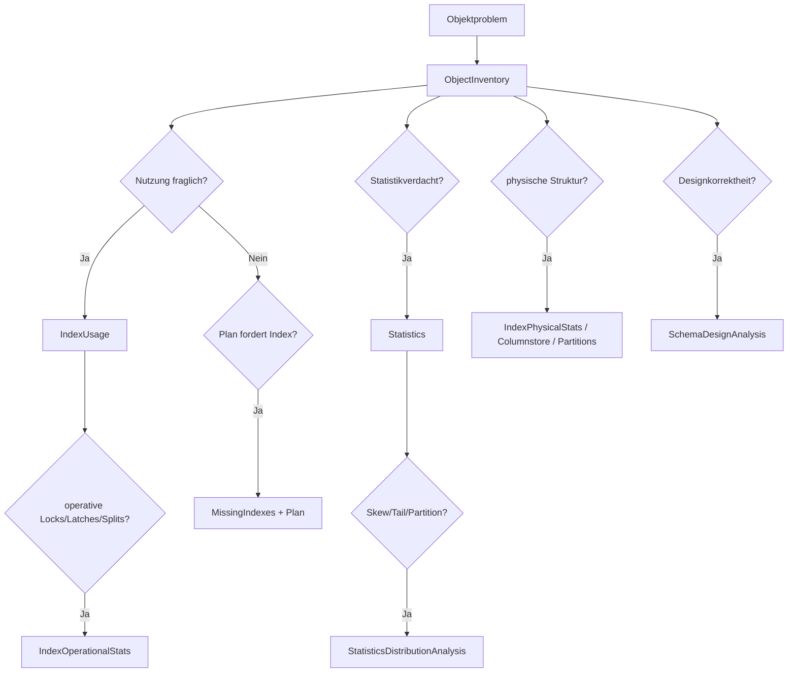

# Object und Index: Inventar, Nutzung, Struktur und Statistiken

**Procedures:** 11  
**Evidenz:** Katalog, kumulative DMVs, DMFs und Histogramme  
**Kosten:** LOW bis HIGH_OPT_IN

## Grundregeln

1. Ein Index ist nicht allein deshalb überflüssig, weil seit dem letzten Reset kein Read gezählt wurde.
2. Eine Missing-Index-Zeile ist eine Optimizerbeobachtung, kein fertiger DDL-Auftrag.
3. Fragmentierung ist nur zusammen mit `PageCount`, Seitendichte, Workload und Wartungsfolgen sinnvoll.
4. Statistikalter ist weniger wichtig als Datenänderung, Sample, Verteilung und betroffene Query.
5. Breite `VOLL`-, Physical-, Histogramm-, Segment- und Dictionarypfade sind gruppengeschützt.

---

## 1. [monitor].[USP_ObjectInventory]

### Zweck

Die Procedure liefert Objekt- und Indexinventar mit Größe, Zeilenzahl, Partitionierung, Kompression, Speicherart und optionalen Key-/Include-Spaltenlisten.

### Wann einsetzen?

- vor jeder Index- oder Statistikänderung,
- zur Größen- und Strukturorientierung,
- für Heaps, deaktivierte/hypothetische/filtered Indizes,
- zur Unterscheidung von Memory-Optimized, Temporal und klassischen Tabellen.

### Aufrufe

```sql
EXEC [monitor].[USP_ObjectInventory]
      @DatabaseNames = N'[ExampleDatabase]',
      @SchemaNames = N'[ExampleSchema]',
      @ObjectNames = N'[ExampleTable]',
      @ResultSetArt = 'RAW';
```

```sql
EXEC [monitor].[USP_ObjectInventory]
      @DatabaseNames = N'[ExampleDatabase]',
      @AnalyseModus = 'VOLL',
      @MitSpaltenlisten = 1,
      @ResultSetArt = 'RAW';
```

`VOLL` benötigt `CATALOG_DEEP`.

### Resultsets

1. Modulstatus.
2. Datenbankstatus.
3. Inventar.

### Inventarspalten

| Gruppe | Spalten | Bedeutung |
|---|---|---|
| Scope | `DatabaseName`, `SchemaName`, `ObjectName`, `ObjectType`, `ObjectId` | qualifizierte Objektidentität |
| Objektart | `IsMsShipped`, `IsMemoryOptimized`, `TemporalTypeDesc`, `DurabilityDesc` | System-, In-Memory-, Temporal- und Durability-Kontext |
| Zeit | `CreateDate`, `ModifyDate` | Katalogzeitpunkte; ModifyDate ist kein belastbarer Datenänderungszeitpunkt |
| Objektgröße | `ObjectRowCount`, `ObjectReservedMb`, `ObjectUsedMb` | Summe des Objekts; Zeilen sind Katalog-/Partitionsschätzwerte |
| Indexidentität | `IndexId`, `IndexName`, `IndexTypeDesc` | `IndexId=0` kann Heap bedeuten |
| Indexeigenschaften | `IsUnique`, `IsPrimaryKey`, `IsUniqueConstraint`, `IsDisabled`, `IsHypothetical`, `HasFilter`, `FilterDefinition` | vor Löschung oder Redesign zwingend prüfen |
| Wartung | `FillFactor`, `AllowRowLocks`, `AllowPageLocks`, `OptimizeForSequentialKey` | Konfiguration, kein Qualitätsurteil |
| Ablage | `DataSpaceName`, `PartitionCount` | Filegroup/Partition Scheme und Partitionszahl |
| Indexgröße | `IndexRowCount`, `IndexReservedMb`, `IndexUsedMb` | physischer Umfang je Index |
| Kompression | `MinCompressionDesc`, `MaxCompressionDesc`, `HasMixedCompression` | gemischte Kompression kann absichtlich partitioniert sein |
| Definition | `KeyColumns`, `IncludedColumns` | Reihenfolge und Includeumfang; nur bei aktivierter Spaltenliste |

### Beispiele

| Fall | Interpretation |
|---|---|
| Heap mit 2 TB, viele Updates | Forwarded Records und Zugriffsmuster prüfen; Heap ist nicht automatisch falsch |
| zwei ähnliche Indizes, unterschiedliche Includes | noch keine Duplikatentscheidung; Usage, Constraints und Pläne prüfen |
| `HasMixedCompression=1` auf partitionierter Tabelle | häufig absichtliche Hot-/Cold-Strategie |
| `IsHypothetical=1` | meist Tuningartefakt; Ursprung prüfen |
| `OptimizeForSequentialKey=1` | Hinweis auf sequentiellen Last-Page-Kontext, kein Beweis für Nutzen |

### Folgeanalyse

`USP_IndexUsage`, `USP_IndexOperationalStats`, `USP_Partitions`, `USP_IndexPhysicalStats`, `USP_SchemaDesignAnalysis`.

---

## 2. [monitor].[USP_IndexUsage]

### Zweck

Die Procedure zeigt die kumulative Nutzung klassischer Indizes seit dem DMV-Reset und liefert ein separates Resultset für In-Memory-OLTP-Indizes.

### RAW-Resultsets

1. Modulstatus.
2. Datenbank-/Quellenstatus.
3. Rowstore/Columnstore/Spatial.
4. XTP, wenn `@MitMemoryOptimized=1`.

### Klassische Indexnutzung

| Gruppe | Spalten | Bedeutung |
|---|---|---|
| Identität | `DatabaseName`, `SchemaName`, `ObjectName`, `ObjectId`, `IndexId`, `IndexName`, `IndexTypeDesc` | Scope |
| Spezialart | `IsMemoryOptimized`, `IsSpatialIndex`, `IsPrimaryKey`, `IsUniqueConstraint`, `IsDisabled` | Einschränkungen und Schutz vor voreiligem Entfernen |
| Umfang | `RowCount` | Index-/Partitionszeilenzahl |
| User Reads | `UserSeeks`, `UserScans`, `UserLookups`, `TotalUserReads` | Zahl von Zugriffsvorgängen, nicht gelesene Zeilen oder Seiten |
| Writes | `UserUpdates` | Indexwartungsvorgänge, nicht Anzahl geänderter Zeilen |
| Relation | `ReadWriteRatio` | Reads geteilt durch Updates; `NULL` bei 0 Updates |
| Zeit | `LastUserSeek`, `LastUserScan`, `LastUserLookup`, `LastUserUpdate` | letzte Aktivität seit sichtbarer DMV-Zeile |
| System | `SystemSeeks`, `SystemScans`, `SystemLookups`, `SystemUpdates` | interne SQL-Server-Zugriffe getrennt halten |
| Reset | `DmvResetTimeServerLocal` | Serverstart als untere Resetgrenze; DB-/Metadatenereignisse können später resetten |
| Klasse | `UsageClassification` | `DISABLED`, `SPATIAL_NOT_IN_USAGE_DMV`, `NO_DMV_ROW`, `WRITE_ONLY_SINCE_RESET`, `UNUSED_SINCE_RESET`, `READ_ONLY_SINCE_RESET`, `READ_AND_WRITE` |

### XTP-Resultset

| Spalten | Bedeutung |
|---|---|
| Identität | Datenbank, Schema, Objekt, Objekt-/Index-ID, Name, Typ, PK/Unique |
| `BucketCount` | Hashbucketzahl, nur Hashindex |
| `ScansStarted`, `ScansRetries` | Scanstarts und Wiederholungen |
| `RowsReturned`, `RowsTouched` | Ergebnis- und geprüfte Zeilen |
| `RowsReturnedPerScan`, `RowsTouchedPerReturned`, `RetryPercent` | Effizienzrelationen |
| `CounterScope`, `UsageClassification` | explizite Zählergrenze und Einordnung |

### Fehlinterpretationen

- `UNUSED_SINCE_RESET` nach Neustart am Morgen sagt wenig.
- Saisonale Reports können monatelang ungenutzt erscheinen.
- PK-/Unique-Indizes sichern Datenqualität, auch ohne Reads.
- Foreign Keys, Replikation, CDC, Change Tracking oder seltene Notfallabfragen können Abhängigkeiten erzeugen.
- `UserUpdates` misst Operationen, nicht tatsächliche Wartungskosten.

### Plakatives Beispiel

| Reads | Updates | Resetalter | Bewertung |
|---:|---:|---:|---|
| 0 | 8.000.000 | 180 Tage | starker Kandidat für Review, aber Abhängigkeiten/Pläne prüfen |
| 0 | 40 | 2 Stunden | nicht belastbar |
| 1 | 10.000.000 | 365 Tage | seltene Nutzung; fachliche Kritikalität kann höher als Frequenz sein |
| 500.000 | 5.000 | 90 Tage | klar genutzt |

### Folgeanalyse

`USP_ObjectInventory`, `USP_IndexOperationalStats`, Query Store, Abhängigkeits- und Deploymentanalyse.

---

## 3. [monitor].[USP_IndexOperationalStats]

### Zweck

Die Procedure liefert kumulative, partitionsgenaue Betriebszähler aus `sys.dm_db_index_operational_stats`. Dazu gehören DML, Page Allocations und Merges, Scans und Lookups, Forwarded Fetches, Locks, Latches, I/O-Latches, Eskalationen und Kompression.

### Spalten

| Gruppe | Spalten |
|---|---|
| Scope | `DatabaseName`, `SchemaName`, `ObjectName`, `ObjectId`, `IsMemoryOptimized`, `IndexId`, `IndexName`, `IndexTypeDesc`, `PartitionNumber`, `HobtId` |
| DML | `LeafInsertCount`, `LeafDeleteCount`, `LeafUpdateCount`, `LeafGhostCount` |
| Struktur | `LeafPageAllocationCount`, `NonleafPageAllocationCount`, `LeafPageMergeCount` |
| Zugriff | `RangeScanCount`, `SingletonLookupCount`, `ForwardedFetchCount`, `LobFetchPages`, `RowOverflowFetchPages` |
| Locks | `RowLockCount`, `RowLockWaitCount`, `RowLockWaitMs`, `PageLockCount`, `PageLockWaitCount`, `PageLockWaitMs`, `LockPromotionAttemptCount`, `LockPromotionCount` |
| Latches | `PageLatchWaitCount`, `PageLatchWaitMs`, `PageIoLatchWaitCount`, `PageIoLatchWaitMs`, `TreePageLatchWaitCount`, `TreePageLatchWaitMs` |
| Kompression | `PageCompressionAttemptCount`, `PageCompressionSuccessCount` |
| Relationen | `LeafAllocationsPerInsert`, `LockWaitMsPerWait`, `PageLatchWaitMsPerWait`, `PageIoLatchWaitMsPerWait` |
| Einordnung | `UsageClassification` |

### Interpretation

- Hohe `LeafAllocationsPerInsert` kann auf Page Splits oder sequentielle Expansion hinweisen; Fill Factor nicht automatisch senken.
- Viele `ForwardedFetchCount` sind bei Heaps ein Prüfauftrag.
- `LockPromotionAttemptCount` ohne Promotion kann normale Vermeidung oder Konflikt bedeuten.
- Latchwaits sind interne Synchronisierung; I/O-Latches betreffen Seiten-I/O. Nicht verwechseln.
- Zähler können verschwinden, wenn Metadaten aus dem Cache entfernt werden.

### Grenzfälle

| Fall | Bewertung |
|---|---|
| hohe Page Allocations bei monoton wachsendem Index | normal möglich |
| hohe Latchzeit bei sehr vielen kurzen Waits | Durchschnitt und aktuelles Delta prüfen |
| einzelne Partition dominiert Locks | Hot-Partition/Lastverteilung prüfen |
| viele Forwarded Fetches, aber kaum Reads | geringe Auswirkung möglich |

### Kosten

GEZIELT moderat. VOLL benötigt `INDEX_OPERATIONAL_DEEP` und kann bei vielen Datenbanken/Indizes teuer werden.

---

## 4. [monitor].[USP_MissingIndexes]

### Zweck

Die Procedure liest flüchtige Missing-Index-DMVs und berechnet eine Priorisierungsmetrik sowie einen **nur als Entwurf** zu verstehenden CREATE-INDEX-Text.

### Spalten

| Spalte | Bedeutung |
|---|---|
| `DatabaseName`, `SchemaName`, `ObjectName`, `ObjectId` | Zielobjekt; Name kann bei eingeschränkter Metadatensicht fehlen |
| `IndexHandle`, `IndexGroupHandle` | flüchtige DMV-Handles |
| `UniqueCompiles` | Zahl unterschiedlicher Compiles, die die Gruppe meldeten |
| `UserSeeks`, `UserScans`, `TotalUserReads` | beobachtete erwartete Nutzung |
| `LastUserSeek`, `LastUserScan` | letzter Hinweiszeitpunkt |
| `AvgTotalUserCost` | durchschnittlich geschätzte Plankosten betroffener Queries |
| `AvgUserImpact` | geschätzte prozentuale Kostenverbesserung; Optimizerprognose |
| `ImprovementMeasure` | Cost × Impact × Reads; Ranking, keine Zeit-/Geldersparnis |
| `EqualityColumns` | Gleichheitsprädikate |
| `InequalityColumns` | Bereichs-/Ungleichheitsprädikate |
| `IncludedColumns` | vorgeschlagene Coverspalten |
| `StatementName` | DMV-Objektbezug |
| `ProposedIndexName` | synthetischer technischer Name |
| `ProposedCreateIndex` | Entwurf, nicht ungeprüft ausführen |
| `WarningText` | verbindliche Aussagegrenze |

### Kritische Grenzen

- Vorschläge kennen vorhandene ähnliche Indizes nur begrenzt.
- Schlüsselreihenfolge und Includeumfang müssen manuell optimiert werden.
- Schreib-, Speicher-, Wartungs- und Lockkosten fehlen.
- DMVs werden bei Restart, Failover und weiteren Ereignissen geleert.
- Maximalzahl gespeicherter Vorschläge ist begrenzt.
- Vorschläge können sich stark überlappen.

### Beispiele

| Vorschlag | Bewertung |
|---|---|
| Impact 98 %, 2 Reads | plakativ, aber statistisch schwach |
| Impact 25 %, 5 Mio. Reads | möglicherweise hoher Gesamtnutzen |
| 30 Include-Spalten | Coveragevorschlag wahrscheinlich zu breit |
| drei Vorschläge mit gleichem Prefix | konsolidieren statt drei Indizes |
| Vorschlag dupliziert vorhandenen Index bis auf Reihenfolge | konkrete Pläne und Selektivität prüfen |

### Folgeanalyse

`USP_ObjectInventory`, `USP_IndexUsage`, `USP_QueryStats`/Query Store, Showplan. Erst danach DDL-Entwurf mit Write-Kosten und Rollbackplan.

---

## 5. [monitor].[USP_Statistics]

### Zweck

Die Procedure inventarisiert Statistiken, Materialisierung, Sample, Änderungszähler, Alter, Filter und optional inkrementelle Partitionsdetails.

### Hauptspalten

| Gruppe | Spalten |
|---|---|
| Scope | `DatabaseName`, `SchemaName`, `ObjectName`, `ObjectId`, `StatisticsId`, `StatisticsName` |
| Herkunft | `IsIndexStatistics`, `IsAutoCreated`, `IsUserCreated` |
| Definition | `IsFiltered`, `FilterDefinition`, `NoRecompute`, `IsIncremental`, `HasPersistedSample`, `StatisticsColumns` |
| Aktualität | `LastUpdated`, `DaysSinceLastUpdate` |
| Umfang/Sample | `Rows`, `RowsSampled`, `SamplePercent`, `Steps`, `UnfilteredRows`, `PersistedSamplePercent` |
| Änderung | `ModificationCounter`, `ModificationPercent` |
| Status | `VisibilityOrState` mit etwa `VISIBLE`, `NOT_VISIBLE_OR_NOT_MATERIALIZED`, `EMPTY_OR_FILTER_NO_ROWS` |

### Inkrementelle Spalten

Datenbank, Schema, Objekt, Statistik-ID/-Name, `PartitionNumber`, `LastUpdated`, `Rows`, `RowsSampled`, `Steps`, `UnfilteredRows`, `ModificationCounter`, `ModificationPercent`.

### Interpretation

- `LastUpdated=NULL` kann noch nicht materialisiert, leer, gefiltert oder nicht sichtbar bedeuten.
- `ModificationPercent` ist bei kleinen Tabellen schnell hoch und bei sehr großen Tabellen trotz vieler Änderungen niedrig.
- 100-%-Sample ist nicht automatisch nötig oder besser.
- `NoRecompute=1` kann absichtliche Stabilisierung oder gefährliche Veraltung bedeuten.
- Mehrspaltenstatistiken besitzen nur für die führende Spalte ein Histogramm.
- Alter allein ist kein Updatekriterium.

### Beispiele

| Rows | Modifications | Sample | Bewertung |
|---:|---:|---:|---|
| 1.000 | 300 | 100 % | 30 % Änderung, aber absolute Größe klein |
| 10 Mrd. | 100 Mio. | 2 % | nur 1 % Änderung, aber 100 Mio. Zeilen können relevant sein |
| 100 Mio. | 0 | 1 % | nicht veraltet, aber Sample/Verteilung kann für kritische Query unzureichend sein |
| filtered stats, 90 % Gesamtänderung außerhalb Filter | Statistik kann trotzdem passend sein |

### Folgeanalyse

`USP_StatisticsDistributionAnalysis`, Query-/Plananalyse, `UPDATE STATISTICS` nur nach Query- und Workloadprüfung.

---

## 6. [monitor].[USP_StatisticsDistributionAnalysis]

### Zweck

Die Procedure begrenzt ausgewählte Statistiken und wertet Histogrammverteilung, dominierende Schritte, Tails, Skew sowie inkrementelle Partitionsabweichungen aus. Sie liefert normalisierte Findings.

### Kandidaten

`DatabaseName`, `SchemaName`, `ObjectName`, `ObjectId`, `StatisticsId`, `StatisticsName`, `Rows`, `RowsSampled`, `SamplePercent`, `Steps`, `ModificationCounter`, `ModificationPercent`, `DaysSinceLastUpdate`, `IsFiltered`, `IsIncremental`, `HasPersistedSample`, `PersistedSamplePercent`, `CandidateOrdinal`.

### Distribution

| Spalte | Bedeutung |
|---|---|
| führende Spalte | `LeadingColumnName`, `LeadingTypeName` |
| Basis | Rows, Sample, Modification, Age, Filter-/Incremental-/Persisted-Sample-Kennzeichen |
| Histogramm | `HistogramSteps`, `HistogramEstimatedRows` |
| Spitzen | `MaxEqualRows`, `MaxRangeRows`, `MaxStepRows`, `DominantStepPercent` |
| Skew | `EqualRowsSkewRatio`, `AverageRangeRowsSkewRatio` |
| Tail | `TailStepRows`, `TailStepPercent`, `TailVsAverageStepRatio` |
| Status | `AnalysisState`, `EvidenceLimit` |

### PartitionVariation

`PartitionCount`, `PartitionsWithRows`, `TotalRows`, `TotalModificationCounter`, `WeightedModificationPercent`, `MinModificationPercent`, `MaxModificationPercent`, `ModificationSpreadPercentPoints`.

### Findings

`FindingOrdinal`, Scope, `Severity`, `Confidence`, `FindingCode`, `MetricName`, `MetricValue`, `ThresholdValue`, `Evidence`, `EvidenceLimit`, `RecommendedNextCheck`.

### Grenzen

- Histogramm maximal 200 Schritte.
- Nur führende Statistikspalte hat ein Histogramm.
- Hoher Skew ist nicht automatisch schlecht; er kann die reale Datenverteilung korrekt beschreiben.
- Problematisch wird Skew zusammen mit unbekannten Parametern, schwachem Sample, veraltetem Tail oder Plankonflikten.
- Konvertierte Boundarywerte dürfen nicht als vollständige Fachdatenanalyse missverstanden werden.

### Beispiele

| Befund | Bewertung |
|---|---|
| `DominantStepPercent=70`, Query filtert genau diesen Wert | Parameter-/Planvarianz wahrscheinlich |
| hoher Skew, aber immer Recompile und korrekte Schätzung | kein akutes Problem |
| Tail 30× Durchschnitt, stark geänderte neue Werte | Ascending-Key-/Tail-Risiko |
| Partitionsspread 80 Prozentpunkte | inkrementelles Update auf Hot-Partition prüfen |

---

## 7. [monitor].[USP_Partitions]

### Zweck

Die Procedure zeigt partitionsgenaue Größe, Kompression, Filegroupzuordnung, Partition Scheme/Function und echte Grenzintervalle.

### Spalten

| Gruppe | Spalten |
|---|---|
| Scope | Datenbank, Schema, Objekt, Objekt-ID, Index-ID/-Name/-Typ |
| Partition | `PartitionNumber`, `PartitionCount`, `PartitionId`, `HobtId`, `RowCount` |
| Größe | `ReservedMb`, `UsedMb` |
| Kompression | `DataCompressionDesc`, `XmlCompressionDesc`, `HasMixedCompression` |
| Ablage | `DataSpaceName`, `DestinationFilegroupName`, `PartitionSchemeName`, `PartitionFunctionName` |
| Range | `BoundaryOnRight`, `LowerBoundaryValue`, `LowerBoundaryInclusive`, `UpperBoundaryValue`, `UpperBoundaryInclusive` |

### Interpretation

- Leere Randpartitionen können für Sliding Window normal und erwünscht sein.
- Mixed Compression ist häufig Hot-/Cold-Design.
- Ungleichmäßige RowCounts können reale Zeit- oder Mandantenverteilung abbilden.
- Grenzwerte sind textuell konvertiert; beachten Sie Datentyp und Zeitzone.
- Partitionierung verbessert die Queryperformance nicht automatisch; prüfen Sie Partition Elimination und Indexausrichtung.

### Folgeanalyse

Showplan, `USP_IndexUsage`, `USP_Statistics` mit inkrementellen Details, Kapazitätsanalyse.

---

## 8. [monitor].[USP_Columnstore]

### Zweck

Die Procedure analysiert Rowgroups; optional physische Rowgroupdetails, Segmente und Dictionaries.

### Basis-/Physical-Rowgroups

| Spalte | Bedeutung |
|---|---|
| Scope | Datenbank, Schema, Objekt, Objekt-ID, Index-ID/-Name/-Typ, Partition, RowGroupId |
| Zustand | `StateDesc` |
| Zeilen | `TotalRows`, `DeletedRows`, `ActiveRows`, `DeletedPercent`, `FullnessPercent` |
| Größe | `SizeMb`, `DeltaStoreHobtId` |
| Physical | `TrimReasonDesc`, `TransitionToCompressedStateDesc`, `HasVertipaqOptimization`, `Generation`, `CreatedTime`, `ClosedTime` |
| Bewertung | `Assessment`: unter anderem `TOMBSTONE`, `CLOSED_WAITING_FOR_TUPLE_MOVER`, `OPEN_DELTA_STORE`, `HIGH_DELETED_ROWS`, `SMALL_COMPRESSED_ROWGROUP`, `NORMAL` |

### Segmente

Datenbank/Objekt/Index/Partition/Spalte, `RowGroupId`, `EncodingType`, `EncodingTypeDesc`, `RowCount`, `HasNulls`, `PrimaryDictionaryId`, `SecondaryDictionaryId`, `OnDiskSizeMb`.

### Dictionaries

Datenbank/Objekt/Index/Partition/Spalte, `DictionaryId`, `DictionaryType`, `DictionaryTypeDesc`, `EntryCount`, `OnDiskSizeMb`.

### Framework-Heuristiken

- `DeletedPercent >= 20` erzeugt in der Basislogik `HIGH_DELETED_ROWS`.
- komprimierte Rowgroup mit weniger als 102.400 Zeilen wird als `SMALL_COMPRESSED_ROWGROUP` markiert.

Diese Schwellen sind Prüfregeln, keine pauschalen Reorganize-/Rebuild-Anweisungen.

### Grenzfälle

| Fall | Interpretation |
|---|---|
| 40 % Deleted Rows in kleiner, kaum gelesener Partition | Wartung eventuell nicht lohnend |
| viele kleine komprimierte Rowgroups nach Trickle Load | Ladebatch-/Tuple-Mover-Design prüfen |
| offene Delta Stores während laufender Last | normal |
| lange CLOSED-Zustände | Tuple Mover, Druck und Wartung prüfen |
| große Dictionaries | hohe Kardinalität; Segment Elimination und Speicher prüfen |

### Kosten

Basis moderat. Physical/Segmente/Dictionaries benötigen `COLUMNSTORE_DEEP` und können große Ergebnismengen erzeugen.

---

## 9. [monitor].[USP_IndexPhysicalStats]

### Zweck

Die Procedure ruft `sys.dm_db_index_physical_stats` gezielt oder breit mit `LIMITED`, `SAMPLED` oder `DETAILED` auf.

### Spalten

`DatabaseName`, `SchemaName`, `ObjectName`, `ObjectId`, `IndexId`, `IndexName`, `IndexTypeDesc`, `PartitionNumber`, `IndexLevel`, `AllocationUnitTypeDesc`, `IndexDepth`, `IndexTypeDescPhysical`, `AvgFragmentationPercent`, `FragmentCount`, `AvgFragmentSizePages`, `PageCount`, `AvgPageSpaceUsedPercent`, `RecordCount`, `GhostRecordCount`, `VersionGhostRecordCount`, `MinRecordSizeBytes`, `MaxRecordSizeBytes`, `AvgRecordSizeBytes`, `ForwardedRecordCount`, `CompressedPageCount`, `ScanMode`.

### Interpretation

- `PageCount` zuerst lesen. Kleine Strukturen verzerren Prozentwerte.
- `AvgPageSpaceUsedPercent` kann wichtiger sein als Fragmentierung, besonders bei Read-/Cacheeffizienz.
- `ForwardedRecordCount` betrifft Heaps.
- Ghost Records sind während des Cleanups normal; prüfen Sie persistente große Werte im jeweiligen Kontext.
- IndexLevel 0 ist Leaf; höhere Levels beschreiben B-Tree-Ebenen.
- LIMITED ist der sicherste Einstieg; DETAILED liest deutlich mehr Seiten.

### Beispiele

| Pages | Fragmentation | Dichte | Bewertung |
|---:|---:|---:|---|
| 8 | 99 % | 70 % | meist irrelevant |
| 5 Mio. | 45 % | 55 % | relevant, aber Workload/Wartungswirkung prüfen |
| 5 Mio. | 5 % | 50 % | geringe Fragmentierung, dennoch schlechte Dichte möglich |
| 1 Mio. | 80 % | 98 % | Range-Scan-Workload entscheidet; kein reflexartiger Rebuild |

`@MinPageCount=1000` ist Framework-Default, keine universelle Produktgrenze.

### Kosten

Immer `PHYSICAL_STATS_DEEP`. `DETAILED` auf großen Datenbanken kann selbst substanzielle I/O-Last verursachen.

---

## 10. [monitor].[USP_SchemaDesignAnalysis]

### Zweck

Die Procedure erzeugt normalisierte Designfindings, unter anderem für:

- deaktivierte oder nicht vertrauenswürdige Foreign Keys,
- deaktivierte oder nicht vertrauenswürdige Check Constraints,
- Foreign Keys ohne passenden beginnenden Unterstützungsindex,
- deaktivierte und hypothetische Indizes,
- exakt duplizierte Indexdefinitionen,
- weitere Schema-/Identity-Risiken gemäß aktueller Implementierung.

### Findings-Spalten

| Spalte | Bedeutung |
|---|---|
| `DatabaseId`, `DatabaseName` | Scope |
| `FindingCode` | stabile Befundklasse |
| `Severity` | `INFO`, `MEDIUM`, `HIGH` als Triage |
| `ObjectType`, `SchemaName`, `ObjectName`, `RelatedObjectName` | betroffenes und verwandtes Objekt |
| `MetricValue` | findingabhängige Messzahl, etwa Spaltenzahl oder Identity-Auslastung |
| `Evidence` | komprimierter Katalogbeleg |
| `EvidenceLimit` | warum keine automatische Änderung folgt |

### Bewertung

- Nicht vertrauenswürdige Constraints können Optimizerinformationen einschränken, aber `WITH CHECK CHECK` kann teuer und blockierend sein.
- FK ohne passgenauen Index ist ein Review, kein automatischer Indexauftrag.
- Exakt gleiche Indexdefinitionen können trotzdem Constraints, unterschiedliche Kompression oder betriebliche Abhängigkeiten besitzen.
- Disabled Index kann absichtlicher Lade-/Deploymentzustand sein.
- Identity-Auslastung hängt vom Datentyp, Seed/Increment, Negativbereich und geplantem Wachstum ab.

### Aufruf

```sql
EXEC [monitor].[USP_SchemaDesignAnalysis]
      @DatabaseNames = N'[ExampleDatabase]',
      @IdentityWarnPercent = 80,
      @ResultSetArt = 'RAW';
```

---

## 11. [monitor].[USP_ObjectAnalysis]

### Zweck

Die Procedure orchestriert alle Objekt- und Indexmodule mit einem gemeinsamen Filtervertrag. Standardmäßig sind Inventar, Usage und Missing Indexes aktiviert; die Tiefenmodule müssen ausdrücklich angefordert werden.

### Childreihenfolge

1. `USP_ObjectInventory`
2. `USP_IndexUsage`
3. `USP_MissingIndexes`
4. `USP_IndexOperationalStats`
5. `USP_Statistics`
6. `USP_StatisticsDistributionAnalysis`
7. `USP_Partitions`
8. `USP_Columnstore`
9. `USP_IndexPhysicalStats`
10. `USP_SchemaDesignAnalysis`

### Modulstatus

`ModuleName`, `StatusCode`, `ErrorNumber`, `ErrorMessage` dokumentieren isolierte Childfehler. Im JSON stehen benannte Child-Envelopes.

### Aufrufe

```sql
EXEC [monitor].[USP_ObjectAnalysis]
      @DatabaseNames = N'[ExampleDatabase]',
      @FullObjectNames = N'[ExampleSchema].[ExampleTable]',
      @ResultSetArt = 'CONSOLE';
```

```sql
EXEC [monitor].[USP_ObjectAnalysis]
      @DatabaseNames = N'[ExampleDatabase]',
      @FullObjectNames = N'[ExampleSchema].[ExampleTable]',
      @MitStatistics = 1,
      @MitStatisticsDistribution = 1,
      @MitPartitions = 1,
      @MitColumnstore = 1,
      @ResultSetArt = 'RAW';
```

### Grenzen

- `@Vollanalyse=1` macht aus `GEZIELT` einen breiten Lauf, hebt aber Child-Gates nicht auf.
- Ein einzelnes `@MaxZeilen` wird an Children weitergegeben; Gesamtzeilenzahl kann deutlich höher sein.
- Wrapperresultsets ersetzen nicht die Child-Metaresultsets.
- Führen Sie Physical-, Histogramm- und Columnstore-Deep-Analysen nicht routinemäßig als Polling aus.

## Anfänger-Entscheidungsbaum



## Quellen

- [sys.dm_db_index_usage_stats](https://learn.microsoft.com/sql/relational-databases/system-dynamic-management-views/sys-dm-db-index-usage-stats-transact-sql)
- [sys.dm_db_index_operational_stats](https://learn.microsoft.com/sql/relational-databases/system-dynamic-management-views/sys-dm-db-index-operational-stats-transact-sql)
- [Missing index suggestions](https://learn.microsoft.com/sql/relational-databases/indexes/tune-nonclustered-missing-index-suggestions)
- [Statistics](https://learn.microsoft.com/sql/relational-databases/statistics/statistics)
- [sys.dm_db_stats_properties](https://learn.microsoft.com/en-us/sql/relational-databases/system-dynamic-management-objects/sys-dm-db-stats-properties-transact-sql?view=sql-server-ver17)
- [sys.dm_db_stats_histogram](https://learn.microsoft.com/en-us/sql/relational-databases/system-dynamic-management-views/sys-dm-db-stats-histogram-transact-sql?view=sql-server-ver17)
- [sys.dm_db_index_physical_stats](https://learn.microsoft.com/sql/relational-databases/system-dynamic-management-views/sys-dm-db-index-physical-stats-transact-sql)
- [Columnstore index guidance](https://learn.microsoft.com/sql/relational-databases/indexes/columnstore-indexes-overview)
- [Partitioned tables and indexes](https://learn.microsoft.com/sql/relational-databases/partitions/partitioned-tables-and-indexes)
- [Brent Ozar: Missing indexes](https://www.brentozar.com/blitz/missing-index/)
- [Brent Ozar: Index fragmentation](https://www.brentozar.com/archive/2012/08/sql-server-index-fragmentation/)
