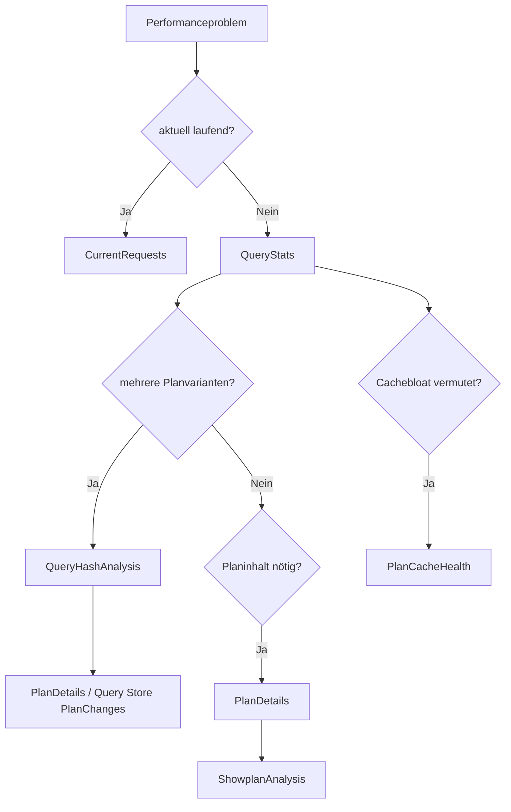

# Plan Cache und Showplan

**Procedures:** 6  
**Evidenz:** flüchtiger Cache, Compile-Plan, optional Last Actual oder Live Plan  
**Kosten:** MEDIUM bis HIGH_OPT_IN

## Grundregeln

- `sys.dm_exec_query_stats` enthält nur abgeschlossene, aktuell gecachte Statements.
- Werte gelten seit Erstellung der jeweiligen Cachezeile, nicht zwingend seit Serverstart.
- Recompile, Cache Eviction, DBCC FREEPROCCACHE, Speicherpressure, DDL und Restart verändern den Scope.
- Query Hash gruppiert ähnliche Statements; Query Plan Hash gruppiert Planformen. Beide sind Analysehilfen, keine garantierten globalen Primärschlüssel.
- Compile Plan zeigt Schätzungen. Last Actual/Live Plan kann Istwerte enthalten, ist aber nur bei entsprechender Aktivierung und Verfügbarkeit vorhanden.

---

## 1. [monitor].[USP_QueryStats]

### Zweck

Die Procedure rangiert aktuell gecachte Statements nach CPU, Laufzeit, Reads, Writes, Ausführungen, Grants, Spills, Zeilen oder letzter Ausführung.

### Aufrufe

```sql
EXEC [monitor].[USP_QueryStats]
      @Sortierung = 'CPU_TOTAL',
      @MaxZeilen = 50,
      @ResultSetArt = 'RAW';
```

```sql
EXEC [monitor].[USP_QueryStats]
      @DatabaseNames = N'[ExampleDatabase]',
      @TextPattern = N'like:%ExampleTable%',
      @Sortierung = 'READS_AVG',
      @ResultSetArt = 'RAW';
```

### RAW-Spalten

| Gruppe | Spalten | Bedeutung |
|---|---|---|
| Identität | `QueryHash`, `QueryPlanHash`, `PlanHandle`, `SqlHandle`, `StatementStartOffset`, `StatementEndOffset`, `PlanGenerationNumber` | Cache-/Statementidentität |
| Scope/Text | `DatabaseId`, `DatabaseName`, `ObjectId`, `StatementText`, `BatchText` | aufgelöster Kontext; Text kann gekürzt oder fehlen |
| Lebensdauer | `CreationTime`, `LastExecutionTime`, `ExecutionCount` | Aggregationsfenster der Cachezeile |
| CPU | `TotalCpuMs`, `LastCpuMs`, `MinCpuMs`, `MaxCpuMs`, `AvgCpuMs` | Worker Time; bei Parallelität kann CPU größer als elapsed sein |
| Laufzeit | `TotalElapsedMs`, `LastElapsedMs`, `MinElapsedMs`, `MaxElapsedMs`, `AvgElapsedMs` | End-to-End aus SQL-Server-Sicht |
| Reads | `TotalLogicalReads`, `LastLogicalReads`, `AvgLogicalReads`, `TotalPhysicalReads`, `LastPhysicalReads` | logische Seitenzugriffe und physische Reads |
| Writes | `TotalLogicalWrites`, `LastLogicalWrites`, `AvgLogicalWrites` | logische Schreibaktivität |
| Zeilen | `TotalRows`, `LastRows`, `MinRows`, `MaxRows` | ausgegebene/betroffene Zeilen gemäß DMV |
| Parallelität | `LastDop`, `MinDop`, `MaxDop` | DOP-Historie der Cachezeile |
| Grant | `MaxGrantKb`, `LastGrantKb`, `LastUsedGrantKb`, `LastIdealGrantKb` | Memory-Grant-Kontext |
| Spills | `TotalSpilledPages`, `LastSpilledPages` | TempDB-Spill-Evidenz |
| Cache | `CacheObjectType`, `ObjectType`, `PlanUseCounts`, `PlanSizeBytes`, `ResourcePoolId` | Cacheobjekt und Speicherumfang |
| Compilekontext | `SetOptions`, `CompileUserId` | mögliche Ursache mehrerer Cachevarianten |
| Sortierung | `SortValue` | normalisierte gewählte Rankingmetrik |

### Interpretation

| Konstellation | Bewertung |
|---|---|
| hohe Total-CPU, sehr viele Ausführungen, niedrige Avg-CPU | „Death by a thousand cuts“ möglich |
| niedrige Total-CPU, extrem hohe Max-CPU | seltener Ausreißer oder Parameterproblem |
| Avg Reads hoch, Rows niedrig | ineffizienter Zugriff möglich |
| `LastSpilledPages>0` | letzten Plan/Grant prüfen; ein Spill beweist noch keine dauerhafte Regression |
| MaxGrant groß, LastUsed klein | mögliche Übergrant-Evidenz |
| `PlanGenerationNumber` hoch | häufige Recompiles möglich; Ursache separat prüfen |
| LastExecution alt | Cachezeile kann irrelevant für aktuellen Workload sein |

### Grenzbeispiel

Eine Query mit einer Million Ausführungen zu jeweils 2 ms verbraucht insgesamt mehr Ressourcen als eine einmalig zehn Minuten laufende Query. Verwenden Sie deshalb sowohl die Total- als auch die Average- und Maximalwertsortierung.

### Folgeanalyse

`USP_QueryHashAnalysis`, `USP_PlanDetails`, `USP_ShowplanAnalysis`, Query Store für Historie.

---

## 2. [monitor].[USP_QueryHashAnalysis]

### Zweck

Die Procedure aggregiert alle aktuellen Cachezeilen eines Query Hash und zeigt Planvarianz, Compile-/Handlezahl und Gesamtressourcen.

### Spalten

| Spalte | Bedeutung |
|---|---|
| `QueryHash` | normalisierte Querygruppe |
| `PlanVariantCount` | verschiedene QueryPlanHashes |
| `PlanHandleCount` | verschiedene Plan Handles; kann größer als PlanVariantCount sein |
| `CompilationCount` | im Code aggregierte Plan-Generationen/Compile-Evidenz |
| `ExecutionCount` | Summe aktueller Cachezeilen |
| `TotalCpuMs`, `AvgCpuMs` | CPU gesamt/je Ausführung |
| `TotalElapsedMs`, `AvgElapsedMs` | Laufzeit gesamt/je Ausführung |
| `TotalReads`, `AvgReads`, `TotalWrites` | I/O-Kennzahlen |
| `TotalSpills`, `MaxGrantKb` | Spill-/Grantkontext |
| `FirstCreationTime`, `LastExecutionTime` | sichtbares Cachefenster |
| `SampleStatementText` | Statement einer dominanten Cachezeile; nicht zwingend alle Textvarianten |

### Interpretation

- Viele Planvarianten können aus legitimen SET Options, Datenbankkontexten, Parameter Sensitivity oder Recompiles entstehen.
- Gleicher Plan Hash mit mehreren Handles kann Cachebloat statt Planvarianz bedeuten.
- Query Hash kann unterschiedliche Literale normalisieren, aber nicht jede semantisch ähnliche Query.
- `PlanVariantCount=1` schließt historische Planwechsel aus; alte Pläne können evictet sein.

### Beispiele

| Varianten | Handles | Bewertung |
|---:|---:|---|
| 1 | 1 | einfacher aktueller Cachezustand |
| 1 | 200 | möglicher Cache-Key-/SET-Option-/Ad-hoc-Kontext |
| 8 | 8 | Parameter-/Planvarianz prüfen |
| 2 | 2, eine Variante 99 % CPU | dominanten Plan priorisieren |

### Folgeanalyse

`USP_PlanDetails` pro Handle, `USP_ShowplanAnalysis`, `USP_QueryStorePlanChanges` für Historie.

---

## 3. [monitor].[USP_PlanCacheHealth]

### Zweck

Die Procedure bewertet Cachegröße und Single-Use-Anteil. Im Vollmodus zeigt sie zusätzlich die Verteilung je Datenbank und die größten Single-Use-Pläne.

### RAW-Resultsets

1. Meta.
2. Overview.
3. Kategorien.
4. Datenbanken, optional.
5. Single-Use-Pläne, optional.

### Overview

| Spalte | Bedeutung |
|---|---|
| `PlanCount` | Cacheobjekte |
| `TotalSizeBytes`, `TotalSizeMb` | gesamter betrachteter Cacheumfang |
| `SingleUsePlanCount`, `SingleUseSizeBytes` | `usecounts <= 1` |
| `SingleUseMemoryPercent` | Speicheranteil der Single-Use-Pläne |
| `OptimizeForAdHocWorkloads` | aktueller Konfigurationswert |

### Kategorien

`CacheObjectType`, `ObjectType`, `PlanCount`, `TotalSizeBytes`, `SingleUsePlanCount`, `SingleUseSizeBytes`, `TotalUseCount`, `AverageUseCount`.

### Datenbankverteilung

`DatabaseId`, `DatabaseName`, `PlanCount`, `TotalSizeBytes`, `SingleUsePlanCount`.

### SingleUseDetails

`PlanHandle`, `CacheObjectType`, `ObjectType`, `UseCounts`, `SizeBytes`, `DatabaseId`, `DatabaseName`, `SqlText`.

### Interpretation

- Hoher Single-Use-Anteil kann Ad-hoc-Bloat bedeuten.
- `optimize for ad hoc workloads=1` reduziert bei erster Ausführung oft nur den gespeicherten Stub, nicht die Anzahl einzigartiger Texte.
- Ein großer Cache ist nicht automatisch schlecht; Memory Pressure und Nutzen sind entscheidend.
- Datenbankzuordnung über Planattribute kann fehlen oder dem Compilekontext entsprechen.
- Prepared/RPC-Workloads können anders aussehen als Ad-hoc-Batches.

### Grenzfälle

| Fall | Bewertung |
|---|---|
| 70 % Single-Use-Speicher, kein Memory Pressure | technische Schuld, aber nicht zwingend akut |
| 20 % Single-Use, Cache sehr groß, Server unter Pressure | trotzdem relevant |
| viele kleine Stubs bei Optimize for Ad Hoc | Konfiguration wirkt, Ursache der Textvarianz bleibt |
| ein selten genutzter 100-MB-Plan | XML-/Planstruktur prüfen; einzelne Größe kann relevant sein |

---

## 4. [monitor].[USP_PlanDetails]

### Zweck

Die Procedure löst gezielt Plan-Kandidaten über Session, Plan Handle, SQL Handle oder Query Hash auf und liefert Planattribute sowie Compile-, Text-, Last-Actual- oder Live-Plan.

### Kandidatenresultset

| Spalten | Bedeutung |
|---|---|
| `CandidateId` | laufinterne Zuordnung |
| `SessionId`, `RequestId` | bei Liveauswahl |
| `PlanHandle`, `SqlHandle`, `QueryHash`, `QueryPlanHash` | technische Identität |
| `StatementStartOffset`, `StatementEndOffset` | Statementsegment |
| `CreationTime`, `LastExecutionTime`, `ExecutionCount` | Cachekontext |
| `StatementText`, `BatchText` | aufgelöster Text |
| `SqlTextDatabaseId`, `SqlTextDatabaseName`, `SqlTextObjectId` | Text-/Modulscope |

### Attribute

`CandidateId`, `AttributeName`, `AttributeValue`, `IsCacheKey`.

Wichtige Attribute sind etwa `dbid`, `set_options`, `user_id`, `language_id`, `date_format`, `compat_level` und Resource-Pool-Kontext. Abweichende Cache-Key-Attribute können mehrere Handles erklären.

### Plans

| Spalte | Bedeutung |
|---|---|
| `CandidateId` | Zuordnung |
| `SourceType` | `COMPILE_XML`, `COMPILE_TEXT`, `LAST_ACTUAL_XML`, `LIVE_XML` |
| `StatusCode` | verfügbar, deaktiviert, evictet, Fehler usw. |
| `DatabaseId`, `ObjectId`, `IsEncrypted` | Planmetadaten |
| `QueryPlanXml`, `QueryPlanText` | Planinhalt |
| `ErrorNumber`, `ErrorMessage` | behandelte Einschränkung |

### Grenzen je Quelle

- Compile XML: Schätzplan; XML kann wegen Tiefe nicht verfügbar sein.
- Compile Text: weniger reichhaltig, aber bei XML-Limit hilfreich.
- Last Actual: benötigt `LAST_QUERY_PLAN_STATS`/entsprechende Funktionalität; zeigt letzte beobachtete Ausführung, nicht jede.
- Live XML: genau eine aktive Session; Request kann während Analyse enden.

### Folgeanalyse

`USP_ShowplanAnalysis` für strukturierte Befunde oder direkte fachliche Planprüfung.

---

## 5. [monitor].[USP_ShowplanAnalysis]

### Zweck

Die Procedure parst begrenzt Plan-XML und extrahiert Statements, Warnungen, Missing-Index-Elemente, verwendete Objekte/Statistiken, Operatoren, Kardinalitätsabweichungen, Memory Grants und Parameter.

### Sicherheitsbudgets

- `@MaxAnalyseobjekte`,
- `@MaxZeilen`,
- `@MaxDurationSeconds`,
- `PLAN_CACHE_DEEP` und `SHOWPLAN_XML_DEEP` bei breiten Läufen.

### Resultsets und Spalten

#### PlanStatus

`CandidateId`, `PlanHandle`, `PlanSource`, `StatusCode`, `ParseDurationMs`, `StatementCount`, `FindingCount`, `ErrorNumber`, `ErrorMessage`.

#### Statements

`CandidateId`, `StatementId`, `StatementType`, `StatementText`, `StatementSubTreeCost`, `CardinalityEstimationModelVersion`, `OptimizationLevel`, `EarlyAbortReason`, `RetrievedFromCache`, `StatementQueryHash`, `StatementQueryPlanHash`.

#### Findings

`CandidateId`, `FindingType`, `Severity`, `NodeId`, `PhysicalOp`, `LogicalOp`, `Detail`.

Findingtypen können Warnungen wie Spill, implizite Konvertierung, NoJoinPredicate, Early Abort oder andere im Code erkannte Showplanmerkmale repräsentieren. Severity ist Triage, kein automatisches Root-Cause-Urteil.

#### MissingIndexes

`CandidateId`, `Impact`, `DatabaseName`, `SchemaName`, `TableName`, `ColumnGroupUsage`, `ColumnName`, `ColumnId`.

Diese XML-Empfehlung unterliegt denselben Grenzen wie Missing-Index-DMVs.

#### Objects

`CandidateId`, `DatabaseName`, `SchemaName`, `TableName`, `IndexName`, `AliasName`, `Storage`.

#### Statistics

`CandidateId`, `DatabaseName`, `SchemaName`, `TableName`, `StatisticsName`, `LastUpdate`, `ModificationCount`, `SamplingPercent`.

Plan-XML zeigt Compilezeitinformationen; sie können zum Analysezeitpunkt veraltet sein.

#### Operators

`CandidateId`, `NodeId`, `PhysicalOp`, `LogicalOp`, `EstimateRows`, `EstimatedRowsRead`, `EstimatedTotalSubtreeCost`, `Parallel`, `EstimateRebinds`, `EstimateRewinds`.

#### Cardinality

`CandidateId`, `NodeId`, `PhysicalOp`, `LogicalOp`, `EstimateRows`, `ActualRows`, `EstimateRowsRead`, `ActualRowsRead`, `ActualExecutions`, `ActualToEstimatedRatio`.

Nur Last Actual/Live Pläne liefern zuverlässig Actualwerte. Ein extremes Ratio bei sehr kleinen absoluten Zahlen kann unkritisch sein.

#### Memory

`CandidateId`, `SerialRequiredMemoryKb`, `SerialDesiredMemoryKb`, `RequiredMemoryKb`, `DesiredMemoryKb`, `RequestedMemoryKb`, `GrantWaitTimeMs`, `GrantedMemoryKb`, `MaxUsedMemoryKb`, `MaxQueryMemoryKb`, `LastRequestedMemoryKb`, `IsMemoryGrantFeedbackAdjusted`.

#### Parameters

`CandidateId`, `ParameterName`, `ParameterDataType`, `CompiledValue`, `RuntimeValue`.

Compiled-/Runtime-Differenz kann Parameter Sensitivity anzeigen, aber ein einzelner Ausführungsplan beweist sie nicht.

### Plakative und grenzwertige Beispiele

| Befund | Bewertung |
|---|---|
| Estimate 1, Actual 10 Mio. | massive Kardinalitätsabweichung; Statistik, Parameter, SARGability prüfen |
| Estimate 1, Actual 10 | Ratio 10, absolut möglicherweise irrelevant |
| ActualRowsRead 1 Mrd., ActualRows 10 | Residual Predicate/ineffizienter Scan möglich |
| Spillwarnung bei einmaligem 2-s-Report | möglicherweise akzeptabel |
| EarlyAbortReason=TimeOut | Optimizerbudget ausgeschöpft; Querykomplexität/Planqualität prüfen |
| Missing Index Impact 99 | keine direkte DDL-Anweisung |
| CompileValue selten, RuntimeValue häufig | Parameter-Sensitivity-Evidenz |

### Kosten

Die Kostenklasse ist bei mehreren oder großen Plänen HIGH_OPT_IN. XML-XQuery beansprucht CPU; Last Actual kann große XML-Dokumente enthalten. Erhöhen Sie das Zeit- und Zeilenbudget nur nach einer aufgabenspezifischen Prüfung.

---

## 6. [monitor].[USP_PlanCacheAnalysis]

### Zweck

Die Procedure orchestriert folgende Teilanalysen:

1. `USP_QueryStats`
2. `USP_QueryHashAnalysis`
3. `USP_PlanCacheHealth`
4. `USP_ShowplanAnalysis`

Standardmäßig wird nur Query Stats ausgeführt. Die übrigen Module müssen ausdrücklich aktiviert werden.

### Orchestratorresultsets

- Meta: `ModuleName`, `CollectionTimeUtc`, `StatusCode`, `IsPartial`, `Detail`.
- Modulstatus: `ExecutionOrdinal`, `ModuleName`, `InvocationStatus`, `ErrorNumber`, `ErrorMessage`.
- davor bzw. dazwischen die Childresultsets in Aufrufreihenfolge.
- JSON `modules`: derselbe Modulstatus; `REUSED_PARENT_SNAPSHOT` kennzeichnet die laufinterne Wiederverwendung von `dm_exec_query_stats`.

### Aufrufe

```sql
EXEC [monitor].[USP_PlanCacheAnalysis]
      @MitQueryStats = 1,
      @ResultSetArt = 'CONSOLE';
```

```sql
EXEC [monitor].[USP_PlanCacheAnalysis]
      @MitQueryStats = 1,
      @MitQueryHashAnalysis = 1,
      @MitShowplanAnalysis = 1,
      @QueryHash = 0x0102030405060708,
      @MaxAnalyseobjekte = 5,
      @ResultSetArt = 'RAW';
```

### Grenzen

- `TOP` wird für Health zu `SUMMARY` und Showplan zu `GEZIELT` übersetzt.
- `VOLL` aktiviert breitere Health-/Showplanpfade, aber nicht automatisch alle Modulschalter.
- `MaxZeilen` gilt je Child; Gesamtumfang ist größer.
- Ein `EXECUTED`-Modul kann intern `PARTIAL` melden; lesen Sie deshalb die Child-Metadaten.
- Sind mindestens zwei der Consumer Query Stats, Query Hash und Showplan-Kandidatenauswahl aktiv, liest der Orchestrator `sys.dm_exec_query_stats` einmal in `#PlanCacheAnalysis_QueryStatsSnapshot`. Breite Snapshots respektieren vor dem Read `PLAN_CACHE_DEEP`; ohne Freigabe prüfen die Children ihren jeweils zulässigen Scope und lesen frisch. Ein einzelner Consumer liest ohne Temp-Materialisierung frisch.
- `USP_PlanCacheHealth` verwendet `sys.dm_exec_cached_plans` und teilt diesen Snapshot nicht. Plan-XML wird weiterhin planweise geladen; Eviction bleibt als `UNAVAILABLE_OBJECT` sichtbar.
- `READPAST` wird nicht eingesetzt: lautlos übersprungene Pläne würden die Evidenz verfälschen. Scheitert der gemeinsame Read, fallen die Children auf ihre frische, isoliert fehlerbehandelte Erhebung zurück.

## Anfänger-Entscheidungsbaum



## Quellen

- [sys.dm_exec_query_stats](https://learn.microsoft.com/sql/relational-databases/system-dynamic-management-views/sys-dm-exec-query-stats-transact-sql)
- [sys.dm_exec_cached_plans](https://learn.microsoft.com/sql/relational-databases/system-dynamic-management-views/sys-dm-exec-cached-plans-transact-sql)
- [sys.dm_exec_plan_attributes](https://learn.microsoft.com/en-us/sql/relational-databases/system-dynamic-management-objects/sys-dm-exec-plan-attributes-transact-sql?view=sql-server-ver17)
- [sys.dm_exec_query_plan](https://learn.microsoft.com/en-us/sql/relational-databases/system-dynamic-management-objects/sys-dm-exec-query-plan-transact-sql?view=sql-server-ver17)
- [sys.dm_exec_query_plan_stats](https://learn.microsoft.com/en-us/sql/relational-databases/system-dynamic-management-objects/sys-dm-exec-query-plan-stats-transact-sql?view=sql-server-ver17)
- [sys.dm_exec_query_statistics_xml](https://learn.microsoft.com/en-us/sql/relational-databases/system-dynamic-management-objects/sys-dm-exec-query-statistics-xml-transact-sql?view=sql-server-ver17)
- [Showplan XML schema](https://learn.microsoft.com/sql/relational-databases/showplan-logical-and-physical-operators-reference)

## Standalone Execution Plan Analysis

`monitor.USP_ExecutionPlanAnalysis` analysiert genau ein Plan-XML ohne zwingenden Plan-Cache- oder Query-Store-Zugriff. Die technische Identität lautet `AnalysisObjectId + StatementOrdinal + NodeId`; gleiche NodeIds verschiedener Statements bleiben getrennt. Compile- und Runtimewerte werden nicht vermischt, fehlende Capabilities bleiben `NULL` mit Status.

## Execution Evidence JSON

`monitor.USP_CreateExecutionEvidenceJson` normalisiert bereits erfasste `SET STATISTICS IO`-/`TIME`-Meldungen sowie optionale Statistik- und Histogrammevidenz. `DERIVED_ONLY` ist der Datenschutzdefault: konkrete Histogrammgrenzen, Parameter und Predicatewerte werden nach lokaler Korrelation nicht exportiert. Predicate-Histogramm-Mappings erhalten StepOrdinal und Mappingstatus, sodass Verteilungsbeziehungen ohne fachliche Rohwerte analysierbar bleiben.
