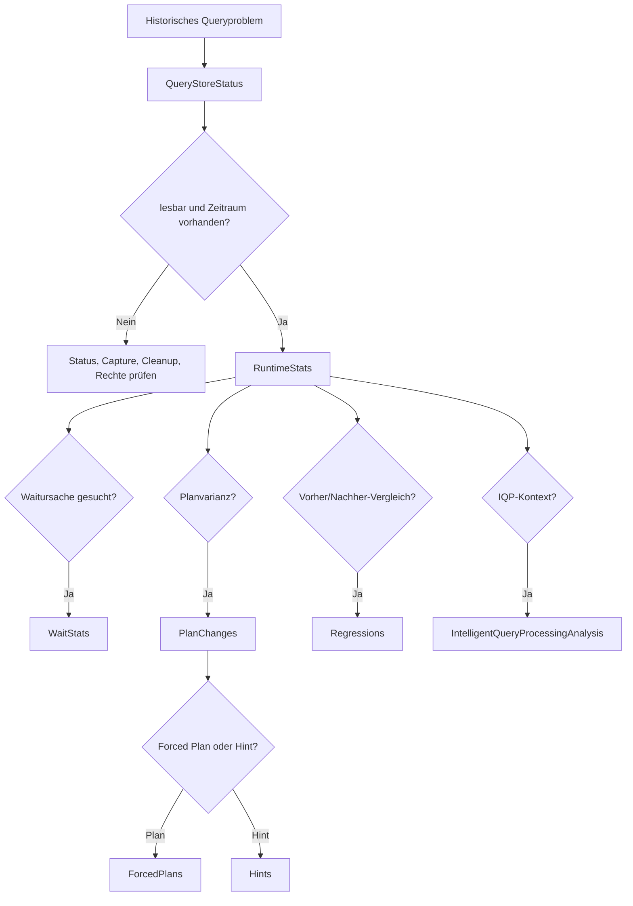

# Query Store: historisierte Laufzeit-, Wait- und Plananalyse

**Procedures:** 9  
**Evidenz:** datenbankbezogene Query-Store-Historie und IQP-Konfiguration  
**Kosten:** LOW bis HIGH_OPT_IN

## Grundregeln

Query Store ist historischer und stabiler als der Plan Cache, aber nicht lückenlos. Jede Interpretation muss mindestens prüfen:

- `actual_state_desc` und `readonly_reason`,
- Capture Mode und Capture Policy,
- Storageauslastung und Cleanup,
- Runtime-Intervalllänge,
- angefordertes Zeitfenster,
- Zahl der Ausführungen je Fenster,
- Query-Store-Datenbank versus im Plan referenzierte Datenbank,
- Plan-/Query-Retention und Planlimit.

**Wichtiger Grenzfall:** Die Procedures verwenden Runtime-Intervalle, die das angeforderte Zeitfenster überlappen. Ein Randintervall kann auch Messanteile außerhalb der exakten Start-/Endzeit enthalten. Je größer das Query-Store-Intervall gegenüber dem Analysefenster ist, desto ungenauer ist die zeitliche Abgrenzung.

---

## 1. [monitor].[USP_QueryStoreStatus]

### Zweck

Inventarisiert Query-Store-Zustand und Konfiguration für eine oder mehrere Datenbanken. Dies ist der erste Aufruf vor jeder historischen Analyse.

### Aufrufe

```sql
EXEC [monitor].[USP_QueryStoreStatus]
      @QueryStoreDatabaseNames = N'[ExampleDatabase]',
      @ResultSetArt = 'RAW';
```

```sql
EXEC [monitor].[USP_QueryStoreStatus]
      @QueryStoreDatabaseNames = NULL,
      @ResultSetArt = 'RAW';
```

### Resultsets

1. Meta/Status.
2. Query-Store-Zustand.
3. Fehler/Warnungen je Datenbank.

### Zustandsspalten

| Spalte | Bedeutung und Interpretation |
|---|---|
| `DatabaseId`, `DatabaseName` | Query-Store-Quelldatenbank |
| `DesiredState`, `DesiredStateDesc` | gewünschter Zustand |
| `ActualState`, `ActualStateDesc` | tatsächlich aktiver Zustand; für Auswertung maßgeblich |
| `ReadonlyReason` | bitcodierter Grund für Read-only; Microsoft-Dokumentation zur Decodierung verwenden |
| `CurrentStorageSizeMb`, `MaxStorageSizeMb`, `StorageUsedPercent` | aktueller Query-Store-Speicher; 90 % erzeugt im Code einen Statushinweis |
| `FlushIntervalSeconds` | Flushintervall von In-Memory-Daten auf Disk |
| `IntervalLengthMinutes` | Aggregationsintervall der Runtime Stats |
| `StaleQueryThresholdDays` | zeitbasierte Retention |
| `MaxPlansPerQuery` | Planlimit je Query |
| `QueryCaptureMode`, `QueryCaptureModeDesc` | ALL, AUTO, CUSTOM oder NONE je Version/Konfiguration |
| `SizeBasedCleanupMode`, `SizeBasedCleanupModeDesc` | größenbasierter Cleanup |
| `WaitStatsCaptureMode`, `WaitStatsCaptureModeDesc` | Wait-Erfassung aktiviert oder deaktiviert |
| `CapturePolicyExecutionCount` | Mindestanzahl gemäß Custom Capture Policy |
| `CapturePolicyTotalCompileCpuTimeMs` | Compile-CPU-Schwelle der Capture Policy |
| `CapturePolicyTotalExecutionCpuTimeMs` | Execution-CPU-Schwelle der Capture Policy |
| `CapturePolicyStaleThresholdHours` | Beobachtungsfenster der Policy |
| `IsEnabled` | Query Store ist lesbar aktiv (`actual_state` 1, 2 oder 4) |
| `IsWritable` | `actual_state=READ_WRITE` |
| `StatusHint` | codebasierte Kurzinterpretation |

### Beispiele

| Zustand | Bewertung |
|---|---|
| Desired/Actual `READ_WRITE`, 35 % Storage | normaler Ausgangspunkt |
| Desired `READ_WRITE`, Actual `READ_ONLY` | `ReadonlyReason` und Storage/Cleanup prüfen |
| `StorageUsedPercent=94` | Frameworkhinweis; Cleanup und MaxSize prüfen |
| Capture Mode `AUTO` | seltene oder billige Queries können fehlen |
| Wait Stats Capture OFF | leeres Wait-Resultset ist erwartbar |
| Interval 60 min, Analysefenster 10 min | zeitliche Aussage stark vergröbert |

### Folgeanalyse

Nur bei geeignetem Zustand `USP_QueryStoreRuntimeStats`, `USP_QueryStoreWaitStats` oder Planmodule aufrufen.

### Kosten

LOW. Cross-Database-Katalogzugriff; keine Plan-XML-Analyse.

---

## 2. [monitor].[USP_QueryStoreRuntimeStats]

### Zweck

Aggregiert Laufzeitwerte je Query und Plan über ein Zeitfenster und mehrere Query-Store-Datenbanken. Defaultfenster: letzte Stunde.

### Aufrufe

```sql
EXEC [monitor].[USP_QueryStoreRuntimeStats]
      @QueryStoreDatabaseNames = N'[ExampleDatabase]',
      @VonUtc = DATEADD(HOUR, -1, SYSUTCDATETIME()),
      @BisUtc = SYSUTCDATETIME(),
      @Sortierung = 'CPU_TOTAL',
      @ResultSetArt = 'RAW';
```

```sql
EXEC [monitor].[USP_QueryStoreRuntimeStats]
      @QueryStoreDatabaseNames = NULL,
      @ReferencedDatabaseNames = N'[ExampleReferencedDatabase]',
      @MitPlanXml = 1,
      @AnalyseModus = 'VOLL',
      @ResultSetArt = 'RAW';
```

Der Referenzdatenbankfilter parst Showplan-XML und ist ein Deep-Pfad.

### Hauptspalten

| Gruppe | Spalten | Bedeutung |
|---|---|---|
| Quelle | `QueryStoreDatabaseId`, `QueryStoreDatabaseName` | Datenbank, in der Query Store gespeichert ist |
| Identität | `QueryId`, `PlanId`, `QueryHash`, `QueryPlanHash`, `ObjectId`, `ObjectName` | IDs sind nur innerhalb der Query-Store-DB eindeutig |
| Ausführung | `ExecutionTypeDesc`, `FirstExecutionTimeUtc`, `LastExecutionTimeUtc`, `ExecutionCount` | normale, abgebrochene oder Ausnahmeausführungen können getrennt sein |
| Dauer | `TotalDurationMs`, `AverageDurationMs` | gewichtete Aggregation über Runtimezeilen |
| CPU | `TotalCpuMs`, `AverageCpuMs` | CPU je Plan/Query im Fenster |
| I/O | `TotalLogicalReads`, `AverageLogicalReads`, `TotalLogicalWrites`, `AverageLogicalWrites`, `TotalPhysicalReads` | Query-Store-Metriken, nicht Storage-Latenz |
| Memory | `TotalMemoryGrantKb`, `MaxMemoryGrantKb` | aggregierte Grant-Evidenz |
| Ergebnis | `TotalRowCount` | aggregierte Zeilenanzahl |
| Log/TempDB | `TotalLogBytes`, `TotalTempdbKb` | versionsabhängige Runtimewerte; partielle Verfügbarkeit möglich |
| Inhalt | `QuerySqlText`, `QueryPlan` | Text optional gekürzt, Plan nur mit `@MitPlanXml=1` |

### Sortierungen

`CPU_TOTAL`, `DURATION_TOTAL`, `READS_TOTAL`, `WRITES_TOTAL`, `EXECUTIONS`, `MEMORY_MAX`, `TEMPDB_TOTAL`, `LOG_BYTES_TOTAL`, `LAST_EXECUTION`.

### Interpretation

| Konstellation | Bewertung |
|---|---|
| hohe Total-CPU, niedrige Avg-CPU, sehr viele Ausführungen | kumulative Optimierungschance |
| hohe Avg-Dauer, geringe CPU | Wait-/Blocking-/I/O-Kontext nötig |
| hoher `MaxMemoryGrantKb`, geringe Ausführungszahl | Ausreißer möglich; Plan und Zeitintervalle prüfen |
| hohe TempDB-KB | Spill-/Worktable-/Versioningverdacht, aber Plan validieren |
| mehrere PlanIds derselben Query mit stark unterschiedlicher Avg-Dauer | Planwechsel oder Parameter-Sensitivity prüfen |
| Query fehlt vollständig | Capture Mode, Cleanup, Zeitraum und Query-Store-Zustand prüfen |

### Deep-Kriterien des Codes

`QUERY_STORE_DEEP` wird unter anderem erforderlich bei:

- `VOLL`,
- Plan-XML,
- mehr als 1000 Ergebniszeilen,
- Zeitraum über 24 Stunden,
- Referenzdatenbankfilter,
- Regex-Textfilter.

### Aussagegrenzen

- Runtimewerte sind intervallaggregiert.
- Randintervalle werden vollständig einbezogen, wenn sie das Fenster schneiden.
- Durchschnittswerte können multimodale Verteilungen verdecken.
- `Total*` ist nur innerhalb des gewählten Fensters und sichtbaren Retentionsbereichs vergleichbar.
- Ein Query Store auf einer sekundären Replica kann je Version/Konfiguration abweichende Daten liefern.

### Folgeanalyse

`USP_QueryStoreWaitStats`, `USP_QueryStorePlanChanges`, `USP_QueryStoreRegressions`, `USP_ShowplanAnalysis`.

---

## 3. [monitor].[USP_QueryStoreWaitStats]

### Zweck

Aggregiert Query-Store-Waitkategorien je Plan und Ausführungstyp über ein Zeitfenster. Default: letzte Stunde.

### Spalten

| Spalte | Bedeutung |
|---|---|
| `QueryStoreDatabaseId`, `QueryStoreDatabaseName` | Quelldatenbank |
| `QueryId`, `PlanId`, `QueryHash`, `QueryPlanHash` | Query-/Planidentität |
| `WaitCategory`, `WaitCategoryDesc` | Query-Store-Waitkategorie, nicht einzelner Waittyp |
| `ExecutionTypeDesc` | normale oder abweichende Ausführungsart |
| `FirstIntervalStartUtc`, `LastIntervalEndUtc` | sichtbare Intervallspanne |
| `RecordedRows` | Zahl aggregierter Query-Store-Waitzeilen, nicht Zahl einzelner Waitevents |
| `TotalQueryWaitTimeMs` | Summe der aufgezeichneten Query-Waitzeit |
| `AverageRecordedQueryWaitTimeMs` | Mittel der gespeicherten Intervall-Durchschnittswerte; nicht strikt nach Ausführungen gewichtet |
| `MaxQueryWaitTimeMs` | größter gespeicherter Maximalwert |
| `QuerySqlText` | optional gekürzter Text |

### Interpretation

- Kategorien sind gröber als Live-Waittypen.
- `TotalQueryWaitTimeMs` priorisiert Gesamtwirkung.
- `AverageRecordedQueryWaitTimeMs` ist kein exakter Durchschnitt pro Ausführung, weil der Code Intervallmittelwerte mittelt.
- `RecordedRows` misst Messpunkte; mehr Messpunkte bedeuten nicht automatisch mehr Ausführungen.
- Wait Capture muss aktiviert gewesen sein.

### Beispiele

| Fall | Bewertung |
|---|---|
| Lock-Kategorie dominiert nur ein Intervall | zeitlich lokaler Blockingburst möglich |
| CPU-Kategorie hoch und Runtime-CPU hoch | CPU-/Scheduler-/Plananalyse |
| Buffer-I/O hoch, aber nur 2 Ausführungen | einzelne schwere analytische Query möglich |
| keine Zeilen, Status READ_WRITE, Wait Capture OFF | erwartetes leeres Resultset |
| hohe Waitsumme bei hoher Ausführungszahl, niedriger Maxwert | viele kleine Wartezeiten statt einzelner Ausreißer |

### Folgeanalyse

Aktuell reproduzierbar: `USP_CurrentWaits` und `USP_CurrentRequests`. Historisch: PlanChanges/Regressions und XE.

---

## 4. [monitor].[USP_QueryStorePlanChanges]

### Zweck

Findet Queries mit mehreren Query-Store-Plänen und liefert eine Queryzusammenfassung sowie alle zugehörigen Planmetadaten.

### Query-Summary

| Spalte | Bedeutung |
|---|---|
| `QueryStoreDatabaseId`, `QueryStoreDatabaseName`, `QueryId`, `QueryHash` | Scope und Identität |
| `ObjectId`, `ObjectName` | Modulbezug, sofern vorhanden |
| `PlanCount` | Zahl Query-Store-Planzeilen |
| `ForcedPlanCount` | aktuell als forced markierte Pläne |
| `DistinctPlanHashCount` | strukturell verschiedene Plan Hashes |
| `FirstCompileTimeUtc`, `LastCompileTimeUtc` | Compilezeitraum |
| `LastExecutionTimeUtc` | jüngste Planaktivität |
| `TotalCompiles` | Summe `count_compiles` |
| `QuerySqlText` | Querytext |

### Plans

| Spalte | Bedeutung |
|---|---|
| `PlanId`, `QueryPlanHash` | Query-Store-Planidentität |
| `EngineVersion`, `CompatibilityLevel` | Compileumgebung |
| `IsParallelPlan` | Parallelitätskennzeichen |
| `IsForcedPlan`, `PlanForcingTypeDesc` | Planforcingstatus und Quelle |
| `ForceFailureCount`, `LastForceFailureReason`, `LastForceFailureReasonDesc` | Force-Probleme |
| `CountCompiles` | Recompile-/Compileevidenz |
| `InitialCompileStartTimeUtc`, `LastCompileStartTimeUtc`, `LastExecutionTimeUtc` | Planlebenszyklus |
| `AverageCompileDurationMs`, `LastCompileDurationMs` | Compilekosten |
| `QueryPlan` | optionales Plan-XML |

### Grenzfälle

- `PlanCount > 1`, aber `DistinctPlanHashCount=1`: mehrere Query-Store-Planzeilen können strukturell gleich sein.
- Unterschiedliche Engine-/Compatibility-Level können erwartete Planwechsel erklären.
- Alter, nie mehr ausgeführter Plan ist nicht automatisch relevant.
- Forced Plan und zusätzliche neue Pläne können aus Force-Fehlern, Recompile oder Featureverhalten entstehen.
- `@NurMehrerePlaene=1` betrachtet Query-Store-Zeilen, nicht zwingend gleichzeitig aktive Pläne.

### Folgeanalyse

RuntimeStats je Plan, Regressions, ForcedPlans und Showplanvergleich.

---

## 5. [monitor].[USP_QueryStoreRegressions]

### Zweck

Vergleicht zwei nicht überlappende Zeitfenster. Defaults:

- Vergleich: letzte Stunde,
- Baseline: die Stunde unmittelbar davor,
- Metrik: `DURATION_AVG`,
- Mindestregression: 20 %,
- mindestens eine Ausführung je Fenster.

### Unterstützte Metriken

`DURATION_AVG`, `CPU_AVG`, `READS_AVG`, `WRITES_AVG`, `EXECUTIONS`.

### Resultset

| Spalte | Bedeutung |
|---|---|
| `QueryStoreDatabaseId`, `QueryStoreDatabaseName`, `QueryId`, `QueryHash` | Queryscope |
| `ObjectId`, `ObjectName` | Modulbezug |
| `BaselineExecutions`, `ComparisonExecutions` | Stichprobengröße beider Fenster |
| `BaselinePlanCount`, `ComparisonPlanCount` | Planvielfalt je Fenster |
| `BaselineValue`, `ComparisonValue` | gewählte Metrik |
| `AbsoluteChange` | Vergleich minus Baseline |
| `RegressionPercent` | Änderung relativ zum Absolutwert der Baseline |
| `LastExecutionTimeUtc` | jüngste Vergleichsaktivität |
| `QuerySqlText` | Querytext |

### Interpretation

| Fall | Bewertung |
|---|---|
| 100 ms → 150 ms, je 100.000 Ausführungen | 50 % Regression mit hoher Evidenz |
| 1 ms → 10 ms, je 1 Ausführung | 900 %, aber sehr schwache Stichprobe |
| 0 → positiver Wert | Prozentwert nicht sinnvoll/NULL; absolute Änderung lesen |
| PlanCount steigt 1 → 4 | Planvarianz als mögliche Erklärung |
| CPU stabil, Duration steigt | Wait-/Blocking-/I/O-Änderung möglich |
| Executions steigt, Avg stabil | Lastanstieg, keine Queryeffizienzregression |

### Wichtige Grenzen

- Workloadmix, Parameter und Datenvolumen können zwischen Fenstern unterschiedlich sein.
- Intervallüberlappung verwässert scharfe Grenzen.
- Durchschnitt verdeckt P95/P99 und bimodale Verteilung.
- Default `MinAusfuehrungenJeFenster=1` ist für belastbare Produktionsergebnisse oft zu niedrig; passend erhöhen.
- Eine Regression rechtfertigt nicht automatisch Planforcing.

### Folgeanalyse

PlanChanges, RuntimeStats je Plan, WaitStats, ForcedPlans und Showplan.

---

## 6. [monitor].[USP_QueryStoreForcedPlans]

### Zweck

Inventarisiert erzwungene Query-Store-Pläne und priorisiert Force-Fehler.

### Spalten

`QueryStoreDatabaseId`, `QueryStoreDatabaseName`, `QueryId`, `PlanId`, `QueryHash`, `QueryPlanHash`, `ObjectId`, `ObjectName`, `IsForcedPlan`, `PlanForcingTypeDesc`, `ForceFailureCount`, `LastForceFailureReason`, `LastForceFailureReasonDesc`, `CountCompiles`, `LastCompileStartTimeUtc`, `LastExecutionTimeUtc`, `EngineVersion`, `CompatibilityLevel`, `QuerySqlText`, optional `QueryPlan`.

### Interpretation

- `IsForcedPlan=1` beweist nicht, dass der Plan aktuell optimal ist.
- `ForceFailureCount>0` und `LastForceFailureReason<>0` benötigen Prüfung.
- Ein alter Forced Plan ohne aktuelle Ausführung kann technisch irrelevant, aber als Konfigurationsschuld wichtig sein.
- Schema-, Index-, Engine- oder Compatibility-Änderungen können Planforcing beeinflussen.
- Automatic Plan Correction und manuelles Forcing über `PlanForcingTypeDesc` unterscheiden.

### Beispiele

| Fall | Bewertung |
|---|---|
| Forced, 0 Fehler, aktuelle stabile Performance | beobachten, nicht reflexartig entfernen |
| 50 Force-Fehler, letzter Grund `NO_PLAN`/ähnlich | akut prüfen |
| Forced Plan aus alter Engineversion nach Upgrade | Regression und aktuellen Alternativplan vergleichen |
| Forced Plan langsam, aber stabiler als Alternativen | SLA-/Risikokontext statt reine Durchschnittsmetrik |

### Folgeanalyse

PlanChanges, Regressions, RuntimeStats und vollständiger Planvergleich.

---

## 7. [monitor].[USP_QueryStoreHints]

### Zweck

Inventarisiert Query Store Hints ab SQL Server 2022 und priorisiert Hintfehler.

### Spalten

| Spalte | Bedeutung |
|---|---|
| `QueryStoreDatabaseId`, `QueryStoreDatabaseName` | Scope |
| `QueryHintId`, `QueryId`, `ReplicaGroupId`, `QueryHash` | Hint-/Queryidentität |
| `QueryHintText` | angewendeter Hinttext |
| `LastQueryHintFailureReason`, `LastQueryHintFailureReasonDesc` | letzter Fehler |
| `QueryHintFailureCount` | Fehleranzahl |
| `Source`, `SourceDesc` | Herkunft des Hints |
| `QuerySqlText` | Zielquery |

### Interpretation

- Ein Hint ist eine betriebliche Intervention und benötigt Owner, Begründung, Reviewdatum und Rücknahmepfad.
- Fehler können durch inkompatible Queryform, Version, Syntax oder spätere Änderungen entstehen.
- Ein fehlerfreier Hint kann trotzdem inzwischen unnötig oder schädlich sein.
- Hints können Optimizerfortschritte nach Upgrade überdecken.
- `ReplicaGroupId` ist in Replikaszenarien relevant.

### Folgeanalyse

RuntimeStats, Regressions, PlanChanges, ForcedPlans und Change-Dokumentation.

---

## 8. [monitor].[USP_IntelligentQueryProcessingAnalysis]

### Zweck

Dokumentiert versionsadaptive IQP-Voraussetzungen und aggregierte Evidenz, ohne Querytext, Plan oder Benutzerdaten zu lesen.

### DatabaseState

| Spalte | Bedeutung |
|---|---|
| `DatabaseId`, `DatabaseName`, `CompatibilityLevel` | Scope |
| `QueryStoreActualStateDesc`, `QueryStoreDesiredStateDesc`, `QueryStoreReadonlyReason` | Query-Store-Voraussetzung |
| `PspEligible` | SQL Server 2022+ und Compatibility Level 160+ |
| `OppoEligible` | SQL Server 2025+ und Compatibility Level 170+ |
| `FindingCode`, `FindingSeverity` | etwa Query Store OFF/READ_ONLY oder Compatibility zu niedrig |
| `EvidenceLimit` | Featureeignung ist kein Wirksamkeitsbeweis |

### Configuration

`DatabaseId`, `DatabaseName`, `ConfigurationName`, `ConfigurationValue`, `IsValueDefault` für unter anderem:

- Parameter Sensitive Plan Optimization,
- Optional Parameter Plan Optimization,
- Memory Grant Feedback Persistence/Percentile,
- DOP Feedback,
- CE Feedback,
- Batch-/Row-Mode Memory Grant Feedback,
- Adaptive Joins,
- Interleaved Execution,
- Deferred Compilation für Table Variables.

### AutomaticTuning

`DatabaseId`, `DatabaseName`, `OptionName`, `DesiredStateDesc`, `ActualStateDesc`, `ReasonDesc`.

### Signals

| Spalte | Bedeutung |
|---|---|
| `SignalCode` | `QUERY_VARIANTS`, `PLAN_FEEDBACK`, `TUNING_RECOMMENDATIONS` |
| `IsSourceAvailable` | Katalogsicht auf dieser Version verfügbar |
| `EvidenceCount` | aggregierte Zahl sichtbarer Evidenzzeilen |
| `Interpretation` | explizite Aussagegrenze |

### Interpretation

- `PspEligible=1` bedeutet nur, dass Version/Compatibility passen.
- `EvidenceCount=0` beweist weder, dass keine Parameter Sensitivity existiert, noch dass IQP fehlschlug.
- Query Store OFF/READ_ONLY begrenzt persistentes Feedback.
- Database-scoped Configuration kann Feature deaktivieren oder vom Default abweichen.
- Automatic-Tuning-Empfehlungen sind keine automatisch umzusetzenden Änderungen.

### Folgeanalyse

Bei auffälligen Signalen Query Store Runtime/PlanChanges, Showplan und konkrete Queryanalyse.

---

## 9. [monitor].[USP_QueryStoreAnalysis]

### Zweck

Orchestriert alle Query-Store-Module. Default aktiviert Status und RuntimeStats.

### Reihenfolge

1. `USP_QueryStoreStatus`
2. `USP_QueryStoreRuntimeStats`
3. `USP_QueryStoreWaitStats`
4. `USP_QueryStorePlanChanges`
5. `USP_QueryStoreRegressions`
6. `USP_QueryStoreForcedPlans`
7. `USP_QueryStoreHints`
8. `USP_IntelligentQueryProcessingAnalysis`

### Orchestratorresultsets

- Childresultsets in Ausführungsreihenfolge.
- Metaresultset.
- RAW-Modulstatus: `ExecutionOrdinal`, `ModuleName`, `InvocationStatus`, `ErrorNumber`, `ErrorMessage`.
- JSON mit benannten Childobjekten.

### Aufrufe

```sql
EXEC [monitor].[USP_QueryStoreAnalysis]
      @QueryStoreDatabaseNames = N'[ExampleDatabase]',
      @MitStatus = 1,
      @MitRuntimeStats = 1,
      @ResultSetArt = 'CONSOLE';
```

```sql
EXEC [monitor].[USP_QueryStoreAnalysis]
      @QueryStoreDatabaseNames = N'[ExampleDatabase]',
      @MitStatus = 1,
      @MitRuntimeStats = 1,
      @MitWaitStats = 1,
      @MitPlanChanges = 1,
      @MitRegressionen = 1,
      @MitForcedPlans = 1,
      @MitHints = 1,
      @MitIQP = 1,
      @ResultSetArt = 'RAW';
```

### Grenzfall der Regressionen im Wrapper

Der Wrapper übergibt `@VonUtc/@BisUtc` als **Vergleichsfenster**. Das Baselinefenster wird von `USP_QueryStoreRegressions` unmittelbar davor abgeleitet. Dies muss bei der Interpretation explizit beachtet werden.

### Kosten

Default LOW bis MEDIUM. Vollständiger Aufruf mit Referenzdatenbankfiltern, Plan-XML, langen Zeiträumen und vielen Datenbanken ist HIGH_OPT_IN.

## Anfänger-Entscheidungsbaum



## Quellen

- [Monitor performance with Query Store](https://learn.microsoft.com/sql/relational-databases/performance/monitoring-performance-by-using-the-query-store)
- [Query Store usage scenarios](https://learn.microsoft.com/sql/relational-databases/performance/query-store-usage-scenarios)
- [sys.database_query_store_options](https://learn.microsoft.com/sql/relational-databases/system-catalog-views/sys-database-query-store-options-transact-sql)
- [sys.query_store_runtime_stats](https://learn.microsoft.com/sql/relational-databases/system-catalog-views/sys-query-store-runtime-stats-transact-sql)
- [sys.query_store_wait_stats](https://learn.microsoft.com/sql/relational-databases/system-catalog-views/sys-query-store-wait-stats-transact-sql)
- [sys.query_store_plan](https://learn.microsoft.com/sql/relational-databases/system-catalog-views/sys-query-store-plan-transact-sql)
- [Query Store hints](https://learn.microsoft.com/sql/relational-databases/performance/query-store-hints)
- [Intelligent Query Processing](https://learn.microsoft.com/sql/relational-databases/performance/intelligent-query-processing)
- [Parameter Sensitive Plan optimization](https://learn.microsoft.com/sql/relational-databases/performance/parameter-sensitive-plan-optimization)
