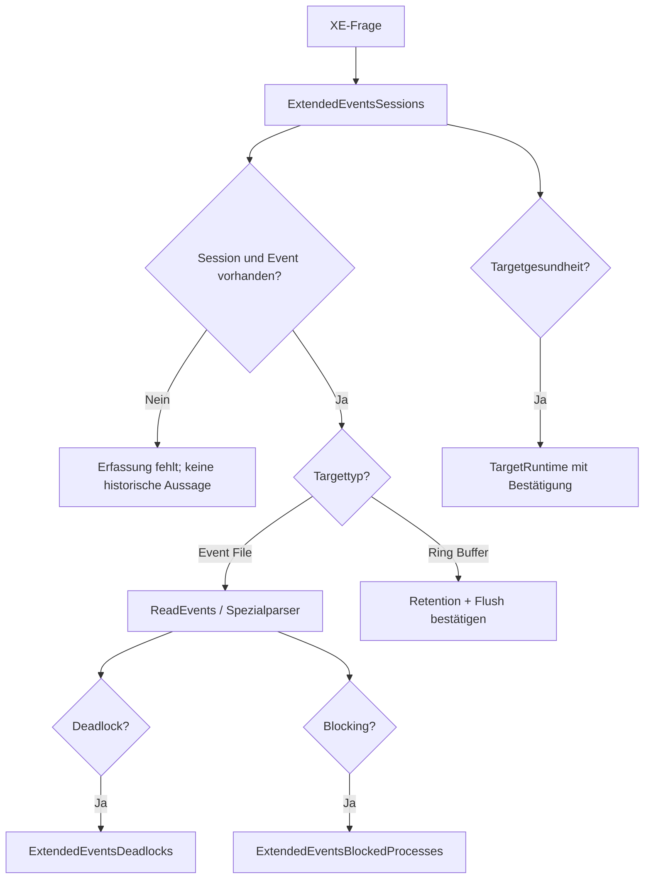

# Extended Events: Inventar und optionale Forensik

**Procedures:** 6  
**Evidenz:** Sessiondefinition, laufender Targetstatus und vorhandene Targethistorie  
**Kosten:** LOW für Inventar, HIGH_OPT_IN für Eventdatei-/XML-Forensik

## Grundregeln

1. Das Framework erstellt, startet, stoppt oder ändert keine XE-Session.
2. Nur bereits konfigurierte Events, Actions und Targets können ausgewertet werden.
3. Event Files können trotz `TOP` vollständig gescannt werden müssen.
4. Ring Buffer ist begrenzt und überschreibbar.
5. Das Lesen von `sys.dm_xe_session_targets` kann gesammelte Daten zum Target flushen. Deshalb sind entsprechende Pfade ohne `@BestaetigeTargetFlush=1` deaktiviert.
6. Ein leeres Eventresultset beweist nicht, dass kein Ereignis auftrat.

---

## 1. [monitor].[USP_ExtendedEventsSessions]

### Zweck

Die Procedure inventarisiert serverweite XE-Sessions, deren Laufzeitstatus, Events, Actions, Targets und optional explizit konfigurierte Felder. Targetdaten selbst werden nicht gelesen.

### Aufrufe

```sql
EXEC [monitor].[USP_ExtendedEventsSessions]
      @ResultSetArt = 'RAW';
```

```sql
EXEC [monitor].[USP_ExtendedEventsSessions]
      @ExtendedEventSessionNames = N'[system_health]',
      @MitFeldern = 1,
      @ResultSetArt = 'RAW';
```

### Resultsets

1. Modulstatus.
2. Sessions.
3. Events, wenn aktiviert.
4. Actions, wenn aktiviert.
5. Targets, wenn aktiviert.
6. Felder, wenn aktiviert.

### Sessions

| Gruppe | Spalten | Bedeutung |
|---|---|---|
| Identität | `EventSessionId`, `SessionName`, `IsRunning`, `StartupState` | Definition und aktueller Laufstatus |
| Retention | `EventRetentionMode`, `EventRetentionModeDesc` | Verlustverhalten bei Druck |
| Dispatch/Memory | `MaxDispatchLatencyMilliseconds`, `MaxMemoryKb`, `MaxEventSizeKb`, `MemoryPartitionMode`, `MemoryPartitionModeDesc`, `TrackCausality` | Sessionkonfiguration |
| Laufzeit | `RunningSince`, `PendingBuffers`, Regular-/Large-Bufferzahl und -größe, `TotalBufferSizeBytes`, `BufferPolicyDesc` | nur bei `@MitLaufzeitstatus=1` und laufender Session |
| Verlust | `DroppedEventCount`, `DroppedBufferCount`, `BlockedEventFireTimeMilliseconds`, `LargestEventDroppedSizeBytes`, `BufferFullCount` | zentrale Qualitätsindikatoren |
| Volumen | `BufferProcessedCount`, `TotalBytesGenerated`, `TotalTargetMemoryBytes` | Aktivität und Targetmemory |
| Definition | `EventCount`, `TargetCount`, `ActionCount`, `HasRingBuffer`, `HasEventFile` | vorhandene Erfassungskomponenten |

### Events

`SessionName`, `EventId`, `PackageName`, `EventName`, `Predicate`.

Ein Event ohne geeignetes Predicate kann hohe Last und große Targets erzeugen. Ein enges Predicate kann umgekehrt relevante Ereignisse ausschließen.

### Actions

`SessionName`, `EventName`, `ActionOrdinal`, `PackageName`, `ActionName`.

Actions wie SQL Text, Session ID, Database ID oder Call Stack beeinflussen Aussagekraft und Kosten.

### Targets

`SessionName`, `TargetId`, `PackageName`, `TargetName`, `ConfiguredFileName`, `MaxFileSizeMb`, `MaxRolloverFiles`, `MaxMemoryKb`.

### Felder

`SessionName`, `ObjectType`, `ObjectId`, `ObjectName`, `FieldName`, `FieldValue` für explizite Event-/Targetkonfiguration.

### Interpretation

| Konstellation | Bewertung |
|---|---|
| `IsRunning=0`, `StartupState=1` | Session sollte beim Start laufen, ist aktuell aber gestoppt |
| `DroppedEventCount>0` | Erfassung ist unvollständig |
| `DroppedBufferCount>0` | stärkere Datenverlust-Evidenz |
| Ring Buffer ohne Event File bei hoher Ereignisrate | kurze Retention wahrscheinlich |
| Event File mit kleinem Rollover | Historie kann schnell verschwinden |
| `TrackCausality=0` | keine Aktivitätskorrelation, aber nicht zwingend erforderlich |
| keine SQL-Text-Action | spätere Ursachenanalyse kann begrenzt sein |

### Folgeanalyse

- Targetlaufzeit: `USP_ExtendedEventsTargetRuntime`
- Rohereignisse: `USP_ExtendedEventsReadEvents`
- Deadlocks/Blocking: spezialisierte Procedures

### Kosten

LOW. Nur Kataloge und optional `sys.dm_xe_sessions`; keine Targetdaten.

---

## 2. [monitor].[USP_ExtendedEventsReadEvents]

### Zweck

Die Procedure liest generische Ereignisse aus `event_file` oder `ring_buffer`. Im Modus `AUTO` wählt sie vorrangig das Event File.

### Aufrufe

```sql
EXEC [monitor].[USP_ExtendedEventsReadEvents]
      @SourceExtendedEventSessionName = N'[system_health]',
      @Quelle = 'EVENT_FILE',
      @EventNames = N'[xml_deadlock_report]',
      @VonUtc = DATEADD(HOUR, -24, SYSUTCDATETIME()),
      @ResultSetArt = 'RAW';
```

```sql
EXEC [monitor].[USP_ExtendedEventsReadEvents]
      @SourceExtendedEventSessionName = N'[ExampleSession]',
      @Quelle = 'RING_BUFFER',
      @BestaetigeTargetFlush = 1,
      @MitEventXml = 0,
      @ResultSetArt = 'RAW';
```

### Events

| Spalte | Bedeutung |
|---|---|
| `SourceType` | `EVENT_FILE` oder `RING_BUFFER` |
| `EventName` | XE-Eventname |
| `TimestampUtc` | Ereigniszeitpunkt |
| `FileName`, `FileOffset` | Position in XEL, beim Ring Buffer `NULL` |
| `EventXml` | vollständiges XML nur bei `@MitEventXml=1` |

### SourceStatus

`SourceType`, `SessionName`, `TargetName`, `ResolvedPath`, `StatusCode`, `ErrorNumber`, `ErrorMessage`, `Detail`.

Diese Zeilen sind zwingend zu lesen. Sie unterscheiden beispielsweise:

- Sessiondefinition nicht lesbar,
- kein Event-File-Pfad,
- Datei nicht erreichbar,
- Ring Buffer nicht bestätigt,
- Target nicht laufend,
- Quelle lesbar, aber keine passenden Events.

### Grenzen

- Ein angegebener `.xel`-Pfad wird zum Wildcardpfad erweitert.
- `TOP` begrenzt Ergebniszeilen, nicht zuverlässig die physische Dateiarbeit.
- Event XML enthält eventabhängige Felder; es gibt keinen universellen Spaltenvertrag innerhalb des XML.
- Ring Buffer kann ältere Events überschrieben haben.
- `AUTO` liest ohne Bestätigung nicht stillschweigend den Ring Buffer.

### Plakative Beispiele

| Fall | Interpretation |
|---|---|
| 0 Events, SourceStatus `AVAILABLE` | im gelesenen Scope keine passenden Events; Retention trotzdem prüfen |
| 0 Events, `UNAVAILABLE_OBJECT` | keine fachliche Entwarnung |
| 1000 zurückgegeben, `MaxZeilen=1000` | mögliches Truncation-/Top-N-Risiko; Zeitraum enger setzen |
| XEL auf vielen Rollover-Dateien | hoher I/O-/XML-Aufwand trotz kleinem Ergebnis |
| Ring Buffer gelesen | bewusster Flush möglich und Historie begrenzt |

---

## 3. [monitor].[USP_ExtendedEventsDeadlocks]

### Zweck

Die Procedure liest `xml_deadlock_report` und zerlegt jeden Deadlockgraph in Summary, Victims, Processes und Resources. Der Standardzeitraum umfasst die letzten 24 Stunden.

### Resultsets

#### DeadlockSummary

| Spalte | Bedeutung |
|---|---|
| `DeadlockId` | laufinterne ID |
| `SourceType`, `DeadlockTimeUtc`, `FileName`, `FileOffset` | Quelle und Zeit |
| `VictimCount`, `ProcessCount`, `ResourceCount` | Graphumfang |
| `FirstDatabaseId` | erste im Graph gefundene Datenbank-ID, nicht zwingend einziger Scope |
| `DeadlockXml` | optional vollständiger Graph |

#### Victims

`DeadlockId`, `DeadlockTimeUtc`, `VictimProcessId`.

Die Victim-ID ist eine graphinterne Prozess-ID, nicht gleichbedeutend mit einer dauerhaft gültigen Session-ID.

#### Processes

| Gruppe | Spalten |
|---|---|
| Identität | `DeadlockId`, `ProcessId`, `IsVictim`, `SessionId`, `ExecutionContextId` |
| Status/Wait | `ProcessStatus`, `WaitResource`, `WaitTimeMs`, `LockMode` |
| Transaktion | `TransactionName`, `IsolationLevel`, `TransactionCount`, `LogUsed` |
| Scope/Client | `DatabaseId`, `ClientApplication`, `HostName`, `LoginName`, `HostProcessId` |
| Inhalt | `InputBuffer`, optional `ProcessXml` |

#### Resources

`DeadlockId`, `DeadlockTimeUtc`, `ResourceType`, `DatabaseId`, `ObjectId`, `IndexId`, `AssociatedObjectId`, `ResourceId`, `ResourceMode`, optional `OwnerListXml`, `WaiterListXml`, `ResourceXml`.

#### SourceStatus

Quelle, Pfad und Fehlerstatus.

### Interpretation

- Deadlock ist ein Zyklus; das Opfer ist nicht automatisch der „schuldige“ Prozess.
- `WaitTimeMs` im Graph ist ein Momentwert vor Erkennung.
- `InputBuffer` kann äußerer Batch/RPC statt exaktem innerem Statement sein.
- Parallelität kann mehrere ECIDs derselben Session enthalten.
- Object-/Index-ID muss zum Ereigniszeitpunkt und zur richtigen Datenbank aufgelöst werden; heutige Metadaten können sich geändert haben.
- `LogUsed` beeinflusst häufig Rollbackkosten und Victimauswahl, ist aber nicht die einzige Prioritätskomponente.

### Beispiele

| Muster | Nächster Check |
|---|---|
| zwei Sessions sperren Objekte in umgekehrter Reihenfolge | konsistente Zugriffsreihenfolge |
| Reader/Writer unter hoher Isolation | Isolation, Indexzugriff und Transaktionsumfang |
| Key-Range-Ressourcen | SERIALIZABLE/HOLDLOCK und passende Indizes |
| Parallel-Query-Deadlock | Planoperatoren und Exchange-/Threadkontext |
| wiederkehrender identischer Graph | Query-/Objektmuster priorisieren, nicht nur Opferretry |

### Folgeanalyse

Showplan, Query Store, Objekt-/Indexanalyse und Applikationstransaktionsdesign.

---

## 4. [monitor].[USP_ExtendedEventsBlockedProcesses]

### Zweck

Die Procedure liest `blocked_process_report` und zerlegt Report, blockierte und blockierende Prozesse. Die Procedure ändert weder `blocked process threshold (s)` noch XE-Konfiguration.

### Voraussetzungen

- Threshold ist größer 0,
- eine XE-Session erfasst `blocked_process_report`,
- Session/Target lief im Zeitraum,
- Targethistorie ist noch vorhanden.

### ReportSummary

`ReportId`, `SourceType`, `ReportTimeUtc`, `FileName`, `FileOffset`, `MonitorLoop`, `BlockedSessionId`, `BlockingSessionId`, `WaitTimeMs`, `DatabaseId`, `DatabaseName`, `WaitResource`, `RequestedLockMode`, optional `ReportXml`.

### BlockedProcesses und BlockingProcesses

`ReportId`, `ReportTimeUtc`, `SessionId`, `ExecutionContextId`, `ProcessStatus`, `WaitResource`, `WaitTimeMs`, `LockMode`, `DatabaseId`, `DatabaseName`, `ClientApplication`, `HostName`, `LoginName`, `InputBuffer`, optional `ProcessXml`.

### Meta

Zusätzlich wird `BlockedProcessThresholdSeconds` ausgegeben. Dies ist wesentlich für die Interpretation: Reports existieren erst nach Überschreiten des konfigurierten Schwellwerts.

### Grenzen und Beispiele

| Fall | Interpretation |
|---|---|
| Threshold 20 s, keine Reports | beweist nur, dass keine sichtbare erfasste Blockierung über der Schwelle gefunden wurde |
| gleicher Blocker in vielen Reports | persistierender Root-Blocker oder wiederkehrendes Muster |
| blockierende Session ohne InputBuffer | Session kann sleeping, beendet oder Text nicht verfügbar sein |
| viele Reports im gleichen MonitorLoop | zusammengehörige Blockingwelle, nicht zwingend unabhängige Vorfälle |
| WaitTime knapp über Threshold | erwartete Erfassung, nicht automatisch kritischer SLA-Verstoß |
| Threshold 0 | Erfassung deaktiviert; leeres Resultset nicht interpretierbar |

### Folgeanalyse

Aktueller Zustand: `USP_CurrentBlocking` und `USP_CurrentTransactions`. Historisch: Query Store, Deadlocks und Applikationstransaktionen.

---

## 5. [monitor].[USP_ExtendedEventsTargetRuntime]

### Zweck

Die Procedure liest Laufzeitmetriken laufender Targets. Dieser Zugriff kann einen Flush auslösen und ist deshalb ohne Bestätigung deaktiviert.

### Aufruf

```sql
EXEC [monitor].[USP_ExtendedEventsTargetRuntime]
      @ExtendedEventSessionNames = N'[system_health]',
      @BestaetigeTargetFlush = 1,
      @MitTargetData = 0,
      @ResultSetArt = 'RAW';
```

### Spalten

| Spalte | Bedeutung |
|---|---|
| `SessionName`, `TargetName` | laufendes Target |
| `SessionCreateTime` | Startzeit der laufenden Session |
| `ExecutionCount` | Targetausführungen gemäß DMV |
| `ExecutionDurationMs` | kumulative Targetausführungsdauer |
| `BytesWritten` | geschriebene Bytes |
| `TargetDataCharacters` | Länge des aktuell zurückgegebenen Targetdata-Texts |
| `TargetDataPrefix` | optional begrenzter Prefix, maximal 1.000.000 Zeichen |

### Interpretation

- Metriken sind seit Start der laufenden Session kumulativ.
- Neustart/Sessionrestart setzt den Kontext zurück.
- Hohe Duration ist nur relativ zu Laufzeit, Eventrate und Targettyp sinnvoll.
- `TargetDataCharacters` ist Textlänge, keine Ereigniszahl.
- Prefix kann abgeschnittenes XML sein und darf nicht als vollständiges Target interpretiert werden.
- Keine Zeilen können bedeuten: Session gestoppt, Targetfilter passt nicht oder Rechte fehlen.

### Kosten

Ohne Targetdata meist moderat, aber Flush-Nebenwirkung. Große `target_data` kann CPU, Memory und Ergebnistransfer belasten.

---

## 6. [monitor].[USP_ExtendedEventsAnalysis]

### Zweck

Die Procedure orchestriert folgende Teilanalysen:

1. Sessioninventar,
2. Target Runtime,
3. generische Events,
4. Deadlocks,
5. Blocked Process Reports.

Standardmäßig wird nur das Sessioninventar ausgeführt.

### Resultsets

- Childresultsets in Reihenfolge.
- Meta: `ModuleName`, `CollectionTimeUtc`, `StatusCode`, `IsPartial`, `ModuleCount`.
- RAW-Modulstatus: `ExecutionOrdinal`, `ModuleName`, `InvocationStatus`, `ErrorNumber`, `ErrorMessage`.
- JSON mit `inventory`, `targetRuntime`, `events`, `deadlocks`, `blockedProcesses`.

### Aufrufe

```sql
EXEC [monitor].[USP_ExtendedEventsAnalysis]
      @MitSessionInventar = 1,
      @ResultSetArt = 'CONSOLE';
```

```sql
EXEC [monitor].[USP_ExtendedEventsAnalysis]
      @SourceExtendedEventSessionName = N'[system_health]',
      @Quelle = 'EVENT_FILE',
      @MitSessionInventar = 1,
      @MitEvents = 1,
      @MitDeadlocks = 1,
      @MaxZeilen = 100,
      @ResultSetArt = 'RAW';
```

### Grenzen

- `@MaxZeilen` gilt je Child, nicht für den gesamten Wrapper.
- Target Runtime und Ring Buffer brauchen Bestätigung.
- Ein `InvocationStatus=EXECUTED` sagt nicht, dass das Child fachliche Events gefunden hat; lesen Sie deshalb den Childstatus.
- Verwenden Sie die Forensik nicht als häufigen Pollingpfad.

## Anfänger-Entscheidungsbaum



## Quellen

- [Extended Events overview](https://learn.microsoft.com/sql/relational-databases/extended-events/extended-events)
- [sys.server_event_sessions](https://learn.microsoft.com/sql/relational-databases/system-catalog-views/sys-server-event-sessions-transact-sql)
- [sys.dm_xe_sessions](https://learn.microsoft.com/sql/relational-databases/system-dynamic-management-views/sys-dm-xe-sessions-transact-sql)
- [sys.dm_xe_session_targets](https://learn.microsoft.com/sql/relational-databases/system-dynamic-management-views/sys-dm-xe-session-targets-transact-sql)
- [sys.fn_xe_file_target_read_file](https://learn.microsoft.com/sql/relational-databases/system-functions/sys-fn-xe-file-target-read-file-transact-sql)
- [Use the system_health session](https://learn.microsoft.com/sql/relational-databases/extended-events/use-the-system-health-session)
- [SQL Server deadlocks guide](https://learn.microsoft.com/sql/relational-databases/sql-server-deadlocks-guide)
- [blocked process threshold](https://learn.microsoft.com/sql/database-engine/configure-windows/blocked-process-threshold-server-configuration-option)
