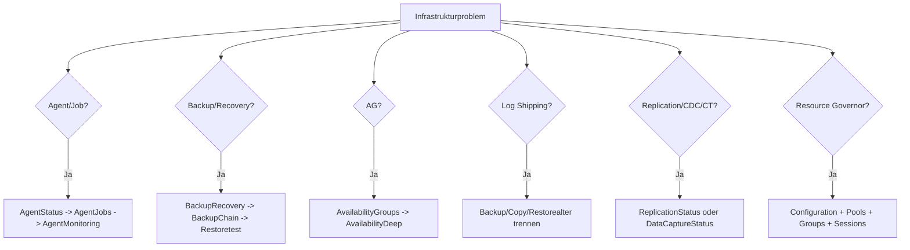

# Infrastruktur: Agent, Recovery, Hochverfügbarkeit und Datenerfassung

**Procedures:** 12  
**Evidenz:** Dienststatus, msdb-Historie, HADR-/Resource-Governor-DMVs und Featurekataloge  
**Kosten:** LOW bis HIGH_OPT_IN

## Grundregeln

- Alter, Queue und Lag sind nur relativ zu RPO, RTO, SLA und Betriebsfenster sinnvoll.
- msdb-Historie kann bereinigt, migriert oder unvollständig sein.
- Dienst-, Job- und HADR-Status sind Momentaufnahmen.
- Backupmetadaten beweisen keine Wiederherstellbarkeit; nur ein erfolgreicher Test-Restore tut dies.
- Keine Procedure führt Failover, Resume, Restore, Jobstart, Alertanlage oder Konfigurationsänderung aus.

---

## 1. [monitor].[USP_AgentStatus]

### Zweck

Liefert SQL-Server-Agent-Dienststatus und ein kleines Basisinventar.

### RAW-Spalten

| Spalte | Bedeutung |
|---|---|
| `ServiceName` | sichtbarer Agentdienst |
| `StartupTypeDesc` | Dienststarttyp |
| `StatusDesc` | aktueller Dienststatus |
| `ProcessId` | Prozess-ID, nur für aktuellen Lauf gültig |
| `LastStartupTime` | letzter Agentstart aus msdb-Sessions |
| `AgentSessionId` | jüngste Agent-Session-ID |
| `JobCount` | Jobs gesamt |
| `EnabledJobCount` | aktivierte Jobs |

### Interpretation

| Fall | Bewertung |
|---|---|
| Status `Running`, Startup Automatic | typischer Sollzustand |
| Service Running, aber `LastStartupTime=NULL` | msdb-Sicht/Berechtigung oder ungewöhnlicher Startkontext prüfen |
| Service Stopped | Agentjobs, Backups und Alerts können ausfallen; Betriebsmodell prüfen |
| `JobCount=0` | kann legitime Instanz ohne Agentworkload sein |
| `EnabledJobCount < JobCount` | deaktivierte Jobs sind nicht automatisch problematisch |

### Folgeanalyse

`USP_AgentJobs` und `USP_AgentMonitoringAnalysis`.

---

## 2. [monitor].[USP_AgentJobs]

### Zweck

Analysiert Jobdefinition, aktuellen Lauf, letzte Gesamtausführung, Schedules und letzte Stepausführung.

### Parameter und Framework-Schwelle

- `@LongRunningMinutes=60` markiert laufende Jobs ab 60 Minuten.
- `@NurProblematisch=1` zeigt Disabled, Last Failed, Long Running, No Schedule oder No Enabled Schedule.

Der Long-Running-Wert ist eine Sichtungsgrenze. Ein normaler DWH-Load kann länger dauern, während ein 10-minütiger OLTP-Job bereits kritisch sein kann.

### Jobs

| Spalte | Bedeutung |
|---|---|
| `JobId`, `JobName` | Jobidentität |
| `Enabled` | Job aktiviert |
| `OwnerName` | Owner; Berechtigung und Existenz prüfen |
| `CategoryName` | Agentkategorie |
| `IsRunning`, `RunStart`, `RunningMinutes` | aktueller Lauf |
| `LastRunDateTime`, `LastRunStatus`, `LastRunStatusDesc` | letzte Job-Gesamtausführung |
| `LastRunDurationSeconds` | Dauer des letzten Laufs |
| `LastMessage` | letzte Agentmeldung; Runtime kann interne Inhalte enthalten |
| `ScheduleCount`, `EnabledScheduleCount` | angehängte Schedules |
| `StepCount` | Jobsteps |
| `ProblemCode` | `DISABLED`, `LONG_RUNNING`, `LAST_FAILED`, `NO_SCHEDULE`, `NO_ENABLED_SCHEDULE` |

### Steps

`JobName`, `StepId`, `StepName`, `Subsystem`, `LastRunOutcome`, `LastRunOutcomeDesc`, `LastRunDateTime`, `LastRunDurationSeconds`, `LastRunRetries`, `LastRunMessage`.

### Beispiele

| Konstellation | Bewertung |
|---|---|
| enabled, kein Schedule | kann On-Demand-Job sein; nicht automatisch Fehler |
| letzter Lauf failed, Job seitdem erfolgreich manuell ausgeführt | aktuelle Historyreihenfolge prüfen |
| 180 Minuten laufend, historisch immer 240 Minuten | wahrscheinlich normaler Job, SLA prüfen |
| 20 Minuten laufend, historisch 2 Minuten | auffällige Abweichung trotz unter 60-Minuten-Schwelle |
| Job erfolgreich, Step hatte Retry | Stabilitätsproblem möglich |
| Owner nicht mehr gültig | Jobausführung kann scheitern, besonders nicht-T-SQL-Subsysteme |

### Folgeanalyse

`USP_AgentMonitoringAnalysis`, Jobhistory, betroffene Query-/Blockinganalyse.

---

## 3. [monitor].[USP_ResourceGovernorAnalysis]

### Zweck

Vergleicht gespeicherte und effektive Resource-Governor-Konfiguration, Pools, Workload Groups und optionale Sessions.

### Configuration

`ClassifierFunctionId`, `IsEnabled`, `ReconfigurationPending`, `ClassifierFunctionName`.

**Grenzfall:** `ReconfigurationPending=1` bedeutet, dass gespeicherte und aktive Konfiguration abweichen können.

### ResourcePools

| Gruppe | Spalten |
|---|---|
| Limits | `MinCpuPercent`, `MaxCpuPercent`, `MinMemoryPercent`, `MaxMemoryPercent`, `CapCpuPercent`, `MinIopsPerVolume`, `MaxIopsPerVolume` |
| Zeitraum | `StatisticsStartTime` |
| CPU/Memory | `TotalCpuUsageMs`, `CacheMemoryMb`, `UsedWorkspaceMemoryMb`, `TargetWorkspaceMemoryMb`, `MaxWorkspaceMemoryMb` |
| Druck | `OutOfMemoryCount`, `ActiveMemgrantCount`, `PendingMemgrantCount` |
| Relationen | `UsedOfTargetMemoryPercent`, `UsedOfMaxMemoryPercent` |

### WorkloadGroups

| Gruppe | Spalten |
|---|---|
| Identität | `GroupId`, `GroupName`, `PoolId`, `PoolName`, `Importance` |
| Grants | `RequestMaxMemoryGrantPercent`, `ConfiguredRequestMaxGrantMemoryMb`, `TargetRequestMaxGrantMemoryMb`, `HistoricalMaxRequestGrantMemoryMb`, `RequestMemoryGrantTimeoutSec` |
| CPU/DOP | `RequestMaxCpuTimeSec`, `MaxDop`, `EffectiveMaxDop` |
| Concurrency | `GroupMaxRequests`, `ActiveRequestCount`, `QueuedRequestCount`, `TotalQueuedRequestCount` |
| Historie | `TotalRequestCount`, `TotalReducedMemgrantCount`, `TotalCpuUsageMs`, `TotalLockWaitCount`, `TotalLockWaitTimeMs` |

### Sessions

`SessionId`, `LoginName`, `HostName`, `ProgramName`, `GroupId`, `GroupName`, `PoolName`, `Status`, `CpuTimeMs`, `MemoryUsagePages`, `MemoryUsageMb`, `Reads`, `Writes`, `LogicalReads`.

### Interpretation

- Konfiguriertes Grantlimit basiert auf Max Pool Memory; Targetlimit auf aktueller Target Memory; Historical Max ist beobachtete DMV-Evidenz.
- `PendingMemgrantCount>0` oder `QueuedRequestCount>0` ist relevanter als ein enges Limit allein.
- `OutOfMemoryCount` ist kumulativ seit `StatisticsStartTime`.
- `EffectiveMaxDop` kann von konfiguriertem `MaxDop` abweichen.
- Default-/Internal-Pools nicht wie benutzerdefinierte Pools interpretieren.
- Sessionzuordnung zeigt Classifier-Ergebnis, nicht zwingend die fachlich gewünschte Klassifizierung.

### Folgeanalyse

`USP_CurrentMemoryGrants`, `USP_CurrentRequests`, `USP_ServerMemory`.

---

## 4. [monitor].[USP_AvailabilityGroups]

### Zweck

Basisinventar für AG-Replikate, Datenbanken, Listener und Read-only Routing.

### Replicas

`AgName`, `ReplicaServerName`, `LocalReplica`, `RoleDesc`, `OperationalStateDesc`, `ConnectedStateDesc`, `RecoveryHealthDesc`, `SynchronizationHealthDesc`, `AvailabilityModeDesc`, `FailoverModeDesc`, `SessionTimeout`, `EndpointUrl`, `PrimaryRoleAllowConnectionsDesc`, `SecondaryRoleAllowConnectionsDesc`, `ReadOnlyRoutingUrl`.

### Databases

| Spalte | Bedeutung |
|---|---|
| `AgName`, `ReplicaServerName`, `DatabaseName`, `IsLocal`, `IsPrimaryReplica` | Scope |
| `SynchronizationStateDesc`, `SynchronizationHealthDesc`, `DatabaseStateDesc` | Zustand |
| `IsSuspended`, `SuspendReasonDesc` | Data Movement |
| `LogSendQueueKb`, `LogSendRateKbSec`, `EstimatedSendSeconds` | Sendqueue und momentane Rate |
| `RedoQueueKb`, `RedoRateKbSec`, `EstimatedRedoSeconds` | Redoqueues |
| `LastSentTime`, `LastReceivedTime`, `LastHardenedTime`, `LastRedoneTime` | Pipelinezeitpunkte |
| `SecondaryLagSeconds` | versions-/modusabhängige Lag-Evidenz |

### Listener

`AgName`, `ListenerDnsName`, `Port`, `IsConformant`, `IpAddress`, `IpSubnetMask`, `NetworkSubnetIp`, `NetworkSubnetPrefixLength`, `StateDesc`.

### Routing

`AgName`, `ReplicaServerName`, `RoutingPriority`, `ReadOnlyReplicaServerName`.

### Interpretation

- Queue ÷ aktuelle Rate ist nur eine grobe Schätzung; Rate kann 0 oder stark schwankend sein.
- Asynchrones Commit darf dauerhaft `SYNCHRONIZING` sein.
- Synchronous Commit erwartet je Ziel/SLA andere Healthbedingungen.
- Listenerzustand auf einem Node ist kein vollständiger Clientkonnektivitätstest.
- Routingliste beweist nicht, dass Anwendung mit `ApplicationIntent=ReadOnly` verbindet.

### Folgeanalyse

`USP_AvailabilityDeepAnalysis`, Performance Counter, Netzwerk-/Cluster-/Storageüberwachung.

---

## 5. [monitor].[USP_BackupRecovery]

### Zweck

Bewertet Backupfrische und zeigt Backup-/Restorehistorie.

### Framework-Schwellen

| Parameter | Default |
|---|---:|
| `@FullWarnHours` | 48 h |
| `@DiffWarnHours` | 24 h |
| `@LogWarnMinutes` | 30 min |

Diese Defaults sind keine universellen RPOs.

### Freshness

`DatabaseName`, `StateDesc`, `RecoveryModelDesc`, `LastFullFinish`, `FullAgeMinutes`, `LastDiffFinish`, `DiffAgeMinutes`, `LastLogFinish`, `LogAgeMinutes`, `LastCopyOnlyFullFinish`, `BackupStatus`.

`BackupStatus`:

- `TEMPDB_NO_BACKUP`
- `NO_FULL_BACKUP`
- `FULL_TOO_OLD`
- `NO_LOG_BACKUP`
- `LOG_TOO_OLD`
- `DIFF_OLD_INFORMATIONAL`
- `OK`

### Backups

`DatabaseName`, `BackupType`, `BackupTypeDesc`, `BackupStartDate`, `BackupFinishDate`, `DurationSeconds`, `BackupSizeMb`, `CompressedSizeMb`, `IsCopyOnly`, `IsSnapshot`, `HasBackupChecksums`, `IsDamaged`, `MediaPath`.

### Restores

`DestinationDatabaseName`, `RestoreDate`, `UserName`, `RestoreType`, `Replace`, `Recovery`, `Restart`, `SourceDatabaseName`, `BackupFinishDate`.

### Interpretation

- `OK` bedeutet nur, dass msdb-Zeitpunkte den Schwellen entsprechen.
- Copy-only Full ist keine normale Differentialbasis.
- `IsDamaged=1` ist hoch relevant.
- Backup Checksum verbessert Evidenz, beweist aber keine erfolgreiche Wiederherstellung.
- Restorehistory kann einen Restore auf derselben DB zeigen, nicht zwingend einen isolierten Recoverytest.
- `MediaPath` ist schutzbedürftige Laufzeitinformation und darf nur im erforderlichen Umfang exportiert oder weitergegeben werden.

### Folgeanalyse

`USP_BackupChainAnalysis`, `USP_DatabaseIntegrityAnalysis`, echter Restore-Test.

---

## 6. [monitor].[USP_LogShippingStatus]

### Zweck

Zeigt Primary-Backup- und Secondary-Copy-/Restorezustand.

### Primary

`PrimaryServer`, `PrimaryDatabase`, `BackupDirectory`, `BackupShare`, `BackupRetentionPeriod`, `BackupThreshold`, `ThresholdAlertEnabled`, `LastBackupFile`, `LastBackupDate`, `BackupAgeMinutes`, `LastBackupDateUtc`, `HistoryRetentionPeriod`.

### Secondary

`SecondaryServer`, `SecondaryDatabase`, `PrimaryServer`, `PrimaryDatabase`, `RestoreDelay`, `RestoreThreshold`, `ThresholdAlertEnabled`, `LastCopiedFile`, `LastCopiedDate`, `CopyAgeMinutes`, `LastRestoredFile`, `LastRestoredDate`, `RestoreAgeMinutes`, `LastRestoredLatency`, `RestoreMode`, `DisconnectUsers`.

### Interpretation

- `BackupAgeMinutes` gegen `BackupThreshold` und RPO lesen.
- `CopyAgeMinutes` hoch, BackupAge normal: Transport-/Shareproblem möglich.
- Copy normal, RestoreAge hoch: Restorejob, RestoreDelay oder Secondaryproblem.
- Konfigurierter `RestoreDelay` kann absichtlich hohes Restorealter erzeugen.
- `ThresholdAlertEnabled=0` bedeutet nicht zwingend unüberwacht; externes Monitoring prüfen.
- Last file/date können Monitorhistory und nicht realen Dateibestand widerspiegeln.

---

## 7. [monitor].[USP_ReplicationStatus]

### Zweck

Inventarisiert sichtbare Replikationsrollen. Distributiondetails sind opt-in und gruppengeschützt.

### Databases

`DatabaseName`, `IsPublished`, `IsSubscribed`, `IsMergePublished`, `IsDistributor`.

### Publications

`PublicationId`, `PublisherDatabase`, `PublicationName`, `PublicationType`, `ImmediateSync`, `AllowPush`, `AllowPull`, `Status`.

### Subscriptions

`PublisherDatabase`, `PublicationName`, `SubscriberName`, `SubscriberDatabase`, `SubscriptionType`, `Status`, `AgentId`, `LastAction`, `LastTimestamp`.

### Errors

`ErrorId`, `ErrorTime`, `SourceName`, `ErrorCode`, `ErrorText`.

### Interpretation

- Basisrollen ohne Distributiondetails sagen wenig über Latenz oder Agentgesundheit.
- `LastAction` ist Freitext aus Distributionhistory; fachlich prüfen und nicht ungeprüft persistieren.
- Alte Errorzeilen können behoben sein; Zeit und Wiederholung beachten.
- Keine online sichtbare Distribution-DB kann Feature nicht vorhanden, remote Distributor oder fehlende Sicht bedeuten.
- Statuscodes sind replizierungsspezifische numerische Codes; mit Microsoftdokumentation interpretieren.

---

## 8. [monitor].[USP_DataCaptureStatus]

### Zweck

Inventarisiert CDC und Change Tracking über ausgewählte Datenbanken sowie CDC-Agentjobs.

### Besonderheit

Der Procedureheader hat `@DatabaseNames=N''`; die dokumentierte Semantik behandelt `N''` jedoch als ungültig. Daher explizite Liste, Pattern oder `NULL` verwenden und Statusresultset prüfen.

### Databases

`DatabaseName`, `StateDesc`, `IsCdcEnabled`, `IsChangeTrackingEnabled`, `RetentionPeriod`, `RetentionPeriodUnitsDesc`, `IsAutoCleanupOn`, `CurrentCtVersion`, `StatusCode`, `ErrorMessage`.

### CDC Tables

`DatabaseName`, `CaptureInstance`, `SourceSchema`, `SourceTable`, `ObjectId`, `StartLsn`, `SupportsNetChanges`, `RoleName`, `IndexName`, `CreateDate`, `PartitionSwitch`.

### Change Tracking Tables

`DatabaseName`, `SchemaName`, `TableName`, `ObjectId`, `IsTrackColumnsUpdatedOn`, `BeginVersion`, `CleanupVersion`, `MinValidVersion`.

### CDC Jobs

`DatabaseName`, `JobType`, `JobName`, `Enabled`, `LastRunOutcome`, `LastRunDateTime`, `LastMessage`.

### Interpretation

- CT-Consumer mit Synchronisationsversion kleiner als `MinValidVersion` muss reinitialisieren.
- Retention muss maximale Consumer-Ausfallzeit abdecken.
- Auto Cleanup OFF kann Wachstum verursachen, kann aber absichtliche externe Steuerung sein.
- CDC-DB enabled ohne Capture Instances ist möglich.
- Capture/Cleanup-Job deaktiviert ist bei Always On oder speziellen Betriebsmodellen kontextabhängig.
- `SupportsNetChanges=1` benötigt geeigneten eindeutigen Index und beeinflusst Nutzungsmöglichkeiten.

### Folgeanalyse

AgentJobs, Log-/Kapazitätsanalyse und Consumerzustand außerhalb des Frameworks.

---

## 9. [monitor].[USP_BackupChainAnalysis]

### Zweck

Prüft Full-/Differentialbasis, Log-LSN-Übergänge, Recovery Forks, Damage-/Checksumflags und Restoreevidenz innerhalb eines Historienfensters. Medienpfade und Benutzernamen werden bewusst nicht gelesen.

### Backupdetails

| Spalte | Bedeutung |
|---|---|
| `BackupSetId`, `BackupType`, `BackupTypeDesc`, Start/Finish | Backupidentität und Zeit |
| `FirstLsn`, `LastLsn`, `CheckpointLsn`, `DatabaseBackupLsn`, `DifferentialBaseLsn` | Kettenevidenz |
| `FirstRecoveryForkGuid`, `LastRecoveryForkGuid` | Recovery-Fork-Kontext |
| `IsCopyOnly`, `HasBackupChecksums`, `IsDamaged`, `IsEncrypted` | Backupmerkmale |
| `PreviousLogLastLsn`, `LogGapDetected` | vom Code berechneter Logübergang |

### Summary

`DatabaseId`, `DatabaseName`, `RecoveryModelDesc`, `LatestFullFinish`, `LatestMatchingDifferentialFinish`, `LatestLogFinish`, `LogBackupCountInWindow`, `LogGapCountInWindow`, `RecoveryForkTransitionCount`, `DamagedBackupCount`, `BackupWithoutChecksumCount`, `LatestRestoreDate`, `FindingCode`, `FindingSeverity`, `EvidenceLimit`.

### Grenzen

- `HistoryDays=35` kann ältere, noch nötige Basisinformationen ausschließen; der letzte non-copy-only Full wird zusätzlich einbezogen.
- LSN-Lücke aus msdb kann Cleanup oder extern erzeugte Backups widerspiegeln.
- Forktransition kann legitimen Restore-/Recoveryverlauf darstellen.
- `LatestRestoreDate` ist nur lokaler msdb-Beleg.
- Nur vollständiger Test-Restore beweist Recoveryfähigkeit.

### Beispiele

| Befund | Bewertung |
|---|---|
| Matching Full + Diff + fortlaufende Logs | gute Metadatenevidenz, kein Restorebeweis |
| `LogGapCountInWindow>0` | sofort Medienbestand und Restoresequenz verifizieren |
| `DamagedBackupCount>0` | hoch kritisch |
| kein Restorebeleg | nicht automatisch schlecht, aber Recoverytest-Policy prüfen |
| Forktransition nach geplantem Point-in-Time-Restore | erwartbar, neue Kette klar identifizieren |

---

## 10. [monitor].[USP_AvailabilityDeepAnalysis]

### Zweck

Erweitert AG um Clusterquorum, Clusterknoten/-netzwerke, Replikabefunde, Datenbankqueues, Seeding und Auto Page Repair.

### Framework-Schwellen

- `@QueueWarnMb=1024`
- `@SecondaryLagWarnSeconds=60`

Sichtungsgrenzen, keine universellen SLOs.

### Resultsets

| Resultset | Schlüsselspalten |
|---|---|
| Cluster | `ClusterName`, `QuorumTypeDesc`, `QuorumStateDesc`, `FindingCode` |
| Members | `MemberName`, `MemberTypeDesc`, `MemberStateDesc`, `NumberOfQuorumVotes` |
| Networks | `MemberName`, `NetworkSubnetIp`, `NetworkSubnetPrefixLength`, `IsPublic`, `IsIpv4` |
| Replicas | AG/Server, Rolle, Operational/Connected/Health, Availability-/Failover-/Seedingmode, `FindingCode` |
| Databases | AG/Replica/DB, Synchronisierung, Suspension, Send-/Redoqueue, Lag, LastCommit, `FindingCode`, `FindingSeverity` |
| Seeding | Remote Machine, Rolle, DB, Zustand, FailureCode, Transfer-/DB-Größe, Rate, Start/End |
| PageRepair | DB/File/Page, ErrorType, PageStatus, ModificationTime, `FindingCode` |

### Interpretation

- Quorumabweichung ist Clusterkontext; kein automatischer Failoverauftrag.
- `DISCONNECTED`, `NOT_HEALTHY`, `NOT_SYNCHRONIZING` oder suspended sind hohe Priorität.
- Queuegröße allein ist volumenabhängig; Lag/Raten und Trend ergänzen.
- Seeding-Rate 0 kann Pause, Fehler oder momentane Messung bedeuten.
- Page Repair `SUCCEEDED` ist weiterhin Integritätsevidenz und Anlass für CHECKDB-/Storageprüfung.
- Netzwerkkatalog zeigt Topologie, nicht Paketverlust, Latenz oder Firewallpfad.

---

## 11. [monitor].[USP_AgentMonitoringAnalysis]

### Zweck

Bewertet Agentservice, Standardalarmabdeckung, Alert-Routing, Operatorstatus, Jobzustand und aggregierten Database-Mail-Status. Es liest keine Mailadressen, Empfänger, Betreffzeilen, Jobstepbefehle oder Meldungstexte als Findings.

### Services

`ServiceName`, `StatusDesc`, `StartupTypeDesc`, `LastStartupTime`, `FindingCode`.

### Findings

`Category`, `FindingCode`, `Severity`, `ScopeType`, `ScopeName`, `MetricValue`, `Evidence`, `EvidenceLimit`.

Wichtige Codes:

- `REQUIRED_AGENT_ALERT_MISSING` für 823, 824, 825 sowie Severity 19–25,
- `ENABLED_ALERT_WITHOUT_ACTION`,
- `ALERT_TARGET_OPERATOR_DISABLED`,
- `ALERT_OCCURRED_IN_WINDOW`,
- job- und mailbezogene Befunde.

### Jobs

`JobId`, `JobName`, `IsEnabled`, `LatestRunDateTime`, `LatestRunStatus`, `LatestRunDuration`, `ScheduleCount`, `EnabledScheduleCount`, `FindingCode`.

### Mail

`SentStatus`, `ItemCount`, `OldestRequestDate`, `NewestRequestDate` im gewählten Historienfenster.

### Interpretation

- Fehlender SQL-Agent-Alert kann durch externes Monitoring kompensiert sein.
- Aktivierter Alert ohne Operator/Job ist meist nicht handlungsfähig.
- Operator disabled ist nur dann kritisch, wenn kein alternativer Kanal existiert.
- `occurrence_count` kann kumulativ sein; letzter Zeitpunkt ist wichtiger.
- Failed Mail kann Folge eines bereits bekannten Infrastrukturfehlers sein.
- On-Demand-Job ohne Schedule ist normal möglich.

---

## 12. [monitor].[USP_InfrastructureAnalysis]

### Zweck

Orchestriert alle elf Infrastrukturmodule. Basisfunktionen sind standardmäßig aktiv; Backup Chain, Availability Deep und Agent Monitoring sind opt-in.

### Modulreihenfolge

1. AgentStatus
2. AgentJobs
3. ResourceGovernorAnalysis
4. AvailabilityGroups
5. BackupRecovery
6. LogShippingStatus
7. ReplicationStatus
8. DataCaptureStatus
9. BackupChainAnalysis, opt-in
10. AvailabilityDeepAnalysis, opt-in
11. AgentMonitoringAnalysis, opt-in

### Resultsets

- Childresultsets in Reihenfolge.
- `ModuleStatus(ModuleName, StatusCode, ErrorNumber, ErrorMessage)`.
- JSON mit benannten Modulobjekten.

### Grenzen

- `EXECUTED` bei älteren Children bedeutet nur, dass kein äußerer CATCH ausgelöst wurde; Child-Meta lesen.
- Neuere Deep-Children geben ihre eigenen Statuscodes an den Wrapper zurück.
- Ein `@MaxZeilen` gilt je Modul.
- Der Default ist breit und für häufiges Polling ungeeignet.
- `@MitReplicationDetails=1` und Deep-Module können zusätzliche Gates und Cross-Database-Zugriffe auslösen.

### Anfänger-Entscheidungsbaum

## Quellen

- [SQL Server Agent](https://learn.microsoft.com/sql/ssms/agent/sql-server-agent)
- [Resource Governor](https://learn.microsoft.com/sql/relational-databases/resource-governor/resource-governor)
- [Monitor Availability Groups](https://learn.microsoft.com/sql/database-engine/availability-groups/windows/monitor-availability-groups-transact-sql)
- [Backup and restore](https://learn.microsoft.com/sql/relational-databases/backup-restore/back-up-and-restore-of-sql-server-databases)
- [Backup history and header information](https://learn.microsoft.com/sql/relational-databases/backup-restore/backup-history-and-header-information-sql-server)
- [Log shipping tables](https://learn.microsoft.com/sql/database-engine/log-shipping/log-shipping-tables-and-stored-procedures)
- [Replication monitoring](https://learn.microsoft.com/sql/relational-databases/replication/monitor/monitoring-replication)
- [Change Data Capture](https://learn.microsoft.com/sql/relational-databases/track-changes/about-change-data-capture-sql-server)
- [Change Tracking](https://learn.microsoft.com/sql/relational-databases/track-changes/about-change-tracking-sql-server)

---

## 13. [monitor].[USP_MaintenanceOperations]

### Zweck

Korrelierte read-only Sicht auf vier getrennte Evidenzbereiche: resumierbare Indexoperationen je gewählter Datenbank, laufende technische Wartungsrequests, ADR/PVS-Momentaufnahmen sowie ausschließlich explizit nach Namen oder Pattern ausgewählte Agent-Jobs.

### Leserichtung

1. `SourceStatus` prüfen. Auf SQL Server 2019 ist der ausführliche PVS-Vertrag bewusst `UNAVAILABLE_VERSION`; der ADR-Konfigurationskontext bleibt erhalten.
2. Pausierte resumierbare Operationen nach Pausenzeit und Fortschritt priorisieren. Eine Pause kann geplant sein.
3. Requests nur bei sichtbarer Blockierung zusammen mit Waitdauer und Fortschritt bewerten. Engine-Restzeitschätzungen sind unverbindlich.
4. PVS-Größe und Anzahl abgebrochener Transaktionen sind Schwellwertbeobachtungen, keine Bereinigungsdiagnose aus einem Einzelwert.
5. Jobdaten erscheinen nur, wenn `@JobNames` oder `@JobNamePattern` gesetzt wurde. Ohne Filter wird die Quelle nicht gelesen.

### Sicherheits- und Datenschutzgrenze

Das Modul liest keine SQL-Texte oder Handles, Jobschritte, Jobbefehle, Meldungen, Owner, Logins, Clients oder Wait-Ressourcen. Es führt weder `RESUME`, `ABORT`, `KILL`, Cleanup, Jobstart noch Jobstop aus. Laufzeitnamen dürfen im interaktiven Resultset erscheinen und sind bei Export oder Weitergabe zu schützen.

### Primärquellen

- [sys.index_resumable_operations](https://learn.microsoft.com/en-us/sql/relational-databases/system-catalog-views/sys-index-resumable-operations)
- [sys.dm_exec_requests](https://learn.microsoft.com/en-us/sql/relational-databases/system-dynamic-management-views/sys-dm-exec-requests-transact-sql)
- [ADR verwalten](https://learn.microsoft.com/en-us/sql/relational-databases/accelerated-database-recovery-management)
- [sys.dm_tran_persistent_version_store_stats](https://learn.microsoft.com/en-us/sql/relational-databases/system-dynamic-management-views/sys-dm-tran-persistent-version-store-stats?view=sql-server-ver17)
- [sys.dm_hadr_auto_page_repair](https://learn.microsoft.com/en-us/sql/relational-databases/system-dynamic-management-objects/sys-dm-hadr-auto-page-repair-transact-sql?view=sql-server-ver17)

---

## 14. [monitor].[USP_ErrorLogAnalysis]

### Zweck

Liest SQL-Server- und optional Agent-Errorlogs über die dokumentierten
`sp_readerrorlog`-Filter. Der Standard liefert nur Kategorien, Häufigkeiten und
serverlokale Zeitgrenzen des aktuellen SQL-Server-Logs. Meldungstext, Agent und
ältere Archive sind opt-in.

### Leserichtung

1. `moduleStatus` und `sourceStatus` auf Rechte, Archive und Quelllimit prüfen.
2. `summary` nach Kategorie sowie erstem und letztem Zeitpunkt lesen.
3. `details` nur gezielt aktivieren; Kürzungsmetriken mit auswerten.
4. Treffer immer mit einer unabhängigen Engine-, OS-, Storage- oder
   Workloadquelle korrelieren.

### Grenzen

`sp_readerrorlog` besitzt keinen dokumentierten Zeitparameter. Keywordfilter
wirken in der Systemprocedure, die Zeitgrenze wirkt anschließend. Rotation,
Lokalisierung und fehlende Rechte begrenzen Negativaussagen. Das Modul wechselt
oder löscht kein Log und persistiert keinen Meldungstext.

### Primärquelle

- [sp_readerrorlog](https://learn.microsoft.com/en-us/sql/relational-databases/system-stored-procedures/sp-readerrorlog-transact-sql?view=sql-server-ver17)
