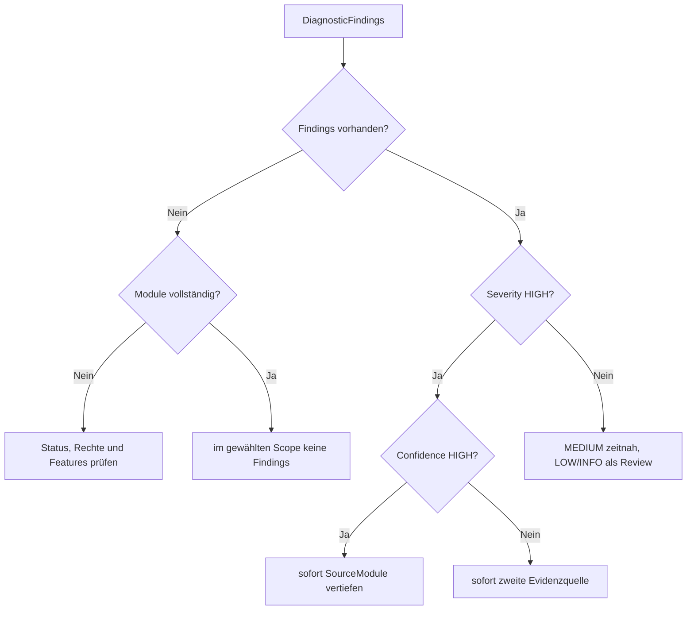

# Server Health: CPU, NUMA, Memory, Integrität und Engine-Evidenz

**Procedures:** 17  
**Evidenz:** Momentaufnahme, Konfiguration, kumulative SQLOS-DMVs, kurze Stichprobe, msdb-Historie und vorhandene XE-Dateien  
**Kosten:** LOW bis HIGH_OPT_IN

## Grundregeln

- Hohe SQL-Server-Speichernutzung ist im Steady State häufig erwartbar; SQL Server nutzt freien Speicher als Cache. Entscheidend sind Pressure-Signale, OS-Reserve, Clerk-/Grantkontext und Verlauf.
- Scheduler-, NUMA-, Latch-, Spinlock- und Performance-Counterwerte sind ohne Vergleichsfenster oder Baseline leicht irreführend.
- Keine negative Integritätsevidenz ist kein Integritätsbeweis.
- Konfigurationsfindings sind Review-Hinweise, keine automatischen Änderungsempfehlungen.
- Server-, Dienst-, Registry-, Dateipfad-, Login- und Meldungswerte dürfen aus Runtimegründen real erscheinen, werden aber niemals in Repositorybeispiele kopiert.

---

## 1. [monitor].[USP_ServerCpuTopology]

### Zweck

Zeigt CPU-/Socket-/Core-/Scheduler-/NUMA-Topologie und die momentane Schedulerlast.

### Resultsets

1. Modulstatus.
2. `cpuTopology`.
3. `schedulers`.
4. `numaNodes`.

### CPU-Topologie

| Spalte | Bedeutung |
|---|---|
| `cpu_count` | logische CPUs, die SQL Server erkennt |
| `scheduler_count` | Schedulerzahl |
| `hyperthread_ratio` | logische CPUs pro physischem Core gemäß Engineinformation |
| `socket_count` | erkannte Sockets |
| `cores_per_socket` | physische Cores je Socket |
| `numa_node_count` | erkannte NUMA-Nodes |
| `softnuma_configuration_desc` | Soft-NUMA-Konfiguration |
| `sqlserver_start_time` | Reset-/Uptime-Kontext vieler DMVs |
| `affinity_type_desc` | CPU-Affinitätsmodus |

### Scheduler

`parent_node_id`, `status`, `SchedulerCount`, `VisibleOnlineSchedulers`, `OnlineSchedulers`, `CurrentTasks`, `RunnableTasks`, `ActiveWorkers`, `LoadFactor`, `Finding`.

### NUMA-Nodes

`node_id`, `node_state_desc`, `memory_node_id`, `online_scheduler_count`, `idle_scheduler_count`, `active_worker_count`, `avg_load_balance`.

### Interpretation

| Konstellation | Bewertung |
|---|---|
| `RunnableTasks=0` | nur diese Momentaufnahme unauffällig |
| einzelne runnable Tasks in kurzer Stichprobe | nicht automatisch CPU-Druck |
| Runnable Tasks wiederholt auf mehreren Schedulern | CPU-/Worker-/Querylast vertiefen |
| Node ohne sichtbare Online-Scheduler | Affinity, Nodezustand oder spezielle Nodeart prüfen |
| `cpu_count` kleiner als erwartete Hardware | Lizenzierung, VM-Zuordnung, Affinity und Edition prüfen |
| hohe ActiveWorkers ohne Runnable Queue | aktive Last, aber nicht zwingend CPU-Stau |

### Folgeanalyse

`USP_ServerNuma`, `USP_CurrentRequests`, `USP_CurrentWaits`, `USP_PerformanceCounters` und OS-/Hypervisor-Monitoring.

### Kosten

LOW. Momentaufnahme; keine Rate und keine CPU-Auslastungsprozentmessung.

---

## 2. [monitor].[USP_ServerNuma]

### Zweck

Verdichtet NUMA-/Soft-NUMA-Verteilung, Scheduler-Skew und SQL-Memory-Nodes.

### NUMA-Spalten

`node_id`, `node_state_desc`, `memory_node_id`, `online_scheduler_count`, `idle_scheduler_count`, `active_worker_count`, `avg_load_balance`, `SchedulerCount`, `VisibleOnline`, `CurrentTasks`, `RunnableTasks`, `ActiveWorkers`, `LoadFactor`, `RunnablePerScheduler`, `Finding`.

### Memory Nodes

`memory_node_id`, `virtual_address_space_reserved_kb`, `virtual_address_space_committed_kb`, `locked_page_allocations_kb`, `pages_kb`, `shared_memory_reserved_kb`, `shared_memory_committed_kb`.

### Interpretation

- `RunnablePerScheduler` ist ein Snapshotquotient, kein historischer Mittelwert.
- Unterschiede zwischen Nodes können aus Workloadlokalität, Connectionverteilung, Affinity oder Momentaufnahme entstehen.
- CPU-Nodes und Memory-Nodes sind verwandt, aber nicht zwingend identisch.
- `locked_page_allocations_kb` zeigt tatsächlich gesperrte Seiten, nicht nur die Vergabe des LPIM-Rechts.
- VAS reserved ist keine physisch belegte RAM-Menge.
- Ein einzelner heißer Node rechtfertigt keine Affinityänderung ohne Trend- und Plananalyse.

### Plakatives Beispiel

| Node | VisibleOnline | RunnableTasks | RunnablePerScheduler | Bewertung |
|---:|---:|---:|---:|---|
| 0 | 8 | 0 | 0 | aktuell unauffällig |
| 1 | 8 | 24 | 3 | auffällig, wenn über mehrere Samples reproduzierbar |
| 2 | 0 | 0 | `NULL` | Nodezustand/Affinity prüfen, nicht dividieren |

### Folgeanalyse

CPU-Topologie, aktive Requests nach Scheduler, Server Memory und Hypervisor-/NUMA-Konfiguration.

---

## 3. [monitor].[USP_ServerMemory]

### Zweck

Korreliert OS-, Prozess- und SQL-Memory-Manager-Zustand, größte Memory Clerks und Query Grants.

### Summary

| Spalte | Bedeutung |
|---|---|
| `total_physical_memory_kb`, `available_physical_memory_kb`, `system_memory_state_desc` | Betriebssystemzustand |
| `physical_memory_in_use_kb` | SQL-Prozessspeicher |
| `locked_page_allocations_kb`, `large_page_allocations_kb` | spezielle Prozessallokationen |
| `process_physical_memory_low`, `process_virtual_memory_low` | Engine-Pressureflags |
| `committed_kb`, `committed_target_kb`, `visible_target_kb` | SQL Memory Manager |
| `sql_memory_model_desc` | Speichermodell |
| `min_server_memory_mb`, `max_server_memory_mb` | aktive Konfiguration |
| `LPIMAssessment` | Laufzeitevidenz, keine Rechteprüfung |
| `MemoryFinding` | codebasierter Snapshotbefund |

### Memory Clerks

`type`, `pages_kb`, `virtual_memory_committed_kb`, `awe_allocated_kb`, `shared_memory_committed_kb`.

### Grants

`ActiveOrWaitingGrants`, `RequestedMemoryKb`, `GrantedMemoryKb`, `UsedMemoryKb`, `WaitingGrantCount`.

### Repository-Heuristiken

- weniger als 1.048.576 KB verfügbarer OS-Speicher → `LOW_OS_FREE_MEMORY_REVIEW`;
- `committed_target_kb < committed_kb` → `TARGET_BELOW_COMMITTED`.

Diese Regeln sind Sichtungshilfen. Auf einem kleinen Server ist 1 GB anders zu bewerten als auf einem Server mit mehreren TB RAM.

### Interpretation

| Fall | Bewertung |
|---|---|
| SQL nutzt fast `max server memory`, OS stabil | oft normaler Cache-Steady-State |
| `process_physical_memory_low=1` | starkes Pressure-Signal |
| `committed_target < committed` | SQL versucht Speicher zurückzugeben; Verlauf prüfen |
| `WaitingGrantCount>0` | Query-Execution-Memory-Druck möglich |
| ein Clerk dominiert | Clerktyp und Betriebsfunktion prüfen; Größe allein ist kein Leakbeweis |
| LPIMAssessment nicht bestätigt | beweist weder fehlendes Benutzerrecht noch Fehlkonfiguration |

### Folgeanalyse

`USP_BufferPoolAnalysis`, `USP_CurrentMemoryGrants`, `USP_ResourceGovernorAnalysis`, OS- und Prozessmonitoring.

---

## 4. [monitor].[USP_TempDBConfiguration]

### Zweck

Inventarisiert TempDB-Dateien, Größe, Growth und ausgewählte Instanzkonfigurationen.

### Files

`file_id`, `name`, `type_desc`, `physical_name`, `SizeMb`, `GrowthValue`, `GrowthType`, `max_size`, `is_percent_growth`.

### Configuration

`name`, `value_in_use` für verfügbare Einstellungen wie:

- `tempdb metadata memory-optimized`,
- `tempdb deferred drop`,
- `mixed page allocation`.

### Interpretation

- Mehrere gleich große Datafiles sind häufig sinnvoll, aber Anzahl nicht blind an CPU-Zahl koppeln.
- Ungleiche Dateigrößen können proportional-fill-Skew erzeugen.
- Prozentwachstum wird mit zunehmender Datei immer größer.
- `max_size` ist in Seiten/Engine-Sonderwerten gespeichert; die Procedure gibt den Rohwert aus.
- Logfile und Datafiles haben unterschiedliche Rollen; nur Datafiles „gleichziehen“.
- Memory-optimized TempDB metadata hilft bei bestimmten Metadatencontention-Szenarien, ist keine universelle Pflicht.

### Beispiele

| Konfiguration | Bewertung |
|---|---|
| 8 gleich große Datafiles, gleiches fixes Growth | plausibler Ausgangspunkt |
| 8 Files, eines 10× größer | Allocation-Skew möglich |
| 10-%-Growth bei 2-TB-Datei | nächster Growth 200 GB; klarer Reviewfall |
| 32 Files auf kleiner OLTP-Instanz ohne Contention | möglicherweise unnötige Komplexität |

### Folgeanalyse

`USP_CurrentTempDB`, `USP_InternalContentionAnalysis`, Datei-/Volume-Kapazität.

---

## 5. [monitor].[USP_ServerConfiguration]

### Zweck

Zeigt konfigurierte und laufende Serverwerte und kennzeichnet einige kontextabhängige Reviewfälle.

### Spalten

`configuration_id`, `name`, `minimum`, `maximum`, `ConfiguredValue`, `RunningValue`, `is_dynamic`, `is_advanced`, `Finding`, `Interpretation`.

### Codes

| Finding | Bedeutung |
|---|---|
| `RECONFIGURE_OR_RESTART_PENDING` | gespeicherter und aktiver Wert weichen ab |
| `LOW_DEFAULT_REVIEW` | Cost Threshold ≤ 5 |
| `UNBOUNDED_MEMORY_REVIEW` | Max Server Memory praktisch unbeschränkt |
| `SECURITY_REVIEW` | `xp_cmdshell` oder OLE Automation aktiv |
| `OK_OR_CONTEXT_DEPENDENT` | keine codebasierte Auffälligkeit, aber weiterhin kontextabhängig |

### Interpretation

- MAXDOP 0 ist kein automatischer Fehler; NUMA, SQL-Version, Querytyp und Workload bestimmen den passenden Wert.
- Cost Threshold 5 ist Default und oft nur ein Startpunkt, aber Änderungen benötigen belastbare Parallelitäts-/CPU-Evidenz.
- Unbeschränktes Max Memory kann auf dedizierten kleinen Instanzen funktionieren, lässt aber keine explizite OS-/Nebenprozessreserve.
- `ConfiguredValue <> RunningValue` kann Reconfigure oder Neustart verlangen.
- Aktiviertes `xp_cmdshell` kann eine begründete, kontrollierte Abhängigkeit sein; Exposure und Rechte prüfen.

### Folgeanalyse

CPU/NUMA, Memory, Security Configuration und konkrete Workload-DMVs.

---

## 6. [monitor].[USP_TraceFlags]

### Zweck

Liest alle aktuell aktiven globalen und sessionbezogenen Trace Flags über `DBCC TRACESTATUS(-1)`.

### Spalten

`TraceFlag`, `Status`, `GlobalFlag`, `SessionFlag`.

### Interpretation

- `GlobalFlag=1` wirkt instanzweit.
- `SessionFlag=1` kann nur für die aufrufende Session gelten.
- Ein aktives Flag ist nicht automatisch schädlich; SQL-Version, CU, dokumentierter Zweck und Gültigkeit prüfen.
- Viele historische Trace Flags sind in neueren Versionen Defaultverhalten, wirkungslos oder nicht mehr empfohlen.
- Runtimeflag kann durch Startupparameter, DBCC TRACEON oder internes Verhalten gesetzt sein.

### Folgeanalyse

`USP_StartupParameters`, Microsoft-Dokumentation der konkreten Flagnummer und Change-Historie.

---

## 7. [monitor].[USP_StartupParameters]

### Zweck

Liest auf unterstützten Plattformen Registry-basierte SQL-Dienst- und Startparameter.

### Spalten

`registry_key`, `value_name`, `value_data`, `ParameterType` mit `TRACE_FLAG`, `MASTER_DATA_PATH`, `MASTER_LOG_PATH`, `ERRORLOG_PATH` oder `OTHER`.

### Grenzen

- `sys.dm_server_registry` ist plattform-/versionsabhängig; auf Linux wird `UNAVAILABLE_PLATFORM` erwartet.
- Registrywerte sind Konfiguration, nicht zwingend vollständig der aktuell wirksame Prozesszustand.
- `ImagePath` und `ObjectName` können sensible Umgebungswerte enthalten und dürfen nicht in Repositoryartefakte kopiert werden.
- Traceflag-Startupwerte mit `USP_TraceFlags` gegen aktiven Zustand vergleichen.

### Folgeanalyse

Trace Flags, OSInformation und Dienstverwaltung außerhalb SQL Server.

---

## 8. [monitor].[USP_OSInformation]

### Zweck

Liest vier Quellen unabhängig, sodass ein Fehler nicht alle anderen Resultsets verhindert.

### SourceStatus

`SourceName`, `StatusCode`, `ErrorNumber`, `ErrorMessage`.

### Host

`host_platform`, `host_distribution`, `host_release`, `host_service_pack_level`, `host_sku`, `os_language_version`.

### SystemMemory

`total_physical_memory_kb`, `available_physical_memory_kb`, `total_page_file_kb`, `available_page_file_kb`, `system_memory_state_desc`.

### ProcessMemory

`physical_memory_in_use_kb`, `locked_page_allocations_kb`, `large_page_allocations_kb`, `process_physical_memory_low`, `process_virtual_memory_low`.

### Services

`servicename`, `startup_type_desc`, `status_desc`, `process_id`, `last_startup_time`, `service_account`, `instant_file_initialization_enabled`.

### Interpretation

- SourceStatus je Teilquelle lesen; `PARTIAL` kann trotzdem wertvolle Daten enthalten.
- Pagefile-Freiraum ist kein Ersatz für physische RAM-Beurteilung.
- Service Account ist Runtimeidentität und repositorysensitiv.
- Instant File Initialization beschleunigt Datafile-Growth/Restore, nicht Logfile-Growth.
- SQL-Prozessspeicher kann wegen Allokationen außerhalb des durch Max Server Memory gesteuerten Bereichs höher erscheinen.

---

## 9. [monitor].[USP_ServerSecurityConfiguration]

### Zweck

Korreliert sicherheitsrelevante Serverkonfiguration, Dienstkonten/IFI und Servereigenschaften.

### Resultsets

1. Modulstatus.
2. SourceStatus.
3. Configuration.
4. Services.
5. Properties.

### Configuration

`ConfigurationName`, `ConfiguredValue`, `RunningValue`, `Finding`.

Findings:

- `XPCMDSHELL_ENABLED`
- `OLE_AUTOMATION_ENABLED`
- `CLR_STRICT_SECURITY_OFF`
- `EXTERNAL_SCRIPTS_ENABLED`
- `OK_OR_CONTEXT_DEPENDENT`

### Services

`ServiceName`, `ServiceAccount`, `StartupTypeDescription`, `StatusDescription`, `InstantFileInitializationEnabled`, `InstantFileInitializationFinding`.

### Properties

`MachineName`, `ServerName`, `Edition`, `IsWindowsAuthenticationOnly`, `CallerIsSysadmin`.

### Interpretation

- „Enabled“ ist ein Exposure-Hinweis, keine Schwachstellenbestätigung.
- tatsächliche Berechtigung, Proxy-/Credentialmodell, Signierung und Nutzung prüfen.
- Windows-only Authentication kann Policyziel sein, ist aber nicht für jede Architektur möglich.
- `CallerIsSysadmin` beschreibt nur den analysierenden Kontext.
- Server-/Machine-/Service-Account-Werte niemals in Repositoryberichte übernehmen.

---

## 10. [monitor].[USP_ServerHealthAnalysis]

### Zweck

Orchestriert alle Server-Health-Module. Die ersten neun Basismodule sind standardmäßig aktiv; Integrität, Kapazität, Counter, kritische Events, Contention, Buffer Pool und Findings sind opt-in.

### Reihenfolge

1. ServerCpuTopology
2. ServerNuma
3. ServerMemory
4. TempDBConfiguration
5. ServerConfiguration
6. TraceFlags
7. StartupParameters
8. OSInformation
9. ServerSecurityConfiguration
10. DatabaseIntegrityAnalysis
11. DatabaseCapacityAnalysis
12. PerformanceCounters
13. CriticalEngineEvents
14. InternalContentionAnalysis
15. BufferPoolAnalysis
16. DiagnosticFindings

### Modulstatus

`Ordinal`, `ModuleName`, `StatusCode`, `IsPartial`, `ErrorNumber`, `ErrorMessage`.

### Grenzen

- Childresultsets werden unverändert weitergereicht.
- `@MaxZeilen` gilt je Kindmodul.
- opt-in Module können WAITFOR, Eventfile-I/O, Cross-Database-Zugriffe oder Buffer-Descriptor-Scans auslösen.
- Der Wrapper ist ein Überblick, nicht für häufiges Vollpolling.
- Findings können mehrere der gleichen Kindmodule nochmals intern aufrufen; nicht gleichzeitig unreflektiert aktivieren.

### Beispiel

```sql
EXEC [monitor].[USP_ServerHealthAnalysis]
      @MitCpu = 1,
      @MitNuma = 1,
      @MitMemory = 1,
      @MitTempDB = 1,
      @MitConfiguration = 1,
      @MitCriticalEvents = 0,
      @MitContention = 0,
      @ResultSetArt = 'CONSOLE';
```

---

## 11. [monitor].[USP_DatabaseIntegrityAnalysis]

### Zweck

Korrelierte rein lesende Integritätsevidenz aus Datenbankstatus, PAGE_VERIFY, letztem dokumentierten guten CHECKDB, `suspect_pages`, Backupflags, HADR Auto Page Repair und optionaler Seitenauflösung.

Die Procedure führt **kein** DBCC CHECKDB, Restore oder Repair aus.

Fehlt `VIEW SERVER STATE` auf SQL Server 2019 beziehungsweise `VIEW SERVER PERFORMANCE STATE` ab SQL Server 2022, bleibt lesbare Teilevidenz erhalten, der Status wird jedoch ausdrücklich `AVAILABLE_LIMITED` mit `IsPartial=1`; ein sicherheitsgefiltertes leeres Ergebnis wird nicht als vollständige Evidenz behandelt.

### Repository-Schwellen

- `@CheckdbWarnHours=168`
- `@BackupHistoryDays=35`
- `@MitPageDetails=0`

### Hauptresultset

| Spalte | Bedeutung |
|---|---|
| `DatabaseId`, `DatabaseName`, `StateDesc` | Datenbankscope |
| `PageVerifyOptionDesc` | PAGE_VERIFY-Konfiguration |
| `LastGoodCheckDbTime`, `CheckdbAgeHours` | Metadatenevidenz des letzten guten CHECKDB |
| `SuspectPageCount`, `LatestSuspectPageUtc` | suspect-pages-Evidenz |
| `DamagedBackupCount` | Backups mit Damageflag im Historienfenster |
| `BackupWithoutChecksumCount` | Backups ohne Backupchecksum |
| `HadrPageRepairCount`, `HadrPageRepairPendingCount` | Auto-Page-Repair-Evidenz |
| `FindingCode` | normalisierte Triage |
| `EvidenceLimit` | explizite Grenze |

### PageDetails

`DatabaseName`, `FileId`, `PageId`, `EventType`, `LastUpdateDate`, `ObjectId`, `IndexId`, `PartitionId`, `PageTypeDesc`, `AllocUnitId`.

`AllocUnitId` entspricht der dokumentierten Spalte `alloc_unit_id` von [`sys.dm_db_page_info`](https://learn.microsoft.com/en-us/sql/relational-databases/system-dynamic-management-objects/sys-dm-db-page-info-transact-sql?view=sql-server-ver17). Ein Allocation-Unit-Typ wird von dieser DMF nicht geliefert und daher nicht abgeleitet.

### Interpretation

| Befund | Bewertung |
|---|---|
| alle Zähler 0 | keine negative Evidenz, aber kein Integritätsbeweis |
| `CheckdbAgeHours > 168` | Repository-Policyhinweis |
| `SuspectPageCount > 0` | sofortige Nachverfolgung |
| `DamagedBackupCount > 0` | hohe Priorität |
| Page Repair succeeded | weiterhin Korruptions-/I/O-Evidenz; CHECKDB und Infrastruktur prüfen |
| pending Auto Page Repair | akut in AG-Kontext |
| PAGE_VERIFY nicht CHECKSUM | Review, aber Änderung mit Betriebsplanung |

`msdb.dbo.suspect_pages` ist auf 1.000 Zeilen begrenzt und enthält auch reparierte/deallozierte Status. EventType muss mitgelesen werden.

### Folgeanalyse

CHECKDB nach Betriebsplan, Error Log, Storagepfad, BackupChain, AvailabilityDeep und getesteter Restore. Microsoft empfiehlt bei bestätigten CHECKDB-Fehlern grundsätzlich Restore aus gutem Backup vor Repair-Optionen.

---

## 12. [monitor].[USP_DatabaseCapacityAnalysis]

### Zweck

Trennt freien Platz **innerhalb der Datei** von freiem Platz **auf dem Volume** und bewertet das nächste Autogrowth.

Fehlt `VIEW SERVER STATE` auf SQL Server 2019 beziehungsweise `VIEW SERVER PERFORMANCE STATE` ab SQL Server 2022, wird insbesondere die Volumensicht als unvollständig markiert: `AVAILABLE_LIMITED`, `IsPartial=1`. Das Resultset selbst wird nicht maskiert oder umgeschrieben.

### Repository-Schwelle

`@MinVolumeFreePercent=10.00`.

### Spalten

`DatabaseId`, `DatabaseName`, `FileId`, `LogicalFileName`, `FileTypeDesc`, `PhysicalName`, `FileSizeMb`, `UsedInFileMb`, `FreeInFileMb`, `FreeInFilePercent`, `GrowthDescription`, `NextGrowthMb`, `MaxSizeMb`, `VolumeMountPoint`, `LogicalVolumeName`, `VolumeTotalMb`, `VolumeAvailableMb`, `VolumeFreePercent`, `FindingCode`, `EvidenceLimit`.

### FindingCodes

- `GROWTH_DISABLED`
- `FILE_MAX_SIZE_REACHED`
- `NEXT_GROWTH_EXCEEDS_VOLUME_FREE`
- `LOW_VOLUME_FREE_PERCENT`
- `PERCENT_GROWTH_REVIEW`
- `NO_CAPACITY_INDICATOR`

### Interpretation

- Viel freier Platz im File kann trotz fast vollem Volume kurzfristig reichen.
- Wenig freier Platz im File ist bei ausreichend Volume und passendem Growth nicht automatisch akut.
- Prozentgrowth skaliert mit Dateigröße.
- `MaxSizeMb=NULL` repräsentiert unbegrenzt, nicht unbekannt.
- Mehrere Dateien auf demselben Volume teilen dieselbe Reserve; Einzelzeilen dürfen nicht additiv als verfügbare Kapazität interpretiert werden.
- Keine Zeit-bis-voll-Prognose ohne Historie.

### Beispiel

| File free | Volume free | Next growth | Bewertung |
|---:|---:|---:|---|
| 500 GB | 20 GB | 100 GB | nächstes Growth unmöglich, trotz großem internem Freiraum nicht sofort voll |
| 1 GB | 2 TB | 512 MB | Growth möglich, aber Häufigkeit/Last prüfen |
| 10 GB | 500 GB | 10 % bei 4-TB-Datei | 400-GB-Growth, deutlicher Reviewfall |

---

## 13. [monitor].[USP_PerformanceCounters]

### Zweck

Typisiert SQL-Server-Performance-Counter als Snapshot, Rate, Fraction oder uninterpretierten Rohwert. Optional misst sie 1–60 Sekunden.

### Spalten

| Spalte | Bedeutung |
|---|---|
| `ObjectName`, `CounterName`, `InstanceName` | Counteridentität |
| `CounterType` | numerischer `cntr_type` |
| `Interpretation` | `RAW_SNAPSHOT`, `RATE_PER_SECOND`, `FRACTION_DELTA_PERCENT`, `AVERAGE_DELTA_RATIO`, `RAW_UNINTERPRETED` |
| `MetricValue`, `MetricUnit` | berechneter oder Rohwert |
| `BeforeValue`, `AfterValue`, `DeltaValue` | Counterdelta |
| `BaseBeforeValue`, `BaseAfterValue`, `BaseDeltaValue` | Basiscounter für Quotienten |
| `SampleSeconds` | tatsächlich gemessene Dauer |
| `SqlServerStartTime` | Resetkontext |
| `FindingCode` | Berechnungs-/Qualitätsstatus |

### FindingCodes

- `SAMPLE_REQUIRED_FOR_DELTA_METRIC`
- `COUNTER_RESET_DURING_SAMPLE`
- `BASE_COUNTER_MISSING`
- `BASE_COUNTER_RESET_DURING_SAMPLE`
- `BASE_COUNTER_DELTA_ZERO`
- `COUNTER_TYPE_NOT_AUTOMATICALLY_INTERPRETED`
- `VALUE_AVAILABLE`

### Interpretation

- Ratecounter ohne Sample sind nicht als Rate interpretierbar.
- Liefert `sys.dm_os_performance_counters` keine Zeilen oder nach Ausschluss alleinstehender Basiscounter keine auswertbaren Counter, meldet die Procedure `UNAVAILABLE_OBJECT` und `IsPartial=1`, statt einen Snapshot oder eine Rate zu erfinden.
- Perfmon-Counter können Instanzstart-/Resetkontext besitzen.
- Countername allein bestimmt nicht die Einheit; `cntr_type` und Basecounter lesen.
- Die technische Counteridentität umfasst Objekt, Counter, Instanz und `cntr_type`; gleich benannte Zeilen verschiedener Typen werden nicht miteinander verrechnet.
- Reset-, Rate- und Quotientenlogik liegt in `monitor.TVF_InterpretPerformanceCounter`; dadurch nutzt der deterministische Resetvertrag exakt denselben Rechenpfad wie die DMV-Auswertung.
- Ein 5-Sekunden-Sample kann Burstlast zeigen, aber keine Tagesbaseline ersetzen.
- Universelle Alarmgrenzen werden absichtlich nicht erzeugt.

### Beispiel

Ein Batch-Requests/sec-Wert von 10.000 kann auf Hardware A normal und auf Hardware B kritisch sein. Erst CPU, Waits, Latenz, Queueing und SLA machen ihn interpretierbar.

---

## 14. [monitor].[USP_CriticalEngineEvents]

### Zweck

Liest begrenzte kritische Ereignisevidenz aus einem vorhandenen `system_health`-Eventfile und optional einen einmaligen `sys.sp_server_diagnostics`-Snapshot.

### Events

`TimestampUtc`, `EventName`, `ErrorNumber`, `Severity`, `ComponentName`, `StateDesc`, `MessageText`, `FindingCode`, optional `EventXml`.

### Typische Codes

- `NON_YIELDING_SCHEDULER`
- `STALLED_DISPATCHER`
- `SEVERE_ERROR_REPORTED`
- `SERVER_DIAGNOSTICS_WARNING_OR_ERROR`
- `MEMORY_OR_RESOURCE_MONITOR_EVENT`
- `CONNECTIVITY_EVENT`
- `DEADLOCK_EVENT`
- `CRITICAL_EVENT_REVIEW`

### Diagnostics

`CreateTime`, `ComponentType`, `ComponentName`, `State`, `StateDesc`, `Data`.

### SourceStatus

`SourceName`, `StatusCode`, `ErrorNumber`, `ErrorMessage`, `Detail`.

### Interpretation

- Default filtert `error_reported` ab Severity 20, lässt aber ausgewählte kritische Fehlernummern wie 701, 802, 823, 824, 825, 832, 833, 8645, 8651 und 17803 durch.
- Ein Event ist Evidenz, nicht automatisch aktuelle Fortdauer.
- Eventfile-Rollover kann Historie verloren haben.
- `sp_server_diagnostics` ist ein One-Shot; manche vollständige Daten benötigen laut SourceStatus mindestens fünf Sekunden.
- MessageText/EventXml können sensible Runtimeinhalte enthalten und dürfen nicht persistiert werden.

### Folgeanalyse

Integrität, Memory, CPU/NUMA, Deadlockparser, Error Log, OS-/Cluster-/Storageüberwachung je FindingCode.

---

## 15. [monitor].[USP_InternalContentionAnalysis]

### Zweck

Misst Latch- und optional Spinlock-Deltas und korreliert aktuelle PAGELATCH-/PAGEIOLATCH-Waits mit Seitenressourcen.

### Latches

`LatchClass`, `MeasurementKind`, `WaitingRequests`, `WaitTimeMs`, `MaxObservedWaitTimeMs`, `WaitsPerSecond`, `WaitMsPerSecond`, `CounterResetDetected`.

### Spinlocks

`SpinlockName`, `MeasurementKind`, `Collisions`, `Spins`, `SleepTime`, `Backoffs`, `CollisionsPerSecond`, `BackoffsPerSecond`, `CounterResetDetected`.

### HotPages

`SessionId`, `DatabaseId`, `DatabaseName`, `WaitType`, `WaitTimeMs`, `WaitResource`, `FileId`, `PageId`, optional `PageTypeDesc`, `ObjectId`, `IndexId`.

### Interpretation

- `@SampleSeconds=0` zeigt kumulativ seit Start; Default 5 Sekunden liefert Delta.
- Latchklassen sind interne Synchronisationssymptome; Name allein liefert selten Root Cause.
- Spinlockzahlen sind hardware- und lastabhängig; Backoffrate und CPU-Kontext sind wichtiger als absolute Kollisionen.
- PAGELATCH ist In-Memory-Latch, PAGEIOLATCH beinhaltet Seiten-I/O; nicht verwechseln.
- HotPage-Parsing aus WaitResource kann bei abweichenden Formaten fehlschlagen.
- PageDetails zeigt nur aktuell wartende Seiten und ist keine Historie.

### Beispiele

| Fall | Bewertung |
|---|---|
| kumulativ hohe Latchzeit nach 200 Tagen | ohne Delta wenig aussagekräftig |
| 5-s-Delta mit 50.000 Backoffs/s und CPU-Druck | reproduzieren und Spinlockklasse recherchieren |
| viele PAGELATCH_EX auf derselben Datenseite | Last-Page-/Allocation-Hotspot möglich |
| PAGEIOLATCH auf vielen Dateien | I/O-/Bufferproblem wahrscheinlicher als einzelne Hot Page |
| CounterResetDetected=1 | Sample verwerfen |

---

## 16. [monitor].[USP_BufferPoolAnalysis]

### Zweck

Korrelierte Memory-Pressure-, Resource-Semaphore-, Clerk- und optional Buffer-Descriptor-Verteilung.

### MemorySnapshot

`PhysicalMemoryInUseKb`, `LockedPageAllocationsKb`, `LargePageAllocationsKb`, `MemoryUtilizationPercent`, `AvailableCommitLimitKb`, `ProcessPhysicalMemoryLow`, `ProcessVirtualMemoryLow`, `TotalPhysicalMemoryKb`, `AvailablePhysicalMemoryKb`, `AvailablePhysicalMemoryPercent`, `SystemMemoryStateDesc`, `FindingCode`, `FindingSeverity`, `EvidenceLimit`.

### Repository-Heuristik

Unter 5 % verfügbarem physischem OS-Speicher → `OS_AVAILABLE_MEMORY_BELOW_5_PERCENT` mit MEDIUM. Engine-Low-Memory-Flags erhalten HIGH.

### ResourceSemaphores

`PoolId`, `ResourceSemaphoreId`, `TotalMemoryKb`, `AvailableMemoryKb`, `GrantedMemoryKb`, `UsedMemoryKb`, `GranteeCount`, `WaiterCount`, `TimeoutErrorCount`, `ForcedGrantCount`.

### MemoryClerks

`ClerkType`, `PagesKb`, `VirtualMemoryReservedKb`, `VirtualMemoryCommittedKb`, `LockedOrAweKb`, `ClerkCount`.

### BufferPool, opt-in

`DatabaseId`, `DatabaseName`, `CachedPages`, `CachedSizeMb`, `DirtyPages`, `DirtySizeMb`, `FreeSpaceMb`, `NumaNodeCount`.

### Interpretation

- `WaiterCount>0` ist aktuelle Grantdruckevidenz.
- Timeout-/Forced-Grant-Zähler sind kumulativ; Resetzeit beachten.
- CachedSizeMb je DB zeigt Cacheverteilung, nicht „zugeteiltes“ Memory und nicht zwingend Working-Set-Nutzen.
- Dirty Pages sind normale Schreibcachebestandteile; hohe Werte nur im Checkpoint-/I/O-Kontext bewerten.
- Buffer-Descriptor-Scan kann auf großen Instanzen teuer sein.
- Das Modul berechnet absichtlich keine Max-Server-Memory-Empfehlung.

---

## 17. [monitor].[USP_DiagnosticFindings]

### Zweck

Aggregiert normalisierte Findings mehrerer Spezialmodule über deren JSON-Verträge. Freie SQL-, Plan-, Mail-, Pfad- oder Ereignistexte werden nicht übernommen.

### Default-Kindmodule

- DatabaseIntegrityAnalysis
- DatabaseCapacityAnalysis
- BufferPoolAnalysis
- BackupChainAnalysis
- AvailabilityDeepAnalysis
- AgentMonitoringAnalysis

Opt-in:

- SchemaDesignAnalysis
- StatisticsDistributionAnalysis
- IntelligentQueryProcessingAnalysis
- InternalContentionAnalysis

### Findings

| Spalte | Bedeutung |
|---|---|
| `FindingOrdinal` | laufinterne Reihenfolge |
| `SourceModule` | erzeugendes Kindmodul |
| `Category` | fachliche Gruppe |
| `Severity` | Triagepriorität |
| `Confidence` | Evidenzstärke |
| `ScopeType`, `ScopeName` | betroffener Scope |
| `FindingCode` | stabiler Code |
| `EvidenceMetric` | findingabhängige Messzahl |
| `Evidence` | komprimierte Evidenz |
| `EvidenceLimit` | zwingend mitzulesende Grenze |
| `RecommendedNextCheck` | Folgeprüfung, kein Eingriff |

### ModuleStatus

`ExecutionOrdinal`, `ModuleName`, `InvocationStatus`, `EvidenceStatus`, `IsPartial`, `ErrorNumber`, `ErrorMessage`.

### Interpretation

- Ein leeres Findings-Resultset ist nur bei vollständigen relevanten Kindmodulen sinnvoll.
- HIGH + HIGH Confidence → schnell priorisieren.
- HIGH + LOW Confidence → sofort validieren, nicht blind handeln.
- `EvidenceMetric` besitzt keine globale Einheit; SourceModule/FindingCode bestimmen die Bedeutung.
- Aggregatorresultat ist komprimierter als Childresultsets.
- Aktiviertes Contention-Modul misst ein Sample und verlängert den Lauf.

### Anfänger-Entscheidungsbaum



## Quellen

- [SQL Server operating-system related DMVs](https://learn.microsoft.com/sql/relational-databases/system-dynamic-management-views/sql-server-operating-system-related-dynamic-management-views-transact-sql)
- [sys.dm_os_nodes](https://learn.microsoft.com/sql/relational-databases/system-dynamic-management-views/sys-dm-os-nodes-transact-sql)
- [sys.dm_os_memory_nodes](https://learn.microsoft.com/sql/relational-databases/system-dynamic-management-views/sys-dm-os-memory-nodes-transact-sql)
- [Troubleshoot memory issues](https://learn.microsoft.com/troubleshoot/sql/database-engine/performance/troubleshoot-memory-issues)
- [TempDB recommendations](https://learn.microsoft.com/sql/relational-databases/databases/tempdb-database)
- [Server configuration options](https://learn.microsoft.com/sql/database-engine/configure-windows/server-configuration-options-sql-server)
- [sys.dm_os_performance_counters](https://learn.microsoft.com/sql/relational-databases/system-dynamic-management-views/sys-dm-os-performance-counters-transact-sql)
- [suspect_pages](https://learn.microsoft.com/sql/relational-databases/system-tables/suspect-pages-transact-sql)
- [DBCC CHECKDB](https://learn.microsoft.com/sql/t-sql/database-console-commands/dbcc-checkdb-transact-sql)
- [Backup checksums](https://learn.microsoft.com/sql/relational-databases/backup-restore/enable-or-disable-backup-checksums-during-backup-or-restore-sql-server)
- [system_health session](https://learn.microsoft.com/sql/relational-databases/extended-events/use-the-system-health-session)
- [sys.dm_os_latch_stats](https://learn.microsoft.com/sql/relational-databases/system-dynamic-management-views/sys-dm-os-latch-stats-transact-sql)
- [sys.dm_os_spinlock_stats](https://learn.microsoft.com/sql/relational-databases/system-dynamic-management-views/sys-dm-os-spinlock-stats-transact-sql)
- [sys.dm_os_buffer_descriptors](https://learn.microsoft.com/sql/relational-databases/system-dynamic-management-views/sys-dm-os-buffer-descriptors-transact-sql)
