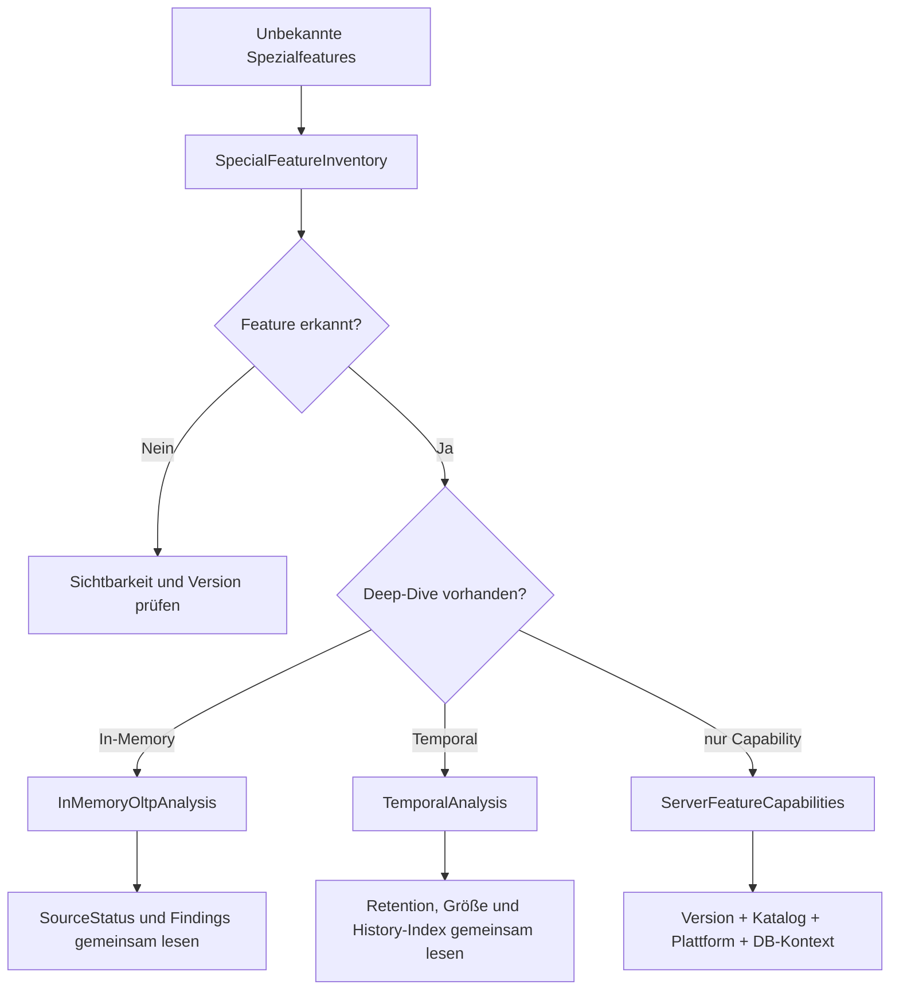

# Versionsadaptive und spezialisierte Analysepfade

**Procedures:** 4  
**Evidenz:** Version, Plattform, sichtbare Kataloge, Spezialfeature-Metadaten und isolierte Runtime-DMVs  
**Kosten:** LOW bis HIGH_OPT_IN

## Grundregeln

- SQL-Server-Hauptversion allein beweist nicht, dass ein Feature auf Edition, Plattform, Build, CU, Compatibility Level oder in einer konkreten Datenbank verfügbar ist.
- Katalogobjekterkennung ist belastbarer als hart codierte Versionsannahmen, bleibt aber berechtigungsabhängig.
- `NOT_DETECTED_VISIBLE_SCOPE` bedeutet nur „im sichtbaren Metadatenscope nicht gefunden“.
- Feature-Inventar ist kein Healthcheck.
- In-Memory- und Temporal-Findings verwenden konfigurierbare Repository-Heuristiken und führen keine DDL aus.

---

## 1. [monitor].[USP_ServerFeatureCapabilities]

### Zweck

Ermittelt versions- und plattformabhängige Diagnosefähigkeiten auf Server- und Datenbankebene. Zusätzlich können Spezialindizes und Query-Store-Replica-Funktionen inventarisiert werden.

### Auswahlhinweis

Der Kopfkommentar bezeichnet `N''` als ungültig, die Hilfezeile als aktuelle Datenbank. Da der zentrale Kandidatenvertrag `N''` normalerweise als aktuelle Datenbank behandelt, muss bei produktiver Automatisierung der tatsächliche Status geprüft oder eine explizite Datenbankliste verwendet werden.

### Aufrufe

```sql
EXEC [monitor].[USP_ServerFeatureCapabilities]
      @DatabaseNames = N'[ExampleDatabase]',
      @ResultSetArt = 'RAW';
```

```sql
EXEC [monitor].[USP_ServerFeatureCapabilities]
      @DatabaseNames = NULL,
      @MitSpezialindizes = 1,
      @MitQueryStoreReplicas = 1,
      @MitPlattformdetails = 1,
      @ResultSetArt = 'RAW';
```

### Capabilities

| Spalte | Bedeutung |
|---|---|
| `ScopeName` | `SERVER` oder anderer Scope |
| `FeatureName` | stabiler Featurecode |
| `AvailabilityStatus` | `AVAILABLE`, `UNAVAILABLE_VERSION`, `UNAVAILABLE_PLATFORM` oder weitere Statuswerte |
| `LogicPath` | verwendete oder empfohlene Erkennungs-/Fallbacklogik |
| `MinimumKnownMajorVersion` | bekannte Mindesthauptversion |
| `SourceObject` | Katalog-/Metadatenquelle |
| `Detail` | fachliche Einordnung |
| `RequiredPermission` | benötigte Berechtigung |

### DatabaseFeatures

`DatabaseName`, `CompatibilityLevel`, `StateDesc`, `FeatureName`, `AvailabilityStatus`, `FeatureValue`, `LogicPath`, `Detail`.

Beispielhafte Features:

- `OPTIMIZED_LOCKING`
- `QUERY_STORE_READABLE_SECONDARY`
- weitere im Build erkannte datenbankbezogene Fähigkeiten.

### SpecialIndexes

`DatabaseName`, `SchemaName`, `ObjectName`, `IndexName`, `IndexFamily`, `IndexDetails`, `AvailabilityStatus`.

Die genaue Familie ist versionsabhängig. Das Resultset ist ein Inventar, kein Performanceurteil.

### Errors

`DatabaseName`, `ModuleName`, `ErrorNumber`, `ErrorMessage`.

### Serverfeatures im aktuellen Code

| Feature | Interpretation |
|---|---|
| `PERFORMANCE_STATE_PERMISSION` | ab SQL Server 2022 wird für viele Performance-DMVs `VIEW SERVER PERFORMANCE STATE` ausgewiesen, davor `VIEW SERVER STATE` |
| `ZSTD_BACKUP_COMPRESSION` | SQL Server 2025 unterstützt ZSTD als Backupkompressionsalgorithmus; CPU-/Durchsatzwirkung trotzdem testen |
| `RESOURCE_GOVERNOR_STANDARD_EDITION` | SQL Server 2025 erweitert Editionsverfügbarkeit; reale Katalog- und Editionsprüfung bleibt nötig |
| Linux Host Stats | Linux-spezifische DMVs werden nur bei Linux und vorhandenem Systemobjekt als verfügbar markiert |
| Optimized Locking | Datenbankeigenschaft; mit ADR, RCSI und Workload interpretieren |
| Query Store Readable Secondary | SQL Server 2025-/Plattformfunktion; Katalogsicht `sys.query_store_replicas` ist maßgeblich |

### Interpretation

- `AVAILABLE` heißt: Diagnosepfad/Katalog ist nach Erkennung verfügbar. Es heißt nicht, dass das Feature aktiviert, genutzt oder gesund ist.
- `UNAVAILABLE_VERSION` kann auch bedeuten, dass das erwartete Systemobjekt auf diesem Build nicht existiert.
- `FeatureValue` muss featurebezogen interpretiert werden; Textwerte sind nicht global vergleichbar.
- Optimized Locking kann Lockmemory und bestimmte Blockierungen reduzieren, beseitigt aber nicht jeden Lockkonflikt.
- Query Store für lesbare Secondaries schreibt Ausführungsinformationen zum primären Query Store zurück; Replica-Dimensionen müssen in Auswertungen berücksichtigt werden.
- ZSTD kann schnellere und bessere Kompression bieten, erhöht aber wie andere Kompression CPU-Verbrauch und muss gegen Concurrent Workload getestet werden.

### Folgeanalyse

- In-Memory gefunden → `USP_InMemoryOltpAnalysis`
- Temporal gefunden → `USP_TemporalAnalysis`
- Query-Store-Replica verfügbar → Query-Store-Guides mit Replica Group beachten
- Spezialindex → passende Objekt-/Plananalyse

### Kosten

LOW bis MEDIUM. Cross-Database-Katalogzugriffe und optionales Spezialindexinventar; keine Benutzerdatenscans.

---

## 2. [monitor].[USP_SpecialFeatureInventory]

### Zweck

Leichtgewichtige aggregierte Nutzungsinventur sichtbarer Spezialfeatures. Es werden keine externen Locations, Credentials, Broker-Payloads, CLR-Binaries, Moduldefinitionen oder Benutzerdaten gelesen.

### Erkannte Familien

- In-Memory OLTP
- System-versioned Temporal Tables
- Service Broker
- Full-Text
- Change Tracking
- Change Data Capture
- Verschlüsselung/Always Encrypted/TDE-Metadaten
- CLR
- External Tables/Data Sources
- External Languages/Libraries
- FILESTREAM/FileTable
- Graph
- Spatial
- XML
- native JSON-/Vector-Typen, soweit versionsseitig sichtbar
- benutzerdefinierte Typen

### Aufrufe

```sql
EXEC [monitor].[USP_SpecialFeatureInventory]
      @DatabaseNames = N'[ExampleDatabase]',
      @ResultSetArt = 'RAW';
```

```sql
EXEC [monitor].[USP_SpecialFeatureInventory]
      @DatabaseNames = NULL,
      @NurErkannteFeatures = 1,
      @ResultSetArt = 'RAW';
```

### DatabaseStatus

| Spalte | Bedeutung |
|---|---|
| `DatabaseName` | Scope |
| `StatusCode`, `IsPartial` | Auswertbarkeit |
| `FeatureRows` | erzeugte Featureinventarzeilen |
| `DetectedFeatureRows` | Zeilen mit erkannter Nutzung/Konfiguration |
| `ErrorNumber`, `ErrorMessage` | behandelter Fehler |
| `Detail` | Aussagegrenze |

### FeatureInventory

| Spalte | Bedeutung |
|---|---|
| `DatabaseName` | Datenbank |
| `FeatureCode` | stabiler technischer Code |
| `FeatureFamily` | lesbare Familie |
| `DetectionStatus` | etwa erkannt, nicht im sichtbaren Scope erkannt oder versionell nicht verfügbar |
| `DetectedItemCount` | aggregierte Anzahl von Metadatenobjekten/-signalen |
| `ConfigurationState` | Featurekonfiguration, sofern sinnvoll |
| `SourceObjects` | verwendete Systemkataloge |
| `RecommendedModule` | passendes Deep-Dive-Modul |
| `RecommendedModuleStatus` | verfügbar, nicht implementiert oder nicht anwendbar |
| `EvidenceLimit` | explizite Grenze |

### Interpretation

- Zähler verschiedener Features sind nicht untereinander vergleichbar. Bei Service Broker können Queue, Service und Enablement in eine Zahl einfließen; bei Temporal primär aktuelle Tabellen.
- `DetectedItemCount=0` kann fehlende Sichtbarkeit bedeuten.
- Konfiguriert, aber ohne Objekt ist ein anderer Zustand als aktiv genutzt.
- External Scripts enabled ohne externe Bibliothek kann Vorbereitungs- oder Altzustand sein.
- Database Encryption Flag, Always-Encrypted-Schlüsselmetadaten und verschlüsselte Spalten sind unterschiedliche Technologien, die in einer Familie zusammengefasst werden können.
- `@NurErkannteFeatures=1` verbessert Lesbarkeit, entfernt aber die explizite Information über nicht erkennbare oder nicht verfügbare Familien.

### Plakative und grenzwertige Beispiele

| Befund | Bewertung |
|---|---|
| Temporal erkannt, 500 Tabellen | Deep-Dive und Retention-/Kapazitätsstrategie priorisieren |
| Broker enabled, keine benutzerdefinierten Queues | möglicherweise nur Konfiguration, nicht aktive Nutzung |
| CLR Assembly Count 1 | Sicherheits-/Supportreview, nicht automatisch Risiko |
| Native Vector `UNAVAILABLE_VERSION` | erwartbar vor unterstützter Version |
| 0 Full-Text-Objekte bei eingeschränkter Metadatensicht | keine belastbare Abwesenheitsaussage |

### Folgeanalyse

Das angegebene `RecommendedModule` verwenden. Fehlt ein Deep-Dive-Modul, Quelle und Betriebsanforderung manuell prüfen.

### Kosten

LOW. Aggregierte Systemkatalogabfragen, kein Daten- oder Definitionsscan.

---

## 3. [monitor].[USP_InMemoryOltpAnalysis]

### Zweck

Best-Effort-Tiefenanalyse sichtbarer In-Memory-OLTP-Konfiguration und Runtimeevidenz zu Tabellen-/Indexmemory, Hashindizes, Memory Consumers, Checkpoint Files, aktiven Transaktionen und Resource Pools.

### Repository-Schwellen

| Parameter | Default | Bedeutung |
|---|---:|---|
| `@MinTableMemoryMb` | 1024 | große Tabelle/Indexmemory zur Sichtung |
| `@HashAvgChainWarn` | 10 | durchschnittliche Hashchain |
| `@HashMaxChainWarn` | 100 | maximale Hashchain |
| `@HashMinEmptyBucketPercent` | 10 | sehr geringe Leerbucketquote |
| `@WaitingCheckpointWarnMb` | 1024 | Checkpointfiles in wartendem Zustand |
| `@ActiveTransactionWarnCount` | 100 | aktive XTP-Transaktionen |
| `@PoolUsedWarnPercent` | 80 | Resource-Pool-Auslastung relativ zum Target |

Diese Schwellen sind heuristische Prüfgrenzen, keine automatische Bucket-, Memory- oder Poolbemessung.

### Statusresultsets

#### DatabaseStatus

`DatabaseName`, `StatusCode`, `IsPartial`, `MemoryOptimizedTableCount`, `MemoryOptimizedTableTypeCount`, `MemoryOptimizedFilegroupCount`, `SourceFailureCount`, `FindingCount`, `RequiredPermission`, `ErrorNumber`, `ErrorMessage`, `Detail`.

#### SourceStatus

`DatabaseName`, `SourceCode`, `StatusCode`, `IsPartial`, `RowCount`, `RequiredPermission`, `ErrorNumber`, `ErrorMessage`, `Detail`.

Jede Runtime-DMV wird separat behandelt. Ein partieller Hashindexstatus darf Table-Memory- oder Checkpointevidenz nicht entwerten.

### TableMemory

`DatabaseName`, `SchemaName`, `TableName`, `ObjectId`, `DurabilityDesc`, `TableAllocatedMb`, `TableUsedMb`, `IndexAllocatedMb`, `IndexUsedMb`, `TotalAllocatedMb`, `TotalUsedMb`, `UsedPercent`, `Severity`, `FindingCode`, `EvidenceLimit`.

### HashIndex

`DatabaseName`, `SchemaName`, `TableName`, `IndexName`, `ObjectId`, `IndexId`, `ConfiguredBucketCount`, `TotalBucketCount`, `EmptyBucketCount`, `EmptyBucketPercent`, `AverageChainLength`, `MaxChainLength`, `RuntimeStatsStatus`, `Severity`, `FindingCode`, `EvidenceLimit`.

`@MitHashIndexStats=1` ist HIGH_OPT_IN und benötigt `CATALOG_DEEP`, weil `sys.dm_db_xtp_hash_index_stats` laut Hersteller vollständige Tabellenarbeit verursachen kann.

### MemoryConsumer

`DatabaseName`, `MemoryConsumerType`, `MemoryConsumerDesc`, `ConsumerCount`, `AllocationCount`, `AllocatedMb`, `UsedMb`, `UsedPercent`, `EvidenceLimit`.

### Checkpoint

`DatabaseName`, `FileType`, `FileTypeDesc`, `State`, `StateDesc`, `FileCount`, `FileSizeMb`, `FileUsedMb`, `LogicalRowCount`, `Severity`, `FindingCode`, `EvidenceLimit`.

Checkpointfiles sind append-only Data-/Delta-Strukturen und durchlaufen mehrere legitime Zustände. `WAITING FOR LOG TRUNCATION` ist nicht automatisch ein Fehler; Logtrunkierung, Merge-/Recoverybedarf und Dauer prüfen.

### Transaction

`DatabaseName`, `TransactionState`, `TransactionStateDesc`, `ResultDesc`, `TransactionCount`, `Severity`, `FindingCode`, `EvidenceLimit`.

Es werden bewusst keine realen Transaktions-IDs ausgegeben.

### ResourcePool

`DatabaseName`, `ResourcePoolId`, `ResourcePoolName`, `IsDefaultOrUnbound`, `DatabasesUsingPool`, `MinMemoryPercent`, `MaxMemoryPercent`, `MaxMemoryMb`, `TargetMemoryMb`, `UsedMemoryMb`, `UsedPercentOfTarget`, `OutOfMemoryCount`, `Severity`, `FindingCode`, `EvidenceLimit`.

### Findings

`FindingOrdinal`, Scope, `Severity`, `Confidence`, `FindingCode`, `MetricName`, `MetricValue`, `ThresholdValue`, `Evidence`, `EvidenceLimit`, `RecommendedNextCheck`.

### Interpretation

| Konstellation | Bewertung |
|---|---|
| hohe TableMemory, stabiler Pool, keine OOMs | groß, aber nicht automatisch problematisch |
| durchschnittliche Chain 15, Max 20, workload hauptsächlich point lookup | Bucketreview sinnvoll |
| Max Chain 1000 durch einzelnen Extremwert, Avg 1.2 | Skew-/Schlüsseldistribution prüfen, nicht nur Maxwert |
| EmptyBucketPercent 1 % | Bucketzahl möglicherweise zu klein oder Verteilung ungleich |
| EmptyBucketPercent 99 % | stark überdimensioniert möglich; Memorykosten prüfen |
| viele Checkpointfiles WAITING FOR LOG TRUNCATION | Log-/Backup-/AG-Kontext prüfen |
| PoolUsed 90 %, keine Pressureflags | Watchlist, Verlauf und Growthplan |
| `OutOfMemoryCount>0` | historisch relevante Pressureevidenz; Reset-/Zeitkontext ergänzen |

### Aussagegrenzen

- Runtimewerte sind Momentaufnahmen oder kumulativ seit Restart/Objekterstellung.
- Hashchainqualität hängt von Schlüsselverteilung und Zugriffsmuster ab.
- Resource-Pool-Auslastung allein ist keine Max-Memory-Empfehlung.
- Checkpointfiles werden aggregiert; Dateipfade werden absichtlich nicht gelesen.
- Memory-optimized Table Types können Nutzung erzeugen, ohne dauerhafte Tabelle.

### Folgeanalyse

Query-/XTP-Indexnutzung, aktuelle Grants/Memory, Resource Governor, Log-/Backupstatus und Wiederholungsmessung.

---

## 4. [monitor].[USP_TemporalAnalysis]

### Zweck

Analysiert sichtbare system-versioned Temporal Tables, Current-/History-Zuordnung, Periodenspalten, Retentionkonfiguration, approximative Größe/Zeilenzahl und die Indexreihenfolge der History-Tabelle.

Es werden keine aktuellen oder historischen Benutzertabellenzeilen gelesen.

### Repository-Schwellen

| Parameter | Default |
|---|---:|
| `@HistorySizeWarnMb` | 10.240 MB |
| `@HistoryRowsWarn` | 10.000.000 |
| `@HistoryToCurrentRatioWarn` | 10 |
| `@MinHistoryMbForRatioWarn` | 100 MB |

### Statusresultsets

#### DatabaseStatus

`DatabaseName`, `StatusCode`, `IsPartial`, `TemporalTableCount`, `HistoryTableCount`, `SourceFailureCount`, `FindingCount`, `RequiredPermission`, `ErrorNumber`, `ErrorMessage`, `Detail`.

#### SourceStatus

`DatabaseName`, `SourceCode`, `StatusCode`, `IsPartial`, `RowCount`, `RequiredPermission`, `ErrorNumber`, `ErrorMessage`, `Detail`.

### TemporalTable

| Gruppe | Spalten |
|---|---|
| Current | `DatabaseName`, `CurrentSchemaName`, `CurrentTableName`, `CurrentObjectId`, `CurrentIsMemoryOptimized`, `CurrentDurabilityDesc` |
| History | `HistorySchemaName`, `HistoryTableName`, `HistoryObjectId` |
| Period | `PeriodStartColumnName`, `PeriodEndColumnName`, `PeriodStartIsHidden`, `PeriodEndIsHidden` |
| Retention | `DatabaseRetentionEnabled`, `HistoryRetentionPeriod`, `HistoryRetentionUnitDesc`, `RetentionMode` |
| Kapazität | `CurrentRowsApprox`, `HistoryRowsApprox`, `CurrentReservedMb`, `CurrentUsedMb`, `HistoryReservedMb`, `HistoryUsedMb`, `HistoryToCurrentRowRatio` |
| Index | `HistoryIndexCount`, `HasPeriodLeadingHistoryIndex` |
| Bewertung | `AssessmentStatus`, `EvidenceLimit` |

### HistoryIndex

`DatabaseName`, Current-/History-Scope, `IndexName`, `IndexId`, `IndexTypeDesc`, `IsUnique`, `IsDisabled`, `FirstKeyColumnName`, `SecondKeyColumnName`, `IsPeriodLeadingIndex`, `EvidenceLimit`.

Ein Period-leading History-Index wird anhand der erwarteten Reihenfolge **Period End, Period Start** bewertet. Andere Zugriffsmuster können zusätzliche Indizes benötigen.

### Findings

`FindingOrdinal`, Current-/History-Scope, `Severity`, `Confidence`, `FindingCode`, `MetricName`, `MetricValue`, `ThresholdValue`, `Evidence`, `EvidenceLimit`, `RecommendedNextCheck`.

### Interpretation

| Konstellation | Bewertung |
|---|---|
| History 20× Current, aber nur 50 MB | Ratio über Schwelle, durch Mindestgröße eventuell absichtlich nicht gewarnt |
| History 2 TB, Ratio 2 | absolute Kapazität relevant trotz moderatem Verhältnis |
| Retention OFF und update-/delete-intensive Tabelle | unbegrenztes Wachstum möglich; fachliche Aufbewahrung klären |
| Retention ON | beweist keinen erfolgreichen Cleanup |
| kein Period-leading Index | Temporal-Abfragen/Cleanup können leiden; bestehende alternative Indizes und Workload prüfen |
| HistoryIndex disabled | klarer Reviewfall |
| Hidden Period Columns | normal und oft erwünscht |
| Current memory-optimized | spezielle Kombination; Feature-/Versiongrenzen beachten |

### Aussagegrenzen

- Größen/Zeilen stammen approximativ aus Partitionsstatistiken.
- Kein Datenscan: Periodenüberlappungen, ungültige Fachzeiten oder Cleanupfortschritt werden nicht bewiesen.
- Nach `SYSTEM_VERSIONING=OFF` kann die frühere Paarbeziehung verloren sein und wird nicht zuverlässig rekonstruiert.
- Retention Policy muss fachliche und rechtliche Anforderungen erfüllen; Größe allein bestimmt sie nicht.
- Eine große History-Tabelle kann sowohl Storagekosten als auch Temporal-Querykosten erhöhen.

### Folgeanalyse

Kapazität, Index Usage/Physical Stats, Query Store für Temporal Queries, Partitionierungs-/Retentionstrategie und Cleanupmonitoring.

## Anfänger-Entscheidungsbaum



## Quellen

- [What's new in SQL Server 2025](https://learn.microsoft.com/sql/sql-server/what-s-new-in-sql-server-2025)
- [Editions and supported features of SQL Server 2025](https://learn.microsoft.com/sql/sql-server/editions-and-components-of-sql-server-2025)
- [Optimized locking](https://learn.microsoft.com/sql/relational-databases/performance/optimized-locking)
- [Query Store for readable secondary replicas](https://learn.microsoft.com/sql/relational-databases/performance/query-store-for-secondary-replicas)
- [sys.query_store_replicas](https://learn.microsoft.com/sql/relational-databases/system-catalog-views/sys-query-store-replicas-transact-sql)
- [Backup compression and ZSTD](https://learn.microsoft.com/sql/relational-databases/backup-restore/backup-compression-sql-server)
- [In-Memory OLTP overview](https://learn.microsoft.com/sql/relational-databases/in-memory-oltp/overview-and-usage-scenarios)
- [sys.dm_db_xtp_hash_index_stats](https://learn.microsoft.com/sql/relational-databases/system-dynamic-management-views/sys-dm-db-xtp-hash-index-stats-transact-sql)
- [sys.dm_db_xtp_checkpoint_files](https://learn.microsoft.com/sql/relational-databases/system-dynamic-management-views/sys-dm-db-xtp-checkpoint-files-transact-sql)
- [Temporal tables](https://learn.microsoft.com/sql/relational-databases/tables/temporal-tables)
- [Manage temporal history retention](https://learn.microsoft.com/sql/relational-databases/tables/manage-retention-of-historical-data-in-system-versioned-temporal-tables)
- [Temporal table considerations and limitations](https://learn.microsoft.com/sql/relational-databases/tables/temporal-table-considerations-and-limitations)
