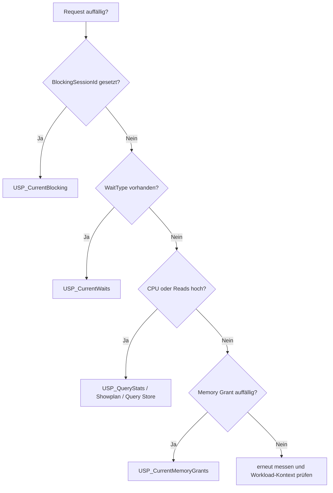
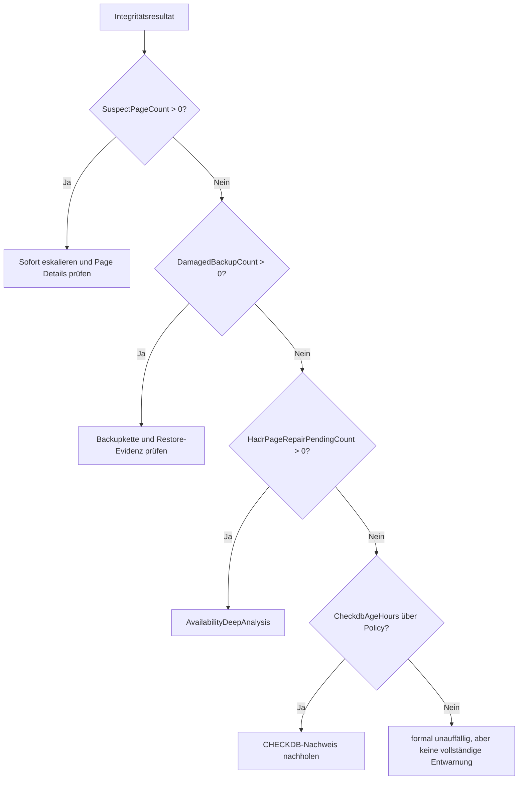
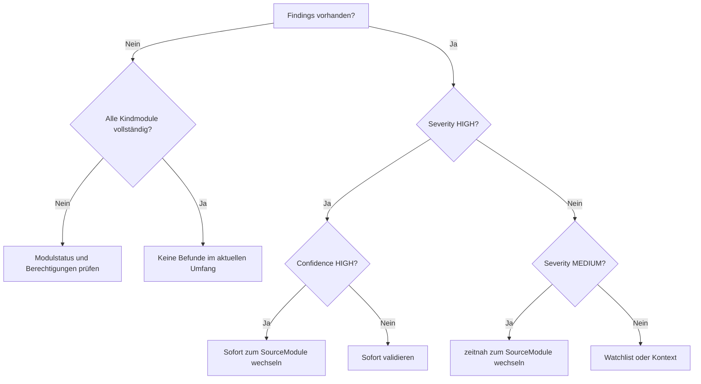

# Tiefenrecherche und Dokumentationskonzept für SQL_Server_Analyze

**Stand:** 17. Juli 2026  
**Status:** redaktionelle und fachliche Grundlage für die spätere Detaildokumentation aller öffentlichen Analyse-Procedures  
**Zielgruppe:** Analyseanfänger, Datenbankentwickler und erfahrene SQL-Server-Administratoren

## 1. Zweck und Aussagegrenze dieses Dokuments

Dieses Dokument beschreibt, wie die öffentlichen Analysefunktionen des Frameworks so dokumentiert werden sollen, dass Anwender nicht nur einen Procedure-Namen und eine Parameterliste sehen, sondern die Resultsets fachlich verstehen, Auffälligkeiten einordnen und sinnvolle Folgeanalysen auswählen können.

Es ist bewusst **keine vollständige Einzelreferenz aller Procedures**. Es enthält:

- eine belastbare Zielstruktur für `Documentation/Analysis_Guides/`,
- einen verbindlichen Redaktionsstandard,
- Grundregeln zur Interpretation von Schwellenwerten und Momentaufnahmen,
- eine priorisierte Dokumentationsroadmap,
- vertiefte Musterguides für
  - `[monitor].[USP_CurrentRequests]`,
  - `[monitor].[USP_DatabaseIntegrityAnalysis]`,
  - `[monitor].[USP_DiagnosticFindings]`.

Die Musterguides zeigen die fachliche Tiefe, die später für jede öffentliche Analyse-Procedure erreicht werden soll.

## 2. Untersuchungsrahmen und belastbare Ausgangsbasis

Das Repository ist ein T-SQL-basiertes Diagnoseframework für SQL Server ab Version 2019. Es wird im Schema `[monitor]` installiert und deckt unter anderem folgende Bereiche ab:

- Current State: Sessions, Requests, Blocking, Waits, Transaktionen, Memory Grants, TempDB, I/O und Transaktionslog,
- Objekt- und Indexanalyse,
- Plan Cache und Showplan,
- Query Store,
- Extended Events,
- Infrastruktur und Hochverfügbarkeit,
- Server Health,
- versionsadaptive und spezialisierte Analysepfade.

Das Framework unterscheidet drei Ausgabearten:

| Ausgabeart | Zweck |
|---|---|
| `CONSOLE` | lesbare Ad-hoc-Ausgabe für Menschen |
| `RAW` | stabiler technischer Resultset-Vertrag |
| `NONE` | keine fachlichen Resultsets, etwa bei reiner JSON-Nutzung |

Die Detailguides sollen sich primär auf `RAW` beziehen, weil dort Spaltennamen, Datentypen und Resultset-Reihenfolge den technischen Vertrag darstellen. `CONSOLE` bleibt wichtig für die praktische Nutzung, darf aber nicht als alleinige Grundlage für Schnittstellen oder automatisierte Auswertungen behandelt werden.

### 2.1 Datenschutz und Beispiele

Dieses Dokument enthält ausschließlich:

- öffentliche Produkt- und Projektnamen,
- öffentliche Repositorypfade,
- öffentliche Fachquellen,
- generische SQL-Server-Systembegriffe,
- eindeutig synthetische `Example*`-Bezeichnungen.

Es enthält keine realen Laufzeitresultate, keine echten Server-, Datenbank-, Benutzer-, Firmen-, Host-, Job-, Pfad- oder Infrastrukturbezeichnungen.

## 3. Empfohlene Struktur unter Documentation/Analysis_Guides

```mermaid
flowchart TD
    A[Documentation/Analysis_Guides/README.md] --> B[Current_State]
    A --> C[Object_Index]
    A --> D[Plan_Cache]
    A --> E[Query_Store]
    A --> F[Extended_Events]
    A --> G[Infrastructure]
    A --> H[Server_Health]
    A --> I[Version_Adaptive]

    B --> B1[USP_CurrentSessions.md]
    B --> B2[USP_CurrentRequests.md]
    B --> B3[USP_CurrentBlocking.md]
    B --> B4[USP_CurrentWaits.md]

    H --> H1[USP_DatabaseIntegrityAnalysis.md]
    H --> H2[USP_DatabaseCapacityAnalysis.md]
    H --> H3[USP_PerformanceCounters.md]
    H --> H4[USP_CriticalEngineEvents.md]
    H --> H5[USP_InternalContentionAnalysis.md]
    H --> H6[USP_BufferPoolAnalysis.md]
    H --> H7[USP_DiagnosticFindings.md]

    I --> I1[USP_SpecialFeatureInventory.md]
    I --> I2[USP_InMemoryOltpAnalysis.md]
```



### 3.1 Inhalt der späteren Indexseite

Eine zentrale `README.md` in `Documentation/Analysis_Guides/` sollte enthalten:

| Element | Zweck |
|---|---|
| Themenübersicht | schneller Einstieg nach Problemklasse statt nur nach Procedure-Name |
| Entscheidungshilfe | welche Procedure bei welcher Fragestellung zuerst aufgerufen wird |
| Ausgabearten | Erklärung von `CONSOLE`, `RAW`, `NONE` und JSON |
| Kostenklassen | LOW, MEDIUM, HIGH und HIGH_OPT_IN |
| Evidenzklassen | Momentaufnahme, kumulative DMV, Historie, Metadaten, Stichprobe |
| Aussagegrenzen | was ein leeres oder unauffälliges Resultset nicht beweist |
| Querverweise | empfohlene Folgeprocedures je Befund |
| Datenschutz | ausschließlich synthetische Beispiele in der Dokumentation |

## 4. Verbindlicher Redaktionsstandard je Analyse-Procedure

Jede spätere Guide-Datei sollte denselben Aufbau verwenden.

### 4.1 Executive Summary

Die ersten Absätze müssen beantworten:

- Was analysiert die Procedure?
- Wann sollte sie eingesetzt werden?
- Wann ist sie ungeeignet?
- Ist sie eine Momentaufnahme, eine Stichprobe oder eine historische Analyse?
- Welche Kostenklasse besitzt sie?
- Welche Berechtigungen oder optionalen Features beeinflussen die Vollständigkeit?
- Was kann ein leeres Resultset bedeuten?

### 4.2 Aufrufmuster

Mindestens drei Varianten:

1. minimaler Einstieg,
2. fokussierter produktiver Aufruf,
3. kostenintensiver oder opt-in-Tiefenaufruf.

### 4.3 Resultset-Vertrag

Für jedes Resultset:

- Reihenfolge,
- Zweck,
- Spaltennamen,
- Datentypen,
- technische Quelle,
- Berechnungslogik,
- Abhängigkeit von Parametern,
- mögliche partielle Verfügbarkeit.

### 4.4 Spaltenkatalog

Jede Column benötigt mindestens:

| Eigenschaft | Beschreibung |
|---|---|
| Name | exakter RAW-Spaltenname |
| Datentyp | technischer Datentyp |
| Quelle | DMV, Katalogsicht, Systemtabelle oder berechnete Logik |
| Bedeutung | verständliche Erklärung ohne unnötigen Fachjargon |
| Interpretation | typische, auffällige und irreführende Werte |
| Folgeanalyse | nächste Procedure oder externe Validierung |
| Aussagegrenze | was aus dem Wert nicht abgeleitet werden darf |

### 4.5 Beispiele

Jeder Guide soll mindestens enthalten:

- normales Beispiel,
- plakatives Problembeispiel,
- grenzwertiges Beispiel,
- irreführendes Beispiel,
- typische Produktionskonstellation.

Alle Werte müssen vollständig synthetisch rekonstruiert sein.

## 5. Schwellenwerte richtig dokumentieren

Nicht jede SQL-Server-Metrik besitzt eine seriöse allgemeingültige Grenze. Die Dokumentation muss deshalb vier Klassen unterscheiden.

| Kennzeichnung | Bedeutung |
|---|---|
| **Repository-Schwelle** | direkt als Parameter oder Bewertungslogik im Code definiert |
| **Microsoft-dokumentiert** | durch offizielle Produktdokumentation gestützt |
| **Heuristik** | praktische Betriebsregel, aber keine universelle Produktgrenze |
| **Unspecified** | keine belastbare allgemeine Grenze vorhanden |

### 5.1 Typische Regeln

| Themenbereich | Dokumentationsregel |
|---|---|
| Waits | keine pauschalen Grenzwerte; immer Workload, Dauer, Häufigkeit und Begleitsymptome berücksichtigen |
| Blocking | kurze Blockierungen können normal sein; persistierende Ketten mit wachsender Wartezeit müssen verfolgt werden |
| Memory Grants | große Grants sind nicht automatisch falsch; wartende Grants und `RESOURCE_SEMAPHORE` sind wesentlich aussagekräftiger |
| Missing Indexes | nur Optimizer-Evidenz, keine sofortige DDL-Anweisung |
| Fragmentierung | Page Count, Seitendichte, Workload und Wartungsfolgen gemeinsam betrachten |
| Statistiken | Alter allein reicht nicht; Modification Counter, Histogramm und Query-Kontext berücksichtigen |
| Integrität | vorhandene Evidenz ist kritisch; fehlende Evidenz ist kein Integritätsbeweis |
| Query Store Regression | Mindestanzahl von Ausführungen und Vergleichsfenster prüfen |
| Extended Events | Ereignisquelle, Retention und Target-Verfügbarkeit mitbewerten |

## 6. Priorisierte Dokumentationsroadmap

### 6.1 Hauptpriorität

1. `USP_DatabaseIntegrityAnalysis`
2. `USP_DiagnosticFindings`
3. `USP_DatabaseCapacityAnalysis`
4. `USP_PerformanceCounters`
5. `USP_CriticalEngineEvents`
6. `USP_CurrentRequests`
7. `USP_CurrentBlocking`
8. `USP_CurrentMemoryGrants`

Diese Procedures besitzen besonders hohe Betriebsrelevanz oder sind zentrale Einstiegspunkte.

### 6.2 Direkt danach

- `USP_StatisticsDistributionAnalysis`
- `USP_SchemaDesignAnalysis`
- `USP_BackupChainAnalysis`
- `USP_AvailabilityDeepAnalysis`
- `USP_AgentMonitoringAnalysis`
- `USP_IntelligentQueryProcessingAnalysis`
- `USP_InternalContentionAnalysis`
- `USP_BufferPoolAnalysis`
- `USP_SpecialFeatureInventory`
- `USP_InMemoryOltpAnalysis`

### 6.3 Zweite Welle

- vollständige Current-State-Familie,
- Plan Cache,
- Query Store,
- Extended Events.

### 6.4 Dritte Welle

- Object/Index-Basisprozeduren,
- Infrastruktur-Basisprozeduren,
- Konfigurations- und Inventarprozeduren.

## 7. Familienbezogene Interpretationsregeln

### 7.1 Current State

Current-State-Procedures zeigen primär flüchtige Live-Zustände. Ein einzelner Aufruf kann ein Problem verpassen oder einen nur kurzzeitigen Zustand überbetonen.

Wichtige Grundregeln:

- Momentaufnahme wiederholen, wenn eine Entwicklung beurteilt werden soll.
- CPU, Reads, Laufzeit und Waits gemeinsam lesen.
- Bei parallelen Requests können Task-Waits von der Request-Hauptzeile abweichen.
- Ein hoher kumulativer Wert ist nicht automatisch ein aktuelles Problem.
- Blockierende Sessions nicht vorschnell beenden; Root Blocker und Transaktionskontext zuerst bestimmen.

### 7.2 Object und Index

Diese Familie liefert überwiegend Prüfaufträge.

- Missing-Index-Evidenz ist keine fertige Indexdefinition.
- Index Usage ist seit letztem Reset, Restart oder Datenbankstatuswechsel zu bewerten.
- Fragmentierung bei kleinen Indizes ist oft irrelevant.
- Hohe Fragmentierung kann bei Scan-lastigen Workloads wichtiger sein als bei Seek-lastigen OLTP-Zugriffen.
- Columnstore-Deleted-Rows müssen mit Rowgroup-Größe, Tuple Mover und Ladeprofil interpretiert werden.

### 7.3 Plan Cache und Query Store

Plan Cache und Query Store beantworten unterschiedliche Fragen.

| Quelle | Charakter |
|---|---|
| Plan Cache | flüchtig, instanzweit, seit Cache-Eintrag |
| Query Store | datenbankbezogen, historisch, intervallbasiert |

Ein Plan-Cache-Befund sollte bei historischen Fragestellungen über Query Store validiert werden. Ein Query-Store-Befund kann seinerseits durch Cleanup, Capture Mode, Read-Only-Status oder fehlende Intervalle begrenzt sein.

### 7.4 Extended Events

Extended Events liefern Ereignishistorie, aber nur soweit:

- die Session aktiv war,
- das Event enthalten war,
- das Target noch Daten enthält,
- Dateien erreichbar sind,
- Retention und Rollover die Daten nicht entfernt haben.

### 7.5 Server Health und Spezialfälle

Hier ist die Trennung zwischen **Evidenz** und **Beweis** besonders wichtig.

Beispiele:

- keine `suspect_pages` bedeutet nicht, dass `DBCC CHECKDB` erfolgreich war,
- kein kritisches XEvent bedeutet nicht, dass kein Engine-Problem auftrat,
- kein Kapazitätsalarm bedeutet nicht, dass Wachstum und Autogrowth sinnvoll konfiguriert sind,
- keine normalisierten Findings bedeutet nicht, dass alle Kindmodule vollständig verfügbar waren.

# 8. Musterguide: [monitor].[USP_CurrentRequests]

## 8.1 Zweck

`[monitor].[USP_CurrentRequests]` ist die zentrale Live-Analyse für aktuell ausgeführte Anforderungen. Die Procedure korreliert aktive Requests mit:

- Session- und Verbindungsidentität,
- Laufzeit-, CPU- und I/O-Werten,
- Blocking und Waits,
- Memory Grants,
- Parallelität,
- Transaktionskontext,
- Resource Governor,
- SQL-, Batch-, Statement- und Modulkontext,
- optionalem Input Buffer.

## 8.2 Wann einsetzen?

- eine Abfrage läuft ungewöhnlich lange,
- CPU oder Reads sind aktuell hoch,
- Benutzer melden Hänger,
- Blocking wird vermutet,
- große Memory Grants werden vermutet,
- der aktuell ausgeführte Statement-Teil einer Stored Procedure soll identifiziert werden.

## 8.3 Wann nicht allein einsetzen?

- historische Regressionen,
- Probleme, die aktuell nicht mehr auftreten,
- langfristige Wait-Verteilung,
- Ursachenanalyse nur auf Basis eines einzelnen Snapshots.

Für Historie sind Query Store oder Extended Events besser geeignet.

## 8.4 Beispielaufrufe

```sql
EXEC [monitor].[USP_CurrentRequests]
      @ResultSetArt = 'CONSOLE';
```

```sql
EXEC [monitor].[USP_CurrentRequests]
      @MinLaufzeitSekunden = 30,
      @MitSqlText = 1,
      @ResultSetArt = 'RAW';
```

```sql
EXEC [monitor].[USP_CurrentRequests]
      @GesamtenSqlTextEinbeziehen = 1,
      @InputBufferEinbeziehen = 1,
      @ModulInfoEinbeziehen = 1,
      @MaxSqlTextZeichen = 0,
      @MaxZeilen = 0,
      @ResultSetArt = 'RAW';
```

Der letzte Aufruf kann deutlich größere Resultsets erzeugen und sollte gezielt verwendet werden.

## 8.5 Resultset-Spalten

### 8.5.1 Identität und Laufzeit

| Spalte | Datentyp | Bedeutung | Interpretation |
|---|---|---|---|
| `SessionId` | `smallint` | SQL-Session des Requests | Schlüssel für Folgeanalysen; Session-IDs sind wiederverwendbar |
| `RequestId` | `int` | Request innerhalb einer Session | eine Session kann mehrere Requests besitzen |
| `RequestStatus` | `nvarchar(30)` | Status des Requests | `running`, `runnable`, `suspended` und weitere Zustände immer zusammen mit Waits lesen |
| `Command` | `nvarchar(32)` | aktuelle Befehlsart | kann klarer sein als der SQL-Text, etwa bei Backup, Restore oder Indexoperationen |
| `DatabaseId` | `smallint` | aktuelle Datenbank-ID | kann vom Modul- oder Objektkontext abweichen |
| `DatabaseName` | `sysname` | aufgelöster Datenbankname | `NULL` kann bei eingeschränkter Sicht oder flüchtigem Zustand auftreten |
| `LoginName` | `nvarchar(128)` | aktueller Sicherheitskontext | bei Impersonation nicht mit dem ursprünglichen Login verwechseln |
| `OriginalLoginName` | `nvarchar(128)` | ursprünglicher Login | wichtig bei `EXECUTE AS` oder delegierten Kontexten |
| `HostName` | `nvarchar(128)` | vom Client gemeldeter Host | Clientangabe, nicht als manipulationssicher behandeln |
| `ProgramName` | `nvarchar(128)` | vom Client gemeldeter Anwendungsname | für Workload-Zuordnung nützlich, aber ebenfalls Clientangabe |
| `StartTime` | `datetime` | Startzeit des Requests | Grundlage für aktuelle Laufzeitbewertung |
| `ElapsedMs` | `int` | bisherige Gesamtlaufzeit | hohe Laufzeit ohne hohe CPU spricht oft für Warten |
| `CpuMs` | `int` | bisher verbrauchte CPU-Zeit | hohe CPU bei niedriger Laufzeit kann normaler intensiver Parallelismus sein |
| `LogicalReads` | `bigint` | logische Seitenzugriffe | hoher Wert deutet auf große Datenzugriffe, Scan oder wiederholte Verarbeitung |
| `Reads` | `bigint` | vom Request gemeldete Reads | nicht isoliert als reine Storage-Latenz interpretieren |
| `Writes` | `bigint` | Schreibaktivität des Requests | hoher Wert bei ETL, Sorts oder DML möglich |
| `RowCount` | `bigint` | bisherige Zeilenaktivität | semantische Bedeutung hängt vom Command und Operatorverlauf ab |
| `PercentComplete` | `real` | Fortschritt unterstützter Operationen | bei vielen normalen Abfragen `NULL` oder 0; nicht universell verfügbar |
| `EstimatedCompletionTimeMs` | `bigint` | geschätzte Restlaufzeit | nur grobe Projektion und bei schwankender Geschwindigkeit unzuverlässig |

### 8.5.2 Blocking, Waits und Memory

| Spalte | Datentyp | Bedeutung | Interpretation |
|---|---|---|---|
| `BlockingSessionId` | `smallint` | direkt blockierende Session | ungleich `NULL` ist ein Prüfauftrag, nicht automatisch ein Notfall |
| `WaitType` | `nvarchar(120)` | aktueller Haupt-Waittyp | Symptomklasse; Ursache erst im Kontext bestimmen |
| `WaitTimeMs` | `int` | Dauer des aktuellen Hauptwaits | wachsender Wert ist wesentlich aussagekräftiger als ein einzelner kleiner Wert |
| `LastWaitType` | `nvarchar(120)` | zuletzt beobachteter Waittyp | kann einen bereits beendeten Zustand zeigen |
| `WaitResource` | `nvarchar(256)` | aktuell angegebene Ressource | bei Lock-Waits für Objekt-/Seitenauflösung nützlich |
| `WaitingTaskCount` | `int` | Zahl wartender Tasks des Requests | bei Parallelität können mehrere Tasks gleichzeitig warten |
| `MaxTaskWaitMs` | `bigint` | längste Task-Wartezeit | ergänzt die Request-Hauptzeile |
| `TaskWaitTypes` | `nvarchar(max)` | aggregierte Task-Waittypen | zeigt Mischbilder paralleler Ausführung |
| `RequestedMemoryMb` | `decimal(19,2)` | angeforderter Query-Execution-Memory-Grant | groß ist nicht automatisch falsch; relationale Größe und Konkurrenz prüfen |
| `GrantedMemoryMb` | `decimal(19,2)` | gewährter Grant | `NULL` oder 0 bei wartendem Grant besonders beachten |
| `UsedMemoryMb` | `decimal(19,2)` | tatsächlich genutzter Grant-Anteil | sehr große Differenz zu Granted kann Übergrant-Evidenz sein |
| `IdealMemoryMb` | `decimal(19,2)` | vom Optimizer berechnete Idealgröße | Schätzgröße, keine garantierte Bedarfsmessung |
| `Dop` | `smallint` | Degree of Parallelism | nicht isoliert als Fehlkonfiguration interpretieren |
| `ParallelWorkerCount` | `int` | aktuell zugeordnete parallele Worker | hohe Werte zusammen mit Worker-Auslastung und Waits bewerten |

### 8.5.3 Transaktion und Verbindung

| Spalte | Datentyp | Bedeutung | Interpretation |
|---|---|---|---|
| `TransactionIsolationLevel` | `nvarchar(40)` | lesbare Isolationsebene | wichtig bei Blocking und Version Store |
| `OpenTransactionCount` | `int` | offene Transaktionen im Request-Kontext | größer 0 bei langen oder schlafenden Sessions weiterverfolgen |
| `OpenResultsetCount` | `int` | offene Resultsets | kann auf noch nicht vollständig konsumierte Ergebnisse hinweisen |
| `TransactionId` | `bigint` | interne Transaktions-ID | für Korrelation mit Transaction-DMVs |
| `ConnectionId` | `uniqueidentifier` | Verbindungs-ID | hilfreich bei mehreren Requests oder MARS |
| `ClientNetAddress` | `varchar(48)` | Client-Netzadresse | in realer Runtime nützlich; niemals in Repositorybeispiele übernehmen |
| `ContextInfo` | `varbinary(128)` | Session-Kontextinformation | nur aussagekräftig, wenn die Anwendung sie bewusst setzt |

### 8.5.4 Scheduler, Resource Governor und Ausführungskontext

| Spalte | Datentyp | Bedeutung | Interpretation |
|---|---|---|---|
| `SchedulerId` | `int` | zugeordneter Scheduler | für Scheduler-/NUMA-Vertiefung |
| `TaskAddress` | `varbinary(8)` | interne Taskreferenz | primär Korrelationswert |
| `NestLevel` | `int` | Verschachtelungstiefe | hohe Werte können aus Triggern oder verschachtelten Modulen entstehen |
| `WorkloadGroupId` | `int` | Resource-Governor-Gruppe | nur bei aktiviertem oder relevantem Resource Governor aussagekräftig |
| `WorkloadGroupName` | `sysname` | Gruppenname | Folgeanalyse mit `USP_ResourceGovernorAnalysis` |
| `ResourcePoolId` | `int` | Resource-Pool-ID | zusammen mit Pool-Limits bewerten |
| `ResourcePoolName` | `sysname` | Resource-Pool-Name | erleichtert fachliche Zuordnung |
| `StatementSqlHandle` | `varbinary(64)` | Handle des aktuellen Statements | Korrelation mit Plan- und Textfunktionen |
| `StatementContextId` | `bigint` | Statement-Kontext-ID | spezielle interne Korrelation |
| `IsResumable` | `bit` | resumable Operation | bei pausierbaren Indexoperationen relevant |
| `ExecutingManagedCode` | `bit` | CLR-Ausführung aktiv | CLR-Kontext als mögliche Ursache berücksichtigen |
| `ExecutionContextType` | `varchar(20)` | ermittelter Ausführungskontext | unterscheidet Batch-, Modul- oder Statementbezug |

### 8.5.5 Query-, Plan- und Modulkontext

| Spalte | Datentyp | Bedeutung | Interpretation |
|---|---|---|---|
| `QueryHash` | `binary(8)` | normalisierte Query-Identität | gruppiert ähnliche Query-Texte; nicht global eindeutig garantiert |
| `QueryPlanHash` | `binary(8)` | Planstruktur-Hash | Planwechsel und Varianten erkennen |
| `SqlHandle` | `varbinary(64)` | Handle des SQL-Texts | flüchtig und cacheabhängig |
| `PlanHandle` | `varbinary(64)` | Handle des Plans | kann nach Recompile oder Cache-Eviction ungültig werden |
| `SqlTextDatabaseId` | `int` | Datenbank-ID des Textkontexts | nicht zwingend identisch mit aktueller Request-Datenbank |
| `SqlTextObjectId` | `int` | Objekt-ID des Textkontexts | bei Ad-hoc-Batches oft `NULL` |
| `SqlTextObjectNumber` | `smallint` | Objektordinal | Spezialmetadatum, meist nur für Modulkontext relevant |
| `SqlTextIsEncrypted` | `bit` | SQL-Text ist verschlüsselt | bei 1 kann Text unvollständig oder nicht sichtbar sein |
| `ModuleDatabaseName` | `sysname` | Datenbank des Moduls | zusammen mit Schema und Objekt lesen |
| `ModuleSchemaName` | `sysname` | Schema des Moduls | Teil des qualifizierten Modulnamens |
| `ModuleObjectName` | `sysname` | Modulname | kann bei Ad-hoc-SQL fehlen |
| `ModuleType` | `char(2)` | SQL-Objekttypcode | technische Kurzform |
| `ModuleTypeDescription` | `nvarchar(60)` | lesbare Typbeschreibung | für Einsteiger vorzuziehen |
| `ModuleFullName` | `nvarchar(776)` | qualifizierter Modulname | schnellster Einstieg in die Objektanalyse |

### 8.5.6 Statement-, Batch- und Input-Buffer-Kontext

| Spalte | Datentyp | Bedeutung | Interpretation |
|---|---|---|---|
| `HasStatementOffsets` | `bit` | Start-/Endoffset vorhanden | Voraussetzung für exakte Statementextraktion |
| `IsStatementOffsetValid` | `bit` | Offsetpaar ist plausibel | bei 0 Statementtext nicht blind vertrauen |
| `StatementStartOffsetBytes` | `int` | Startoffset in Bytes | SQL Server verwendet Byteoffsets |
| `StatementEndOffsetBytes` | `int` | Endoffset in Bytes | `-1` kann bis Batchende bedeuten |
| `StatementStartCharacter` | `int` | berechnete Zeichenposition | anwenderfreundliche Ableitung |
| `StatementEndCharacter` | `int` | berechnete Endposition | zusammen mit Startposition lesen |
| `StatementStartLine` | `int` | berechnete Startzeile | erleichtert Navigation in langen Modulen |
| `StatementEndLine` | `int` | berechnete Endzeile | kann bei dynamischem SQL nur eingeschränkt helfen |
| `CurrentStatementCharacterCount` | `int` | Länge des Statements | für Truncation-Bewertung |
| `CurrentStatementIsTruncated` | `bit` | Statement wurde gekürzt | bei 1 mit höherem oder unbegrenztem Textlimit wiederholen |
| `BatchTextCharacterCount` | `int` | Länge des Batchtexts | zeigt tatsächlichen Umfang unabhängig von Ausgabegrenze |
| `BatchTextIsTruncated` | `bit` | Batch wurde gekürzt | für vollständige Analyse Limit anpassen |
| `CurrentStatement` | `nvarchar(max)` | aktuell ausgeführter Statement-Teil | meist wichtigste Textspalte |
| `BatchText` | `nvarchar(max)` | vollständiger Batch- oder Modultext | kann deutlich größer als CurrentStatement sein |
| `InputBufferEventType` | `nvarchar(256)` | Typ des Input-Buffer-Ereignisses | beschreibt Aufrufart |
| `InputBufferParameterCount` | `smallint` | gemeldete Parameterzahl | nicht immer verfügbar |
| `InputBufferCharacterCount` | `int` | Länge des Input Buffers | Umfang unabhängig von Ausgabegrenze |
| `InputBufferIsTruncated` | `bit` | Input Buffer wurde gekürzt | bei 1 keine vollständige Aufrufrekonstruktion annehmen |
| `InputBufferText` | `nvarchar(max)` | ursprünglicher Aufrufkontext | kann Parameter oder äußeren RPC-Aufruf besser zeigen als BatchText |

## 8.6 Einordnung typischer Konstellationen

| Konstellation | Bewertung | Nächster Schritt |
|---|---|---|
| kurze Laufzeit, keine Waits, geringe Reads | meist unproblematisch | keine Vertiefung |
| `suspended` mit sehr kurzem Wait | häufig normal | erneut messen |
| `BlockingSessionId` gesetzt und `WaitTimeMs` wächst | verfolgungswürdig | `USP_CurrentBlocking` |
| hoher Requested Grant, kein Grant, `RESOURCE_SEMAPHORE` | deutlich auffällig | `USP_CurrentMemoryGrants` |
| hohe CPU und hohe Logical Reads | Query-/Planproblem möglich | `USP_QueryStats`, Showplan oder Query Store |
| hohe Laufzeit bei niedriger CPU | überwiegend Wait- oder Blockingverdacht | Wait- und Blockinganalyse |
| hohe ParallelWorkerCount plus gemischte Task-Waits | Parallelitätskontext nötig | Plan und Worker-/Scheduler-Situation prüfen |
| `CurrentStatementIsTruncated = 1` | Text unvollständig | gezielt mit höherem `@MaxSqlTextZeichen` wiederholen |

## 8.7 Plakative und grenzwertige Beispiele

### Normal

| SessionId | RequestStatus | ElapsedMs | CpuMs | LogicalReads | BlockingSessionId | WaitType | Interpretation |
|---:|---|---:|---:|---:|---:|---|---|
| 57 | running | 420 | 380 | 1200 | `NULL` | `NULL` | kurze CPU-aktive OLTP-Anforderung |

### Grenzwertig

| SessionId | RequestStatus | ElapsedMs | CpuMs | LogicalReads | BlockingSessionId | WaitType | WaitTimeMs | Interpretation |
|---:|---|---:|---:|---:|---:|---|---:|---|
| 88 | suspended | 900 | 35 | 150 | `NULL` | ASYNC_NETWORK_IO | 120 | kann langsame Clientabnahme sein; kein automatischer Serverfehler |

### Kritisch

| SessionId | RequestStatus | ElapsedMs | CpuMs | BlockingSessionId | WaitType | WaitTimeMs | Interpretation |
|---:|---|---:|---:|---:|---|---:|---|
| 121 | suspended | 182000 | 1240 | 74 | LCK_M_X | 179500 | persistierende Blocking-Evidenz; Root Blocker analysieren |

### Memory-Grant-Stau

| SessionId | RequestedMemoryMb | GrantedMemoryMb | WaitType | WaitTimeMs | Interpretation |
|---:|---:|---:|---|---:|---|
| 203 | 32768.00 | 0.00 | RESOURCE_SEMAPHORE | 61000 | wartender großer Grant; Konkurrenz, Schätzung und Plan prüfen |

## 8.8 Anfänger-Entscheidungsbaum



## 8.9 Laufzeitkosten und Grenzen

Der Basispfad ist meist leicht bis moderat. Teurer werden:

- vollständiger Batchtext,
- Modulauflösung,
- Input Buffer,
- unbegrenzte Textlänge,
- unbegrenzte Zeilenzahl,
- breite unselektierte Analyse vieler Requests.

Die Werte sind eine Momentaufnahme. Ein einzelner Aufruf beweist weder Dauerhaftigkeit noch Ursache.

# 9. Musterguide: [monitor].[USP_DatabaseIntegrityAnalysis]

## 9.1 Zweck

Die Procedure korreliert rein lesende Integritätsevidenz je Datenbank aus:

- Datenbankstatus,
- `PAGE_VERIFY`-Konfiguration,
- letztem dokumentiertem erfolgreichen CHECKDB-Nachweis,
- `msdb.dbo.suspect_pages`,
- Backupmetadaten,
- HADR Auto Page Repair,
- optionaler Seitenauflösung über `sys.dm_db_page_info`.

Sie führt niemals `DBCC CHECKDB`, Restore, Reparatur oder Konfigurationsänderungen aus.

## 9.2 Repository-Schwellen

| Parameter | Default | Bedeutung |
|---|---:|---|
| `@CheckdbWarnHours` | 168 | Warnheuristik für alten CHECKDB-Nachweis |
| `@BackupHistoryDays` | 35 | betrachtetes Backupmetadatenfenster |
| `@MitPageDetails` | 0 | Seitenauflösung ist standardmäßig deaktiviert |

Diese Werte sind Repository-Heuristiken, keine universellen SQL-Server-Produktgrenzen.

## 9.3 Beispielaufrufe

```sql
EXEC [monitor].[USP_DatabaseIntegrityAnalysis]
      @ResultSetArt = 'CONSOLE';
```

```sql
EXEC [monitor].[USP_DatabaseIntegrityAnalysis]
      @DatabaseNames = N'[ExampleDatabase]',
      @MitPageDetails = 1,
      @ResultSetArt = 'RAW';
```

## 9.4 Hauptresultset

| Spalte | Datentyp | Bedeutung | Interpretation |
|---|---|---|---|
| `DatabaseId` | `int` | Datenbank-ID | technischer Schlüssel |
| `DatabaseName` | `sysname` | Datenbankname | in Dokumentationsbeispielen nur synthetisch |
| `StateDesc` | `nvarchar(60)` | Datenbankstatus | nicht-online Zustände begrenzen die Aussage |
| `PageVerifyOptionDesc` | `nvarchar(60)` | konfigurierte Page-Verify-Option | `CHECKSUM` ist typischer Zielzustand |
| `LastGoodCheckDbTime` | `datetime2(3)` | letzter dokumentierter guter CHECKDB-Zeitpunkt | Metadatenbeleg, kein aktueller Live-Test |
| `CheckdbAgeHours` | `bigint` | Alter des Nachweises | gegen betriebliche Policy und Repository-Schwelle bewerten |
| `SuspectPageCount` | `bigint` | Anzahl suspect-pages-Einträge | größer 0 immer ernst nehmen |
| `LatestSuspectPageUtc` | `datetime` | jüngster suspect-pages-Zeitpunkt | hilft bei Korrelation mit Storage- oder Engine-Ereignissen |
| `DamagedBackupCount` | `bigint` | Backups mit Damage-Indikator im Fenster | größer 0 ist hoch relevant |
| `BackupWithoutChecksumCount` | `bigint` | Backups ohne Checksum im Fenster | Policy- und Recovery-Qualität prüfen |
| `HadrPageRepairCount` | `bigint` | automatische HADR-Seitenreparaturversuche | zeigt historische Reparaturevidenz |
| `HadrPageRepairPendingCount` | `bigint` | noch nicht erfolgreich abgeschlossene Reparaturen | akut nachverfolgen |
| `FindingCode` | `varchar(80)` | normalisierte Befundklasse | für Triage und Automatisierung geeignet |
| `EvidenceLimit` | `nvarchar(1000)` | explizite Aussagegrenze | muss bei jeder Interpretation mitgelesen werden |

## 9.5 Optionales Seitenresultset

| Spalte | Bedeutung |
|---|---|
| `DatabaseName` | betroffene Datenbank |
| `FileId` | Datei-ID |
| `PageId` | Seiten-ID |
| `EventType` | suspect-pages-Ereignistyp |
| `LastUpdateDate` | letzter Ereigniszeitpunkt |
| `ObjectId` | aufgelöstes Objekt |
| `IndexId` | aufgelöster Index |
| `PartitionId` | aufgelöste Partition |
| `PageTypeDesc` | Seitentyp |
| `AllocUnitTypeDesc` | Allocation-Unit-Typ |

Die Seitenauflösung ist eine Vertiefung. Fehlende Objektauflösung bedeutet nicht automatisch, dass der Eintrag irrelevant ist.

## 9.6 Bewertung

| Konstellation | Bewertung |
|---|---|
| alle Evidenzwerte 0 oder `NULL` | formal unauffällig, aber kein Integritätsbeweis |
| `CheckdbAgeHours > 168` | Repository-Warnschwelle überschritten |
| `BackupWithoutChecksumCount > 0` | Backup-Policy und Restore-Strategie prüfen |
| `DamagedBackupCount > 0` | hoch priorisieren |
| `SuspectPageCount > 0` | sofortige Integritätsnachverfolgung |
| `HadrPageRepairPendingCount > 0` | hohe Priorität in AG-Umgebung |
| `PageVerifyOptionDesc <> CHECKSUM` | Konfiguration fachlich prüfen |

## 9.7 Beispiele

### Formal unauffällig

| DatabaseName | PageVerifyOptionDesc | CheckdbAgeHours | SuspectPageCount | DamagedBackupCount | HadrPageRepairPendingCount | FindingCode |
|---|---|---:|---:|---:|---:|---|
| ExampleSalesDb | CHECKSUM | 24 | 0 | 0 | 0 | NO_INDICATOR_FOUND |

Interpretation: Es wurde keine negative Evidenz gefunden. Das ersetzt keinen aktuellen CHECKDB- oder Restore-Test.

### Grenzwertig

| DatabaseName | PageVerifyOptionDesc | CheckdbAgeHours | SuspectPageCount | BackupWithoutChecksumCount | FindingCode |
|---|---|---:|---:|---:|---|
| ExampleArchiveDb | CHECKSUM | 190 | 0 | 1 | CHECKDB_EVIDENCE_STALE |

Interpretation: kein Korruptionsnachweis, aber CHECKDB-Evidenz ist älter als die Repository-Schwelle und ein Backup im betrachteten Fenster besitzt keine Checksum.

### Kritisch

| DatabaseName | CheckdbAgeHours | SuspectPageCount | DamagedBackupCount | HadrPageRepairPendingCount | FindingCode |
|---|---:|---:|---:|---:|---|
| ExampleBillingDb | 12 | 3 | 1 | 1 | INTEGRITY_EVIDENCE_REVIEW_REQUIRED |

Interpretation: akute Eskalation. Suspect Pages, beschädigte Backup-Evidenz und offene HADR-Seitenreparatur dürfen nicht getrennt bagatellisiert werden.

## 9.8 Folgeanalysen

```sql
EXEC [monitor].[USP_DatabaseIntegrityAnalysis]
      @DatabaseNames = N'[ExampleDatabase]',
      @MitPageDetails = 1,
      @ResultSetArt = 'RAW';
```

```sql
EXEC [monitor].[USP_BackupChainAnalysis]
      @DatabaseNames = N'[ExampleDatabase]',
      @ResultSetArt = 'RAW';
```

```sql
EXEC [monitor].[USP_AvailabilityDeepAnalysis]
      @ResultSetArt = 'RAW';
```

Externe Validierung kann beispielsweise `RESTORE VERIFYONLY` und vor allem ein geplanter echter Restore-Test umfassen. `RESTORE VERIFYONLY` ist kein Ersatz für einen vollständigen Restore-Test.

## 9.9 Anfänger-Entscheidungsbaum



# 10. Musterguide: [monitor].[USP_DiagnosticFindings]

## 10.1 Zweck

`[monitor].[USP_DiagnosticFindings]` aggregiert normalisierte Befunde aus mehreren Spezialfallmodulen. Die Kindmodule werden über ihre JSON-Verträge aufgerufen. Der Aggregator übernimmt bewusst nur definierte Felder und keine freien SQL-, Plan-, Mail-, Pfad- oder Ereignistexte.

Die Procedure ist eine Triage-Schicht, keine automatische Ursachenfeststellung.

## 10.2 Typische Kindmodule

- `USP_DatabaseIntegrityAnalysis`
- `USP_DatabaseCapacityAnalysis`
- `USP_BufferPoolAnalysis`
- `USP_BackupChainAnalysis`
- `USP_AvailabilityDeepAnalysis`
- `USP_AgentMonitoringAnalysis`
- optional `USP_SchemaDesignAnalysis`
- optional `USP_StatisticsDistributionAnalysis`
- optional `USP_IntelligentQueryProcessingAnalysis`
- optional `USP_InternalContentionAnalysis`

## 10.3 Beispielaufrufe

```sql
EXEC [monitor].[USP_DiagnosticFindings]
      @ResultSetArt = 'CONSOLE';
```

```sql
EXEC [monitor].[USP_DiagnosticFindings]
      @MitSchemaDesign = 1,
      @MitStatistikverteilung = 1,
      @MitIQP = 1,
      @NurAbPrioritaet = 'MEDIUM',
      @ResultSetArt = 'RAW';
```

```sql
EXEC [monitor].[USP_DiagnosticFindings]
      @MitContention = 1,
      @ContentionSampleSeconds = 5,
      @ContentionMinWaitMs = 1000,
      @NurAbPrioritaet = 'INFO',
      @ResultSetArt = 'RAW';
```

Der letzte Aufruf aktiviert eine Stichprobenanalyse und ist teurer als der Default.

## 10.4 Findings-Resultset

| Spalte | Datentyp | Bedeutung | Interpretation |
|---|---|---|---|
| `FindingOrdinal` | `bigint` | Reihenfolge im aktuellen Lauf | keine globale persistente ID |
| `SourceModule` | `sysname` | Kindmodul, das den Befund erzeugt hat | bestimmt die nächste Detailanalyse |
| `Category` | `varchar(60)` | fachliche Kategorie | gruppiert Integrität, Kapazität, Speicher und weitere Themen |
| `Severity` | `varchar(16)` | Triage-Priorität | keine automatische Ursachenbestätigung |
| `Confidence` | `varchar(16)` | Evidenzstärke | niedrige Confidence verlangt stärkere Validierung |
| `ScopeType` | `nvarchar(60)` | Scope-Klasse | etwa DATABASE, STATISTICS oder LATCH |
| `ScopeName` | `nvarchar(512)` | Scope-Bezeichnung | in Repositorybeispielen nur synthetisch |
| `FindingCode` | `varchar(120)` | stabiler Befundcode | für Filter, Reporting und Tests geeignet |
| `EvidenceMetric` | `decimal(38,4)` | normalisierte Messzahl | Einheit muss aus Befundcode und Quellmodul verstanden werden |
| `Evidence` | `nvarchar(1000)` | kurze fachliche Evidenz | Zusammenfassung, nicht vollständiger Quellbeleg |
| `EvidenceLimit` | `nvarchar(1000)` | Aussagegrenze | zwingend mit Severity lesen |
| `RecommendedNextCheck` | `nvarchar(1000)` | empfohlene Folgeprüfung | kein automatischer Eingriff |

## 10.5 Modulstatus-Resultset

| Spalte | Bedeutung |
|---|---|
| `ExecutionOrdinal` | Ausführungsreihenfolge |
| `ModuleName` | Kindmodul |
| `InvocationStatus` | wurde das Modul ausgeführt, übersprungen oder nicht verfügbar |
| `EvidenceStatus` | vom Kindmodul gemeldeter Status |
| `IsPartial` | Kindresultat ist unvollständig |
| `ErrorNumber` | technische Fehlernummer |
| `ErrorMessage` | technische Statusmeldung |

Ein leeres Findings-Resultset ist nur dann sinnvoll interpretierbar, wenn die Modulstatuszeilen zeigen, dass die relevanten Kindmodule vollständig und erfolgreich gelaufen sind.

## 10.6 Severity und Confidence

| Kombination | Deutung |
|---|---|
| HIGH + HIGH | schnell priorisieren und aktiv verfolgen |
| HIGH + MEDIUM oder LOW | sofort verifizieren, Ursache noch nicht bestätigt |
| MEDIUM + HIGH | reguläre zeitnahe Nachverfolgung |
| LOW + HIGH | technische Schuld oder Watchlist |
| INFO | Kontext oder dokumentierter Normalzustand |

## 10.7 Beispiele

### Informativ

| Severity | Confidence | SourceModule | ScopeType | ScopeName | FindingCode | Interpretation |
|---|---|---|---|---|---|---|
| INFO | HIGH | USP_DatabaseIntegrityAnalysis | DATABASE | ExampleSalesDb | NO_INDICATOR_FOUND | keine negative Evidenz, aber kein Gesundheitsbeweis |

### Grenzwertig

| Severity | Confidence | SourceModule | ScopeType | ScopeName | FindingCode | EvidenceMetric | Interpretation |
|---|---|---|---|---|---|---:|---|
| MEDIUM | LOW | USP_StatisticsDistributionAnalysis | STATISTICS | ExampleDb.ExampleSchema.ExampleTable.ExampleStats | SKEW_REVIEW | 96.2 | hoher Prüfwert, aber Query-Relevanz und Stichprobengröße fehlen noch |

### Kritisch

| Severity | Confidence | SourceModule | ScopeType | ScopeName | FindingCode | EvidenceMetric | Interpretation |
|---|---|---|---|---|---|---:|---|
| HIGH | HIGH | USP_DatabaseIntegrityAnalysis | DATABASE | ExampleBillingDb | SUSPECT_PAGE_EVIDENCE_PRESENT | 3 | sofortige Integritätsnachverfolgung |

## 10.8 Folgeanalyse nach SourceModule

| SourceModule | Nächster Schritt |
|---|---|
| `USP_DatabaseIntegrityAnalysis` | Procedure gezielt mit Page Details wiederholen |
| `USP_DatabaseCapacityAnalysis` | Datei-, Volumen-, Wachstum- und Autogrowth-Kontext prüfen |
| `USP_BufferPoolAnalysis` | Memory Clerks, Buffer-Verteilung und Workload-Kontext prüfen |
| `USP_BackupChainAnalysis` | Sicherungskette und Restore-Evidenz vertiefen |
| `USP_AvailabilityDeepAnalysis` | Queue, Lag, Synchronisierungsstatus und Clusterkontext prüfen |
| `USP_AgentMonitoringAnalysis` | Jobs, Alerts, Operatoren und Mailverfügbarkeit prüfen |
| `USP_SchemaDesignAnalysis` | Befund als Design-Review, nicht als automatische DDL-Anweisung behandeln |
| `USP_StatisticsDistributionAnalysis` | Histogramm, Modification Counter und betroffene Queries prüfen |
| `USP_IntelligentQueryProcessingAnalysis` | Datenbankoptionen, Query Store und konkrete Query-Evidenz prüfen |
| `USP_InternalContentionAnalysis` | Stichprobe wiederholen und Hot Pages oder Latches auflösen |

## 10.9 Anfänger-Entscheidungsbaum



## 10.10 Kosten und Grenzen

Der Aggregator selbst ist leichtgewichtig. Die Gesamtkosten entsprechen der Summe der aktivierten Kindmodule.

Besonders beachten:

- Contention verwendet Sampling.
- Statistikverteilung kann Cross-Database- und Histogrammzugriffe auslösen.
- Schemaanalyse kann breite Katalogscans auslösen.
- partielle Kindmodule müssen im Modulstatus sichtbar bleiben.
- Findings sind absichtlich komprimierter als die Detailresultsets.

# 11. Typische Fehlinterpretationen über mehrere Procedures

## 11.1 Ein leerer Resultset ist gesund

Falsch. Mögliche Ursachen:

- kein Ereignis im Messfenster,
- fehlende Berechtigung,
- Feature nicht verfügbar,
- Quelle nach Restart geleert,
- Filter zu eng,
- Historie bereits rotiert,
- Kindmodul partiell.

## 11.2 Hoher Wert bedeutet automatisch Fehler

Falsch. Beispiele:

- hohe Reads bei bewusstem Data-Warehouse-Scan,
- hoher DOP bei kontrolliertem analytischem Workload,
- große Memory Grants bei großen Hash- oder Sortoperationen,
- hohe Fragmentierung bei kleinem Index,
- viele Deleted Rows in einer aktiven Columnstore-Ladephase.

## 11.3 Microsoft-DMV liefert Ursache

DMVs liefern überwiegend Zustände und Symptome. Die Ursache entsteht erst durch Korrelation von:

- Zeitpunkt,
- Workload,
- Query- oder Planidentität,
- Blocking,
- Waits,
- Ressourcen,
- Historie.

## 11.4 Ein Threshold ist universell

Falsch. Repository-Schwellen sind Defaults und Heuristiken. Sie müssen an SLA, Workload, Datenvolumen und Betriebsmodell angepasst werden.

# 12. Empfohlene nächste Dokumentationsschritte

1. `Documentation/Analysis_Guides/README.md` mit Einstiegsmatrix und Kosten-/Evidenzlegende anlegen.
2. Die drei Musterguides dieses Dokuments in eigene Dateien aufteilen und gegen den aktuellen Code vollständig validieren.
3. Danach `USP_DatabaseCapacityAnalysis`, `USP_PerformanceCounters` und `USP_CriticalEngineEvents` dokumentieren.
4. Für jede Procedure automatisiert Spaltennamen und Datentypen aus dem kanonischen SQL-Code extrahieren.
5. Fachliche Interpretation und Schwellen weiterhin manuell und quellenbasiert prüfen.
6. Querverweise zwischen Current State, Plan Cache, Query Store und Extended Events systematisch ergänzen.
7. Alle Beispielresultsets synthetisch rekonstruieren und über das Repository-Datenschutzgate prüfen.

# 13. Fortführende Quellen

## 13.1 Repository

- [Projekt-README](../../README.md)
- [Procedure-Referenz](../Reference/Procedure_Reference.md)
- [Resultset-Konventionen](../Reference/Resultset_Conventions.md)
- [Spezialfallmodule: Evidenz, Kosten und Grenzen](../Architecture/Special_Case_Modules.md)
- [Datenschutz- und Sicherheitsvertrag](../Architecture/Runtime_Data_and_Repository_Privacy.md)
- [Spezialfall-Gap-Analyse](../Research/Special_Case_Gap_Analysis.md)
- [Testmatrix](../Quality/Test_Matrix.md)
- [USP_CurrentRequests – kanonischer Code](../../Code/02_CurrentState/020_USP_CurrentRequests.sql)
- [USP_DatabaseIntegrityAnalysis – kanonischer Code](../../Code/08_ServerHealth/110_USP_DatabaseIntegrityAnalysis.sql)
- [USP_DiagnosticFindings – kanonischer Code](../../Code/08_ServerHealth/170_USP_DiagnosticFindings.sql)

## 13.2 Microsoft Learn

- [sys.dm_exec_requests](https://learn.microsoft.com/sql/relational-databases/system-dynamic-management-views/sys-dm-exec-requests-transact-sql)
- [sys.dm_exec_sessions](https://learn.microsoft.com/sql/relational-databases/system-dynamic-management-views/sys-dm-exec-sessions-transact-sql)
- [sys.dm_exec_connections](https://learn.microsoft.com/sql/relational-databases/system-dynamic-management-views/sys-dm-exec-connections-transact-sql)
- [sys.dm_os_waiting_tasks](https://learn.microsoft.com/sql/relational-databases/system-dynamic-management-views/sys-dm-os-waiting-tasks-transact-sql)
- [sys.dm_exec_query_memory_grants](https://learn.microsoft.com/sql/relational-databases/system-dynamic-management-views/sys-dm-exec-query-memory-grants-transact-sql)
- [sys.dm_exec_sql_text](https://learn.microsoft.com/sql/relational-databases/system-dynamic-management-functions/sys-dm-exec-sql-text-transact-sql)
- [sys.dm_exec_input_buffer](https://learn.microsoft.com/sql/relational-databases/system-dynamic-management-functions/sys-dm-exec-input-buffer-transact-sql)
- [suspect_pages](https://learn.microsoft.com/sql/relational-databases/system-tables/suspect-pages-transact-sql)
- [sys.dm_hadr_auto_page_repair](https://learn.microsoft.com/sql/relational-databases/system-dynamic-management-views/sys-dm-hadr-auto-page-repair-transact-sql)
- [RESTORE VERIFYONLY](https://learn.microsoft.com/sql/t-sql/statements/restore-statements-verifyonly-transact-sql)
- [Backup Checksums](https://learn.microsoft.com/sql/relational-databases/backup-restore/enable-or-disable-backup-checksums-during-backup-or-restore-sql-server)
- [Query Store Usage Scenarios](https://learn.microsoft.com/sql/relational-databases/performance/query-store-usage-scenarios)
- [Query Store Hints](https://learn.microsoft.com/sql/relational-databases/performance/query-store-hints)
- [system_health Extended Events Session](https://learn.microsoft.com/sql/relational-databases/extended-events/use-the-system-health-session)
- [SQL Server Deadlocks Guide](https://learn.microsoft.com/sql/relational-databases/sql-server-deadlocks-guide)
- [Missing Index Suggestions](https://learn.microsoft.com/sql/relational-databases/indexes/tune-nonclustered-missing-index-suggestions)
- [sys.dm_db_index_physical_stats](https://learn.microsoft.com/sql/relational-databases/system-dynamic-management-views/sys-dm-db-index-physical-stats-transact-sql)
- [sys.dm_db_stats_properties](https://learn.microsoft.com/sql/relational-databases/system-dynamic-management-functions/sys-dm-db-stats-properties-transact-sql)
- [sys.dm_db_stats_histogram](https://learn.microsoft.com/sql/relational-databases/system-dynamic-management-functions/sys-dm-db-stats-histogram-transact-sql)

## 13.3 Ergänzende Fachquellen

- [Paul Randal: Wait Statistics](https://www.sqlskills.com/blogs/paul/wait-statistics-or-please-tell-me-where-it-hurts/)
- [Brent Ozar: Stop Worrying About Index Fragmentation](https://www.brentozar.com/archive/2012/08/sql-server-index-fragmentation/)
- [Brent Ozar: Missing Indexes](https://www.brentozar.com/blitz/missing-index/)

## 14. Schlussfolgerung

Die Dokumentation sollte nicht bei Parameterlisten stehen bleiben. Eine für Analyseanfänger brauchbare und für erfahrene DBAs belastbare Guide-Sammlung muss für jede Procedure erklären:

- welche Evidenz tatsächlich erhoben wird,
- welche Columns nur technische Identifikatoren sind,
- welche Werte problematisch sein können,
- welche Werte ohne Kontext irreführend sind,
- welche Folgeanalyse kontrolliert ausgeführt werden sollte,
- welche Aussage aufgrund von Momentaufnahme, Berechtigung, Restart oder Featureverfügbarkeit nicht möglich ist.

Die beste langfristige Struktur ist eine familienweise gegliederte Dokumentation unter `Documentation/Analysis_Guides/` mit konsistentem Schema, synthetischen Beispielen und klar gekennzeichneten Repository-Schwellen, offiziellen Produktgrenzen, Heuristiken und nicht spezifizierten Bereichen.
