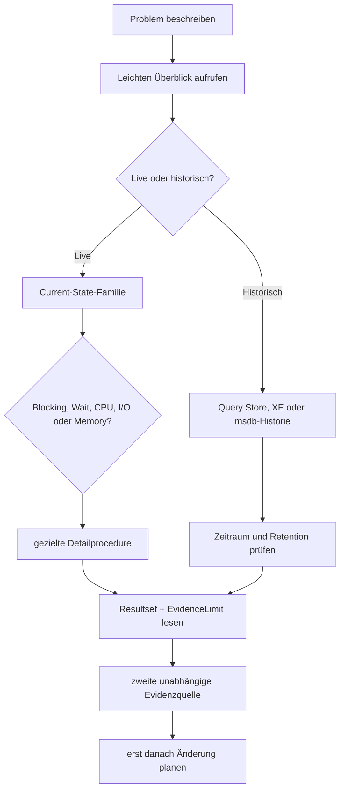

# Analysehandbuch für SQL_Server_Analyze

**Stand:** 17. Juli 2026  
**Geltungsbereich:** alle 79 im öffentlichen Procedure-Referenzhandbuch aufgeführten Procedures  
**Zielgruppe:** Analyseanfänger, Datenbankentwickler und erfahrene SQL-Server-Administratoren

## Wo befinden sich die eigentlichen Objektbeschreibungen?

Die Datei `Deep_Research_Analysis_Guides_Concept.md` ist ausschließlich das Forschungs- und Strukturkonzept. Sie ist **nicht** das eigentliche Analysehandbuch.

Für die praktische Arbeit stehen zwei Einstiege zur Verfügung:

1. [Objektindex mit Direktlinks zu allen 79 umfassenden Procedure-Beschreibungen](Object_Index.md)
2. die nachstehenden Familienguides mit den vollständigen Resultset-, Spalten-, Interpretations-, Beispiel- und Folgeanalyseabschnitten

## Zweck

Dieser Bereich erklärt nicht nur, wie eine Procedure aufgerufen wird, sondern vor allem:

- welche Frage sie beantwortet,
- welche Datenquellen und Zeiträume hinter den Resultsets stehen,
- wie jede Spalte beziehungsweise zusammengehörige Spaltengruppe zu lesen ist,
- welche Werte normal, auffällig, kritisch oder irreführend sein können,
- welche Aussagegrenzen durch Neustart, Cache-Eviction, Rechte, Featurestatus oder Sampling entstehen,
- welche Folgeanalyse kontrolliert als Nächstes ausgeführt werden sollte,
- welche Kosten die Analyse selbst verursachen kann.

Alle Beispiele sind vollständig synthetisch und verwenden ausschließlich `Example*`-Bezeichnungen.

## Dokumente

| Bereich | Dokument | Enthaltene Procedures |
|---|---|---:|
| Objektweiser Einstieg | [Object_Index.md](Object_Index.md) | Direktlinks zu allen 79 Objekten |
| Gemeinsame Verträge | [Common_Contracts.md](Common_Contracts.md) | frameworkweite Status-, Ausgabe-, Filter-, Kosten- und Evidenzregeln |
| Common | [01_Common.md](01_Common.md) | 4 |
| Current State | [02_Current_State.md](02_Current_State.md) | 10 |
| Object und Index | [03_Object_Index.md](03_Object_Index.md) | 11 |
| Plan Cache | [04_Plan_Cache.md](04_Plan_Cache.md) | 6 |
| Query Store | [05_Query_Store.md](05_Query_Store.md) | 9 |
| Extended Events | [06_Extended_Events.md](06_Extended_Events.md) | 6 |
| Infrastruktur | [07_Infrastructure.md](07_Infrastructure.md) | 12 |
| Server Health | [08_Server_Health.md](08_Server_Health.md) | 17 |
| Versionsadaptive Spezialanalysen | [09_Version_Adaptive.md](09_Version_Adaptive.md) | 4 |
| **Summe** | | **79** |

Das Forschungs- und Strukturkonzept bleibt als Hintergrunddokument verfügbar:

- [Deep_Research_Analysis_Guides_Concept.md](Deep_Research_Analysis_Guides_Concept.md)

## Schnellwahl nach Symptom

| Symptom oder Frage | Erster Aufruf | Typische Folgeanalyse |
|---|---|---|
| Benutzer melden Hänger | `USP_CurrentOverview` | `USP_CurrentBlocking`, `USP_CurrentWaits`, `USP_CurrentRequests` |
| einzelne laufende Abfrage langsam | `USP_CurrentRequests` | `USP_QueryStats`, `USP_ShowplanAnalysis`, Query Store |
| Blockierung | `USP_CurrentBlocking` | `USP_CurrentTransactions`, `USP_CurrentRequests`, Extended Events |
| Memory-Grant-Stau | `USP_CurrentMemoryGrants` | `USP_CurrentRequests`, `USP_ShowplanAnalysis`, `USP_ServerMemory` |
| TempDB wächst oder ist voll | `USP_CurrentTempDB` | `USP_TempDBConfiguration`, `USP_CurrentRequests` |
| I/O-Latenz | `USP_CurrentIO` mit Stichprobe | `USP_DatabaseCapacityAnalysis`, OS-/Storage-Monitoring |
| Transaktionslog voll | `USP_CurrentLog` | `USP_CurrentTransactions`, `USP_BackupRecovery` |
| Top-CPU oder Top-I/O historisch | `USP_QueryStoreRuntimeStats` | `USP_QueryStorePlanChanges`, `USP_QueryStoreRegressions` |
| Top-CPU aus aktuellem Cache | `USP_QueryStats` | `USP_QueryHashAnalysis`, `USP_ShowplanAnalysis` |
| Index wird nicht genutzt | `USP_IndexUsage` | `USP_IndexOperationalStats`, Query Store, Abhängigkeitsprüfung |
| fehlender Index vermutet | `USP_MissingIndexes` | `USP_ObjectInventory`, `USP_IndexUsage`, Plananalyse |
| Fragmentierung | `USP_IndexPhysicalStats` | `USP_IndexUsage`, Wartungsfenster- und Seitendichteprüfung |
| Statistikproblem | `USP_Statistics` | `USP_StatisticsDistributionAnalysis`, Showplan |
| Columnstore-Problem | `USP_Columnstore` | Rowgroup-, Segment- und Dictionary-Tiefenoptionen |
| Backup-/Recovery-Risiko | `USP_BackupRecovery` | `USP_BackupChainAnalysis`, Restore-Test |
| Integritätsverdacht | `USP_DatabaseIntegrityAnalysis` | Page Details, CHECKDB, Backupkette, HADR |
| Availability-Group-Lag | `USP_AvailabilityDeepAnalysis` | Performance Counter, Netzwerk, Storage, Cluster |
| Agent-Fehler | `USP_AgentMonitoringAnalysis` | `USP_AgentJobs`, Database Mail, Alert-Konfiguration |
| kritische Engine-Ereignisse | `USP_CriticalEngineEvents` | `USP_ExtendedEventsReadEvents`, Error Log und Infrastruktur |
| unbekannte Spezialfeatures | `USP_SpecialFeatureInventory` | empfohlenes Deep-Dive-Modul |
| In-Memory OLTP | `USP_InMemoryOltpAnalysis` | Hashindex-, Checkpoint- und Resource-Pool-Prüfung |
| Temporal Tables | `USP_TemporalAnalysis` | Retention-, History-Index- und Kapazitätsprüfung |

## Evidenzarten

| Evidenzart | Typische Quellen | Hauptgrenze |
|---|---|---|
| Live-Momentaufnahme | `dm_exec_requests`, Waiting Tasks, Locks | kann kurzlebige oder bereits beendete Zustände verpassen |
| Stichprobe/Delta | I/O, Waits, Performance Counter, Contention | Ergebnis hängt stark vom gewählten Intervall ab |
| kumulative DMV | Index Usage, Query Stats, einige OS-DMVs | Reset bei Neustart, Cache-Eviction, DDL oder Datenbankstatuswechsel |
| historisch persistiert | Query Store, msdb-Backup-/Agent-Historie | Retention, Cleanup, Capture Mode und Historienlücken |
| Ereignishistorie | Extended Events | nur erfasste, noch vorhandene Targetdaten |
| Katalog-/Konfigurationssicht | `sys.*`-Kataloge | sichtbarer Berechtigungs- und Plattformscope |
| normalisierte Findings | JSON-Verträge der Spezialmodule | Triage, keine automatische Ursachenfeststellung |

## Kostenklassen

| Klasse | Bedeutung |
|---|---|
| `LOW` | kleine DMV- oder Katalogabfragen, normalerweise ad hoc unkritisch |
| `MEDIUM` | breitere Instanz-/Datenbankabfragen, XML-Auswertung oder approximative Größenstatistik |
| `HIGH` | breite Cache-, Plan-, Histogramm-, Segment- oder Cross-Database-Analyse |
| `HIGH_OPT_IN` | explizit aktivierte Tiefenpfade, Sampling, XML-/Targetdaten oder potentiell große Katalogscans |

Die Kostenklasse ist keine Laufzeitgarantie. Servergröße, Cachegröße, Zahl der Datenbanken, Objektzahl, Berechtigungsfehler und Ausgabeumfang beeinflussen die tatsächliche Last.

## Allgemeiner Anfänger-Workflow

## Grundsatz für Änderungen

Keine Analyse-Procedure dieses Frameworks ersetzt:

- einen getesteten Restore,
- einen vollständigen Integritätscheck,
- eine belastbare Baseline,
- eine Query- und Planprüfung,
- eine Change-, Rollback- und Lastabschätzung.

Aus einem einzelnen Resultset darf daher keine automatische DDL-, Konfigurations-, Failover-, Kill-, Repair- oder Indexentscheidung abgeleitet werden.

## Verwandte Repositorydokumente

- [Procedure_Reference.md](../Reference/Procedure_Reference.md)
- [Resultset_Conventions.md](../Reference/Resultset_Conventions.md)
- [Call_Catalog.md](../Reference/Call_Catalog.md)
- [Special_Case_Modules.md](../Architecture/Special_Case_Modules.md)
- [Runtime_Data_and_Repository_Privacy.md](../Architecture/Runtime_Data_and_Repository_Privacy.md)
- [Test_Matrix.md](../Quality/Test_Matrix.md)
