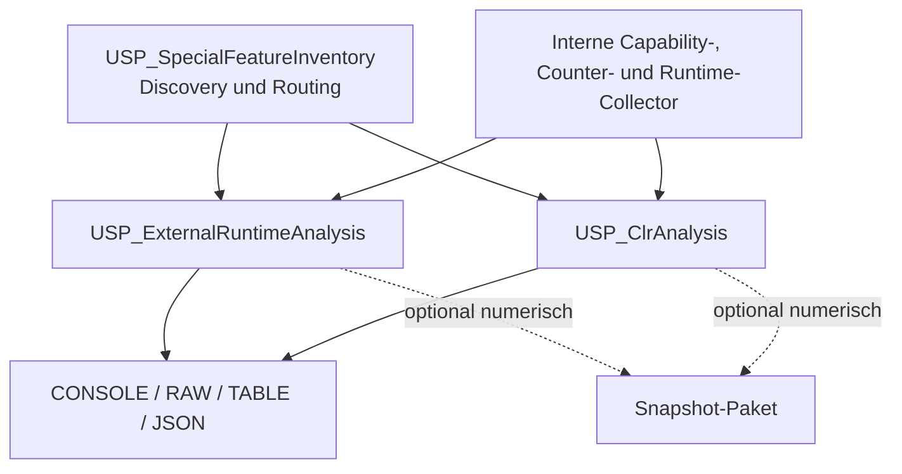

# RUNTIME-001 – External Runtime und SQL CLR Analysis

**Stand:** 22. Juli 2026  
**Status:** geplantes nächstes SubProject; noch nicht implementiert  
**Zielversionen:** SQL Server 2019, 2022 und 2025

## 1. Auftrag und Abgrenzung

RUNTIME-001 erweitert SQL Server Analyze um abfragbare Diagnoseverfahren für zwei technisch getrennte Ausführungsmodelle:

- das out-of-process Extensibility Framework für R, Python, Java, C# und Custom Language Extensions;
- SQL CLR für von SQL Server gehostete .NET-Assemblies und CLR-Datenbankobjekte.

Geplant sind zwei getrennte öffentliche Procedures:

- `[monitor].[USP_ExternalRuntimeAnalysis]` für External Scripts, Language Extensions, Libraries, Launchpad und External Resource Pools;
- `[monitor].[USP_ClrAnalysis]` für SQL CLR, Assemblies, AppDomains, Tasks, Speicher und Sicherheitskontext.

`[monitor].[USP_SpecialFeatureInventory]` bleibt der leichtgewichtige Einstieg. Es erkennt Konfiguration und sichtbare Katalognutzung und soll nach Implementierung auf das passende Deep-Dive-Modul verweisen. Bis zur Implementierung bleiben seine Modulstatus für `CLR`, `EXTERNAL_RUNTIME` und `EXTERNAL_SCRIPTS` unverändert `NOT_PLANNED`; das Planungsdokument täuscht keine vorhandene Laufzeitfunktion vor.

Nicht Bestandteil des ersten Releases sind:

- Ausführung fremder Scripts oder Assemblies als Health Check;
- Aktivierung von `external scripts enabled`, `clr enabled` oder Resource Governor;
- Start, Stop oder Konfiguration des Launchpad Service;
- Installation von Runtimes, Packages, JARs, Assemblies oder Libraries;
- automatische Extended-Events-Session, SQL-Agent-Job oder Betriebssystemüberwachung;
- Persistenz von Code, Parametern, Binärinhalten oder Identitäten im Frameworkkern.

## 2. Ausgangslage im Framework

Der aktuelle Frameworkstand besitzt bereits Teilabdeckungen, die RUNTIME-001 korrelieren und nicht duplizieren soll.

| Bestehender Baustein | Aktueller Beitrag | Konsequenz für RUNTIME-001 |
|---|---|---|
| `USP_SpecialFeatureInventory` | zählt benutzerdefinierte CLR-Assemblies, External Languages und Libraries und liest `external scripts enabled`; alle drei Deep-Dives sind noch `NOT_PLANNED` | bleibt Discovery- und Routing-Einstieg |
| `USP_CurrentRequests` | zeigt laufende Requests und `executing_managed_code` | neue Module materialisieren nur den fachspezifischen Requestkontext; bestehender RAW-Vertrag wird nicht beiläufig erweitert |
| `USP_ResourceGovernorAnalysis` | analysiert reguläre Pools und Workload Groups | External Resource Pools werden im External-Runtime-Modul ergänzt und fachlich getrennt ausgewertet |
| `USP_PerformanceCounters` | typisierte Counter und optionales Sampling | gemeinsame Counterlogik wiederverwenden; keine zweite öffentliche Samplingarchitektur |
| `USP_ServerSecurityConfiguration` | relevante Serverkonfiguration und Sicherheitsmerkmale | Findings referenzieren vorhandene Evidenz, lesen zwingende Konfigurationswerte aber innerhalb desselben Aufrufs einmalig |
| Capability- und Analyseklassenmodell | Version, Plattform, Rechte und Ressourcen-Gate | jede optionale Quelle erhält einen eigenen Capability- und SourceStatus-Pfad |
| Snapshot-/Baseline-Paket | optionale, getrennte Persistenz numerischer Zeitreihen | erst nach stabilen Current-State-Modulen um deaktivierte Collector erweiterbar |

## 3. Zielarchitektur



Architekturentscheidungen:

- Die öffentlichen Procedures gehören nach `Code/09_VersionAdaptive`, weil Quellen, Spalten, Rechte und Plattformgrenzen versionsabhängig sind.
- Wiederverwendbare Capability-, Sampling- und SourceStatus-Logik gehört nach `Code/01_Common`.
- Ein öffentliches Analyseverfahren ruft das andere nicht auf. So bleiben Resultsetreihenfolge, Kosten, Berechtigungsstatus und Fehlerisolation kontrollierbar.
- Vorhandene öffentliche RAW-, TABLE- und JSON-Verträge werden in der ersten Ausbaustufe nicht verändert.
- Das Modul ist zunächst Bestandteil des vollständigen Frameworkinstallers. Ein eigener Teilinstaller ist erst nach einer dokumentierten Abhängigkeitsschließung zu entscheiden und gehört nicht automatisch zum ersten Release.

## 4. Verbindliches Evidenzmodell

Die Implementierung muss Konfiguration, Registrierung, aktuellen Zustand und historische Beobachtung strikt trennen.

| Evidenzebene | Zulässige Aussage | Nicht zulässige Schlussfolgerung |
|---|---|---|
| `external scripts enabled` oder `clr enabled` | Serverkonfiguration ist aktiviert oder deaktiviert | Runtime ist installiert, startfähig oder wurde bereits verwendet |
| Datenbankkataloge | Sprache, Library oder Assembly ist im sichtbaren Scope registriert | Objekt ist ausführbar oder fehlerfrei |
| Launchpad- oder CLR-Hostzustand | Hostkomponente ist aktuell sichtbar und besitzt einen Zustand | konkrete Library oder Assembly funktioniert |
| Live-DMVs | Request oder CLR-Task war am Messzeitpunkt aktiv | vollständige Ausführungshistorie |
| kumulative DMV-/Counterwerte | Aktivität seit dem jeweiligen Start- oder Resetpunkt | einzelne Aufrufe, exakte Ursache oder SLA |
| vorhandene Extended Events oder Errorlogs | Ereignis liegt im gelesenen Capture- und Retentionfenster | Ereignisse vor Capturebeginn oder außerhalb des Prozesses |
| Betriebssystemmetriken | Prozess-CPU, Working Set, Crash und externe Logs | gehört nicht zum reinen T-SQL-Core |

Wichtige Grenzen:

- `sys.dm_external_script_requests` enthält nur aktuell aktive externe Requests.
- `sys.dm_external_script_execution_stats` ist eine kumulative Feature-Nutzungsstatistik und keine allgemeine Ausführungshistorie beliebiger Scripts.
- SQL-Request-CPU und CPU externer Runtimeprozesse dürfen nicht zu einer unbelegten per-Request-Gesamt-CPU verrechnet werden.
- „Keine aktive Ausführung“ ist `NO_DATA`, nicht automatisch „gesund“.
- Fehlende Registrierung beweist bei reservierten oder setupseitig bereitgestellten R-/Python-Pfaden nicht automatisch eine fehlende Runtime.
- Ab SQL Server 2022 beweist die SQL-Server-Version nicht, dass eine R-, Python- oder Java-Runtime installiert wurde.

## 5. `USP_ExternalRuntimeAnalysis`

### 5.1 Fachlicher Umfang

Das Modul analysiert:

- R, Python, Java, C# und Custom Language Extensions;
- External Languages, Language Files und External Libraries ausschließlich über freigegebene Metadaten;
- aktive External-Script-Requests und deren SQL-Request-, Wait- und Blockingkontext;
- External Resource Pools einschließlich Prozesszahl, CPU, I/O und Memory;
- External-Scripts-Performance-Counter;
- kumulative External-Script-Execution-Stats mit korrekter Aussagegrenze;
- Feature-, Plattform-, Berechtigungs- und Launchpad-Capabilities.

SQL CLR ist ausdrücklich ausgeschlossen.

### 5.2 Geplante Resultsets

| Resultset | Inhalt und Primärquellen |
|---|---|
| `moduleStatus` | Gesamtstatus, Partialität, Version, Plattform, Messzeitpunkte und Fehlergrenze |
| `sourceStatus` | Verfügbarkeit, Capability, Berechtigung, Lesezeitpunkt und Teilstatus je Quelle |
| `configuration` | `external scripts enabled`, Plattform- und Launchpad-Evidenz |
| `databaseStatus` | Auswahl-, Sichtbarkeits-, Sperr- und Fehlerstatus je Datenbank |
| `languages` | `sys.external_languages` und sichere Dateimetadaten ohne Binärinhalt |
| `libraries` | `sys.external_libraries` ohne Package- oder Libraryinhalt |
| `activeRequests` | `sys.dm_external_script_requests`, `sys.dm_exec_requests`, Sessions und Waits |
| `externalPools` | Konfiguration und aktuelle/kumulative Werte aus External Resource Pools |
| `executionStats` | `sys.dm_external_script_execution_stats`, als Feature-Nutzung gekennzeichnet |
| `performanceCounters` | typisierte External-Scripts-Counter, optional mit Delta |
| `findings` | deterministisch aus bereits materialisierter Evidenz erzeugte Befunde |
| `warnings` | Reset, Kürzung, unlesbare Quelle und Aussagegrenze |

### 5.3 Bewertungsregeln

Zulässige deterministische Findings sind beispielsweise:

- External Scripts aktiviert, aber Launchpad nach verfügbarer Evidenz nicht betriebsbereit;
- aktive Prozesszahl erreicht das konfigurierte `max_processes`;
- `Execution Errors` steigt innerhalb eines gültigen Messintervalls;
- registrierte Language-Dateimetadaten passen nicht zur erkannten Plattform;
- aktiver externer Request wartet, ist geblockt oder bildet den Kopf einer Blockerkette;
- Runtime ist registriert, ihre tatsächliche Installation oder Startfähigkeit bleibt aber unverifiziert.

CPU-, Memory- und I/O-Werte werden gerankt, mit Zeitraum und Nenner dargestellt und nicht mit pauschalen universellen Grenzwerten als kritisch klassifiziert. Ein optionales Sample verwendet exakt dasselbe Fenster für Performance Counter und External-Pool-Zähler. Ändert sich `statistics_start_time`, sinkt ein kumulativer Zähler oder wechselt eine Instanzidentität, wird kein negatives Delta berechnet; stattdessen entsteht `RESET_BOUNDARY`.

Das Analyseverfahren ruft niemals `sp_execute_external_script` zu Testzwecken auf.

## 6. `USP_ClrAnalysis`

### 6.1 Fachlicher Umfang

Das Modul analysiert ausschließlich SQL CLR:

- `clr enabled`, `clr strict security`, `lightweight pooling` und Plattform;
- benutzerdefinierte Assemblies, Assemblymodule, Referenzen und sichtbare Typverwendungen;
- CLR Host Properties, AppDomains, geladene Assemblies und aktuelle CLR Tasks;
- Requests mit `executing_managed_code`;
- CLR Memory Clerks und CLR Performance Counter;
- sicherheitsrelevante Konstellationen, ohne Rechte oder Trustzustände zu verändern.

Die C# Language Extension gehört nicht in dieses Modul.

### 6.2 Geplante Resultsets

| Resultset | Inhalt und Primärquellen |
|---|---|
| `moduleStatus` | Gesamtstatus, Partialität, Version, Plattform und Fehlergrenze |
| `sourceStatus` | Capability-, Berechtigungs- und Fehlerstatus je CLR-Quelle |
| `configuration` | `clr enabled`, `clr strict security`, `lightweight pooling` und Plattform |
| `databaseStatus` | datenbankbezogene Sichtbarkeit und isolierte Teilfehler |
| `assemblies` | `sys.assemblies` ohne Assembly-Binärdaten |
| `assemblyModules` | `sys.assembly_modules`, Objekttyp, Schema, Klasse und Methode |
| `assemblyDependencies` | `sys.assembly_references` und sichtbare Typbezüge |
| `clrProperties` | `sys.dm_clr_properties` |
| `appDomains` | `sys.dm_clr_appdomains` |
| `loadedAssemblies` | `sys.dm_clr_loaded_assemblies` |
| `clrTasks` | `sys.dm_clr_tasks` mit vorsichtiger Task-/Requestkorrelation |
| `activeRequests` | Requests mit `executing_managed_code`; keine Aufrufhistorie |
| `memory` | `MEMORYCLERK_SQLCLR` und `MEMORYCLERK_SQLCLRASSEMBLY` |
| `performanceCounters` | typisierte CLR-Counter, optional mit Delta |
| `findings` und `warnings` | Konfiguration, Security, Reset und Evidenzgrenzen |

### 6.3 Bewertungsregeln

Geplante Findings:

- benutzerdefinierte Assemblies vorhanden, CLR aber deaktiviert;
- `clr strict security` deaktiviert;
- CLR zusammen mit `lightweight pooling` aktiviert;
- `TRUSTWORTHY ON` zusammen mit sichtbaren `EXTERNAL_ACCESS`- oder `UNSAFE`-Assemblies;
- geladene Assembly oder CLR Task ist nicht vollständig einer sichtbaren Datenbank oder einem Modul zuordenbar;
- aktiver Managed-Code-Request wartet oder ist geblockt;
- hohe CLR-Speicherbelegung als gerankte Beobachtung, nicht als universelles Fehlerurteil.

Eine exakte Aussage, ob eine Assembly über ihren Binary-Hash in `sys.trusted_assemblies` vertraut ist, würde einen expliziten Hash-/Binarypfad erfordern. Dieser Pfad ist nicht Bestandteil der ersten Ausbaustufe. Das Modul dokumentiert Trust-List-, Signatur- und Permission-Kontext sowie die verbleibende Evidenzlücke.

Plattformgrenzen werden capability-basiert und nicht anhand des Produktnamens geraten. Insbesondere benötigen SQL CLR unter Linux und `EXTERNAL_ACCESS`/`UNSAFE` eine eigene dokumentierte Support- und Testmatrix.

## 7. Öffentlicher Parametervertrag

Beide Procedures übernehmen die bestehenden Frameworkparameter, soweit fachlich anwendbar:

```sql
@DatabaseNames                nvarchar(max)  = NULL,
@DatabaseNamePattern          nvarchar(4000) = NULL,
@SystemdatenbankenEinbeziehen bit            = 0,
@HighImpactConfirmed          bit            = 0,
@MaxZeilen                    int            = 100,
@LockTimeoutMs                int            = 0,
@ResultSetArt                 varchar(16)    = 'CONSOLE',
@ResultTablesJson             nvarchar(max)  = NULL,
@JsonErzeugen                 bit            = 0,
@Json                         nvarchar(max)  = NULL OUTPUT,
@Hilfe                        bit            = 0
```

Modulspezifisch vorgesehen:

| External Runtime | SQL CLR |
|---|---|
| `@LanguageNames`, `@LanguageNamePattern` | `@AssemblyNames`, `@AssemblyNamePattern` |
| `@SampleSeconds` von 0 bis 60 | `@SampleSeconds` von 0 bis 60 |
| `@MitDateimetadaten = 0` | `@MitModulzuordnung = 1` |
| `@MitBerechtigungsanalyse = 0` | `@MitBerechtigungsanalyse = 0` |
| `@MitSitzungskontext = 0` | `@MitSitzungskontext = 0` |
| `@NurProblematisch = 0` | `@NurProblematisch = 0` |

Die endgültigen Namen, Datentypen, Defaults, Status-OUTPUT-Parameter und Resultsetreihenfolgen werden in Phase 0 als öffentlicher Vertrag festgeschrieben. Dabei gelten unverändert:

- standardmäßig alle sichtbaren, zugänglichen, `ONLINE` User-Datenbanken;
- keine Sonderstellung der aktuellen oder der Frameworkdatenbank;
- keine Vorbegrenzung der Datenbankzahl;
- exakte bracket-aware Pipe-Liste und Pattern als getrennte Filter;
- globale Sortierung vor dem fachlichen Ausgabelimit;
- `CONSOLE`, `RAW`, `TABLE`, `NONE` und JSON aus derselben Materialisierung;
- atomarer TABLE-Preflight vor dem ersten fachlichen Read;
- sichtbare Warning bei Kürzung oder abgeschnittenem Resultset.

## 8. Verarbeitungsablauf je Aufruf

1. Das Verfahren validiert Steuerparameter, Output Mode, Filter und sämtliche TABLE-Ziele, ohne eine fachliche Quelle zu lesen.
2. Es ermittelt Produktversion, Plattform, Edition, Objekt- und Spaltenverfügbarkeit sowie die erforderlichen Berechtigungen.
3. Es bestimmt die tatsächlich aktivierte Analyseklasse: `EXTERNAL_RUNTIME_CURRENT`, `CLR_CURRENT` und optional `CATALOG_DEEP`.
4. Es prüft das Gruppen-Gate und `@HighImpactConfirmed` ausschließlich für den tatsächlich aktivierten Deep-Pfad.
5. Es bildet die Datenbankkandidaten über den gemeinsamen Frameworkpfad.
6. Es materialisiert die Serverkonfiguration einmalig.
7. Es liest die Datenbankkataloge je Datenbank mit `QUOTENAME`, direktem `sys.*`-Zugriff, `LOCK_TIMEOUT` und isoliertem `TRY/CATCH`.
8. Es materialisiert Runtime-DMVs und Counter am Messpunkt `t1` jeweils einmalig.
9. Nur bei `@SampleSeconds > 0` wartet es einmal und liest alle Deltaquellen am gemeinsamen Messpunkt `t2`.
10. Es berechnet Deltas, Resetgrenzen, SourceStatus und Partialität.
11. Es korreliert bereits materialisierte Quellen und erzeugt Findings; fehlende Evidenz bleibt sichtbar.
12. Es sortiert global und wendet danach die Resultset- und Analyseobjektlimits an.
13. Es projiziert CONSOLE, RAW, TABLE und JSON aus denselben Temp-Tabellen.

Eine verweigerte, fehlende oder gesperrte Quelle verwirft erfolgreich erhobene andere Quellen nicht. Der Gesamtstatus wird `AVAILABLE_LIMITED`, sobald fachlich nutzbare Teilresultate neben einer Evidenzlücke existieren. Ohne verwertbare Quelle bleibt der spezifische Status wie `DENIED_PERMISSION`, `FEATURE_DISABLED`, `UNAVAILABLE_VERSION`, `LOCK_TIMEOUT` oder `SOURCE_UNAVAILABLE` erhalten.

## 9. Performance-, Locking- und Fehlervertrag

- Jede DMV, jeder Counterbestand und jede Katalogquelle wird je Messpunkt höchstens einmal gelesen.
- Keine Child-Procedure darf dieselbe DMV im selben Aufruf erneut scannen.
- Systemkataloge werden direkt über `sys.*` mit der Frameworkstrategie für `WITH (NOLOCK)` gelesen.
- Implizite Cross-Database-Auflösung mit `OBJECT_ID()` oder `OBJECT_NAME()` ist ausgeschlossen.
- Dynamische Datenbankkontexte verwenden validierte sichtbare Namen und `QUOTENAME`.
- `SET LOCK_TIMEOUT` wird lokal gesetzt und vor Rückgabe auf den vorherigen Wert zurückgeführt.
- Fehler je Datenbank und Quelle werden isoliert; andere Datenbanken und Quellen laufen weiter.
- Breite Permission-, Module-, Dependency- oder Typauflösung ist `CATALOG_DEEP` und verlangt die dafür geltenden Gates.
- Cross-Database allein ist kein High-Impact-Merkmal.
- Standard-Sampling ist `0`; ein aktives Sample ist auf maximal 60 Sekunden begrenzt.
- Kein Pfad verändert Server-, Datenbank-, Resource-Governor-, CLR-, Launchpad-, XE- oder Agentzustand.

## 10. Datenschutz und Security

Standardmäßig nicht lesen, materialisieren oder ausgeben:

- `sys.external_language_files.content`;
- Parameter und `environment_variables` externer Ausführungen;
- `sys.external_library_files.content`;
- `sys.assembly_files.content`;
- Script-, Modul- oder Batchtext;
- Parameterwerte und Ausführungspläne;
- Login, Host, Clientprogramm und External Worker Account ohne `@MitSitzungskontext = 1`;
- Betriebssystempfade, sofern eine technische Capability nicht ausdrücklich Dateimetadaten benötigt.

Language-, Library-, Assembly-, Datenbank-, Schema- und Objektnamen sind notwendige technische Inventarmetadaten, können aber schutzbedürftig sein. Sie werden in den Laufzeitvertrag aufgenommen und nicht automatisch anonymisiert. `@MitSitzungskontext`, `@MitDateimetadaten` und `@MitBerechtigungsanalyse` bleiben separate Opt-ins. High-Impact-Freigabe ist keine Datenschutzfreigabe.

Installations- und Analysecode:

- erteilt keine SQL-Server-Rechte;
- liest keine Secrets, Keys oder Binärpayloads;
- führt keinen externen Code aus;
- verwendet keine frei konfigurierbaren SQL-Fragmente;
- persistiert im Frameworkkern keine Laufzeitevidenz.

## 11. Frameworkintegration

Nach erfolgreicher Implementierung sind folgende Integrationen erforderlich:

- `USP_SpecialFeatureInventory`
  - `CLR` → `USP_ClrAnalysis`, Status `IMPLEMENTED`;
  - `EXTERNAL_RUNTIME` und `EXTERNAL_SCRIPTS` → `USP_ExternalRuntimeAnalysis`, Status `IMPLEMENTED`.
- `USP_ServerFeatureCapabilities`
  - Capability-Zeilen für External Languages, aktive External Requests, External Pools, Launchpad, CLR Host und Trusted Assemblies.
- `VW_AnalyseClassCatalog`
  - `EXTERNAL_RUNTIME_CURRENT` und `CLR_CURRENT`;
  - tiefe Katalogpfade weiterhin über `CATALOG_DEEP`.
- `VW_AnalysisCatalog`, `VW_AnalysisSearchTerm`, `VW_AnalysisRelation`
  - Suchbegriffe R, Python, Java, C#, Launchpad, External Script, CLR, Assembly, AppDomain und Managed Code.
- Relationen
  - External Runtime → Current Requests, Resource Governor, Performance Counter, Extended Events und Errorlog;
  - SQL CLR → Current Requests, Server Security, Performance Counter, Extended Events und Errorlog.
- Installer, Objektinventar, Procedure-Referenz, Resultsetinventar, Beispiele, Analysis Guides und Testverträge.

Bestehende öffentliche Resultsets werden zunächst nicht erweitert. Insbesondere bleibt `ExternalScriptRequestId` im neuen Modul, bis eine eigene Schema- und Kompatibilitätsentscheidung für `USP_CurrentRequests` getroffen wurde.

Jede neue Procedure-Seite erhält den Abschnitt **Source Select** mit den tatsächlichen Basis-SELECTs, Join-Schlüsseln, Capability-Guards, Resetregeln und bewusst ausgeschlossenen Spalten.

## 12. Optionaler Snapshot-Ausbau

Der Frameworkkern bleibt zustandslos. Erst nach Stabilisierung der Current-State-Verfahren sind zwei standardmäßig deaktivierte Collector vorgesehen.

`EXTERNAL_RUNTIME_METRICS`:

- Anzahl aktiver Requests und Prozesse;
- External-Pool-CPU- und I/O-Deltas;
- Peak Memory;
- Total-, Parallel- und Streaming-Executions;
- Execution-Error- und Execution-Time-Deltas.

`CLR_RUNTIME_METRICS`:

- Anzahl aktiver Managed-Code-Requests;
- CLR Tasks, AppDomains und geladene Assemblies;
- CLR Memory Clerk KB;
- ausgewählte CLR-Performance-Counter-Deltas.

Persistiert werden ausschließlich versionierte numerische Metriken, technische Collector-/Source-IDs, Zeitbezug, Resetstatus und Modulstatus. Nicht persistiert werden Scripttext, Parameter, Identitäten, Namen von Assemblies/Libraries/Languages, Pfade oder Binärdaten. Collector, Retention, Budget und Zielbindung folgen vollständig dem Snapshot-/Baseline-Paketvertrag.

## 13. Extended Events und Betriebssystemgrenze

DMVs und Counter liefern keine vollständige Historie. Eine spätere XE-Ausbaustufe darf vorhandene Engine-seitige Events versionsabhängig inventarisieren und lesen, aber keine Session automatisch erstellen oder ändern.

Ein Teil der Launchpad-/Runtime-Ereignisse entsteht außerhalb von `sqlservr.exe`. Vollständige Prozess-CPU, Working Set, Runtime-Crashs, Windows Event Log und externe Extensibility Logs bleiben deshalb eine dokumentierte Betriebssystem-Gegenprobe und außerhalb des T-SQL-Core.

## 14. Umsetzungsphasen

| Phase | Inhalt | Exit-Kriterium |
|---|---|---|
| 0 | öffentliche Parameter, Resultsets, Statuscodes, Datenschutz, Packaging und Quellenprojektionen festschreiben | Vertragsreview ohne T-SQL-Implementierung abgeschlossen |
| 1 | Analyseklassen, Capability-Zeilen und interne Counter-/Runtime-Collector | Rechte-, Version- und Quellenpfade auf SQL Server 2025 verifiziert |
| 2 | `USP_ExternalRuntimeAnalysis` | disabled, configured, registered, active, reset und permission-denied getestet |
| 3 | `USP_ClrAnalysis` | Konfiguration, Katalog, Tasks, Memory und Security-Findings getestet |
| 4 | Inventory-, Navigator-, Search-, Relation- und Installerintegration | alle neuen Objekte über Frameworksuche auffindbar |
| 5 | optionale Snapshot-Collector | reset-sichere numerische Zeitreihen ohne Payload |
| 6 | vollständige Dokumentation und finale Testmatrix | SQL Server 2019, 2022 und 2025 freigegeben |

## 15. Abnahmematrix

Verpflichtend:

- Entwicklung und erster Feature-Positive-Lauf auf SQL Server 2025;
- finale Tests auf SQL Server 2019, 2022 und 2025;
- Windows und Linux mit jeweils dokumentierten Capability-Grenzen;
- R, Python, Java und C# Language Extension als getrennte Runtimefälle, soweit die Plattform sie unterstützt;
- Custom Language Extension als registrierter, nicht vorschnell als unsupported klassifizierter Fall;
- SQL CLR mit synthetischer SAFE-Assembly; Windows zusätzlich mit synthetischen Security-Metadaten für `EXTERNAL_ACCESS`/`UNSAFE`;
- Feature deaktiviert, fehlende Runtime, Launchpad nicht verfügbar, keine Aktivität und aktive Ausführung;
- vollständig und teilweise eingeschränkte Berechtigungen;
- `CONSOLE`, `RAW`, `TABLE`, `NONE` und JSON;
- Sampling ohne Reset, mit `statistics_start_time`-Wechsel und mit Zählerrückgang;
- Multi-Database-Teilfehler, `LOCK_TIMEOUT`, nicht sichtbare Datenbank und leere Kandidatenmenge;
- statische Prüfung, dass Binary-, Environment-, Parameter-, Scripttext- und Plan-Spalten nicht in den Standardpfad gelangen;
- Prüfung, dass kein Analysepfad Rechte vergibt, Features aktiviert, externe Programme startet oder Testcode ausführt;
- Dokumentationsgate für Source Select, Primärquellen, Kosten, sensible Felder, Evidenzgrenze und Gegenprobe.

`NOT_EXECUTED` ist kein Laufzeitnachweis. Ein leerer oder synthetischer Test ersetzt keinen Feature-Positive-Lauf auf der jeweiligen Zielplattform.

## 16. Primärquellen

- [Microsoft: Language Extensions overview](https://learn.microsoft.com/en-us/sql/language-extensions/language-extensions-overview?view=sql-server-ver17)
- [Microsoft: Compare Language Extensions to SQL CLR](https://learn.microsoft.com/en-us/sql/language-extensions/concepts/compare-extensibility-to-clr?view=sql-server-ver17)
- [Microsoft: Monitor Machine Learning Services with DMVs](https://learn.microsoft.com/en-us/sql/machine-learning/administration/monitor-sql-server-machine-learning-services-using-dynamic-management-views?view=sql-server-ver17)
- [Microsoft: `sys.dm_external_script_requests`](https://learn.microsoft.com/en-us/sql/relational-databases/system-dynamic-management-objects/sys-dm-external-script-requests?view=sql-server-ver17)
- [Microsoft: `sys.dm_external_script_execution_stats`](https://learn.microsoft.com/en-us/sql/relational-databases/system-dynamic-management-objects/sys-dm-external-script-execution-stats?view=sql-server-ver17)
- [Microsoft: External resource pool DMV](https://learn.microsoft.com/en-us/sql/relational-databases/system-dynamic-management-objects/sys-dm-resource-governor-external-resource-pools?view=sql-server-ver17)
- [Microsoft: `sys.external_languages`](https://learn.microsoft.com/en-us/sql/relational-databases/system-catalog-views/sys-external-languages-transact-sql?view=sql-server-ver17)
- [Microsoft: Monitor and troubleshoot CLR objects](https://learn.microsoft.com/en-us/sql/relational-databases/clr-integration/monitoring-and-troubleshooting-managed-database-objects?view=sql-server-ver17)
- [Microsoft: CLR programming concepts and platform support](https://learn.microsoft.com/en-us/sql/relational-databases/clr-integration/common-language-runtime-clr-integration-programming-concepts?view=sql-server-ver17)
- [Microsoft: Extended Events for Machine Learning Services](https://learn.microsoft.com/en-us/sql/machine-learning/administration/extended-events?view=sql-server-ver17)

## 17. Verwandte Frameworkverträge

- [Datenbank-, CONSOLE- und TABLE-Vertrag](Database_Console_Table_Contract.md)
- [Spezialfallmodule](Special_Case_Modules.md)
- [Datenschutz und Laufzeitausgaben](Runtime_Data_Privacy.md)
- [Ressourcenschutz und Berechtigungen](Authorization_Architecture.md)
- [Snapshot-/Baseline-Paket](Snapshot_Baseline_Package_Contract.md)
- [Testmatrix](../Quality/Test_Matrix.md)
