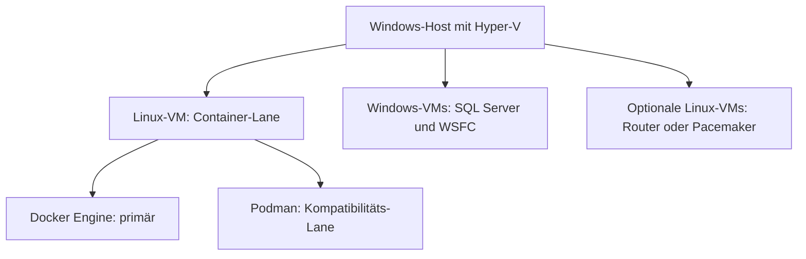

# LAB-001 – Reproducible Diagnostic Lab

**Status:** `RESEARCHED_NOT_IMPLEMENTED`  
**Stand:** 23. Juli 2026  
**Ziel:** Ein vollständig automatisierbares, ressourcenschonendes und ausschließlich synthetisches Diagnoselabor für SQL Server 2019, 2022 und 2025.

## 1. Zweck und Architekturentscheidung

LAB-001 soll die bisher fehlenden externen Laufzeitnachweise des Frameworks reproduzierbar erzeugen. Das Lab stellt keine Produktionsumgebung nach und ist kein allgemeiner SQL-Server-Benchmark. Es erzeugt kontrollierte Zustände, führt die betroffenen Analyseverfahren aus und prüft fachliche Findings, Statuswerte und Evidenzgrenzen.

Die verbindliche Zielarchitektur besteht aus drei Ebenen:

1. Hyper-V bildet das Infrastruktur-Fundament auf einem Windows-Host.
2. Eine dedizierte, minimale Linux-VM betreibt Docker Engine als primäre Container-Lane.
3. Podman wird in derselben Linux-VM als optionale, getrennt ausgeführte Kompatibilitäts-Lane unterstützt.

Vollständige Windows-Server-VMs unter Hyper-V übernehmen Windows-spezifische und clusterabhängige Szenarien. Docker Desktop und Podman Desktop dürfen für lokale Entwicklung verwendet werden, sind aber wegen ihrer zusätzlichen internen VM, backendabhängiger I/O- und Netzwerksteuerung und geringerer Reproduzierbarkeit nicht die kanonische Lab-Plattform.



Diese Kombination minimiert den Ressourcenverbrauch, weil der überwiegende Teil der Szenarien in kurzlebigen Containern ausgeführt wird. Vollständige VMs werden nur für Szenarien gestartet, die Windows, WSFC, vNUMA, eigene virtuelle Datenträger oder einen vollständigen Betriebssystemstart benötigen.

## 2. Abgrenzung der Aussagen

Der Plan trennt drei Aussageklassen:

| Klasse | Bedeutung |
|---|---|
| Dokumentiert | Die Aussage ist durch eine Hersteller- oder Projektquelle belegt. |
| Empfehlung | Die Festlegung ist eine Architekturentscheidung für LAB-001. |
| Zu validierende Annahme | Die Festlegung ist ein Startwert, der erst durch eine reale Lab-Ausführung bestätigt wird. |

Ressourcenbudgets, Laufzeiten, konkrete Imagegrößen und erreichbare Wait-Verteilungen sind zu validierende Annahmen. Sie werden nicht als Laufzeitnachweis behandelt.

## 3. Ziele

LAB-001 muss folgende Ziele erfüllen:

- SQL Server 2019, 2022 und 2025 werden mit demselben Szenariovertrag geprüft.
- Alle Testdaten, Namen, Logins, Zertifikate, Datenbanken und Workloads sind eindeutig synthetisch.
- Jedes Szenario ist über `Arrange`, `Act`, `Observe`, `Assert` und `Cleanup` beschrieben.
- Der Standardlauf startet nur die für das gewählte Szenario erforderliche Topologie.
- Docker und Podman verwenden denselben portablen Compose-Core; technische Abweichungen werden explizit in Engine-Overrides geführt.
- Hyper-V-VMs werden deklarativ beschrieben, idempotent aufgebaut und durch neue Differencing Disks zurückgesetzt.
- Container-Images, VM-Basisimages, Tools und SQL-Server-Versionen werden versioniert und mit Digest beziehungsweise Prüfsumme gebunden.
- Reproduzierbar ist der fachliche Befund, nicht ein identischer Wait-Wert oder eine identische Laufzeit.
- Jeder öffentliche Analyzer-Pfad erhält mindestens einen positiven Nachweis oder eine ausdrücklich begründete Fixture-Zuordnung.
- Das Lab verändert keine Ressource außerhalb seines eigenen Namens-, Netzwerk-, Datenträger- und Run-ID-Scopes.
- Rohdaten und umgebungsspezifische Laufzeitevidenz werden nicht automatisch in das Repository geschrieben.

## 4. Nichtziele und technische Grenzen

LAB-001 leistet ausdrücklich keine:

- Aussage über Produktionsdimensionierung oder produktive Leistungsfähigkeit;
- Garantie identischer Wartezeiten, CPU-Werte, Latenzen oder Ausführungspläne auf unterschiedlichen Hosts;
- realistische Simulation eines physischen SAN-, Controller-, Strom-, Standort- oder Hyper-V-Hostausfalls auf nur einem physischen Rechner;
- automatische Verwendung realer Datenbanken, Backups, Ausführungspläne, Logs oder Screenshots;
- Verteilung von Windows-, SQL-Server- oder sonstigen Installationsmedien;
- Ablage von Produktschlüsseln, Kennwörtern, privaten Schlüsseln, Zertifikaten oder lokalen Pfaden;
- Unterstützung von CPU-Emulation als kanonische SQL-Server-Containerplattform;
- Gleichsetzung eines Docker-/Podman-Desktop-Backends mit einer kontrollierten nativen Linux-Container-Lane.

Nicht lokal und sicher erzeugbare Zustände werden als `CONTRACT_FIXTURE` geführt. Die Fixture prüft ausschließlich den Analyzer-Vertrag und darf nicht als realer Infrastrukturtest ausgewiesen werden.

## 5. Plattformverantwortung

| Funktionsgruppe | Docker Engine in Linux-VM | Podman in Linux-VM | Hyper-V-Windows | Hyper-V-Linux | Fixture |
|---|:---:|:---:|:---:|:---:|:---:|
| Blocking, Deadlocks und Latches | primär | Kompatibilität | möglich | möglich | nein |
| CPU-, Worker- und Memory-Druck | primär | Kompatibilität | ergänzend | ergänzend | nein |
| TempDB, Log, Plan Cache und Query Store | primär | Kompatibilität | ergänzend | ergänzend | nein |
| Manuelles Linux-AG ohne Cluster Manager | primär | Kompatibilität | nicht erforderlich | möglich | nein |
| Log Shipping und Transactional Replication | primär | Kompatibilität | ergänzend | möglich | nein |
| Netzwerkfehler über `tc/netem` | primär | Kompatibilität | über Router | primär | nein |
| SQL-Server-Windows-Pfade | nein | nein | primär | nein | nur Negativvertrag |
| WSFC und automatisches AG-Failover | nein | nein | primär | nein | nur Negativvertrag |
| Failover Cluster Instance | nein | nein | primär | nein | nur Negativvertrag |
| Windows Service Accounts, Registry und Performance Counter | nein | nein | primär | nein | nur Negativvertrag |
| vNUMA und getrennte virtuelle Controller | nein | nein | primär | ergänzend | nein |
| Linux-Pacemaker-AG | nicht kanonisch | nicht kanonisch | nein | primär | möglich |
| Physischer Host-, SAN- oder Standortausfall | nein | nein | auf Einzelhost nicht real | auf Einzelhost nicht real | primär |

`Primär` bezeichnet die kanonische Nachweisplattform. `Kompatibilität` bedeutet, dass ein Szenario erst nach einem eigenen Podman-Lauf als unterstützt gilt.

## 6. Vorgesehene Repositorystruktur

Der Plan liegt unter `Documentation/Architecture`. Die spätere Implementierung erhält einen eigenen Top-Level-Bereich `Lab`, weil sie weder Framework-Produktcode unter `Code` noch reine Dokumentation ist.

```text
Documentation/
└── Architecture/
    └── Reproducible_Diagnostic_Lab_Plan.md

Lab/
├── README.md
├── .gitignore
├── Config/
│   ├── lab.config.example.psd1
│   ├── resource-profiles.json
│   ├── image-lock.example.json
│   └── capability-overrides.example.json
├── Contracts/
│   ├── lab-config.schema.json
│   ├── topology.schema.json
│   ├── scenario.schema.json
│   ├── evidence.schema.json
│   └── finding-expectation.schema.json
├── Orchestration/
│   ├── Invoke-DiagnosticLab.ps1
│   └── Modules/
│       └── DiagnosticLab/
│           ├── DiagnosticLab.psd1
│           ├── DiagnosticLab.psm1
│           ├── Public/
│           └── Private/
├── Containers/
│   ├── compose.yaml
│   ├── compose.docker.yaml
│   ├── compose.podman.yaml
│   ├── Config/
│   ├── Images/
│   │   ├── sqlserver-runtime/
│   │   └── network-fault/
│   └── Scripts/
├── HyperV/
│   ├── Images/
│   │   ├── Packer/
│   │   ├── AnswerFiles/
│   │   │   └── Autounattend.xml.template
│   │   └── Provisioning/
│   ├── Topologies/
│   ├── Guest/
│   ├── Network/
│   ├── Storage/
│   └── FaultInjection/
├── Scenarios/
│   ├── Catalog/
│   │   ├── scenarios.json
│   │   └── coverage.csv
│   ├── Core/
│   ├── Performance/
│   ├── Availability/
│   ├── Integrity/
│   ├── Runtime/
│   ├── Security/
│   └── Fixtures/
└── Validation/
    ├── Assertions/
    ├── Static/
    ├── Runtime/
    └── Invoke-LabValidation.ps1

Metadata/
└── Quality/
    ├── Lab_Scenario_Coverage.csv
    └── Lab_External_Evidence_Gates.csv
```

### 6.1 Namenskonventionen

- Projektkennung: `LAB-001`.
- Szenario-ID: `LAB-<BEREICH>-<NUMMER>`, beispielsweise `LAB-CONC-001`.
- Hyper-V-VMs: generische Namen wie `LAB-DC01`, `LAB-SQL01`, `LAB-SQL02`, `LAB-STG01` und `LAB-RTR01`.
- DNS-Testdomäne: `lab.test`.
- PowerShell: Verb-Nomen-Namen und PascalCase.
- Verzeichnisse: PascalCase ohne Leerzeichen.
- Konfigurations- und Manifestdateien: Kleinbuchstaben mit Bindestrich oder bestehendem projekttypischem Unterstrich, ohne umgebungsspezifische Werte.
- Generierte Run-IDs: zufällig oder zeitbasiert, aber niemals aus Benutzer-, Host-, Firmen- oder Repositoryidentitäten abgeleitet.

### 6.2 Nicht versionierte Laufzeitpfade

Folgende Pfade entstehen ausschließlich lokal und werden durch `Lab/.gitignore` ausgeschlossen:

```text
Lab/.artifacts/
Lab/.cache/
Lab/.secrets/
Lab/.state/
Lab/HyperV/Images/output-*/
Lab/HyperV/Images/*.iso
Lab/HyperV/Images/*.vhd
Lab/HyperV/Images/*.vhdx
Lab/HyperV/Images/*.avhdx
Lab/**/*.bak
Lab/**/*.trn
Lab/**/*.cer
Lab/**/*.pfx
Lab/**/*.key
Lab/**/*.log
```

Eine spätere Implementierung muss zusätzlich die vorhandene Repository-Privacy-Prüfung um diese Dateiklassen und Labpfade erweitern.

## 7. Bedien- und Zustandsvertrag

Die zentrale Oberfläche ist `Lab/Orchestration/Invoke-DiagnosticLab.ps1`. Die vorgesehene Bedienung lautet:

```powershell
.\Lab\Orchestration\Invoke-DiagnosticLab.ps1 -Action Preflight

.\Lab\Orchestration\Invoke-DiagnosticLab.ps1 `
    -Action Up `
    -Platform Container `
    -Engine Docker `
    -Topology Single `
    -SqlVersion 2025 `
    -ResourceProfile Compact

.\Lab\Orchestration\Invoke-DiagnosticLab.ps1 `
    -Action Run `
    -ScenarioId LAB-CONC-001

.\Lab\Orchestration\Invoke-DiagnosticLab.ps1 `
    -Action Validate `
    -ScenarioId LAB-CONC-001

.\Lab\Orchestration\Invoke-DiagnosticLab.ps1 -Action Down -LabRunId <LabRunId>
```

Die endgültigen Parameter werden erst mit dem öffentlichen PowerShell-Vertrag festgeschrieben. Folgende Aktionen sind vorgesehen:

| Aktion | Vertrag |
|---|---|
| `Preflight` | Prüft Host, Berechtigungen, Tools, Kapazität, Image-Locks, Netzkonflikte und Secret-Verfügbarkeit; verändert keine Labressource. |
| `BuildImage` | Erstellt ein versioniertes Basisimage außerhalb des Repositorys. |
| `Up` | Erstellt ausschließlich die gewählte Topologie und wartet auf definierte Health Checks. |
| `Run` | Führt genau ein Szenario oder eine explizite Szenariogruppe aus. |
| `Observe` | Führt die dem Szenario zugeordneten Frameworkaufrufe im kleinsten erforderlichen Scope aus. |
| `Validate` | Prüft Status, Findings, Mindest-Evidenz, Partialität und zulässige Alternativen. |
| `Reset` | Verwirft Szenariostatus und erzeugt Child Disks oder Volumes neu. |
| `Down` | Entfernt nur Ressourcen der angegebenen Run-ID. |
| `Clean` | Entfernt freigegebene Lab-Caches oder Basisimages nur mit explizitem Scope und Bestätigung. |
| `Status` | Zeigt Soll-/Ist-Zustand, Ressourcenverbrauch und Health ohne Mutation. |

Alle mutierenden PowerShell-Funktionen unterstützen soweit technisch möglich `-WhatIf` und `-Confirm`. Der Orchestrator hält einen lokalen Run-State mit den tatsächlich erzeugten Objekt-IDs. Namen allein reichen für Löschentscheidungen nicht aus.

## 8. Konfiguration und Secrets

### 8.1 Öffentliche Konfiguration

`Lab/Config/lab.config.example.psd1` enthält nur generische Defaults und Platzhalter. Eine lokale Kopie `lab.config.psd1` ist ignoriert. Der Vertrag umfasst mindestens:

- Host-Ressourcenreserve;
- Pfade zu lokalen, rechtmäßig vorhandenen Installationsmedien;
- gewünschte SQL-Server-Version;
- Container-Engine und Compose-Provider;
- Hyper-V-Switch- und Subnetzpräferenzen;
- Image-Cache- und Retentiongrenzen;
- erlaubte Szenarioklassen;
- Timeouts;
- Artefakt- und Cleanup-Policy.

Lokale Pfade werden nicht in Evidenzdateien übernommen. Für Reproduzierbarkeit werden nur logische Image-IDs, Versionen, Digests und Prüfsummen gespeichert.

### 8.2 Secret-Vertrag

Kennwörter und private Schlüssel dürfen weder in `compose.yaml` noch in PowerShell-Datafiles, Answer Files, Tests oder Dokumentation stehen. Die Implementierung verwendet einen austauschbaren Secret-Provider:

1. PowerShell SecretManagement oder ein vergleichbarer lokaler Secret Store;
2. Prozessumgebungsvariablen für kurzlebige, synthetische Lab-Secrets;
3. interaktive Eingabe nur bei ausdrücklich interaktivem Lauf.

Temporäre Secret-Dateien liegen ausschließlich unter `Lab/.secrets/<LabRunId>`, erhalten restriktive Dateirechte und werden beim normalen Cleanup sowie beim Recovery-Cleanup entfernt. Das Lab verwendet eigene synthetische Zugangsdaten, die nach dem Lauf wertlos sind.

### 8.3 Medien und Lizenzen

Windows-ISOs, SQL-Server-Installationsmedien, Lizenzdateien und Produktschlüssel werden nicht versioniert oder automatisiert weitergegeben. `image-lock.example.json` beschreibt nur erwartete Produktfamilie, Version, Sprache, Prüfsummenfeld und lokale logische Medien-ID.

Developer-Editionen dürfen nur innerhalb ihrer jeweils gültigen Entwicklungs- und Testlizenz verwendet werden. Die konkrete Lizenzprüfung bleibt eine Voraussetzung des Betreibers und wird durch das Lab nicht ersetzt.

## 9. Ressourcenstrategie

### 9.1 Grundsatz

Ressourcen werden nicht für die maximale Matrix gleichzeitig reserviert. SQL Server 2019, 2022 und 2025 laufen standardmäßig sequenziell. Ebenso werden Container- und Windows-Cluster-Lane nicht parallel betrieben, sofern das Szenario keine Cross-Platform-Topologie verlangt.

Der Orchestrator muss vor `Up` folgende Regeln anwenden:

- eine konfigurierbare Host-RAM-Reserve erhalten;
- verfügbaren physischen Speicherplatz und nicht nur die virtuelle VHDX-Maximalgröße prüfen;
- nicht benötigte VMs herunterfahren;
- nicht benötigte Containerprofile deaktivieren;
- pro Szenario ein Ressourcenbudget prüfen;
- einen Lauf ablehnen, wenn die Mindestreserve unterschritten würde;
- Stressprofile niemals automatisch aus einem Compact-Profil ableiten.

### 9.2 Planungsprofile

Die Werte sind Startbudgets und müssen in Welle 0 und Welle 2 empirisch validiert werden.

| Profil | Zweck | Gleichzeitige SQL-Instanzen | Startbudget pro SQL-Container | Startbudget pro Windows-SQL-VM |
|---|---|---:|---:|---:|
| `Compact` | funktionale Findings und Vertragsprüfungen | 1 bis 2 | 3 GiB RAM, 2 vCPU | 4 GiB RAM, 2 vCPU |
| `Standard` | Mehrknotentopologie und belastbarere Lastformen | 2 bis 3 | 4 GiB RAM, 2 vCPU | 6 GiB RAM, 4 vCPU |
| `Stress` | Memory-, Worker-, Parallelism- und Scale-Szenarien | szenarioabhängig | explizit berechnet | explizit berechnet |

SQL Server benötigt auf Linux dokumentiert mindestens 2 GB RAM. LAB-001 setzt im Compact-Profil bewusst einen höheren Containerrahmen an und konfiguriert `MSSQL_MEMORY_LIMIT_MB` so, dass Betriebssystem- und Sidecar-Prozesse Reserve behalten. Der genaue Wert ist versions- und szenarioabhängig.

### 9.3 Host-Zielklassen

| Hostklasse | Planungsziel | Aussagegrenze |
|---|---|---|
| 16 GiB RAM | einzelne Containerinstanz oder einzelne kleine Windows-VM | keine Zusage für WSFC, FCI oder realistischen Memory-Druck |
| 32 GiB RAM | funktionale sequenzielle Abdeckung des Container-Cores und einer kompakten Zwei-Knoten-WSFC-Topologie | Welle-0-Nachweis erforderlich; Stressläufe können abgelehnt werden |
| 64 GiB RAM oder mehr | Standard-Mehrknotenprofile und kontrollierte Lastszenarien | weiterhin kein Produktionsbenchmark |

Als anfängliches Storage-Ziel werden 200 bis 300 GB freier SSD-Speicher vorgesehen, wenn Basisimages mehrerer SQL-Versionen lokal gehalten werden. Durch nur eine aktive Versionsfamilie, dynamische VHDX, Differencing Disks, Image-Locks und begrenzte Cache-Retention kann der tatsächliche Verbrauch darunter liegen. Der Wert ist eine Planungsannahme und wird nicht als Mindestanforderung festgeschrieben, bevor reale Imagegrößen gemessen wurden.

### 9.4 Speichersparende Mechanismen

- Windows Server Core statt Desktop Experience, soweit das Szenario keine GUI-Komponente benötigt.
- Ein schreibgeschütztes OS-Basisimage pro erforderlicher Windows-Generation.
- Ein SQL-Basisimage pro freigegebener SQL-/Windows-Kombination.
- Kurzlebige Differencing Disks pro Lab-Run.
- Dynamische VHDX für funktionale Tests; feste VHDX nur für explizite I/O-Vergleichsszenarien.
- Zusätzliche Data-, Log- und TempDB-Datenträger nur bei Szenarien, die getrennte Fehler- oder I/O-Pfade prüfen.
- Container-Volumes pro Run-ID statt langfristiger gemeinsamer Datenvolumes.
- Kontrollierte Cache-Retention nach Alter, Größe und Image-Lock.
- Keine gleichzeitige Vorhaltung laufender Instanzen aller SQL-Versionen.

## 10. Container-Lane

### 10.1 Linux-VM

Die Container-Lane läuft in einer dedizierten x86-64-Linux-VM. Die exakte Distribution und Version wird in `image-lock.example.json` gebunden und vor Freigabe gegen die aktuellen Docker-, Podman- und SQL-Server-Anforderungen geprüft. Die VM erhält:

- eine kleine OS-Disk als Differencing Disk;
- eine separate dynamische Container-Data-Disk;
- optional getrennte virtuelle Disks für Data-, Log- und TempDB-I/O-Szenarien;
- zwei vCPU im Compact-Profil;
- 6 GiB RAM für eine einzelne SQL-Instanz beziehungsweise ein berechnetes Budget für Mehrinstanztopologien;
- einen Managementadapter und einen internen Lab-Datenadapter;
- keinen ungeprüften direkten Zugriff aus dem Lab-Datennetz auf das physische LAN.

Docker Engine ist primär. Podman wird vorzugsweise rootful und nur in einer eigenen Ausführung verwendet, weil Block-I/O-, Netzwerk- und Capability-Tests bei rootless Betrieb eingeschränkt sein können. Docker und Podman dürfen nicht gleichzeitig dieselben Datenpfade oder Volumes verwenden.

### 10.2 Compose-Aufteilung

`Lab/Containers/compose.yaml` enthält ausschließlich den nachgewiesenen gemeinsamen Umfang:

- SQL-Server-Services;
- interne Netzwerke;
- Health Checks;
- synthetische Volumes;
- Profile;
- CPU-, RAM- und PID-Grenzen;
- Read-only-Mount des für den Lauf erzeugten Frameworkinstallers;
- keine Secrets oder hostabhängigen Pfade.

Engine-spezifische Ergänzungen liegen getrennt:

| Datei | Inhalt |
|---|---|
| `compose.docker.yaml` | Docker-spezifisch validierte Optionen und Block-Device-Zuordnung. |
| `compose.podman.yaml` | Podman-spezifisch validierte Optionen, Labels, Netzwerk- oder User-Namespace-Abweichungen. |

`podman compose` delegiert an einen externen Compose-Provider. LAB-001 bindet deshalb Providername und Version. Ein Podman-Nachweis protokolliert Engine, Provider und effektive Konfiguration.

### 10.3 Compose-Profile

| Profil | Services |
|---|---|
| `sql2019`, `sql2022`, `sql2025` | genau eine SQL-Version |
| `pair` | zwei SQL-Instanzen für Log Shipping, Linked Server oder DTC |
| `triple` | drei SQL-Instanzen für AG- oder Replikationstopologien |
| `agent` | SQL Agent und zugehörige synthetische Jobs |
| `runtime` | Custom Image mit freigegebener External Runtime |
| `network-fault` | Router- oder Proxy-Service für kontrollierte Netzwerkfehler |
| `storage-fault` | zusätzliche, ausschließlich lablokale Block- oder Loop-Devices |
| `observer` | sqlcmd-basierter Runner ohne persistente Nutzdaten |

Ein Standardlauf aktiviert genau ein Versionsprofil und die kleinste zusätzliche Servicegruppe.

### 10.4 SQL-Server-Containervertrag

- Image-Tags dienen nur der Lesbarkeit; ausgeführt wird ein im Lockfile gespeicherter Digest.
- Die Architektur ist x86-64 ohne CPU-Emulation.
- Die Edition wird versionsabhängig als freigegebene Developer-Variante gesetzt.
- `MSSQL_COLLATION` entspricht dem aktuellen Frameworkvertrag `SQL_Latin1_General_CP1_CS_AS`.
- `MSSQL_MEMORY_LIMIT_MB` wird kleiner als das Containerlimit gesetzt.
- Hostportbindungen erfolgen standardmäßig nur auf Loopback oder entfallen vollständig.
- `restart` bleibt für Tests deaktiviert, sofern nicht ausdrücklich ein Recovery-Szenario geprüft wird.
- Health Checks prüfen Verbindungsfähigkeit und erwartete Produktversion; ein laufender Prozess allein gilt nicht als SQL-Health.
- Persistente Daten liegen in Run-ID-Volumes und nicht im schreibbaren Containerlayer.
- Für VDI-Backup-Szenarien wird `shm_size` separat gemäß aktuellem Herstellerhinweis konfiguriert; der Core reserviert dieses Budget nicht pauschal.
- Setup und Szenarien verwenden ausschließlich synthetische Datenbanken wie `ExampleDatabase` und synthetische Objekte.

### 10.5 Resource Limits

Compose-Limits werden nicht nur syntaktisch geprüft. Nach `Up` verifiziert der Orchestrator die effektive CPU-, Memory-, PID- und gegebenenfalls Block-I/O-Konfiguration über die jeweilige Engine.

Block-I/O-Drosselung setzt ein eindeutig zugeordnetes Block Device voraus. Sie gehört deshalb nicht in den portablen Compose-Core. Unter Podman werden zusätzlich cgroup-Version, rootful/rootless-Modus und tatsächlich akzeptierte Limits geprüft.

## 11. Hyper-V-Lane

### 11.1 Orchestrierung

Hyper-V wird direkt über das PowerShell-Hyper-V-Modul gesteuert. Vagrant ist nicht Bestandteil des Core-Vertrags. Packer darf für den reproduzierbaren Imagebau verwendet werden, bleibt aber ein austauschbarer Adapter.

PowerShell Direct ist der bevorzugte Konfigurationskanal für Windows-Gäste, weil er nicht vom absichtlich gestörten Lab-Netz abhängt. WinRM wird nur für Gast-zu-Gast- oder Remote-Host-Szenarien verwendet.

### 11.2 Basisimage-Pipeline

1. `Preflight` prüft ISO-ID, Prüfsumme, Lizenzfreigabe, Hostkapazität und Hyper-V-Version.
2. Ein temporärer Image-Build-Run erstellt eine Generation-2-VM.
3. `Autounattend.xml.template` wird mit nicht geheimen Einstellungen und einem zur Laufzeit eingesetzten Secret verwendet.
4. Windows wird gepatcht und auf den erforderlichen dokumentierten Stand gebracht.
5. Rollen und Basistools werden installiert.
6. Das Image wird bereinigt, generalisiert und sauber heruntergefahren.
7. Das resultierende VHDX wird kompakt optimiert, gehasht und als unveränderliches Parent markiert.
8. SQL-versionierte Parent-Images werden auf dieser OS-Basis erzeugt.
9. Jeder Lab-Run erhält neue Child Disks; ein Parent wird niemals direkt gestartet oder verändert.

Packer kann eine VM aus ISO erstellen und exportieren. Der native Fallback verwendet `New-VM`, `New-VHD`, Answer Files und PowerShell Direct. Beide Pfade müssen denselben Image-Manifestvertrag erzeugen.

### 11.3 VM-Rollen

| Rolle | Minimaler Zweck | Startbudget Compact |
|---|---|---:|
| `LAB-DC01` | Active Directory, DNS und im Minimalprofil File Share Witness | 2 GiB RAM, 1 bis 2 vCPU |
| `LAB-SQL01` | erster Windows-SQL-Knoten | 4 GiB RAM, 2 vCPU |
| `LAB-SQL02` | zweiter Windows-SQL-Knoten | 4 GiB RAM, 2 vCPU |
| `LAB-SQL03` | optionaler dritter Knoten | nur bei Szenariobedarf |
| `LAB-STG01` | optionales iSCSI-/Storage-Ziel für FCI | 2 GiB RAM, 1 bis 2 vCPU |
| `LAB-RTR01` | optionale Linux-Router-VM für `tc/netem` | 512 MiB bis 1 GiB RAM, 1 vCPU |

Die Zusammenlegung von Domain Controller und File Share Witness ist ausschließlich eine ressourcensparende Lab-Variante und keine Produktionsreferenzarchitektur. FCI-Storage wird nicht auf dem Domain Controller konsolidiert.

### 11.4 Memory und CPU

- SQL-VMs verwenden für Performance- und vNUMA-Szenarien statischen RAM.
- Infrastrukturrollen dürfen Dynamic Memory verwenden, sofern das Szenario keine Memory-Topologie prüft.
- `max server memory` bleibt unter dem VM-RAM und wird je Profil explizit gesetzt.
- vCPU-Zahl, CPU-Reserve, Limit und Relative Weight werden im Topologiemanifest festgelegt.
- vNUMA-Szenarien verwenden ein eigenes Topologiemanifest und keine allgemeinen Compact-Defaults.
- Eine absichtliche Überbelegung ist nur in markierten Stressszenarien erlaubt.

### 11.5 Storage

- OS: Differencing Disk auf schreibgeschütztem Parent.
- SQL Data, Log und TempDB: separate dynamische VHDX nur bei entsprechendem Szenario.
- Disk-Full: eigene kleine, verwerfbare VHDX; niemals OS-, Parent- oder Hostvolume.
- IOPS-Drosselung: `Set-VMHardDiskDrive -MaximumIOPS` auf genau dem Szenariodatenträger.
- Reine IOPS-Drosselung wird nicht als exakte Latenzemulation bezeichnet.
- Zusätzliche Latenz erfordert eine kontrollierte Storage-Fault-Layer oder erzeugte konkurrierende I/O-Last und einen eigenen Nachweis.
- Fixed VHDX wird nur für einen expliziten Vergleich zu Dynamic VHDX verwendet.
- VM-Checkpoints sind kein kanonischer SQL-Datenreset. Der Reset erfolgt über neue Child Disks oder SQL-Backups aus synthetischen Daten.

### 11.6 Netzwerke

| Netzwerk | Hyper-V-Typ | Zweck |
|---|---|---|
| `LabManagement` | Internal mit kontrolliertem NAT | Orchestrierung, Paketbezug und Hostzugriff |
| `LabData` | Private oder Internal | SQL-Datenverkehr |
| `LabCluster` | Private | WSFC- und Replikaverkehr |
| `LabFault` | Private über `LAB-RTR01` | Latenz, Verlust, Reordering und Partition |

Subnetze werden aus einem konfigurierbaren privaten Bereich gewählt. `Preflight` prüft Kollisionen mit Hostrouten, VPNs, WSL, Docker und Podman. Es werden keine produktiven DNS-Suffixe oder vorhandenen Unternehmensnetze übernommen.

Firewallregeln werden eng auf Labsubnetze und benötigte Ports begrenzt. Ein Szenario kann Adapter, Regeln oder Routing verändern, muss den vorherigen Zustand jedoch aus seinem Run-State wiederherstellen.

### 11.7 Windows-Cluster

Die minimale WSFC-Topologie umfasst `LAB-DC01`, `LAB-SQL01` und `LAB-SQL02`. Sie richtet ein synthetisches Cluster, Quorum, Witness, SQL-Server-Instanzen und eine Availability Group ein. Folgende Zustände müssen separat erzeugbar sein:

- synchron und asynchron;
- synchronisiert, synchronisierend und suspendiert;
- geplantes und ungeplantes Failover;
- SQL-Serviceausfall;
- VM-Hard-Off;
- Cluster-Netzunterbrechung;
- Witness-Ausfall;
- Quorumverlust;
- Seeding-Fehler;
- Listener- und DNS-Fehler.

Eine FCI ist eine eigene Topologie mit `LAB-STG01` und wird wegen zusätzlicher VM- und Storagekosten nicht zusammen mit der Standard-AG aufgebaut.

### 11.8 Linux-Pacemaker

Automatisches Linux-AG-Failover mit `CLUSTER_TYPE = EXTERNAL` ist optional in vollständigen Linux-VMs vorgesehen. Es wird nicht als gewöhnliche privilegierte Container-Compose-Topologie implementiert. Die Container-Lane verwendet für kompakte AG-Szenarien `CLUSTER_TYPE = NONE` und prüft nur manuelles Failover.

## 12. Topologiekatalog

| TopologyId | Bestand | Hauptzweck |
|---|---|---|
| `CTR-SINGLE` | eine SQL-Containerinstanz | Core, Plans, Query Store, TempDB, Indexe |
| `CTR-PAIR` | zwei SQL-Containerinstanzen | Log Shipping, Linked Server, MSDTC |
| `CTR-TRIPLE` | drei SQL-Containerinstanzen | manuelle AG, Replikation mit getrennten Rollen |
| `CTR-RUNTIME` | SQL plus Custom Runtime Image | External Runtime und SQL CLR auf Linux |
| `HV-WIN-SINGLE` | eine Windows-SQL-VM | Windows-spezifische Standalone-Pfade |
| `HV-WSFC-AG2` | DC/DNS plus zwei SQL-Knoten | WSFC und automatisches AG-Failover |
| `HV-WSFC-AG3` | DC/DNS plus drei SQL-Knoten | Quorum-, Replica- und Multi-Failure-Szenarien |
| `HV-FCI2` | DC/DNS, zwei SQL-Knoten, Storage-Ziel | Failover Cluster Instance |
| `HV-CROSS-PLATFORM` | Windows-SQL und Linux-SQL | unterstützte Cross-Platform-Pfade |
| `HV-LINUX-PACEMAKER` | drei Linux-VMs | automatisches Linux-Failover |
| `FIXTURE-ONLY` | keine laufende SQL-Instanz erforderlich | nicht sicher lokal erzeugbare Vertragsevidenz |

## 13. Szenariovertrag

Jedes Szenario liegt in einem eigenen Verzeichnis:

```text
Lab/Scenarios/<Bereich>/<ScenarioId>/
├── scenario.json
├── README.md
├── Arrange.sql
├── Act.ps1
├── Observe.sql
├── Assert.sql
└── Cleanup.sql
```

Nicht benötigte Dateien entfallen. `scenario.json` ist kanonisch und enthält mindestens:

| Feld | Vertrag |
|---|---|
| `ScenarioId` | stabile ID |
| `Title` und `Purpose` | fachliches Ziel |
| `EvidenceClass` | `REAL`, `EMULATED_INFRASTRUCTURE`, `RESTORED_ARTIFACT` oder `CONTRACT_FIXTURE` |
| `Platforms` | erlaubte Engine-/VM-Kombinationen |
| `SqlVersions` | unterstützte Major-Versionen |
| `TopologyId` | kleinste erforderliche Topologie |
| `ResourceProfile` | Budget und Hostreserve |
| `DestructiveClass` | `NONE`, `LAB_DATA`, `LAB_STORAGE`, `LAB_NETWORK` oder `LAB_VM` |
| `RequiredCapabilities` | Feature-, Rechte-, Tool- und Hostanforderungen |
| `Arrange` | deterministischer Ausgangszustand |
| `Act` | Last oder Fehlerauslösung |
| `Observe` | Frameworkverfahren, Parameter und Messfenster |
| `ExpectedFindings` | erwartete Codes, Statuswerte und Mindestkonfidenz |
| `AlternativeEvidence` | zulässige alternative Waits oder Zustandsbelege |
| `Timeouts` | Setup-, Act-, Observe- und Cleanup-Limits |
| `SafetyGuards` | erlaubte Datenbanken, Volumes, VMs, Netze und Dienste |
| `Cleanup` | Rücksetzvertrag |
| `DataClassification` | ausschließlich `SYNTHETIC` oder `PUBLIC_FIXTURE` |
| `KnownLimitations` | explizite Aussagegrenze |

### 13.1 Ausführungsfolge

1. `Arrange` erzeugt Topologie und Daten mit festem Seed.
2. `Act` startet Last oder Fehlerzustand und bestätigt, dass er tatsächlich aktiv ist.
3. `Observe` führt das Framework in einem definierten Messfenster aus.
4. `Assert` prüft fachliche Findings, Status, Partialität und Mindest-Evidenz.
5. `Cleanup` beendet Last, setzt veränderte Infrastruktur zurück und entfernt Szenariodaten.
6. Ein abschließender Health Check bestätigt, dass keine Störung außerhalb der Labressourcen fortbesteht.

Ein Szenario ist nur `PASS`, wenn der Zielzustand erzeugt, die Beobachtung ausgeführt, der Vertrag erfüllt und Cleanup erfolgreich bestätigt wurde. `SKIPPED_CAPABILITY` und `NOT_EXECUTED` sind keine positiven Nachweise.

### 13.2 Evidenzklassen

| Evidenzklasse | Beispiel |
|---|---|
| `REAL` | echte Blocking Chain, Deadlock, Log Shipping Lag oder AG-Suspendierung |
| `EMULATED_INFRASTRUCTURE` | begrenzter RAM, IOPS, Netzwerkverlust oder kleine Disk |
| `RESTORED_ARTIFACT` | synthetische beschädigte Datenbank, Backup oder Planfixture |
| `CONTRACT_FIXTURE` | physischer SAN-Controller-Ausfall oder Azure-MI-spezifischer Zustand |

## 14. Geplanter Szenariokatalog

Die folgende Liste ist der initiale Mindestumfang. Welle 0 erzeugt daraus die maschinenlesbare Coverage-Matrix und ergänzt fehlende Analyzerpfade aus `Metadata/Inventory/Objects.csv`.

| ScenarioId | Zustand | Primärplattform | Evidenz |
|---|---|---|---|
| `LAB-BASE-001` | gesunder Baseline-Lauf mit leerer beziehungsweise unauffälliger Evidenz | Container | REAL |
| `LAB-BASE-002` | eingeschränkte Berechtigungen und partielle Metadatensicht | Container und Windows | REAL |
| `LAB-CPU-001` | CPU-Sättigung und `SOS_SCHEDULER_YIELD`-Evidenz | Container | EMULATED_INFRASTRUCTURE |
| `LAB-CPU-002` | parallele Last und CX-Wait-Kontext | Container | REAL |
| `LAB-CPU-003` | Worker-Thread-Druck und `THREADPOOL`-Kandidat | Container, ergänzend Windows | EMULATED_INFRASTRUCTURE |
| `LAB-MEM-001` | konkurrierende Memory Grants und `RESOURCE_SEMAPHORE` | Container | REAL |
| `LAB-MEM-002` | Buffer-Pool-Druck bei begrenztem `max server memory` | Container | EMULATED_INFRASTRUCTURE |
| `LAB-MEM-003` | Resource-Governor-Poolgrenze | Container und Windows | REAL |
| `LAB-TEMP-001` | Sort-/Hash-Spill in TempDB | Container | REAL |
| `LAB-TEMP-002` | Version-Store-Wachstum durch lange Snapshot-Transaktion | Container | REAL |
| `LAB-TEMP-003` | TempDB-Allocation-Contention | Container und Windows | REAL |
| `LAB-TEMP-004` | eigener kleiner TempDB-Datenträger voll | Hyper-V oder native Linux-Block-Lane | EMULATED_INFRASTRUCTURE |
| `LAB-TEMP-005` | SQL-Server-2025-TempDB-Resource-Governance | Container 2025 | REAL |
| `LAB-IO-001` | begrenzte Data-File-IOPS | Hyper-V oder native Linux-Block-Lane | EMULATED_INFRASTRUCTURE |
| `LAB-IO-002` | begrenzter Log-I/O-Pfad und `WRITELOG` | Hyper-V oder native Linux-Block-Lane | EMULATED_INFRASTRUCTURE |
| `LAB-IO-003` | TempDB-I/O-Engpass | Hyper-V oder native Linux-Block-Lane | EMULATED_INFRASTRUCTURE |
| `LAB-IO-004` | häufiges Autogrowth mit kleinem Growth-Schritt | Container und Hyper-V | REAL |
| `LAB-IO-005` | eigener synthetischer Daten-Datenträger voll | Container-Block-Lane oder Hyper-V | EMULATED_INFRASTRUCTURE |
| `LAB-LOG-001` | Log Full durch lange offene Transaktion | Container | REAL |
| `LAB-LOG-002` | VLF- und Autogrowth-Konstellation | Container | REAL |
| `LAB-REC-001` | Prozessabbruch und Restart Recovery | Container | REAL |
| `LAB-REC-002` | VM-Hard-Off und Betriebssystem-/SQL-Recovery | Hyper-V | REAL |
| `LAB-CONC-001` | mehrstufige Blocking Chain mit Root Blocker | Container | REAL |
| `LAB-CONC-002` | Schema-, Metadata- und Compile-Lock | Container | REAL |
| `LAB-DEAD-001` | Key Deadlock | Container | REAL |
| `LAB-DEAD-002` | Conversion Deadlock | Container | REAL |
| `LAB-DEAD-003` | Range Deadlock | Container | REAL |
| `LAB-DEAD-004` | Parallelism Deadlock oder sichere Fixture, falls nicht deterministisch | Container | REAL oder CONTRACT_FIXTURE |
| `LAB-LATCH-001` | Last-Page-Insert-Contention | Container | REAL |
| `LAB-LATCH-002` | Vergleich mit `OPTIMIZE_FOR_SEQUENTIAL_KEY` | Container | REAL |
| `LAB-LATCH-003` | verteilter Schlüssel, Heap und nichtsequenzieller Key als Vergleich | Container | REAL |
| `LAB-PLAN-001` | Parameter Skew und Parameter Sniffing | Container | REAL |
| `LAB-PLAN-002` | veraltete Statistik und Fehlkardinalität | Container | REAL |
| `LAB-PLAN-003` | Ad-hoc-Planflut und Plan-Cache-Bloat | Container | REAL |
| `LAB-PLAN-004` | Compile Pressure und Recompile-Kontext | Container | REAL |
| `LAB-PLAN-005` | PSP-/OPPO-/Feedback-Pfade versionsabhängig | Container 2022/2025 | REAL |
| `LAB-QS-001` | Query-Store-Planregression | Container | REAL |
| `LAB-QS-002` | Forced Plan und fehlgeschlagener Forced Plan | Container | REAL |
| `LAB-IDX-001` | Fragmentierung und Page Density | Container | REAL |
| `LAB-IDX-002` | doppelte und überlappende Indexe | Container | REAL |
| `LAB-IDX-003` | synthetischer Missing-Index-Kandidat | Container | REAL |
| `LAB-COL-001` | problematische Columnstore-Rowgroups | Container | REAL |
| `LAB-AVAIL-001` | manuelles Linux-AG-Failover mit `CLUSTER_TYPE = NONE` | Container | REAL |
| `LAB-AVAIL-002` | Suspend, Queue-Aufbau und Seeding-Fehler | Container und Hyper-V | REAL |
| `LAB-AVAIL-003` | automatisches WSFC-AG-Failover | Hyper-V-Windows | REAL |
| `LAB-AVAIL-004` | Witness- und Quorumfehler | Hyper-V-Windows | REAL |
| `LAB-AVAIL-005` | FCI-Failover und Shared-Storage-Fehler | Hyper-V-Windows | REAL |
| `LAB-LS-001` | Log-Shipping-Backup-, Copy- und Restore-Lag | Container | REAL |
| `LAB-LS-002` | unterbrochener Transferpfad und Alert-Schwelle | Container | REAL |
| `LAB-REPL-001` | Transactional-Replication-Backlog | Container | REAL |
| `LAB-REPL-002` | gestoppter Log Reader oder Distribution Agent | Container | REAL |
| `LAB-REPL-003` | Subscriber-Ausfall und nicht zugestellte Commands | Container | REAL |
| `LAB-BACKUP-001` | synthetische Full-/Diff-/Log-Backupkette | Container | REAL |
| `LAB-BACKUP-002` | langsames oder nicht erreichbares Backupziel | Container oder Hyper-V | EMULATED_INFRASTRUCTURE |
| `LAB-CORR-001` | Data-Page-Checksumfehler | verwerfbarer Container- oder VM-Datenträger | RESTORED_ARTIFACT |
| `LAB-CORR-002` | beschädigte Nonclustered-Index-Seite | verwerfbarer Container- oder VM-Datenträger | RESTORED_ARTIFACT |
| `LAB-CORR-003` | Allocation-, IAM- oder LOB-Schaden | verwerfbarer Container- oder VM-Datenträger | RESTORED_ARTIFACT |
| `LAB-CORR-004` | nicht lesbare Seite oder `SUSPECT` | verwerfbarer Container- oder VM-Datenträger | RESTORED_ARTIFACT |
| `LAB-CORR-005` | Page-Restore-Vertrag | Container oder Hyper-V | RESTORED_ARTIFACT |
| `LAB-NET-001` | Latenz, Jitter und Bandbreitenlimit | Linux-Router mit `tc/netem` | EMULATED_INFRASTRUCTURE |
| `LAB-NET-002` | Paketverlust, Duplikation und Reordering | Linux-Router mit `tc/netem` | EMULATED_INFRASTRUCTURE |
| `LAB-NET-003` | vollständige oder asymmetrische Partition | Router oder Hyper-V-Netz | EMULATED_INFRASTRUCTURE |
| `LAB-NET-004` | DNS-, Port- und TLS-Fehler | Container und Hyper-V | REAL |
| `LAB-AGENT-001` | fehlgeschlagener, langer und deaktivierter SQL-Agent-Job | Container und Windows | REAL |
| `LAB-XE-001` | Deadlock- und Blocked-Process-Evidenz in Ring Buffer und Event File | Container und Windows | REAL |
| `LAB-BROKER-001` | deaktivierte Queue und Transmission-Queue-Backlog | Container | REAL |
| `LAB-DTC-001` | erfolgreiche und unterbrochene verteilte Transaktion | Container-Pair, ergänzend Windows | REAL |
| `LAB-LINK-001` | Linked-Server-Erfolg, Timeout und Remote-Ausfall | Container-Pair | REAL |
| `LAB-RUNTIME-001` | erfolgreich ausgeführte synthetische External Runtime | freigegebenes Custom Container Image | REAL |
| `LAB-RUNTIME-002` | Feature deaktiviert, Runtime nicht registriert oder Pfad ungültig | Container und Windows | REAL |
| `LAB-RUNTIME-003` | Runtime-Fehler, Hänger, Prozesslimit und Memory Pressure | Container und Windows | REAL |
| `LAB-CLR-001` | synthetische SAFE-Assembly | Container und Windows | REAL |
| `LAB-CLR-002` | Windows-spezifischer `EXTERNAL_ACCESS`-/`UNSAFE`-Securitykontext | Hyper-V-Windows | REAL |
| `LAB-FT-001` | Full-Text installiert, nicht installiert und fehlerhafte Population | Container und Windows | REAL |
| `LAB-IMOLTP-001` | Hashindexketten und In-Memory-Memory-Druck | Container und Windows | REAL |
| `LAB-TEMPORAL-001` | History-Nutzung und inkonsistenter Retention-/Periodenkontext | Container | REAL |
| `LAB-CDC-001` | CDC-/Change-Tracking-/Capture-Lag | Container | REAL |
| `LAB-SEC-001` | fehlende DMV-Rechte | Container und Windows | REAL |
| `LAB-SEC-002` | eingeschränkte Metadatensicht und Gruppen-Gate | Container und Windows | REAL |
| `LAB-WIN-001` | Windows Performance Counter, Registry und Service Account | Hyper-V-Windows | REAL |
| `LAB-NUMA-001` | definierte vNUMA-Topologie | Hyper-V-Windows | EMULATED_INFRASTRUCTURE |
| `LAB-VERSION-001` | identischer Basisszenariovertrag auf 2019, 2022 und 2025 | Container, sequenziell | REAL |
| `LAB-CLOUD-001` | Azure-SQL-MI-spezifischer Vertrag | Fixture oder getrennte Cloud-Lane | CONTRACT_FIXTURE |
| `LAB-HW-001` | physischer SAN-, Controller- oder Hostausfall | Fixture | CONTRACT_FIXTURE |

### 14.1 Coverage-Regeln

Jede öffentliche Procedure wird in `Lab_Scenario_Coverage.csv` mindestens folgenden Nachweisen zugeordnet, soweit fachlich anwendbar:

1. Baseline beziehungsweise `NO_DATA`;
2. mindestens ein positiver Finding-Pfad;
3. fehlende Berechtigung oder partielle Quelle;
4. nicht unterstützte Version, Plattform oder Feature;
5. Fehler- und Timeoutisolation;
6. Output-Vertrag für CONSOLE, RAW, TABLE, NONE und JSON;
7. Cleanup- und Wiederholbarkeitsnachweis.

Ein Analyzer gilt nicht allein deshalb als abgedeckt, weil ein Szenario dieselbe DMV verwendet. Die erwartete öffentliche Procedure, Resultsetgruppe, Finding-ID und Aussagegrenze müssen explizit zugeordnet sein.

## 15. Fault Injection und Sicherheit

### 15.1 Allgemeine Guards

- Alle mutierten Datenbanken tragen einen synthetischen Labpräfix oder sind über die Run-ID registriert.
- Destruktive SQL-Schritte prüfen Serverkennung, Datenbankkennung und Szenariotoken.
- Corruption wird nur an einer Kopie einer synthetischen, offline genommenen Datenbank auf einem eigenen verwerfbaren Datenträger erzeugt.
- Disk-Full-Szenarien schreiben ausschließlich auf eine kleine dedizierte Labdisk.
- Netzwerkregeln adressieren ausschließlich Labadapter, Labsubnetze und registrierte Run-IDs.
- VM-Hard-Off ist nur für Child-Disk-VMs erlaubt.
- Kein Cleanup verwendet unaufgelöste Globs, breite Stammverzeichnisse oder Namen ohne Objekt-ID-Gegenprüfung.
- Ein fehlgeschlagenes Cleanup blockiert weitere destruktive Szenarien, bis `RecoveryCleanup` erfolgreich war.
- Szenarien der Klassen `LAB_STORAGE`, `LAB_NETWORK` und `LAB_VM` verlangen eine explizite Destructive-Freigabe.

### 15.2 Netzwerkfehler

`tc/netem` kann Delay, Jitter, Loss, Corruption, Duplication, Reordering und Rate emulieren. LAB-001 bindet für zufallsbasierte Varianten einen Seed. Die resultierende SQL-Auswirkung bleibt hostabhängig; der Assert prüft deshalb Verbindungsausfall, Queue-Aufbau, Timeout oder fachliche Findings und nicht eine exakte Paket- oder Wait-Zahl.

### 15.3 Datenkorruption

Die Hauptmethode ist kontrollierte Offline-Byte-Manipulation einer frisch erzeugten synthetischen Datenbankkopie. Undokumentierte Enginebefehle sind nicht der primäre Generator. Jedes Corruption-Szenario muss:

- die Zielkopie und den Datenträger eindeutig prüfen;
- SQL Server beziehungsweise die Datenbank vor Manipulation stoppen oder offline setzen;
- die erwartete Defektklasse vor der Frameworkanalyse mit `DBCC CHECKDB` bestätigen;
- nach dem Lauf den gesamten Child-Datenträger verwerfen;
- verhindern, dass ein beschädigtes Artefakt automatisch in einen allgemeinen Imagecache gelangt.

## 16. Frameworkinstallation und Beobachtung

Der Lab-Run wird an einen konkreten Framework-Commit gebunden. Der Orchestrator erzeugt außerhalb des Repositorys einen Installationssnapshot und installiert daraus:

- das vollständige Framework für allgemeine Szenarien;
- den eigenständigen PLAN-001-Installer für dessen Paketvertrag;
- optionale Teilpakete nur, wenn ihr Installationsvertrag dies vorsieht.

Der Beobachtungsschritt verwendet standardmäßig:

- kleine `@MaxZeilen`- und Analyseobjektgrenzen;
- gezielte Datenbank- und Objektfilter;
- `CONSOLE` für die erste Sichtprüfung;
- `RAW` oder JSON für maschinenlesbare Assertions;
- `@HighImpactConfirmed = 1` nur bei einem Szenario, dessen Manifest die entsprechende Analyseklasse erlaubt;
- keinen unbeschränkten SQL-, Plan-, XE- oder Histogrammexport ohne explizite Szenarionotwendigkeit.

## 17. Evidenz, Datenschutz und Artefakte

Lokale Laufzeitartefakte liegen unter `Lab/.artifacts/<LabRunId>` und sind vollständig ignoriert. Der Run erzeugt mindestens:

- `run-manifest.json` mit logischen Versionen, Digests, Szenario-ID und Framework-Commit;
- `topology-state.json` mit lokalen Objekt-IDs;
- `assertion-summary.json`;
- technische Logs;
- optionale RAW-/JSON-Ergebnisse.

Rohartefakte können Login-, Host-, Pfad-, Objekt-, SQL-Text-, Plan- oder Ereignisinformationen enthalten und dürfen nicht automatisch committet, an einen PR angehängt oder in eine GitHub-Actions-Ausgabe kopiert werden.

Ein späterer `Publish-EvidenceSummary`-Schritt darf nur nach separater Privacy-Prüfung eine synthetische, minimierte Zusammenfassung erzeugen. Er übernimmt keine realen Werte und enthält höchstens:

- Szenario-ID;
- öffentliche SQL-Server-Produktversion;
- Plattformklasse;
- Framework-Commit;
- PASS/FAIL/NOT_EXECUTED;
- erwartete Finding-IDs;
- externe Run-Referenz, sofern freigegeben;
- dokumentierte Einschränkungen ohne lokale Identitäten oder Pfade.

Der bestehende Vertrag [Datenschutz und Laufzeitausgaben](Runtime_Data_Privacy.md) bleibt maßgeblich.

## 18. Validierung und CI

### 18.1 Pull-Request-Prüfungen ohne laufendes Lab

Jede Änderung unter `Lab` muss mindestens folgende statische Prüfungen auslösen:

- JSON-Schema-Validierung für Config, Topologie, Szenario und Evidenz;
- PowerShell-Parser und PSScriptAnalyzer;
- T-SQL-Parser- beziehungsweise vorhandene statische SQL-Verträge;
- `docker compose config` für betroffene Compose-Profile;
- `podman compose config` mit festgeschriebenem Provider;
- Prüfung, dass Image-Referenzen über Lockfile und Digest auflösbar sind;
- Secret- und Privacy-Scan;
- Prüfung der Szenario-/Coverage-Referenzen;
- Dokumentations- und Linkprüfung.

### 18.2 Container-Runtime-Gates

- Bei Änderungen am portablen Compose-Core: Docker- und Podman-Smoke-Test.
- Bei SQL-Szenarioänderung: SQL Server 2025 als schnelle Entwicklungs-Lane, sofern der Szenariovertrag nicht versionsspezifisch ist.
- Vor Merge eines versionsübergreifenden Vertrags: sequenzielle 2019-/2022-/2025-Matrix.
- Bei Engine-Override: nur die betroffene Engine plus gemeinsamer Core.
- Bei Netzwerk- oder Storage-Fault-Änderung: eigener privilegierter Self-Hosted-Runner; keine stillschweigende Ausführung auf einem Standardrunner.

### 18.3 Hyper-V-Gates

GitHub-hosted Standardrunner werden nicht als Hyper-V-Nachweis vorausgesetzt. Hyper-V-Runtime-Gates benötigen einen dedizierten, isolierten Self-Hosted-Runner und werden zunächst manuell oder geplant ausgeführt.

Jeder Hyper-V-Run beginnt mit einem sauberen Parent-Image-Lock und endet mit dem Verwerfen der Child Disks. Ein fehlgeschlagener Run darf nicht denselben Child-Zustand als nächsten Testeingang verwenden.

### 18.4 Impact Selection

Die bestehende [CI-Impact-Auswahl](../Quality/CI_Impact_Selection.md) wird um Labpfade erweitert:

- reine Labdokumentation startet keine SQL- oder Hyper-V-Runtime;
- Szenariomanifeständerungen wählen nur die referenzierten Topologien, Versionen und Analyzer;
- Änderungen an Orchestrator, Schemata, Compose-Core, Image-Pipeline oder Cleanup lösen das vollständige zugehörige Gate aus;
- nicht sicher zuordenbare Änderungen fallen auf das vollständige Lab-Gate zurück;
- Repository-Privacy und Commitregeln bleiben immer aktiv.

## 19. Implementierungswellen

### Welle 0 – Verträge und Coverage

**Lieferumfang:**

- endgültige `Lab`-Verzeichnisstruktur;
- JSON-Schemata;
- Szenario- und Topologieverträge;
- Ressourcenprofile;
- vollständige Procedure-zu-Szenario-Coverage aus den Inventaren;
- Security-, Cleanup- und Privacy-Review;
- dokumentierte Host- und Medien-Preflightwerte.

**Abnahme:**

- jede öffentliche Procedure ist einem geplanten realen Szenario oder einer begründeten Fixture zugeordnet;
- alle Beispielmanifeste bestehen die statische Validierung;
- keine Runtimefunktion wird als implementiert ausgewiesen.

### Welle 1 – Orchestrator-Core

**Lieferumfang:**

- `Preflight`, Run-ID, State Lock, Logging und Configauflösung;
- Secret-Provider-Abstraktion;
- `Status`, `Down`, `RecoveryCleanup` und `-WhatIf`;
- sichere Objekt-ID-basierte Cleanup-Registry.

**Abnahme:**

- wiederholte Ausführung ist idempotent;
- ein absichtlich abgebrochener Lauf kann ausschließlich seine eigenen Ressourcen bereinigen;
- keine breite oder unaufgelöste Löschoperation ist vorhanden.

### Welle 2 – Container-Single und Baseline

**Lieferumfang:**

- Docker-Linux-VM-Bootstrap;
- `compose.yaml` und Docker-Override;
- SQL-Server-2025-Single-Instanz;
- Installerbereitstellung;
- `LAB-BASE-001`, `LAB-BASE-002` und erste Output-Assertions;
- reale Messung der Compact-Ressourcen.

**Abnahme:**

- `Up → Run → Validate → Down` funktioniert ohne manuellen Eingriff;
- zweiter Lauf startet aus sauberem Zustand;
- Hostreserve und tatsächlicher Storageverbrauch werden geprüft.

### Welle 3 – Core-Performance-Szenarien

**Lieferumfang:**

- CPU, Memory Grants, Buffer Pool, TempDB, Log, Blocking, Deadlocks, Latches, Plans, Query Store und Indexe;
- feste Seeds und alternative Evidenz;
- szenariobezogene Timeouts;
- 2019-/2022-/2025-Lane.

**Abnahme:**

- fachliche Findings sind wiederholbar;
- exakte Wait-Zahlen werden nicht als Assert verwendet;
- Cleanup bleibt nach jedem Szenario grün.

### Welle 4 – Multi-Container und Netzwerk

**Lieferumfang:**

- Pair- und Triple-Topologien;
- Log Shipping, Transactional Replication, Linked Server, MSDTC und manuelle AG;
- Router-/Proxy-Fault-Layer;
- `tc/netem`-Szenarien;
- SQL Agent.

**Abnahme:**

- Netzwerkfehler treffen nur das gewählte Labsegment;
- Replikations-, Shipping- und AG-Zustände werden vor Assert verifiziert;
- eine Netzwerkpartition kann über Managementzugang sicher aufgehoben werden.

### Welle 5 – Hyper-V-Image-Pipeline

**Lieferumfang:**

- native PowerShell-Imagepipeline;
- optionaler Packer-Adapter;
- Windows Server Core Parent;
- SQL-2019-/2022-/2025-kompatible Parentmatrix;
- Differencing-Disk-Reset;
- PowerShell Direct.

**Abnahme:**

- Parent-Images sind unveränderlich und prüfsummengebunden;
- Child-Reset erzeugt einen sauberen wiederholbaren Gast;
- keine Medien, Secrets oder lokalen Pfade gelangen in Git.

### Welle 6 – Windows Standalone

**Lieferumfang:**

- `HV-WIN-SINGLE`;
- Windows Performance Counter, Services, Registry, Agent, Full-Text und CLR SAFE;
- Windows-/Linux-Vergleich derselben Frameworkverfahren;
- SQL-Service- und VM-Recovery.

**Abnahme:**

- Windows-spezifische Quellen werden real gelesen;
- Plattformgrenzen erscheinen korrekt als Status und nicht als generischer Fehler.

### Welle 7 – WSFC, AG und FCI

**Lieferumfang:**

- AD/DNS;
- Zwei-Knoten-WSFC-AG;
- automatisches Failover, Quorum, Witness und Listener;
- optionale Drei-Knoten-Topologie;
- separate FCI-/Storage-Topologie.

**Abnahme:**

- geplantes und ungeplantes Failover werden fachlich nachgewiesen;
- ein einzelner Hyper-V-Host wird nicht als physisch hochverfügbar bezeichnet;
- FCI-Ressourcen werden nach dem Szenario vollständig entfernt.

### Welle 8 – Runtime, CLR und Integrität

**Lieferumfang:**

- External-Runtime-Custom-Images;
- Erfolgs-, Fehler-, Hänge-, Limit- und Memory-Szenarien;
- SQL CLR SAFE sowie Windows-Securityfälle;
- Corruption-Generator und Page-Restore;
- Destructive-Class-Gates.

**Abnahme:**

- RUNTIME-001 erhält echte Positiv- und Negativnachweise;
- Corruption kann nur auf registrierten synthetischen Kopien ausgelöst werden;
- beschädigte Datenträger gelangen nicht in Caches oder Parent-Images.

### Welle 9 – Podman-Kompatibilität

**Lieferumfang:**

- festgeschriebener Podman-Compose-Provider;
- Podman-Override;
- Capability-Matrix;
- portabler Core in allen als unterstützt markierten Szenarien;
- dokumentierte Abweichungen für rootless/rootful und Block-I/O.

**Abnahme:**

- `PODMAN_SUPPORTED` wird nur nach realem Run gesetzt;
- effektive Limits und Health Checks werden verifiziert;
- Docker- und Podman-Läufe verwenden getrennte States und Volumes.

### Welle 10 – Vollständiges Evidence Gate

**Lieferumfang:**

- vollständige Lab-Coverage-Matrix;
- Impact Selection;
- geplante Container-Matrix;
- manuelles beziehungsweise geplantes Hyper-V-Gate;
- Operations-Runbook;
- Ressourcen- und Retentionbericht;
- Integration in `Test_Matrix.md` und externe Evidence Gates.

**Abnahme:**

- jede Coverage-Zeile besitzt einen tatsächlichen Status;
- `NOT_EXECUTED` bleibt sichtbar;
- keine lokale Roh- oder Umgebungsinformation wird veröffentlicht;
- der Labstatus kann nach dem bestehenden Implementierungsstatusmodell bewertet werden.

## 20. Gesamt-Abnahmekriterien

LAB-001 ist als Produktfunktion erst abgeschlossen, wenn:

1. die vollständige Verzeichnis-, Manifest- und CLI-Struktur implementiert ist;
2. alle Szenarien idempotent und mit sicherem Cleanup ausführbar sind;
3. der Container-Core auf Docker nachgewiesen ist;
4. als unterstützt markierte Podman-Szenarien einen eigenen Nachweis besitzen;
5. Windows-, WSFC-, FCI-, Runtime-, CLR- und Corruption-Gates auf ihren erforderlichen Plattformen ausgeführt wurden;
6. jede öffentliche Procedure durch reales Szenario oder begründete Fixture abgedeckt ist;
7. Version, Plattform, Feature, Berechtigung und Partialität korrekt unterschieden werden;
8. Ressourcenbudgets und tatsächlicher Verbrauch dokumentiert sind;
9. kein Szenario exakte Wait-Zahlen als universellen Assert verwendet;
10. Repository- und Artefakt-Privacy bestanden sind;
11. externe Laufzeitnachweise mit `Test_Matrix.md` und `Metadata/Quality` konsistent sind;
12. das Operations-Runbook Aufbau, Reset, Recovery-Cleanup, Cachepflege und Fehlerbehebung beschreibt.

Vor Erfüllung dieser Kriterien bleibt LAB-001 `RESEARCHED_NOT_IMPLEMENTED` oder wechselt bei nutzbaren Teilwellen gemäß dem [Implementierungsstatusmodell](Implementation_Status_Model.md) auf einen präzise abgegrenzten Teilstatus.

## 21. Noch benötigte Informationen vor der Implementierung

Für diesen Architekturplan werden keine weiteren Kerninformationen benötigt. Vor Welle 0 beziehungsweise spätestens vor Welle 5 sind folgende lokale Eingaben erforderlich:

- Windows-Hostedition und Hyper-V-Verfügbarkeit;
- physischer RAM, logische CPUs und verfügbarer SSD-Speicher;
- zulässige Windows-Server- und SQL-Server-Installationsmedien;
- gewünschte Priorität der SQL-Versionen;
- Entscheidung, ob Podman nur optional oder verpflichtendes Release-Gate ist;
- Möglichkeit eines isolierten Self-Hosted-Hyper-V-Runners;
- zulässiger privater IP-Bereich für die lokale Umgebung;
- gewünschte maximale Laufzeit und Cache-Retention.

Diese Werte verändern Ressourcenprofile und Ausführungsreihenfolge, nicht die Grundarchitektur.

## 22. Quellen

- Docker (2026): [Compose Deploy Specification](https://docs.docker.com/reference/compose-file/deploy/), abgerufen am 23. Juli 2026.
- Docker (2026): [Resource constraints](https://docs.docker.com/engine/containers/resource_constraints/), abgerufen am 23. Juli 2026.
- HashiCorp (2026): [Packer Hyper-V ISO Builder](https://developer.hashicorp.com/packer/integrations/hashicorp/hyperv/latest/components/builder/iso), abgerufen am 23. Juli 2026.
- Linux man-pages (2026): [tc-netem(8)](https://man7.org/linux/man-pages/man8/tc-netem.8.html), abgerufen am 23. Juli 2026.
- Microsoft (2026): [Docker: Run Containers for SQL Server on Linux](https://learn.microsoft.com/en-us/sql/linux/install-upgrade/quickstart-install-docker?view=sql-server-ver17), abgerufen am 23. Juli 2026.
- Microsoft (2026): [Configure SQL Server Linux containers](https://learn.microsoft.com/en-us/sql/linux/containers/configure?view=sql-server-ver17), abgerufen am 23. Juli 2026.
- Microsoft (2026): [Configure environment variables for SQL Server on Linux](https://learn.microsoft.com/en-us/sql/linux/configure/environment-variables?view=sql-server-ver17), abgerufen am 23. Juli 2026.
- Microsoft (2026): [Availability Groups for SQL Server on Linux](https://learn.microsoft.com/en-us/sql/linux/business-continuity/availability-groups/overview?view=sql-server-ver17), abgerufen am 23. Juli 2026.
- Microsoft (2026): [SQL Server Replication on Linux](https://learn.microsoft.com/en-us/sql/linux/replication/overview?view=sql-server-ver17), abgerufen am 23. Juli 2026.
- Microsoft (2026): [Install SQL Server Agent on Linux](https://learn.microsoft.com/en-us/sql/linux/install-upgrade/setup-sql-agent?view=sql-server-ver17), abgerufen am 23. Juli 2026.
- Microsoft (2026): [New-VM](https://learn.microsoft.com/en-us/powershell/module/hyper-v/new-vm?view=windowsserver2025-ps), abgerufen am 23. Juli 2026.
- Microsoft (2026): [New-VHD](https://learn.microsoft.com/en-us/powershell/module/hyper-v/new-vhd?view=windowsserver2025-ps), abgerufen am 23. Juli 2026.
- Microsoft (2026): [Set-VMHardDiskDrive](https://learn.microsoft.com/en-us/powershell/module/hyper-v/set-vmharddiskdrive?view=windowsserver2025-ps), abgerufen am 23. Juli 2026.
- Microsoft (2025): [Manage Windows Virtual Machines with PowerShell Direct](https://learn.microsoft.com/en-us/windows-server/virtualization/hyper-v/powershell-direct), abgerufen am 23. Juli 2026.
- Microsoft (2026): [Automate Windows Setup](https://learn.microsoft.com/en-us/windows-hardware/manufacture/desktop/automate-windows-setup?view=windows-11), abgerufen am 23. Juli 2026.
- Podman (2026): [podman compose](https://docs.podman.io/en/latest/markdown/podman-compose.1.html), abgerufen am 23. Juli 2026.
- Podman (2026): [podman run resource limits](https://docs.podman.io/en/latest/markdown/podman-run.1.html), abgerufen am 23. Juli 2026.
- Podman Desktop (2026): [Windows installation](https://podman-desktop.io/docs/installation/windows-install), abgerufen am 23. Juli 2026.
