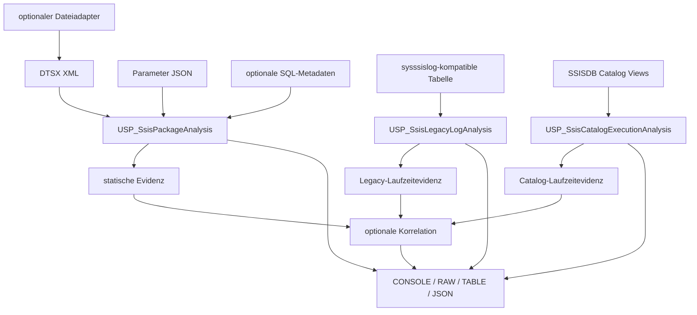

# SSIS-001 – SSIS Package and Execution Analysis

**Stand:** 22. Juli 2026  
**Status:** geplantes SubProject; noch nicht implementiert  
**Zielversionen:** SQL Server 2019, 2022 und 2025

## 1. Auftrag und Abgrenzung

SSIS-001 erweitert SQL Server Analyze um eine statische Analyse von SSIS-Paketen sowie um die Interpretation vorhandener Laufzeitprotokolle. Das Modul trennt Paketdefinition, Datenbankmetadaten und Laufzeitbeobachtung, damit ein mögliches Designrisiko nicht ohne Nachweis als ausgeführter Fehler dargestellt wird.

Geplant sind drei getrennte öffentliche Analyseverfahren:

- `[monitor].[USP_SsisPackageAnalysis]` analysiert ein direkt übergebenes DTSX-Paket und optional übergebene Projekt- oder Paketparameter.
- `[monitor].[USP_SsisLegacyLogAnalysis]` interpretiert vorhandene Einträge einer Tabelle im Format von `sysssislog`.
- `[monitor].[USP_SsisCatalogExecutionAnalysis]` analysiert eine vorhandene Ausführung aus dem Integration Services Catalog `SSISDB`.

Ein optionaler Dateiadapter kann eine `.dtsx`-Datei einlesen und als XML an den statischen Analysekern übergeben. Dieser Adapter gehört wegen seiner Dateisystem- und Berechtigungswirkung nicht in den standardmäßig aktiven Kernpfad.

Nicht Bestandteil der ersten Ausbaustufe sind:

- Ausführung, Validierung oder Änderung eines SSIS-Pakets;
- Entschlüsselung eines Pakets oder sensibler Eigenschaften;
- Herstellung einer Verbindung zu im Paket definierten externen Quellen;
- automatische Änderung von Logging Level, SSISDB-Retention oder Catalog-Konfiguration;
- automatische Anlage oder Änderung von SQL-Agent-Jobs, Extended-Events-Sessions oder SSIS-Umgebungen;
- allgemeine Ausführung beliebiger SQL-Fragmente aus einem Paket;
- vollständige semantische Auswertung der SSIS Expression Language;
- vollständige Analyse beliebiger Script Tasks, Script Components oder nicht bekannter Custom Components.

## 2. Zielarchitektur



Architekturentscheidungen:

- Der DTSX-Parser arbeitet ausschließlich auf einer übergebenen XML-Instanz. Dateisystem-, SSISDB- und zukünftige ISPAC-Zugriffe sind Quellenadapter vor dem Parser.
- Die statische Paketdefinition wird pro Aufruf einmal in interne temporäre Tabellen materialisiert. Mehrere Resultsets dürfen dieselben XML-Bereiche nicht unabhängig erneut vollständig shredden.
- Paketdefinition, optionale SQL-Metadaten und Laufzeitdaten besitzen getrennte SourceStatus- und Evidenzebenen.
- Eine fehlende optionale Quelle verwirft erfolgreich ermittelte andere Quellen nicht.
- Der vollständige Frameworkinstaller enthält nach Implementierung den Kern und die freigegebenen Laufzeitanalysen. Zusätzlich ist ein eigenständig installierbares SSIS-001-Paket vorgesehen.
- Der optionale Dateiadapter bleibt separat installierbar und standardmäßig deaktiviert.

## 3. Quellen und Eingabewege

### 3.1 Direkte DTSX-Übergabe

Die primäre Quelle ist ein direkt übergebener Parameter vom Datentyp `xml`. DTSX ist ein XML-basiertes Dateiformat. Paketdateien können abhängig von ihrem Protection Level teilweise oder vollständig verschlüsselt sein. Der Parser muss deshalb zwischen ungültigem XML, nicht unterstütztem Format, verschlüsseltem Inhalt und lediglich fehlenden sensitiven Werten unterscheiden.

Die direkte Übergabe ist der Standard, weil sie:

- keine Dateisystemberechtigung des SQL-Server-Prozesses benötigt;
- aus SSMS, PowerShell, .NET oder einer anderen aufrufenden Anwendung möglich ist;
- eine Prüfung und gegebenenfalls Entschlüsselung außerhalb des Analyseframeworks erlaubt;
- den statischen Analysekern unabhängig von Paketablage und Deploymentmodell hält.

Der Parser erkennt die Paketformatversion und verwendete XML-Namespaces. Die erste Implementierung priorisiert das dokumentierte DTSX-Version-2-Format. Nicht vollständig unterstützte Formate liefern einen strukturierten Capability-Status und keine heuristisch erfundene Vollanalyse.

### 3.2 Paket- und Projektparameter als JSON

Parameterwerte werden optional als versioniertes JSON-Dokument übergeben. Vorgesehen ist folgende logische Struktur:

```json
{
  "schemaVersion": 1,
  "parameters": [
    {
      "scope": "Project",
      "name": "ExampleProjectParameter",
      "dataType": "String",
      "value": "ExampleValue",
      "sensitive": false
    },
    {
      "scope": "Package",
      "name": "ExamplePackageParameter",
      "dataType": "Int32",
      "value": 100,
      "sensitive": false
    }
  ]
}
```

Das Analyseverfahren prüft mindestens:

- JSON-Schemaversion und syntaktische Gültigkeit;
- unbekannte, doppelte oder im falschen Scope übergebene Parameter;
- Datentyp und `NULL`-Zulässigkeit;
- im Paket definierte, aber nicht auflösbare Parameterreferenzen;
- übergebene Werte für als sensitiv gekennzeichnete Parameter.

Sensitive Werte dürfen für eine ausdrücklich angeforderte, rein temporäre Referenzauflösung verwendet werden. Sie werden weder in Findings, Warnings, JSON, TABLE-Ausgaben noch in Fehlermeldungen wiedergegeben. Der Standardpfad wertet direkte Referenzen aus und implementiert keinen vollständigen Interpreter der SSIS Expression Language.

### 3.3 Optionaler Dateiadapter

SQL Server kann Dateien über `OPENROWSET(BULK...)` einlesen. Für XML ist `SINGLE_BLOB` vorgesehen, damit die im XML deklarierte Zeichenkodierung durch den XML-Parser berücksichtigt werden kann.

Der Dateiadapter ist eine eigene Procedure, beispielsweise:

```sql
[monitor].[USP_SsisPackageFileLoad]
    @PackageFilePath nvarchar(4000),
    @PackageXml      xml OUTPUT,
    @Hilfe           bit = 0;
```

Verbindliche Sicherheitsgrenzen:

- ausschließlich `.dtsx`;
- ausschließlich konfigurierte Root-Verzeichnisse;
- keine Wildcards und keine Verzeichnisauflistung;
- UNC-Pfade standardmäßig nicht freigegeben;
- Pfadnormalisierung und segmentweise Prüfung vor dynamischem SQL;
- ausschließlich Lesen; kein Schreiben, Verschieben oder Löschen;
- keine Ausgabe des vollständigen Pfads ohne dafür vorgesehenen Opt-in;
- maximale zulässige Paketgröße mit sichtbarer Ablehnung nach dem Read;
- eigener Capability-, Permission- und Fehlerstatus.

Der Dateipfad kann in der `BULK`-Syntax nicht wie ein regulärer Wertparameter verwendet werden. Ein T-SQL-Adapter benötigt deshalb eng begrenztes dynamisches SQL mit korrekt escaptem Literal. Ein verlässliches Größenlimit vor dem ersten Byte-Read ist im reinen Kernpfad nicht vorauszusetzen. Diese Einschränkung ist ein weiterer Grund, den Dateiadapter optional zu halten.

### 3.4 SSISDB-Projektartefakt und ISPAC

`SSISDB.catalog.get_project` kann den Binärstream eines bereitgestellten Projekts als `varbinary(max)` liefern. Der Stream repräsentiert ein Projektartefakt und nicht unmittelbar eine einzelne XML-Paketinstanz. Das Entpacken eines ISPAC- oder Projektstreams wird deshalb nicht als T-SQL-Kernfunktion geplant.

Zulässige spätere Adapter:

- PowerShell- oder .NET-Hilfsprogramm, das einzelne DTSX-Dateien extrahiert;
- optionaler SQLCLR-Adapter mit eigenem Installations- und Sicherheitsvertrag;
- CI/CD-Schritt, der DTSX-Dateien vor dem Deployment analysiert;
- direkte Übergabe einer bereits extrahierten Paketdatei.

Der erste Release analysiert SSISDB-Ausführungsdaten, extrahiert aber keine Paketbinärstreams innerhalb des T-SQL-Kerns.

## 4. Geplante öffentliche Procedures

### 4.1 `[monitor].[USP_SsisPackageAnalysis]`

Die Procedure analysiert ein DTSX-Paket statisch und kann bei freigegebenen SQL-Server-Quellen zusätzliche Metadaten verifizieren.

Vorgesehener Parameterrahmen:

```sql
@PackageXml                    xml,
@PackageParametersJson         nvarchar(max)  = NULL,
@AnalysisDepth                 varchar(16)    = 'STANDARD',
@ResolveSqlMetadata            bit            = 0,
@CheckLookupDataUniqueness     bit            = 0,
@DatabaseNames                 nvarchar(max)  = NULL,
@DatabaseNamePattern           nvarchar(4000) = NULL,
@SystemdatenbankenEinbeziehen  bit            = 0,
@HighImpactConfirmed           bit            = 0,
@MaxZeilen                     int            = 100,
@LockTimeoutMs                 int            = 0,
@ResultSetArt                  varchar(16)    = 'CONSOLE',
@ResultTablesJson              nvarchar(max)  = NULL,
@JsonErzeugen                  bit            = 0,
@Json                          nvarchar(max)  = NULL OUTPUT,
@Hilfe                         bit            = 0
```

Die endgültigen Namen, Datentypen, Defaults, Status-OUTPUT-Parameter und Resultsetreihenfolgen werden in Phase 0 als öffentlicher Vertrag festgeschrieben.

### 4.2 `[monitor].[USP_SsisLegacyLogAnalysis]`

Die Procedure liest eine explizit benannte, `sysssislog`-kompatible Tabelle und analysiert eine angegebene Execution ID.

Vorgesehener Parameterrahmen:

```sql
@LoggingDatabase        sysname,
@LoggingSchema          sysname          = N'dbo',
@LoggingTable           sysname          = N'sysssislog',
@ExecutionId            uniqueidentifier,
@PackageXml             xml              = NULL,
@IncludeTimeline        bit              = 1,
@IncludeRawEvents       bit              = 0,
@MaxZeilen              int              = 1000,
@LockTimeoutMs          int              = 0,
@ResultSetArt           varchar(16)      = 'CONSOLE',
@ResultTablesJson       nvarchar(max)    = NULL,
@JsonErzeugen           bit              = 0,
@Json                    nvarchar(max)    = NULL OUTPUT,
@Hilfe                   bit              = 0
```

Datenbank, Schema und Tabelle werden getrennt übergeben, gegen Sichtbarkeit und erwartete Spalten validiert und ausschließlich mit `QUOTENAME` in dynamisches SQL eingesetzt.

### 4.3 `[monitor].[USP_SsisCatalogExecutionAnalysis]`

Die Procedure analysiert eine vorhandene SSISDB-Ausführung über die öffentlichen Catalog Views.

Vorgesehener Parameterrahmen:

```sql
@ExecutionId             bigint,
@IncludeMessages         bit            = 1,
@IncludeParameters       bit            = 1,
@IncludePerformance      bit            = 1,
@IncludeRawEvents        bit            = 0,
@MaxZeilen               int            = 1000,
@LockTimeoutMs           int            = 0,
@ResultSetArt            varchar(16)    = 'CONSOLE',
@ResultTablesJson        nvarchar(max)  = NULL,
@JsonErzeugen            bit            = 0,
@Json                    nvarchar(max)  = NULL OUTPUT,
@Hilfe                   bit            = 0
```

Der SSISDB-Pfad ist capability-basiert. Der statische XML-Analyzer bleibt auch verfügbar, wenn auf der Instanz kein SSIS Catalog vorhanden ist. SSISDB wird von SQL Server auf Linux nicht unterstützt; dieser Quellenstatus ist ausdrücklich als Plattformgrenze auszugeben.

## 5. Verbindliches Evidenzmodell

Jedes Finding besitzt eine Evidenzebene. Die Ebene begrenzt die zulässige Aussage.

| Evidenzebene | Bedeutung | Zulässige Aussage |
|---|---|---|
| `STATIC_CERTAIN` | direkte, eindeutig interpretierbare Paketkonfiguration | die konkrete Konfiguration ist im übergebenen Paket vorhanden |
| `STATIC_HEURISTIC` | statisches Muster mit fachlich begründeter Unsicherheit | die Konfiguration kann ein Risiko darstellen und benötigt Gegenprüfung |
| `METADATA_VERIFIED` | sichtbare SQL-Server-Katalogmetadaten bestätigen oder widerlegen eine Annahme | Objekt-, Spalten-, Index- oder Typmerkmal wurde im gelesenen Scope verifiziert |
| `DATA_VERIFIED` | eine ausdrücklich freigegebene Datenprüfung bestätigt das Ergebnis | die gelesene Datenmenge enthält den geprüften Zustand |
| `RUNTIME_OBSERVED` | Legacy- oder SSISDB-Protokoll enthält die Beobachtung | der Zustand wurde innerhalb des vorhandenen Logging- und Retentionfensters protokolliert |
| `UNRESOLVED` | Format, Ausdruck, Verschlüsselung oder Custom Component verhindert eine belastbare Aussage | die konkrete Eigenschaft konnte nicht ausgewertet werden |

Die Findings verwenden mindestens folgende Felder:

```text
RuleId
Severity
Category
EvidenceLevel
PackagePath
ObjectType
ObjectName
Finding
Evidence
Impact
Recommendation
CanAutoVerify
VerificationCost
SourceStatus
```

Ein statisches Risiko wird nicht allein durch seine Existenz zu `ERROR`. Severity und EvidenceLevel sind getrennte Dimensionen.

## 6. Statische DTSX-Analyse

### 6.1 Package Summary

Das Summary enthält mindestens:

- Paketname, Beschreibung und erkannte Paketformatversion;
- Protection Level und erkannte Verschlüsselungsgrenze;
- TargetServerVersion oder ersatzweise die sicher ableitbare Versionsinformation;
- Anzahl Tasks, Container, Event Handler und Data Flow Tasks;
- Anzahl Quellen, Ziele, Lookups, Transformationen und Verbindungen;
- Anzahl Parameter, Variablen und Expressions;
- Anzahl nicht auflösbarer Komponenten oder Eigenschaften;
- Finding-Anzahl nach Severity und Evidenzebene.

### 6.2 Control-Flow-Graph

Der Control Flow wird als Graph und nicht nur als lineare Schrittliste ausgegeben. Er enthält:

- Parent Container und Package Path;
- Task- oder Containertyp;
- Aktivierungsstatus;
- eingehende und ausgehende Precedence Constraints;
- Success-, Failure- und Completion-Bedingung;
- Constraint Expression und logische Verknüpfung;
- TransactionOption, IsolationLevel und RetainSameConnection, soweit relevant;
- FailPackageOnFailure, FailParentOnFailure und MaximumErrorCount;
- DelayValidation und DisableEventHandlers;
- Schleifen- und Sequenzcontainer;
- Event Handler und deren Auslöser.

### 6.3 Data-Flow-Graph und Lineage

Der Data Flow enthält:

- Task, Komponente, Input, Output und Pfad;
- regulären, Fehler- und No-Match-Ausgang;
- Quell- und Zielspaltenzuordnung;
- SSIS-Datentyp, Länge, Precision, Scale und Codepage;
- Lineage-ID und externe Metadatenreferenz;
- synchrone oder asynchrone Verarbeitung, soweit aus den Metadaten ableitbar;
- Sortierungsmetadaten und SortKeyPosition;
- verwendete und ungenutzte Outputs;
- erkennbare Zeilenflussverzweigungen und Zusammenführungen.

### 6.4 Verbindungen, Quellen und Ziele

Ausgegeben werden:

- Connection-Manager-Typ und referenzierende Tasks oder Komponenten;
- Verbindungsname und Expression-Bindungen;
- SourceType wie Tabelle, View, SQL Command, Variable oder Datei;
- Zielobjekt und Write Mode, soweit eindeutig ableitbar;
- Fast-Load-Einstellungen, Batch- und Commitgröße;
- verwendete Spalten;
- harte Abhängigkeiten von Server-, Datenbank-, Datei- oder Verzeichnisnamen;
- ungenutzte Connection Manager.

Sensitive Bestandteile von Connection Strings, Kennwörter, Tokens und Parameterwerte werden nicht ausgegeben.

### 6.5 Expressions und Parameterabhängigkeiten

Die erste Version unterstützt belastbar:

- Literale;
- direkte Projektparameterreferenzen;
- direkte Paketparameterreferenzen;
- direkte Variablenreferenzen;
- einfache Property Expressions mit eindeutig erkennbaren Referenzen.

Komplexe Stringoperationen, Typkonvertierungen, bedingte Ausdrücke und proprietäre Expressions werden als Ausdruck inventarisiert, aber nur bei sicherer Implementierung ausgewertet. Ein nicht auflösbarer Ausdruck erhält `UNRESOLVED_EXPRESSION` und keinen erfundenen Wert.

## 7. Regelkatalog

### 7.1 Lookup-Regeln

Lookup-Analysen besitzen hohe Priorität, weil mehrere passende Referenzzeilen zu nichtdeterministischen oder cacheabhängigen Ergebnissen führen können. SSIS gibt bei mehreren Treffern den ersten von der Lookup-Abfrage gelieferten Treffer zurück. Eine Warnung wegen Mehrfachtreffern wird nur unter bestimmten Cachebedingungen erzeugt.

Geplante Regeln:

- Lookup-Schlüssel werden nicht durch einen geeigneten Unique Index abgesichert.
- Die Referenzabfrage kann mehrere Zeilen je Lookup-Schlüssel liefern.
- Eine freigegebene Datenprüfung findet tatsächliche Duplikate.
- No-Match-Ausgang ist fachlich erforderlich, aber nicht verbunden.
- Error Output ist nicht verbunden oder auf Ignore Failure gesetzt.
- No-Match-Zeilen werden ignoriert, obwohl nachfolgend Lookup-Spalten benötigt werden.
- Full Cache wird für eine nach Metadaten große Referenzquelle verwendet.
- Partial oder No Cache kann bei hohem Eingangsvolumen viele Einzelzugriffe verursachen.
- Lookup-Eingang und Referenzschlüssel besitzen inkompatible Datentypen, Längen, Precision, Scale oder Codepages.
- Cachemodus und Datenbankcollation können zu unterschiedlicher Stringvergleichssemantik führen.
- Nullable Lookup-Schlüssel besitzen keine erkennbare Sonderbehandlung.
- Mehrere Lookups verwenden dieselbe Referenzquelle und könnten unnötige Mehrfachzugriffe verursachen.
- Die Referenzabfrage transportiert deutlich mehr Spalten als im Lookup ausgegeben werden.

### 7.2 Datenintegrität und Typkonvertierung

Geplante Regeln:

- Stringlänge wird verkürzt.
- Unicode wird in einen nicht-Unicode-Datentyp konvertiert.
- Precision oder Scale wird reduziert.
- numerischer Datentyp wird verengt.
- Truncation oder Conversion Error ist auf Ignore Failure gestellt.
- Error Output ist nicht verbunden.
- fehlerhafte Datensätze werden ohne nachvollziehbaren Auditpfad verworfen.
- Conditional Split besitzt keinen Default Output.
- ein regulärer oder Fehleroutput endet ohne nachfolgende Komponente.
- Zielspalte ist nach verifizierter Metadatenlage `NOT NULL`, aber nicht zugeordnet.
- Sortierungsmetadaten eines Merge oder Merge Join sind unvollständig oder widersprüchlich.
- Flat-File-Metadaten und nachfolgende Typkonvertierungen widersprechen einander.
- ErrorCode und ErrorColumn werden erzeugt, aber nicht in interpretierbare Informationen übersetzt.

### 7.3 Performance und Ressourcenverbrauch

Geplante Regeln:

- Sort-Transformation, obwohl eine sortierte Quellabfrage möglich oder bereits konfiguriert ist.
- mehrere Sorts mit derselben Sortierreihenfolge.
- Aggregate, Sort, Fuzzy- oder andere asynchrone Transformation auf unnötig breitem Datenstrom.
- ungenutzte Spalten werden durch mehrere Komponenten transportiert.
- BLOB- oder MAX-Spalten werden früh geladen und über lange Pfade mitgeführt.
- OLE DB Command wird für einen Datenstrom verwendet, obwohl die Komponente das SQL-Statement zeilenweise ausführt.
- OLE DB Destination verwendet bei erwartbar großem Volumen keinen geeigneten Fast-Load-Pfad.
- FastLoadMaxInsertCommitSize, RowsPerBatch oder Table Lock besitzen eine auffällige Konfiguration.
- mehrere parallele Pfade lesen dieselbe Quelle oder schreiben dasselbe Ziel.
- Full-Cache-Lookup besitzt potenziell hohe PreExecute-Kosten.
- manuell gesetzte Buffergrößen sind außerhalb plausibler Grenzen.
- Komponenten erfordern zusätzliche Buffer, ohne dass nachfolgende Komponenten die erzeugte Ordnung oder Aggregation nutzen.

Diese Regeln verwenden keine pauschalen universellen Grenzwerte. Sie berücksichtigen Komponententyp, Metadaten, Datenbreite und vorhandene Laufzeitevidenz.

### 7.4 Control Flow, Fehlerbehandlung und Restartability

Geplante Regeln:

- Task ist nicht erreichbar oder besitzt widersprüchliche Constraints.
- Task oder Container ist dauerhaft deaktiviert.
- Precedence Constraint referenziert eine nicht auflösbare Variable oder einen Parameter.
- Ausdruck kann mit den übergebenen Parameterwerten nach sicherer Auswertung nicht wahr werden.
- parallele Pfade verändern dasselbe Ziel ohne erkennbare Serialisierung.
- TransactionOption von Parent und Child ist widersprüchlich.
- Checkpoints sind aktiviert, aber unvollständig oder nicht konsistent konfiguriert.
- Paket besitzt keine erkennbare sichere Wiederanlaufstrategie für bereits teilweise geschriebene Ziele.
- MaximumErrorCount ist ungewöhnlich konfiguriert und kann Fehler zu früh oder zu spät eskalieren.
- Timeout ist unbegrenzt, obwohl eine blockierende externe Operation erkennbar ist.
- Execute SQL Task enthält mehrere verändernde Statements ohne klaren Transaktionsvertrag.
- Schleifencontainer besitzt keine sicher erkennbare Fortschrittsbedingung.
- Event Handler kann denselben Fehler mehrfach protokollieren oder eine Fehlereskalation verdecken.
- Execute Package Task verweist auf ein nicht mitgeliefertes oder nicht auflösbares Paket.
- Parameter, Variable, Connection Manager oder Event Handler ist definiert, aber nicht referenziert.

### 7.5 Security und Wartbarkeit

Geplante Regeln:

- sensibler Wert oder Credential ist im Paketinhalt erkennbar;
- Connection String enthält eingebettete Zugangsdaten;
- Protection Level ist für den erkannten Betriebsweg ungeeignet;
- `EncryptSensitiveWithUserKey` wird für einen pakettypischen Servicekonto-Betrieb verwendet;
- `DontSaveSensitive` ist gesetzt, aber erforderliche externe Bereitstellung ist nicht erkennbar;
- vollständige oder partielle Verschlüsselung verhindert eine belastbare Analyse;
- Script Task oder Script Component bildet eine nicht analysierbare Black Box;
- Custom Component besitzt kein bekanntes Regelprofil;
- Execute Process Task startet ein externes Programm;
- SQL Commands oder Dateiverbindungen enthalten harte umgebungsspezifische Namen;
- mehrere Properties werden gleichzeitig statisch und per Expression gesetzt.

Eine nicht bekannte Custom Component ist kein automatischer Fehler. Sie wird als `UNRESOLVED_COMPONENT` inventarisiert und kann später durch ein metadatengesteuertes Komponentenprofil ergänzt werden.

## 8. SQL-Metadatenverifikation

Die statische Analyse kann ausgewählte SQL-Server-Metadaten ergänzen, wenn Quelle, Datenbank und Objekt sicher auflösbar sind. Der Standard bleibt `@ResolveSqlMetadata = 0`.

Zulässige Metadatenprüfungen:

- Datenbank-, Schema-, Tabellen- und Viewexistenz;
- Spaltenexistenz und Datentyp;
- Nullability, Länge, Precision, Scale und Collation;
- Unique- und Primary-Key-Indizes für Lookup-Schlüssel;
- Zielspaltenzuordnung;
- einfache Abhängigkeiten von Views und Modulen, soweit ohne breite Textanalyse verfügbar.

Nicht automatisch ausgeführt werden:

- im Paket enthaltene freie SQL Commands;
- Stored Procedures mit unbekannten Seiteneffekten;
- Abfragen gegen externe Server oder Nicht-SQL-Server-Quellen;
- beliebige Validierungs- oder Teststatements.

Für eine Lookup-Datenprüfung gilt:

1. Die Referenzquelle und Schlüsselspalten müssen sicher auflösbar sein.
2. Eine Unique-Index-Prüfung erfolgt zunächst ausschließlich über Katalogmetadaten.
3. Eine tatsächliche `GROUP BY`-Duplikatprüfung ist `DATA_VERIFIED`, ressourcenintensiv und benötigt `@CheckLookupDataUniqueness = 1` sowie `@HighImpactConfirmed = 1`.
4. Die Prüfung verwendet enge Limits, `LOCK_TIMEOUT`, einen dokumentierten `MAXDOP`-Vertrag und keine persistente Zwischentabelle.
5. Bei komplexen SQL Commands wird eine synthetische Prüfvorlage ausgegeben, aber nicht automatisch ausgeführt.

Systemkataloge werden entsprechend dem Frameworkvertrag direkt über `sys.*` gelesen. `OBJECT_ID()` und `OBJECT_NAME()` werden für Cross-Database-Auflösung vermieden. Kataloganreicherungen verwenden `WITH (NOLOCK)` und einen lokal gesetzten, anschließend wiederhergestellten `LOCK_TIMEOUT`.

## 9. Legacy-Laufzeitanalyse aus `sysssislog`

### 9.1 Quellenvertrag

`sysssislog` enthält eine Zeile je protokolliertem Ereignis eines Pakets, Tasks oder Containers, wenn der SQL Server Log Provider verwendet wird. Die Procedure akzeptiert auch eine anders benannte Tabelle, sofern die erforderlichen Spalten und kompatiblen Datentypen vorhanden sind.

Erforderliche Kernspalten:

```text
id
Event
Computer
Operator
Source
SourceID
ExecutionID
StartTime
EndTime
DataCode
DataBytes
Message
```

Die Spalte `endtime` ist in der dokumentierten Tabelle nicht funktionsfähig und entspricht `starttime`. Laufzeiten werden deshalb aus zusammengehörenden Ereignissen wie `OnPreExecute` und `OnPostExecute` rekonstruiert.

Eine Paketausführung kann mehrere Execution IDs erzeugen, beispielsweise für Validierung und eigentliche Ausführung oder für Child Packages. Die Procedure analysiert die explizit übergebene ID und weist auf angrenzende, wahrscheinlich zusammengehörende IDs hin, ohne sie ungefragt zusammenzuführen.

### 9.2 Geplante Ausgaben

`executionSummary` enthält:

- ersten und letzten beobachteten Zeitstempel;
- abgeleiteten Status Success, Failure, Cancelled oder Incomplete;
- Anzahl Fehler, Warnings und TaskFailed-Ereignisse;
- erste wahrscheinliche technische Ursache;
- zuletzt fehlgeschlagenen Task;
- Anzahl beteiligter Tasks, Container und Iterationen;
- geschätzte Gesamtdauer und Evidenzgrenze.

`timeline` enthält:

- Zeitstempel und Abstand zum vorherigen Ereignis;
- Event, Source, SourceID und ExecutionID;
- DataCode und klassifizierte Message;
- Severity und ParseConfidence;
- geschätzte Iteration;
- Package Path, sofern das DTSX-Paket zusätzlich übergeben wurde.

`taskDurations` rekonstruiert mindestens:

- `OnPreValidate` bis `OnPostValidate`;
- `OnPreExecute` bis `OnPostExecute`;
- Paketstart bis Paketende;
- wiederholte Schleifeniterationen je SourceID.

Ausgegeben werden Dauer je Ausführung, Summe, Durchschnitt, Maximum, prozentualer Anteil an der Paketlaufzeit und unvollständige Start-/Endpaare.

### 9.3 Root-Cause- und Fehlerkettenanalyse

Der Analyzer unterscheidet:

- ursprüngliche Fehlermeldung;
- `OnError` auf Taskebene;
- propagierte Fehler auf Container- und Paketebene;
- `OnTaskFailed`;
- nachfolgende Warnungen und Informationsmeldungen;
- Wiederholung desselben Tasks mit späterem Erfolg;
- Fortsetzung des Pakets nach einem Fehler.

Identische oder eng zusammengehörende Meldungen werden als Fehlergruppe dargestellt. Die Deduplizierung darf den Rohzugriff nicht verhindern; `@IncludeRawEvents = 1` liefert weiterhin die vollständigen gelesenen Ereignisse.

### 9.4 Data-Flow- und Logging-Qualität

Falls die entsprechenden Ereignisse protokolliert wurden, werden unter anderem ausgewertet:

- `OnPipelineRowsSent`;
- `PipelineComponentTime`;
- `BufferSizeTuning`;
- `PipelineExecutionPlan`;
- `PipelineExecutionTrees`;
- `PipelineInitialization`;
- `PipelineBufferLeak`.

Mögliche Ableitungen:

- Zeilen je Pfad und Durchsatz;
- Quellen oder Ziele mit null Zeilen;
- unerwartete starke Reduktion oder Vervielfachung;
- Fehlerpfade mit Datensätzen;
- langsamste Komponenten;
- auffällige Bufferanpassungen;
- potenziell nicht freigegebene Buffer.

Freie Meldungstexte sind versions-, komponenten- und sprachabhängig. Jeder extrahierte Wert besitzt deshalb `ParseConfidence`. Ein unbekanntes Format bleibt als Rohmeldung erhalten.

Die Procedure bewertet zusätzlich die Logging-Qualität:

- fehlen `OnError` oder `OnTaskFailed`;
- fehlen passende Pre-/Post-Ereignisse;
- fehlen Row-Count- oder Komponentenzeitereignisse;
- ist die Ausführung nur partiell rekonstruierbar;
- werden sensible SQL-, Prozess- oder Parameterinformationen protokolliert;
- erzeugt die Ausführung unverhältnismäßig viele redundante Einträge.

## 10. SSISDB-Laufzeitanalyse

`SSISDB` stellt strukturierte Catalog Views für Ausführungen, Executables, Meldungen, Parameter, Data-Flow-Phasen und Zeilenzahlen bereit. Der SSISDB-Analyzer verwendet ausschließlich dokumentierte öffentliche Views und Procedures.

Geplante Quellen:

- `catalog.executions`;
- `catalog.executable_statistics`;
- `catalog.event_messages` und bei Bedarf `catalog.event_message_context`;
- `catalog.execution_parameter_values`;
- `catalog.execution_component_phases`;
- `catalog.execution_data_statistics`;
- weitere dokumentierte Catalog Views nur nach Capability- und Spaltenprüfung.

Geplante Ausgaben:

- Execution Summary mit Status, Dauer, Caller, Environment und Logging Level;
- Executable Timeline einschließlich Iterationen und Execution Path;
- Fehlergruppen, Root Cause und propagierte Folgeereignisse;
- verwendete Parameter mit konsequenter Unterdrückung sensitiver Werte;
- Komponentenphasen und aktive Zeit;
- Zeilenzahlen und Durchsatz zwischen Data-Flow-Komponenten;
- Logging- und Retentiongrenzen;
- Findings aus der Korrelation mit einem optional übergebenen Paket-XML.

`catalog.execution_component_phases` liefert Detailwerte nur bei geeignetem Logging Level, insbesondere Performance oder Verbose. Fehlende Zeilen bedeuten deshalb nicht automatisch, dass eine Komponente keine Zeit verbraucht hat. `catalog.execution_data_statistics` ist ebenfalls von der vorhandenen Logging-Evidenz abhängig.

## 11. Korrelation von Design und Laufzeit

Der größte fachliche Nutzen entsteht durch die Korrelation statischer Paketmerkmale mit Laufzeitbeobachtungen.

| Statische Beobachtung | mögliche Laufzeitevidenz | Ergebnis |
|---|---|---|
| Lookup-Eindeutigkeit nicht abgesichert | Duplicate-Warning oder bestätigte Duplikate | Designrisiko wird bestätigt oder bleibt offen |
| OLE DB Command vorhanden | hoher Komponentenzeitanteil und viele Eingangszeilen | zeilenweise Zieloperation als wahrscheinlicher Engpass |
| Sort oder Aggregate als asynchrone Komponente | lange ProcessInput-, PrimeOutput- oder PreExecute-Phase | Materialisierungs- oder Sortierkosten beobachtet |
| Error Output verbunden | protokollierte Zeilen am Fehlerpfad | Fehlerbehandlung tatsächlich genutzt |
| Full-Cache-Lookup | lange PreExecute-Phase | Cacheaufbau als Laufzeitanteil sichtbar |
| parallele Zielpfade | zeitliche Überlappung und SQL-Blocking-Evidenz | möglicher Zielkonflikt benötigt Gegenprüfung |
| unbegrenzter Timeout | sehr lange oder unvollständige Taskausführung | Betriebsrisiko durch Laufzeitbeobachtung verstärkt |
| Pfad statisch vorhanden | dauerhaft null gesendete Zeilen | ungenutzter oder datenabhängiger Pfad |

Eine Korrelation verändert die ursprünglichen Evidenzzeilen nicht. Sie erzeugt zusätzliche Findings mit Verweisen auf die beteiligten statischen und dynamischen Quellen.

## 12. Geplante Resultsets

| Resultset | Inhalt |
|---|---|
| `moduleStatus` | Gesamtstatus, Paketformat, Analysepfade, Partialität, Plattform und Grenzen |
| `sourceStatus` | Capability, Berechtigung, Read-Zeitpunkt, Fehler und Kosten je Quelle |
| `packageSummary` | Paketmetadaten, Objektzahlen, Protection Level und Finding-Zusammenfassung |
| `parameters` | Definition, Scope, Datentyp, Referenzen und Auflösungsstatus ohne sensitive Werte |
| `connections` | Connection Manager, Nutzung, Typ und sichere Metadaten |
| `controlFlow` | Tasks, Container, Event Handler und Precedence Constraints |
| `dataFlowComponents` | Quellen, Ziele, Transformationen und Komponentenmetadaten |
| `dataFlowPaths` | Verbindungen, Lineage, reguläre und Fehlerpfade |
| `columnLineage` | Spaltenherkunft, Datentypänderungen und Zielzuordnung |
| `lookups` | Referenzquelle, Schlüssel, Cachemodus, Outputs und Verifikationsstatus |
| `expressions` | Property Expressions, Referenzen und Auflösungsstatus |
| `executionSummary` | Legacy- oder SSISDB-Ausführungszusammenfassung |
| `timeline` | protokollierte Ereignisse in Zeitfolge |
| `taskDurations` | rekonstruierte oder strukturierte Task- und Containerlaufzeiten |
| `componentPerformance` | SSISDB-Phasen oder interpretierte Legacy-Komponentenwerte |
| `rowFlow` | Zeilenzahlen und Durchsatz, sofern protokolliert |
| `findings` | deterministische und heuristische Befunde mit Evidenzebene |
| `warnings` | Verschlüsselung, Kürzung, unlesbare Quelle, Parsing- und Logginggrenzen |

Nicht jede öffentliche Procedure liefert jedes Resultset. Phase 0 legt die verbindliche Reihenfolge und Schemaversion je Procedure fest.

## 13. Performance-, Locking- und Fehlervertrag

- Das Paket-XML wird je Aufruf einmal validiert und pro logischem Bereich höchstens einmal breit gelesen.
- Wiederverwendete Paketknoten werden in internen Temp-Tabellen materialisiert.
- XML-Namespaces werden versionsbezogen gebunden. Breite `local-name()`-Scans sind nur ein begrenzter Fallback und kein Standardpfad.
- Jede SQL-Server-Katalogquelle wird je Aufruf höchstens einmal gelesen.
- SSISDB-Ausführungsviews werden nach `execution_id` eingeschränkt und nicht ohne Filter gescannt.
- Legacy-Loggingtabellen werden nach `executionid` und, soweit verfügbar, unterstützenden Zeit- oder ID-Spalten eingeschränkt.
- Vor einer Legacy-Analyse werden geeignete vorhandene Indizes inventarisiert. Das Framework legt keine Indizes in fremden Loggingtabellen an.
- Kataloganreicherungen verwenden die Frameworkstrategie für `WITH (NOLOCK)` und lokales `LOCK_TIMEOUT`.
- Datenprüfungen sind getrennte High-Impact-Pfade und werden nicht durch `STANDARD` aktiviert.
- Fehler je Quelle werden isoliert; vorhandene Teilresultate bleiben verfügbar.
- Das Modul führt keine Paketkomponente, kein SQL Command und keinen externen Prozess aus.
- Das Modul verändert weder SSISDB noch fremde Loggingtabellen.

## 14. Datenschutz und Security

Standardmäßig nicht ausgeben oder persistieren:

- Kennwörter, Tokens und sensitive Connection-String-Bestandteile;
- Werte sensitiver Projekt-, Paket- oder Umgebungsparameter;
- vollständige Dateipfade;
- Operator-, Computer-, Login- oder Hostwerte ohne dafür vorgesehenen Laufzeit-Opt-in;
- Script- oder Assembly-Binärinhalte;
- DataBytes ohne dokumentierten und sicheren Decoder;
- vollständige freie SQL Commands in CONSOLE-Zusammenfassungen;
- Paket-XML, Parameter-JSON oder Log-Rohdaten in einer Frameworktabelle.

Das Framework bleibt zustandslos. TABLE- und JSON-Ausgaben können technische Namen, SQL-Textfragmente, Pfade oder Laufzeitidentitäten enthalten, wenn der Benutzer den entsprechenden Ausgabepfad ausdrücklich aktiviert. High-Impact-Freigabe ist keine Datenschutzfreigabe.

Repository-Tests und Fixtures verwenden ausschließlich synthetische Pakete, synthetische Datenbankobjekte, synthetische Pfade und synthetische Loggingzeilen. Reale Paketdateien, Connection Strings, Servernamen, Firmennamen, Benutzerdaten oder Ausführungsprotokolle dürfen nicht in das Repository gelangen.

## 15. Frameworkintegration

Nach Implementierung sind mindestens folgende Integrationen erforderlich:

- `VW_AnalyseClassCatalog`
  - `SSIS_PACKAGE_STATIC`;
  - `SSIS_METADATA_DEEP`;
  - `SSIS_LEGACY_LOG`;
  - `SSIS_CATALOG_RUNTIME`.
- `VW_AnalysisCatalog`, `VW_AnalysisSearchTerm`, `VW_AnalysisRelation`
  - Suchbegriffe SSIS, DTSX, Package, Data Flow, Control Flow, Lookup, sysssislog, SSISDB und Execution ID.
- Analysis Navigator
  - Routing nach Paketdefinition, Laufzeitfehler, Lookup, langsamer Data Flow und Loggingqualität.
- Beziehungen
  - SSIS → Current Requests, Blocking, Query Store, Execution Plan, Extended Events, SQL Agent und Server Security.
- Capability-Inventar
  - DTSX-XML-Parser, optionaler File Read, SSISDB, Legacy-Loggingquelle und unterstützte Paketformate.
- Installer, Objektinventar, Procedure-Referenz, Resultsetinventar, Beispiele, Analysis Guides und Testverträge.

Jede Procedure-Seite erhält den Abschnitt **Source Select** mit den tatsächlichen Basiszugriffen, Join-Schlüsseln, Filtern, Logging-Level-Grenzen, sensiblen Spalten und bewusst nicht gelesenen Quellen.

## 16. Packaging und eigenständige Installation

SSIS-001 soll unabhängig vom vollständigen Framework installierbar sein. Der Teilinstaller enthält ausschließlich:

- Schema und zwingende gemeinsame Status-, Ausgabe- und JSON-/TABLE-Helfer;
- Paketformat- und Komponentenmetadaten;
- interne DTSX-Parser und Regelengine;
- Legacy-Log-Parser;
- SSISDB-Quellenadapter;
- die drei öffentlichen Kernprocedures;
- optionale Metadatenverifikation, soweit ihre Abhängigkeiten geschlossen sind.

Der Dateiadapter wird als separat zuschaltbarer Bestandteil behandelt. Er darf nicht stillschweigend durch die Installation des statischen XML-Kerns aktiviert werden.

Vorgesehene Installationswege entsprechen dem bestehenden Standalone-Muster:

- SQLCMD-Include-Installer;
- generierter eingebetteter Einzelinstaller unter `Code/Install/generated`;
- Integration in `Install_All.sql` und dessen generierte Ausgabe;
- maschinenlesbares Abhängigkeitsinventar für SSIS-001.

Die exakten Dateinamen und Objektabhängigkeiten werden in Phase 0 festgeschrieben.

## 17. Umsetzungsphasen

| Phase | Inhalt | Exit-Kriterium |
|---|---|---|
| 0 | öffentliche Parameter, Resultsets, Statuscodes, Packaging, Datenschutz und Quellenprojektionen festschreiben | Vertragsreview ohne T-SQL-Implementierung abgeschlossen |
| 1 | Paketformat-Erkennung und statisches Inventar für Package, Control Flow, Data Flow, Connections und Expressions | synthetische DTSX-Fixtures werden deterministisch inventarisiert |
| 2 | Regelengine für Lookup, Datentypen, Fehlerpfade, Performance, Restartability und Security | High-Confidence-Regeln besitzen positive und negative Tests |
| 3 | optionale SQL-Metadaten- und Eindeutigkeitsprüfung | Katalog- und High-Impact-Datenpfade sind getrennt und belastbar begrenzt |
| 4 | `USP_SsisLegacyLogAnalysis` | Timeline, Dauer, Fehlerkette, Iterationen und Loggingqualität getestet |
| 5 | `USP_SsisCatalogExecutionAnalysis` | strukturierte Ausführung, Meldungen, Parameter, Phasen und Row Flow getestet |
| 6 | statische und dynamische Korrelation | Findings referenzieren nachvollziehbar beide Evidenzquellen |
| 7 | Standalone-Installer, Frameworkintegration, Dokumentation und finale Testmatrix | SQL Server 2019, 2022 und 2025 freigegeben |
| 8 | optionaler File-/ISPAC-Adapter | separater Security- und Installationsvertrag erfüllt |

## 18. Abnahmematrix

Verpflichtend:

- Entwicklung und erster Feature-Positive-Lauf auf SQL Server 2025;
- finale Tests auf SQL Server 2019, 2022 und 2025;
- Windows für SSISDB- und SSIS-Runtime-Pfade;
- Linux mit korrektem `UNAVAILABLE_PLATFORM` für SSISDB und weiterhin funktionsfähiger XML-Analyse;
- gültiges DTSX-Version-2-Paket, ungültiges XML, verschlüsseltes Paket und nicht unterstütztes Format;
- Control Flow mit Sequenz, Parallelität, Schleife, Event Handler und komplexen Constraints;
- Data Flow mit Source, Destination, Lookup, Conditional Split, Sort, Aggregate, Error Output und unverbundenem Output;
- Lookup mit Unique Index, ohne Unique Index und mit synthetischen Duplikaten;
- Unicode-, Längen-, Precision- und Scale-Konvertierungen;
- Script Task und unbekannte Custom Component als sichtbare Analysegrenze;
- direkte Parameterreferenz, fehlender Parameter und nicht auflösbarer Ausdruck;
- `sysssislog` mit vollständigem Lauf, unvollständigem Lauf, Schleifeniterationen, propagierten Fehlern und mehreren angrenzenden Execution IDs;
- SSISDB-Ausführung mit Basic-, Performance- und Verbose-Logging, soweit die Quellen verfügbar sind;
- vollständig und teilweise eingeschränkte Berechtigungen;
- `CONSOLE`, `RAW`, `TABLE`, `NONE` und JSON;
- `LOCK_TIMEOUT`, nicht lesbare Datenbank, fehlende Loggingtabelle und fehlender SSIS Catalog;
- statische Prüfung, dass sensitive Werte und Binärpayloads nicht in den Standardpfad gelangen;
- Prüfung, dass kein Analysepfad Pakete, SQL Commands, externe Programme oder SSISDB-Änderungen ausführt;
- Dokumentationsgate für Source Select, Primärquellen, Kosten, sensible Felder, Evidenzgrenze und Gegenprobe;
- eigenständiger Installer und Gesamtinstaller erzeugen denselben öffentlichen SSIS-001-Vertrag.

`NOT_EXECUTED` ist kein Laufzeitnachweis. Ein leerer oder synthetischer Test ersetzt keinen Feature-Positive-Lauf für die jeweilige dokumentierte Quelle.

## 19. Offene Architekturentscheidungen für Phase 0

Vor der Implementierung sind verbindlich zu entscheiden:

1. endgültige Resultsetnamen und Schemaversionen der drei Procedures;
2. unterstützte DTSX-Formatversionen im ersten Release;
3. exakte Grenzen der einfachen Expression-Auswertung;
4. Komponentenprofilmodell für Microsoft- und Custom Components;
5. Statuscodes für Verschlüsselung, unbekannte Komponenten und partielle Lineage;
6. Kostenklasse und Limits der optionalen Lookup-Datenprüfung;
7. zulässige Session-, Operator- und Computerfelder in Laufzeitausgaben;
8. eigener Installerpfad und maschinenlesbares Abhängigkeitsinventar;
9. ob der optionale Dateiadapter Bestandteil von SSIS-001 oder ein eigenes Teilpaket wird;
10. ob eine spätere ISPAC-Extraktion über SQLCLR oder ausschließlich außerhalb des T-SQL-Frameworks erfolgt.

## 20. Primärquellen

- [Microsoft Open Specifications: DTSX Version 2](https://learn.microsoft.com/en-us/openspecs/sql_data_portability/ms-dtsx2/fb216aa4-62ab-41c8-a6d5-5b1002739d21)
- [Microsoft Open Specifications: DTSX Structures](https://learn.microsoft.com/en-us/openspecs/sql_data_portability/ms-dtsx2/1e88a799-3702-4512-9b1d-efce172b1c61)
- [Microsoft: OPENROWSET BULK](https://learn.microsoft.com/en-us/sql/t-sql/functions/openrowset-bulk-transact-sql?view=sql-server-ver17)
- [Microsoft: sysssislog](https://learn.microsoft.com/en-us/sql/relational-databases/system-tables/sysssislog-transact-sql?view=sql-server-ver17)
- [Microsoft: Integration Services Logging](https://learn.microsoft.com/en-us/sql/integration-services/performance/integration-services-ssis-logging?view=sql-server-ver17)
- [Microsoft: Lookup Transformation](https://learn.microsoft.com/en-us/sql/integration-services/data-flow/transformations/lookup-transformation?view=sql-server-ver17)
- [Microsoft: Synchronous and Asynchronous Transformations](https://learn.microsoft.com/en-us/sql/integration-services/understanding-synchronous-and-asynchronous-transformations?view=sql-server-ver17)
- [Microsoft: OLE DB Command Transformation](https://learn.microsoft.com/en-us/sql/integration-services/data-flow/transformations/ole-db-command-transformation?view=sql-server-ver17)
- [Microsoft: OLE DB Destination](https://learn.microsoft.com/en-us/sql/integration-services/data-flow/ole-db-destination?view=sql-server-ver17)
- [Microsoft: Access Control for Sensitive Data in Packages](https://learn.microsoft.com/en-us/sql/integration-services/security/access-control-for-sensitive-data-in-packages?view=sql-server-ver17)
- [Microsoft: SSIS Catalog](https://learn.microsoft.com/en-us/sql/integration-services/catalog/ssis-catalog?view=sql-server-ver17)
- [Microsoft: Catalog Views](https://learn.microsoft.com/en-us/sql/integration-services/system-views/views-integration-services-catalog?view=sql-server-ver17)
- [Microsoft: catalog.executable_statistics](https://learn.microsoft.com/en-us/sql/integration-services/system-views/catalog-executable-statistics?view=sql-server-ver17)
- [Microsoft: catalog.event_messages](https://learn.microsoft.com/en-us/sql/integration-services/system-views/catalog-event-messages?view=sql-server-ver17)
- [Microsoft: catalog.execution_component_phases](https://learn.microsoft.com/en-us/sql/integration-services/system-views/catalog-execution-component-phases?view=sql-server-ver17)
- [Microsoft: catalog.execution_data_statistics](https://learn.microsoft.com/en-us/sql/integration-services/system-views/catalog-execution-data-statistics?view=sql-server-ver17)
- [Microsoft: catalog.get_project](https://learn.microsoft.com/en-us/sql/integration-services/system-stored-procedures/catalog-get-project-ssisdb-database?view=sql-server-ver17)
